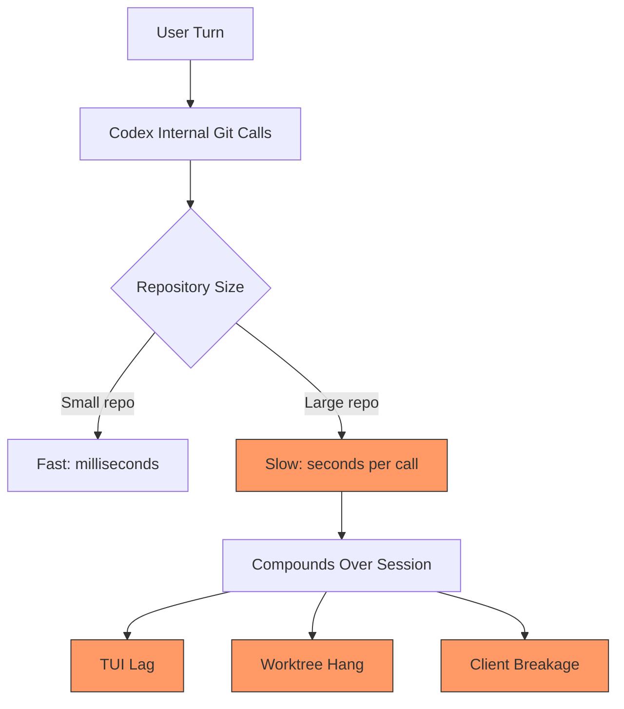
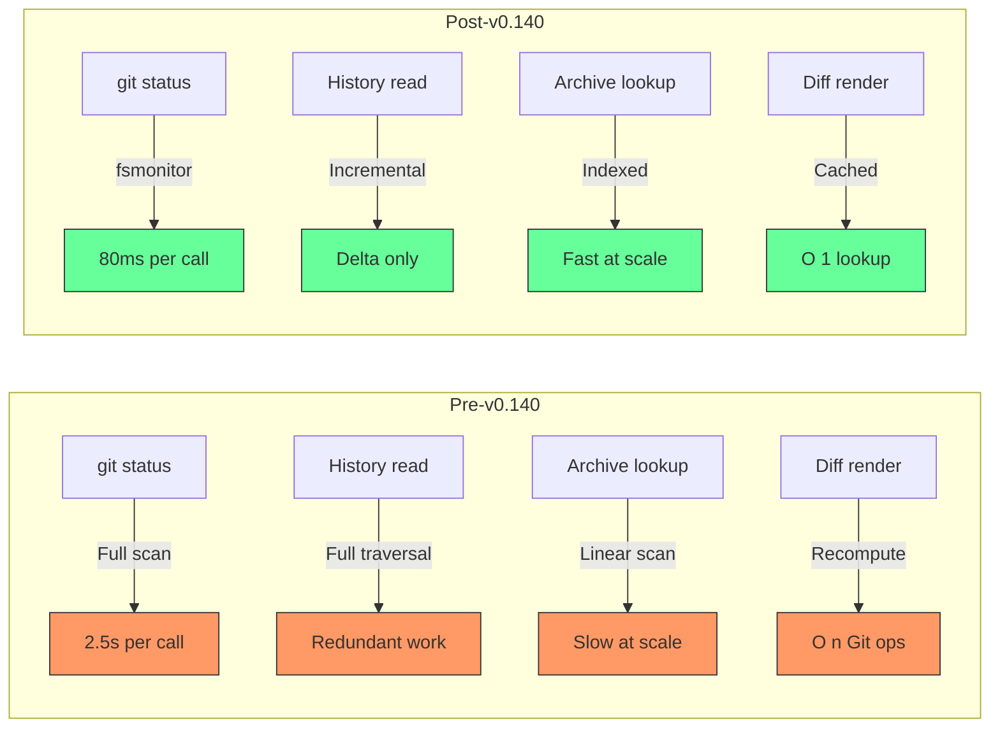

# Taming the Monorepo: How Codex CLI v0.140 Fixed Git Performance for Large Repositories


---

Codex CLI v0.140.0, released on 15 June 2026, shipped a set of performance fixes targeting a problem that every developer working in a large codebase eventually hits: the agent getting slower the bigger the repository and the longer the session[^1]. The changelog entry is deliberately understated — "improved responsiveness for large repositories and long sessions" — but the underlying changes touch four distinct bottlenecks: **fsmonitor preservation**, **duplicate history read elimination**, **archive lookup acceleration**, and **turn-diff rendering cache**[^1].

This article traces each fix back to the problem it solves, explains the implementation mechanics where the source is public, and offers configuration guidance for teams running Codex CLI against repositories with 100,000+ tracked files.

## The Performance Problem

Codex CLI interrogates Git constantly. Every turn that reads, writes, or diffs a file triggers `git status`, `git diff`, or `git ls-files` under the hood. In a small repository these calls complete in milliseconds. In a monorepo with 160,000 tracked files, multi-gigabyte ignored directories, and an hour-long session accumulating dozens of turns, they compound into perceptible latency[^2].

Three user-visible symptoms characterised the problem:

1. **Sluggish TUI response** — typing a prompt or scrolling `/diff` output felt laggy after extended sessions[^3].
2. **Worktree pre-flight hangs** — creating a new worktree in the Codex App could stall for up to 14 minutes while scanning for `AGENTS.override.md` files across the full tree[^2].
3. **Broken third-party Git clients** — turn-diff references stored as tree objects rather than commits caused SourceTree, TortoiseGit, and VS Code remote environments to fail during ref enumeration[^4].



## Fix 1: Preserving Git's Built-in Filesystem Monitor

The single highest-impact change was restoring Git's built-in filesystem monitor (`fsmonitor`) for internal commands. Prior to v0.140, Codex forced `core.fsmonitor=false` on every Git invocation to prevent repository-configured fsmonitor helpers from executing — a reasonable security precaution, since a malicious `.gitconfig` could specify an arbitrary executable[^5]. The collateral damage was severe: on repositories where Git's built-in `fsmonitor--daemon` was active, every `status`, `diff`, and `ls-files` call reverted to a full filesystem scan.

### How the Fix Works

PR #26880 introduced a nuanced detection strategy[^5]:

1. **Read the raw value** — query `core.fsmonitor` without automatic type coercion.
2. **Validate built-in support** — check `git version --build-options` for the built-in daemon capability flag.
3. **Preserve only canonical `true`** — if and only if the value is boolean `true` *and* the Git build advertises daemon support, preserve the setting.
4. **Reject everything else** — `unset`, `false`, helper paths, malformed values, and probe failures all map to `core.fsmonitor=false`.

```toml
# Git's built-in fsmonitor daemon — preserved by Codex
[core]
    fsmonitor = true

# External helper script — blocked by Codex (security)
[core]
    fsmonitor = .git/hooks/fsmonitor-watchman
```

The policy probes once per worktree workflow boundary and caches the result, so subsequent Git commands within the same workflow reuse the determination without repeated subprocess spawns[^5]. The TUI `/diff` path, which previously had its own independent `core.fsmonitor=false` override, was updated to use the same cached policy[^5].

### Impact

On a repository with 160,000 tracked files and an active `fsmonitor--daemon`, `git status` drops from ~2.5 seconds (full scan) to ~80 milliseconds (daemon-assisted)[^6]. Over a 50-turn session where Codex might issue 200+ Git status calls, the cumulative saving is measured in minutes.

## Fix 2: Eliminating Duplicate History Reads

Long Codex sessions accumulate turn history — the sequence of prompts, tool calls, and outputs that the agent uses for context. Each turn boundary triggered a fresh read of the session's Git history to reconstruct file-level change tracking. In sessions exceeding 30 turns, these reads became redundant: the same commit range was traversed repeatedly with only the latest turn appended[^1].

The fix introduces incremental history reads that cache previously traversed ranges and only fetch the delta since the last boundary. Implementation details are not fully public, but the changelog confirms the deduplication targets "duplicate history reads" specifically[^1].

## Fix 3: Accelerating Archive Lookup

Codex CLI's session archiving system (shipped in v0.136 with the `/archive` command[^7]) stores completed sessions as compressed archives. When a user references a prior session or when the agent needs context from an earlier thread, Codex searches these archives. The original implementation performed linear scans across archive metadata.

The v0.140 fix accelerates this lookup — likely through indexed metadata or a sorted structure that enables binary search over session timestamps[^1]. For developers with hundreds of archived sessions, this eliminates a scaling bottleneck that grew linearly with usage history.

## Fix 4: Caching Turn-Diff Rendering

Every turn in Codex CLI can produce a diff — the set of file changes the agent made during that turn. The TUI renders these diffs for the `/diff` command and for inline change indicators. Prior to v0.140, each render recomputed the diff from the underlying Git tree objects[^1].

The caching fix stores rendered diff output and invalidates it only when the underlying tree changes. For sessions where a developer repeatedly reviews earlier turns (common during code review workflows), this converts O(n) Git operations into O(1) cache lookups.

### The Turn-Diff Tree Refs Problem

A related but distinct issue surfaced in June 2026: Codex stores turn-diff snapshots as Git references under `.git/refs/codex/turn-diffs/`, but these refs point to **tree objects** rather than commit objects[^4]. Core Git plumbing permits this — `git fsck` passes cleanly — but libgit2-based clients (SourceTree, TortoiseGit, VS Code remote) assume all refs point to commits and fail during enumeration[^4].

Symptoms include:
- SourceTree stops displaying local branches
- TortoiseGit fails with "the requested type does not match the type in the ODB"
- `git pull` fails with "fatal: bad object refs/codex/..."

```bash
# Workaround: delete Codex turn-diff refs
git for-each-ref --format="%(refname)" refs/codex/turn-diffs | \
  xargs -I {} git update-ref -d {}
```

The community has proposed three architectural fixes: stop using enumerable refs for turn-diff storage, wrap trees in synthetic commits, or move the mapping to Codex-internal state outside the Git ref namespace[^4]. As of 23 June 2026, this remains an open issue.

## Configuration for Large Repositories

Beyond the v0.140 fixes, several configuration choices materially affect Codex CLI performance in large repositories.

### Enable the Built-in fsmonitor Daemon

If your repository does not already use Git's built-in filesystem monitor, enabling it is the single most impactful change:

```bash
# Enable Git's built-in fsmonitor daemon (Git 2.37+)
git config core.fsmonitor true

# Verify the daemon is running
git fsmonitor--daemon status
```

Codex will now preserve this setting rather than overriding it[^5]. The daemon watches for filesystem events and maintains a bitmap of changed paths, allowing `git status` and `git diff` to skip unchanged entries entirely[^6].

### Enable the Untracked Cache

Git's untracked cache (`core.untrackedCache`) stores directory modification times to skip re-scanning directories whose contents have not changed:

```bash
git config core.untrackedCache true
```

Combined with fsmonitor, this eliminates both the tracked-file scan and the untracked-file scan, reducing `git status` to near-constant time regardless of repository size[^6].

### Scope AGENTS.override.md Discovery

The worktree pre-flight hang reported in issue #28381 stems from an `ls-files` scan for `AGENTS.override.md` across the entire tree, including multi-gigabyte ignored directories[^2]. Until this is fixed upstream, teams can mitigate it by:

1. **Keeping `AGENTS.override.md` files in tracked paths only** — the scan uses `--others --ignored`, so tracked files are found instantly.
2. **Trimming large ignored directories before worktree creation** — a `build/` directory containing 9 GiB of generated artefacts is the primary offender.
3. **Using `.gitignore` patterns that exclude `AGENTS.override.md`** from ignored directory scans where it will never exist.

### Limit Tool Output Tokens

Large repositories often produce large tool outputs — multi-thousand-line `git diff` results, verbose test logs, or sprawling directory listings. The `tool_output_token_limit` configuration caps these at the source:

```toml
# config.toml
[model]
tool_output_token_limit = 12000
```

This forces the agent to work with summaries rather than full outputs, reducing both token consumption and the context-window pressure that degrades reasoning quality in long sessions[^8].



## Remaining Gaps

The v0.140 fixes address the most acute performance problems, but two issues remain open:

1. **Turn-diff ref format** — the tree-object refs that break libgit2 clients need an architectural resolution, not just a workaround script[^4].
2. **AGENTS.override.md pre-flight scan** — the full-tree `ls-files` traversal during worktree creation still affects repositories with large ignored directories[^2]. The community has proposed limiting discovery to tracked paths or known ancestor directories.

Both issues have active GitHub threads and are likely to be addressed in upcoming releases.

## Key Takeaways

The v0.140 performance work is a reminder that agent tooling inherits the scaling characteristics of every system it integrates with. Codex CLI's tight coupling to Git means that Git performance *is* agent performance. The four fixes — fsmonitor preservation, incremental history reads, indexed archive lookup, and diff render caching — collectively transform Codex CLI's behaviour in large repositories from "noticeably degraded" to "indistinguishable from small repos" for most workflows.

For teams running Codex CLI against monorepos, the actionable steps are clear: enable `core.fsmonitor` and `core.untrackedCache`, cap `tool_output_token_limit`, keep `AGENTS.override.md` in tracked paths, and watch for the turn-diff ref fix in a future release.

---

## Citations

[^1]: Codex CLI Changelog — v0.140.0, 15 June 2026. [https://developers.openai.com/codex/changelog](https://developers.openai.com/codex/changelog)
[^2]: "Codex App worktree pre-flight hangs after checkout during AGENTS.override.md scan in large repo," GitHub Issue #28381, openai/codex. [https://github.com/openai/codex/issues/28381](https://github.com/openai/codex/issues/28381)
[^3]: "Performance degradation in Codex App with large Git changes, even when Diff Editor is not open," GitHub Issue #11043, openai/codex. [https://github.com/openai/codex/issues/11043](https://github.com/openai/codex/issues/11043)
[^4]: "Codex turn-diff tree refs break libgit2-based Git clients," GitHub Issue #28241, openai/codex. [https://github.com/openai/codex/issues/28241](https://github.com/openai/codex/issues/28241)
[^5]: "Preserve fsmonitor for worktree Git reads," PR #26880, openai/codex. [https://github.com/openai/codex/pull/26880](https://github.com/openai/codex/pull/26880)
[^6]: GitHub Blog, "Improve Git monorepo performance with a file system monitor." [https://github.blog/engineering/infrastructure/improve-git-monorepo-performance-with-a-file-system-monitor/](https://github.blog/engineering/infrastructure/improve-git-monorepo-performance-with-a-file-system-monitor/)
[^7]: Codex CLI Changelog — v0.136.0, 29 May 2026. [https://developers.openai.com/codex/changelog](https://developers.openai.com/codex/changelog)
[^8]: "Codex CLI Performance Optimisation: Token Overhead, Hidden Costs and Tuning Tactics," Codex Knowledge Base. [https://codex.danielvaughan.com/2026/04/08/codex-cli-performance-optimization/](https://codex.danielvaughan.com/2026/04/08/codex-cli-performance-optimization/)
