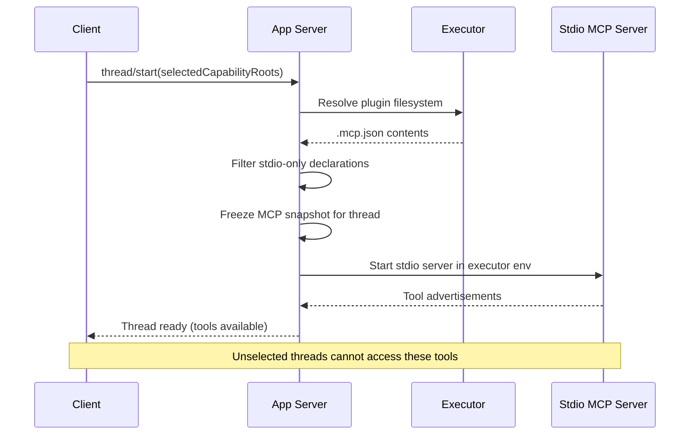
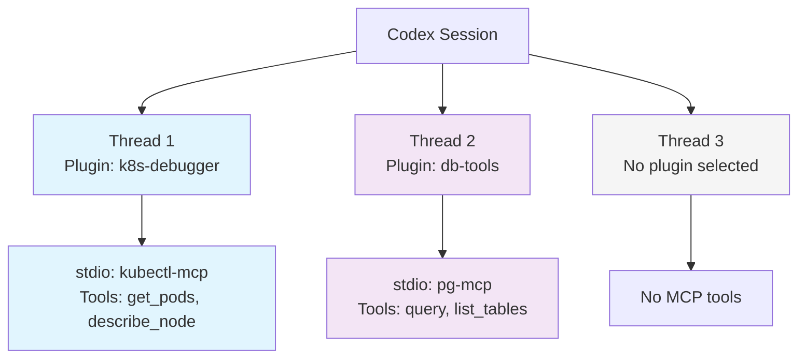

# Plugin as MCP Host: How Codex CLI v0.141 Turns Plugins into Per-Thread Tool Servers


---

When OpenAI launched the Codex plugin marketplace on 27 March 2026, plugins were distribution units — bundles of skills, app connectors, and MCP server *declarations* that Codex loaded at session start[^1]. Three months and fifteen releases later, plugins have quietly become something more consequential: **per-thread MCP hosts** whose stdio servers start on demand, run inside the executor's environment, and expose tools scoped exclusively to the selecting thread[^2][^3]. Combined with the v0.142 marketplace reorganisation into Curated, Workspace, and Shared categories[^4], this creates a governed, composable tool-server architecture that merits attention from anyone building enterprise Codex workflows.

## The Problem: Static MCP, Dynamic Work

Before v0.141, MCP server activation in Codex followed a session-level model. You declared servers in `.codex/mcp.json` or `requirements.toml`, and they started when the session started[^5]. Every thread within that session shared the same MCP tool surface. This created three friction points:

1. **Tool sprawl** — a Kubernetes debugging MCP server exposed `kubectl` tools to threads working on React components.
2. **Environment mismatch** — remote executor plugins declaring MCP servers had those declarations silently ignored because the app-server only resolved local plugin filesystems[^2].
3. **No dynamic composition** — selecting a plugin at thread start did not activate its bundled MCP servers, forcing manual configuration.

The fundamental issue was an architectural mismatch: plugins were selected per-thread, but MCP servers were activated per-session.

## The v0.141 Solution: Per-Thread Plugin MCP Activation

Pull requests #27870 and #27893[^2][^3] introduced a three-layer activation flow that resolves this mismatch:



### Step 1: Plugin Resolution Through Executor Filesystem

When `thread/start` includes `selectedCapabilityRoots`, the app-server resolves each plugin through its owning executor's filesystem — not the host filesystem[^2]. This is a deliberate security boundary: the resolution uses the exact filesystem capability granted to that executor, with no host-filesystem fallback.

### Step 2: Stdio-Only Filtering and Normalisation

The system reads the plugin's `.mcp.json`, filters to stdio declarations only (HTTP declarations are skipped with warnings until placement semantics are defined[^2]), and normalises server entries with executor-bound environment IDs.

### Step 3: Frozen Snapshot

Discovered MCP declarations are frozen once per active thread runtime[^2][^3]. This prevents dynamic changes mid-execution — a deliberate design choice that ensures thread-level tool consistency. Standard MCP config reloads preserve frozen registrations[^3].

## The `.mcp.json` Plugin Configuration

A plugin that bundles an MCP server declares it in its `.mcp.json` at the plugin root:

```json
{
  "mcpServers": {
    "k8s-tools": {
      "command": "node",
      "args": ["./mcp-servers/k8s/index.js"],
      "transport": "stdio",
      "env": {
        "KUBECONFIG": "${EXECUTOR_KUBECONFIG}"
      }
    },
    "monitoring-api": {
      "url": "https://monitor.internal/mcp",
      "transport": "http"
    }
  }
}
```

In this example, `k8s-tools` activates as a stdio server in the executor's environment when the plugin is selected. `monitoring-api` is skipped — HTTP transport activation is not yet supported in the per-thread model[^2].

## Per-Thread Isolation: What It Means in Practice

The isolation guarantees are strict[^3]:

- MCP tools from a selected plugin are advertised **only** to the selecting thread
- The MCP process receives **executor-only** environment values
- Unselected threads **cannot** access these MCP servers
- Sessions without `selectedCapabilityRoots` remain entirely unchanged

This means a team can have one thread debugging a Kubernetes cluster with `kubectl` tools, another thread reviewing database schemas with a PostgreSQL MCP server, and a third thread writing documentation with no external tools — all within the same Codex session, with zero cross-contamination.



## Marketplace Reorganisation: Curated, Workspace, Shared

The v0.142 release reorganised the `/plugins` command output into three distinct marketplace sections[^4][^6]:

| Section | Source | Governance |
|---------|--------|------------|
| **OpenAI Curated** | OpenAI-vetted plugins available to all users | OpenAI review process |
| **Workspace** | Plugins distributed within a ChatGPT workspace | Workspace admin controls |
| **Shared with me** | Plugins shared by workspace members | Per-user sharing permissions |

For enterprise teams, the Workspace tier is the critical one. Administrators can curate a set of approved plugins — each bundling governed MCP servers — and distribute them across the organisation. Combined with `requirements.toml` managed hooks[^7], this creates a supply chain:

1. Security team authors a plugin bundling a SAST MCP server
2. Admin publishes it to the Workspace marketplace
3. Developers select it per-thread when working on security-sensitive code
4. The MCP server starts in the executor's sandboxed environment
5. PostToolUse hooks validate the MCP server's outputs before they reach the model

## Turn-Level Plugin Recommendations

A subtler v0.142 addition: eligible turns can now recommend and install relevant plugins[^4]. When Codex detects that a task would benefit from a plugin it has not yet loaded, it surfaces a recommendation. This shifts plugin discovery from "browse the marketplace" to "the agent tells you what it needs."

For the per-thread MCP model, this means a thread could recommend a plugin, the user approves, and the plugin's stdio MCP servers activate — all without restarting the session or reconfiguring `.codex/mcp.json`.

## Security Considerations

The per-thread MCP model introduces new security surface that deserves attention:

**Executor-bound resolution** — plugins resolve through their owning executor's filesystem, not the host[^2]. This prevents a compromised plugin from reading arbitrary host files during MCP server startup.

**Stdio-only activation** — HTTP MCP servers are deliberately excluded from per-thread activation[^2]. This avoids the complexity of network-level isolation between threads and keeps the initial implementation surface small.

**Frozen snapshots** — once a thread's MCP declarations are frozen, they cannot be modified by the plugin, the MCP server, or another thread[^2][^3]. This prevents time-of-check/time-of-use (TOCTOU) attacks where a plugin modifies its MCP configuration after initial validation.

**Sandbox interaction** — MCP servers started by plugins inherit the executor's sandbox constraints. In `full-auto` mode with network disabled, a plugin's MCP server cannot exfiltrate data over the network even if the MCP server code is compromised[^8].

However, plugin MCP servers do run arbitrary code within the executor environment. Enterprise teams should validate plugin `.mcp.json` declarations through managed `requirements.toml` policies[^7] and restrict Workspace marketplace publishing to trusted authors.

## Practical Configuration

### Selecting a Plugin MCP at Thread Start (App-Server API)

```json
{
  "method": "thread/start",
  "params": {
    "selectedCapabilityRoots": [
      "plugin:@openai/k8s-debugger"
    ]
  }
}
```

### CLI Usage

From the TUI, the `/plugins` command shows available plugins grouped by marketplace source. Selecting a plugin for a new thread activates its bundled MCP servers automatically[^4][^6].

### Verifying MCP Tool Availability

Once a plugin MCP server activates, its tools appear in the thread's tool list. You can confirm with:

```bash
codex --print-tools
```

Or within a session, the model will list available tools including those from the plugin's MCP server.

### Plugin MCP with PostToolUse Hooks

Combine plugin MCP tools with PostToolUse hooks for governed tool usage:

```toml
# requirements.toml
[hooks.PostToolUse]
command = "python3 scripts/validate_mcp_output.py"
match_tools = ["k8s-tools.*"]
```

This runs validation after every tool call from the `k8s-tools` MCP server, regardless of which thread activated it[^7].

## What This Architecture Enables

The per-thread plugin MCP model enables patterns that were previously impossible or required manual orchestration:

- **Multi-environment debugging** — one thread connected to staging via a staging-k8s plugin, another to production, with complete tool isolation
- **Governed tool distribution** — security tools distributed as Workspace plugins with auditable activation and PostToolUse validation
- **Dynamic capability acquisition** — turn-level recommendations mean threads acquire tools as needed rather than pre-configuring every possible MCP server
- **Plugin-as-microservice** — each plugin becomes a self-contained tool server, composable at the thread level, version-managed through the marketplace

## Current Limitations

Several constraints apply to the current implementation[^2][^3]:

- **HTTP MCP servers** are not activated per-thread; only stdio transport is supported
- **Resume and fork** operations do not yet persist per-thread MCP state across session boundaries
- **Hosted plugins** (cloud-hosted rather than executor-hosted) follow a different activation path not covered by this mechanism
- **No hot-reload** — changing a plugin's `.mcp.json` requires starting a new thread; existing frozen snapshots are immutable

## Conclusion

The shift from session-level MCP configuration to per-thread plugin MCP activation is architecturally significant. It transforms plugins from passive instruction bundles into active tool servers with thread-scoped isolation, executor-bound security, and marketplace-governed distribution. For enterprise teams, the combination of Workspace marketplace curation, `requirements.toml` policy enforcement, and per-thread tool scoping creates a governed extensibility model that scales across projects without sacrificing the isolation guarantees that make agent-driven workflows safe to deploy.

The pattern to watch is the eventual activation of HTTP MCP servers per-thread — once that lands, plugins will be able to host both local tools (stdio) and remote services (HTTP) with the same per-thread isolation model, completing the vision of plugins as fully self-contained capability units.

---

## Citations

[^1]: OpenAI, "Plugins — Codex," OpenAI Developers, 2026. [https://developers.openai.com/codex/plugins](https://developers.openai.com/codex/plugins)

[^2]: jif-oai, "Discover stdio MCP servers from selected executor plugins," GitHub Pull Request #27870, openai/codex, June 2026. [https://github.com/openai/codex/pull/27870](https://github.com/openai/codex/pull/27870)

[^3]: jif-oai, "Activate selected executor plugin MCPs in app-server," GitHub Pull Request #27893, openai/codex, June 2026. [https://github.com/openai/codex/pull/27893](https://github.com/openai/codex/pull/27893)

[^4]: OpenAI, "Changelog — Codex CLI v0.142.0," OpenAI Developers, 22 June 2026. [https://developers.openai.com/codex/changelog](https://developers.openai.com/codex/changelog)

[^5]: OpenAI, "Configuration Reference — Codex," OpenAI Developers, 2026. [https://developers.openai.com/codex/config-reference](https://developers.openai.com/codex/config-reference)

[^6]: Releasebot, "Codex Updates by OpenAI — June 2026," Releasebot, 2026. [https://releasebot.io/updates/openai/codex](https://releasebot.io/updates/openai/codex)

[^7]: Daniel Vaughan, "Codex CLI Network Security: requirements.toml Enforcement, Landlock, and Air-Gapped Deployments," Codex Knowledge Base, 31 March 2026. [https://codex.danielvaughan.com/2026/03/31/codex-cli-network-security-requirements-toml/](https://codex.danielvaughan.com/2026/03/31/codex-cli-network-security-requirements-toml/)

[^8]: Daniel Vaughan, "Codex CLI Plugin System: Bundling Skills, MCP Servers, and App Connectors," Codex Knowledge Base, 30 March 2026. [https://codex.danielvaughan.com/2026/03/30/codex-cli-plugin-system/](https://codex.danielvaughan.com/2026/03/30/codex-cli-plugin-system/)
