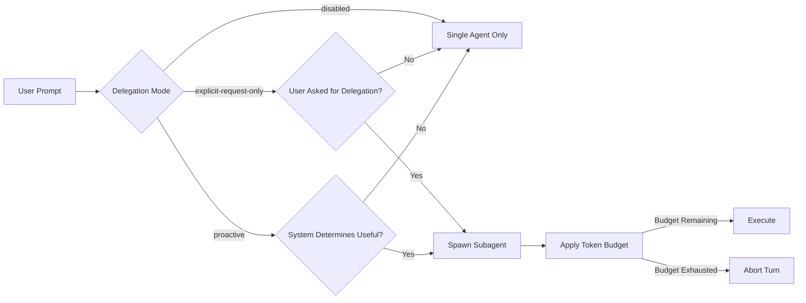
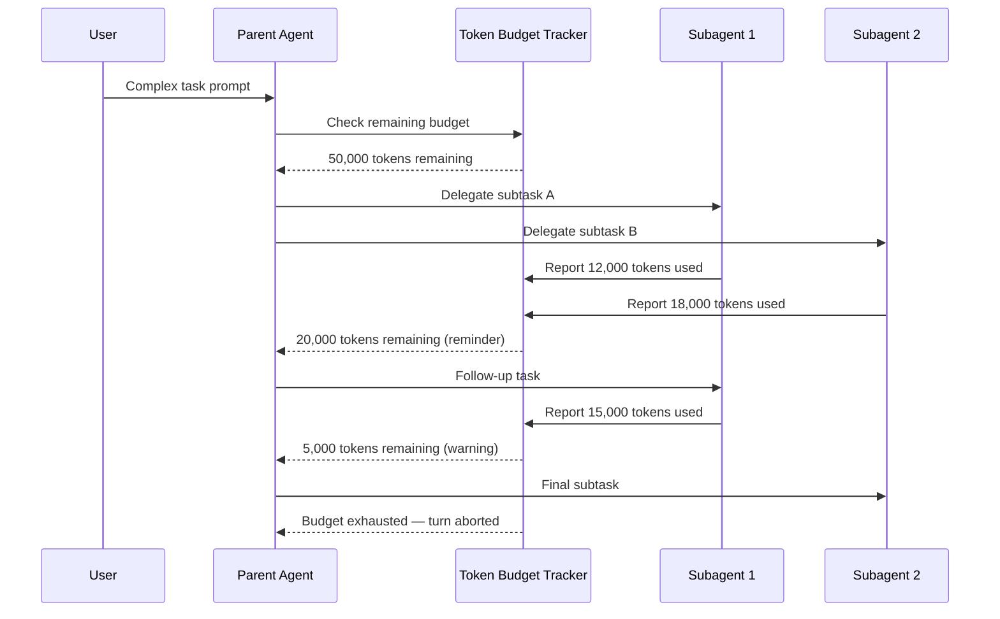

# Codex CLI v0.142 Delegation Modes and Token Budgets: Governing Multi-Agent Autonomy at Thread and Turn Level


---

Codex CLI v0.142.0, released on 22 June 2026, ships two features that fundamentally change how teams govern multi-agent workflows: **three-tier delegation modes** configurable at thread and turn granularity, and **rollout token budgets** that track consumption across agent threads with automatic abort-on-exhaustion[^1]. Together they close a long-standing gap between Codex's powerful subagent machinery and the enterprise reality that not every task should be allowed to spawn autonomous children.

This article walks through the delegation model, the token budget system, their configuration surface, and the patterns that make them useful in production.

## Why Delegation Governance Matters

Since v0.128, Codex CLI has supported subagents — specialised child sessions defined in TOML that run in parallel under configurable concurrency caps[^2]. The system is powerful: a parent agent can fan out CSV-batch jobs, delegate bounded subtasks to role-specific agents, and collect structured results[^3].

But until v0.142, the delegation policy was binary. Codex would only spawn a subagent when the user explicitly asked for one in the prompt[^3]. There was no middle ground between "always ask me" and "never delegate". GitHub issues #18513 and #18105 captured the friction: users running subagent-heavy workflows had to restate delegation permissions turn after turn, whilst enterprise administrators wanted the opposite — a way to hard-disable delegation for certain environments[^4].



## The Three Delegation Modes

v0.142 introduces a `delegation` key that app-server clients can set at both **thread level** (applies to every turn in the thread) and **turn level** (overrides the thread default for a single interaction)[^1].

### disabled

No subagent spawning permitted. The parent agent operates as a single session regardless of prompt content or AGENTS.md directives. This is the mode enterprise administrators will reach for when locking down sensitive repositories or compliance-scoped workflows.

### explicit-request-only

The pre-v0.142 default behaviour, now given a name. Codex spawns subagents only when the user's prompt explicitly requests delegation — phrases like "use a subagent", "delegate this", or referencing a named custom agent[^3]. Repository-level instructions in AGENTS.md cannot override this; the user must opt in per turn.

### proactive

The new autonomous mode. When set, Codex may spawn subagents without explicit user phrasing if the system determines delegation would be useful — for example, when it detects a task that maps cleanly to a defined custom agent's `description`, or when a CSV batch job would benefit from parallel workers[^1]. Guardrails still apply: `max_threads` and `max_depth` caps remain in force, and the parent session's sandbox policy propagates to every child[^3].

### Configuration

For CLI users connecting via the app-server API, the delegation mode is set as a thread-level parameter. For local `config.toml`, the `[agents]` section gains the new key:

```toml
[agents]
delegation = "explicit-request-only"   # "disabled" | "explicit-request-only" | "proactive"
max_threads = 6
max_depth = 1
```

Turn-level overrides are available through the app-server API, allowing programmatic workflows to toggle delegation on a per-interaction basis[^1]. A CI pipeline might set `proactive` for an initial planning turn, then switch to `disabled` for the implementation turns where deterministic single-agent execution is preferred.

## Rollout Token Budgets

The second governance feature addresses the cost dimension. Subagent workflows consume significantly more tokens than single-agent runs — each child session carries its own system prompt, tool definitions, and context window[^3]. Before v0.142, there was no mechanism to cap aggregate consumption across a thread's subagent tree.

### How It Works

Rollout token budgets track cumulative token usage across all agent threads spawned from a parent session[^1]. When the budget approaches exhaustion, Codex surfaces remaining-budget reminders. When exhausted, the system aborts the current turn rather than allowing unbounded consumption.



### Configuration

Token budgets are configured at the thread level, making them suitable for both interactive sessions and automated pipelines:

```toml
[agents]
delegation = "proactive"
max_threads = 6
max_depth = 1
rollout_token_budget = 100000   # total tokens across all child threads
```

The budget counter includes both input and output tokens across all subagent sessions. Cached input tokens, which cost 90% less on OpenAI's rate card[^5], still count towards the budget ceiling — the limit is about total model interaction volume, not billing alone.

## Practical Patterns

### Pattern 1: Tiered Governance by Repository

An organisation managing multiple repositories can set delegation policies per project through `.codex/config.toml`:

```toml
# Production services repo — conservative
[agents]
delegation = "disabled"
```

```toml
# Internal tooling repo — balanced
[agents]
delegation = "explicit-request-only"
max_threads = 4
max_depth = 1
rollout_token_budget = 75000
```

```toml
# Experimental prototypes — autonomous
[agents]
delegation = "proactive"
max_threads = 8
max_depth = 2
rollout_token_budget = 200000
```

### Pattern 2: Turn-Level Mode Switching in Pipelines

Automated pipelines connecting via the app-server API can vary delegation mode across turns. A code review pipeline might use `proactive` for the initial analysis turn (allowing Codex to autonomously delegate file-specific reviews to custom agents), then switch to `explicit-request-only` for the summary turn where controlled output matters more than parallelism.

### Pattern 3: Budget-Gated Exploration

For exploratory tasks where scope is uncertain, set a generous delegation mode with a conservative budget:

```toml
[agents]
delegation = "proactive"
max_threads = 6
rollout_token_budget = 50000
```

This lets Codex autonomously explore the problem space through subagents whilst ensuring the total cost stays bounded. When the budget expires, the parent agent must synthesise results from whatever work completed — a natural forcing function for incremental progress.

## Interaction with Existing Controls

The delegation modes compose with Codex's existing multi-agent governance surface:

| Control | Scope | Effect |
|---------|-------|--------|
| `delegation` | Thread / Turn | Whether subagents can spawn at all |
| `max_threads` | Session | Concurrent subagent cap |
| `max_depth` | Session | Nesting depth (prevents recursive delegation) |
| `rollout_token_budget` | Thread | Aggregate token ceiling across all children |
| Sandbox policy | Session | Inherited by all subagents; cannot be relaxed by children[^3] |
| Permission profiles | Session | Named profiles propagate to spawned agents |

Critically, sandbox inheritance remains non-negotiable. A `proactive` delegation mode does not weaken the security boundary — it only governs *whether* delegation occurs, not *what* delegated agents can do[^3]. A subagent spawned under `proactive` mode still inherits the parent's sandbox restrictions and cannot escalate its own permissions.

## What This Means for AGENTS.md Authors

Repository maintainers writing AGENTS.md files should be aware that their delegation directives now interact with the thread-level delegation mode:

- Under `disabled`, AGENTS.md instructions to "delegate X to the security-review agent" will be ignored entirely.
- Under `explicit-request-only`, such instructions serve as documentation but require the user to explicitly trigger delegation.
- Under `proactive`, AGENTS.md instructions act as hints that the system can use to determine when autonomous delegation is appropriate.

This means AGENTS.md authors can confidently describe ideal multi-agent workflows without worrying about forcing delegation on teams that have restricted it at the configuration level.

## Limitations and Caveats

⚠️ The delegation mode feature shipped in v0.142.0 on 22 June 2026 and may evolve in subsequent releases. The `proactive` mode in particular should be considered carefully before enabling in security-sensitive environments — whilst sandbox inheritance and depth limits provide guardrails, autonomous subagent spawning increases the attack surface for prompt injection propagation between parent and child sessions.

⚠️ Token budget tracking operates at the thread level. If your workflow uses `codex fork` to create sibling threads, each fork starts with its own independent budget counter. Cross-fork budget aggregation is not yet supported.

⚠️ The `proactive` delegation mode's heuristics for determining when delegation is "useful" are not documented in detail. Early adopters should monitor subagent spawn frequency and adjust `max_threads` and token budgets to match observed patterns.

## Looking Forward

The delegation modes feature closes the loop on a governance model that began with basic `max_threads` and `max_depth` limits. With v0.142, Codex CLI now offers a layered autonomy control stack: *whether* agents delegate (delegation mode), *how much* they delegate (thread and depth caps), *what* delegated agents can do (sandbox and permission inheritance), and *how much* they can consume (token budgets).

For teams running Codex in production, the immediate action is to audit existing `[agents]` configuration blocks and decide where each repository sits on the disabled–explicit–proactive spectrum. The `explicit-request-only` default preserves current behaviour, so upgrading to v0.142 requires no immediate changes — but the new surface is there when you need it.

## Citations

[^1]: OpenAI, "Release 0.142.0 · openai/codex," GitHub, 22 June 2026. [https://github.com/openai/codex/releases/tag/rust-v0.142.0](https://github.com/openai/codex/releases/tag/rust-v0.142.0)

[^2]: OpenAI, "Subagents – Codex | OpenAI Developers," OpenAI Developer Documentation, 2026. [https://developers.openai.com/codex/subagents](https://developers.openai.com/codex/subagents)

[^3]: OpenAI, "Subagents – Codex | OpenAI Developers," OpenAI Developer Documentation, 2026 — section on sandbox inheritance and spawn policy. [https://developers.openai.com/codex/subagents](https://developers.openai.com/codex/subagents)

[^4]: D. Buchi, "Add opt-in autonomous delegation setting for subagent-heavy workflows," GitHub Issue #18513, openai/codex, 2026. [https://github.com/openai/codex/issues/18513](https://github.com/openai/codex/issues/18513)

[^5]: OpenAI, "Pricing – Codex | OpenAI Developers," OpenAI Developer Documentation, 2026. [https://developers.openai.com/codex/pricing](https://developers.openai.com/codex/pricing)
