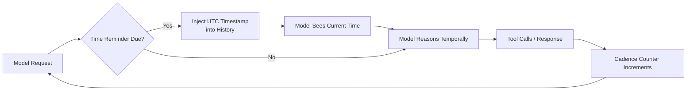
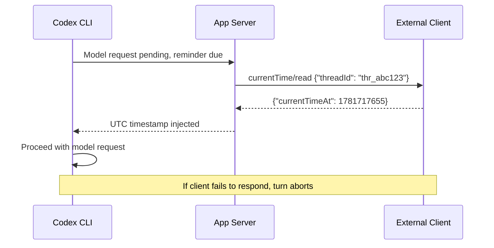

# Time-Aware Agents: How Codex CLI v0.142 Gives Your Agent a Clock


---

LLM agents are temporally blind. They cannot tell you how long a task took, whether cached data is stale, or what time zone the CI server lives in. Research confirms this is not a minor gap — it is a structural deficit. Garikaparthi's empirical investigation across 68 tasks and four model families found that pre-task duration estimates overshoot actual execution time by four to seven times, with models predicting human-scale minutes for tasks that complete in seconds [^1]. Separately, the TicToc benchmark showed that without explicit time signals, LLM tool-calling alignment with human temporal expectations drops to random-guessing levels [^2].

Codex CLI v0.142.0, released on 22 June 2026, addresses this head-on with a three-part time-awareness feature: configurable current-time reminders injected before model requests, a callable `clock.curr_time` tool for on-demand time queries, and an external clock protocol for app-server deployments [^3]. This article examines the architecture, configuration, and practical implications for agent workflows.

## The Temporal Blindness Problem in Coding Agents

A coding agent that cannot perceive time makes predictable mistakes. It re-fetches API documentation it retrieved thirty seconds ago. It fails to notice that a CI run has been pending for twenty minutes. It cannot schedule a retry after a rate-limit window expires. It treats every turn as happening in an eternal present.

The consequences compound in long-running sessions. Codex CLI sessions can span hours of autonomous work across multiple threads. Without temporal grounding, the model has no mechanism to distinguish a fresh thread from one that has been idle for an hour, or to reason about whether a deployment has had time to propagate.



## Architecture: Three Layers of Time Awareness

The v0.142 implementation landed across four pull requests (#28822, #28824, #28835, #29011) [^3] and introduces three distinct mechanisms, each solving a different temporal need.

### Layer 1: Passive Time Reminders

The foundation is a `CurrentTimeProvider` trait with a pluggable implementation [^4]. Before each model request, the turn-processing pipeline checks whether a reminder is due based on a configurable cadence. If so, it records a UTC timestamp directly into the conversation history, immediately before the model samples its next response.

The cadence is measured in model requests, not wall-clock time. Setting `reminder_interval_model_requests = 1` injects a timestamp before every single model call. Setting it to `5` means the model sees the current time once every five requests. The cadence state is maintained per session and survives history compaction through a forced refresh mechanism [^4].

```toml
[features.current_time_reminder]
enabled = true
reminder_interval_model_requests = 1
clock_source = "system"
```

This is the simplest configuration: the system clock provides UTC timestamps before every model request. The model receives them as standard history entries, requiring no special tool invocation.

### Layer 2: The `clock.curr_time` Tool

Passive reminders solve the "agent does not know what time it is" problem, but they do not solve the "agent needs to check the time mid-reasoning" problem. PR #29011 introduced `clock.curr_time`, a tool exposed to the model whenever current-time reminders are enabled [^5].

When invoked, the tool queries the session's configured time provider using the calling thread's identifier and returns a structured response:

```json
{ "current_time": "2026-06-23 14:32:07 UTC" }
```

In standard mode, it returns the same UTC reminder text format used by passive reminders. In Code Mode, it delivers the structured JSON above [^5]. Clock lookup failures are treated as fatal — the turn aborts rather than proceeding with stale or absent temporal data, maintaining consistency with the pre-inference reminder behaviour [^5].

### Layer 3: External Clock Protocol

For app-server deployments where the CLI runs as a backend service, the system clock may not be the authoritative time source. PR #28835 introduced the `currentTime/read` protocol [^6], enabling app-server clients to provide thread-specific timestamps.

When `clock_source = "external"` is configured, the app-server sends a JSON-RPC request to the subscribed client before each reminder-eligible model request:

```json
{
  "id": 42,
  "method": "currentTime/read",
  "params": { "threadId": "thr_abc123" }
}
```

The client responds with a Unix timestamp:

```json
{
  "id": 42,
  "result": { "currentTimeAt": 1781717655 }
}
```

A failed, cancelled, timed-out, or malformed response stops the turn before the model request is sent [^6]. This fail-closed design prevents the model from proceeding with an incorrect temporal context — a critical safety property for workflows where time-sensitive decisions (deployment windows, rate-limit expiry, SLA deadlines) depend on accurate timestamps.

```toml
[features.current_time_reminder]
enabled = true
reminder_interval_model_requests = 3
clock_source = "external"
```



## Practical Workflows

### Time-Bounded CI Monitoring

With time awareness, a Codex agent can reason about elapsed time during CI monitoring without the developer providing explicit timestamps:

```toml
# .codex/config.toml
[features.current_time_reminder]
enabled = true
reminder_interval_model_requests = 1
clock_source = "system"
```

The agent now knows when it started watching a pipeline, how long each check has taken, and whether it has exceeded a reasonable wait threshold. Combined with `codex exec` for scripted invocations, this enables time-bounded automation that previously required external scheduling logic.

### Rate-Limit Aware API Interactions

When an API returns a `Retry-After` header, a temporally aware agent can compare the retry timestamp against its current time perception, decide whether to wait or proceed with other work, and schedule a return to the blocked task. Without `clock.curr_time`, the agent would need to invoke a shell command like `date` — which may be sandboxed — or simply guess.

### Multi-Timezone Deployment Coordination

For teams operating across time zones, the external clock source allows the app-server to inject timezone-adjusted timestamps relevant to the deployment target. A London-based developer deploying to a Tokyo-hosted service can have the agent reason about the target region's current time without manual conversion.

## Interaction with Existing Features

The time-awareness features compose naturally with other v0.142 capabilities:

- **Token budget tracking** [^3]: Time reminders consume tokens. At `reminder_interval_model_requests = 1`, every model request includes a timestamp entry. For token-budget-constrained rollouts, increasing the interval to 5 or 10 reduces overhead whilst maintaining periodic temporal grounding.
- **Delegation modes** [^3]: Each subagent thread maintains its own cadence counter. A proactively delegated subagent inherits the time-reminder configuration but tracks its own reminder schedule independently.
- **Indexed web search** [^3]: Time-aware agents can reason about the freshness of cached web search results, deciding whether to request a live re-fetch based on elapsed time since the last search.

## Configuration Guidance

| Scenario | `reminder_interval` | `clock_source` | Rationale |
|---|---|---|---|
| Interactive terminal session | `5` | `system` | Periodic grounding without token overhead |
| `codex exec` CI automation | `1` | `system` | Every decision may be time-sensitive |
| App-server embedded deployment | `1` | `external` | Authoritative time from infrastructure |
| Token-constrained rollout | `10` | `system` | Minimise reminder token consumption |
| Offline/air-gapped environment | `1` | `system` | System clock is the only available source |

⚠️ The `features.current_time_reminder` configuration block is not yet documented in the official Configuration Reference or Sample Configuration pages as of 23 June 2026. The configuration keys shown in this article are derived from the merged PR implementations (#28822, #28824) and may be subject to change before they appear in official documentation.

## Why This Matters

The temporal blindness research is unambiguous: LLM agents perform at chance level on time-sensitive decisions without explicit time signals [^2]. Codex CLI's implementation is notable for three design choices:

1. **Passive injection over active querying**: The default mode injects timestamps without the model needing to decide to ask for the time. This sidesteps the meta-cognitive problem where a temporally blind agent does not know it needs to check the time.

2. **Fail-closed external clocks**: When the external clock source fails, the turn aborts. This prevents silent temporal drift in production deployments where stale timestamps could trigger premature or delayed actions.

3. **Thread-scoped cadence**: Each thread maintains its own reminder counter, ensuring that subagent threads receive temporal grounding independently of the parent thread's cadence. This is essential for multi-agent workflows where threads may execute at different rates.

The broader implication is architectural: time awareness should be a scaffold-level concern, not a model-level one. Rather than training models to perceive time (a task where current architectures demonstrably fail [^1]), Codex CLI provides accurate temporal data as infrastructure, letting the model focus on reasoning about time rather than perceiving it.

## Citations

[^1]: Garikaparthi, A. (2026). "Can LLMs Perceive Time? An Empirical Investigation." arXiv:2604.00010. [https://arxiv.org/abs/2604.00010](https://arxiv.org/abs/2604.00010)

[^2]: Zhong, W. et al. (2025). "Your LLM Agents are Temporally Blind: The Misalignment Between Tool Use Decisions and Human Time Perception." arXiv:2510.23853. [https://arxiv.org/abs/2510.23853](https://arxiv.org/abs/2510.23853)

[^3]: OpenAI. (2026). "Release 0.142.0." GitHub, openai/codex. [https://github.com/openai/codex/releases/tag/rust-v0.142.0](https://github.com/openai/codex/releases/tag/rust-v0.142.0)

[^4]: OpenAI. (2026). "PR #28824: Current time reminders — host-injectable provider with system implementation." GitHub, openai/codex. [https://github.com/openai/codex/pull/28824](https://github.com/openai/codex/pull/28824)

[^5]: OpenAI. (2026). "PR #29011: Clock current-time tool." GitHub, openai/codex. [https://github.com/openai/codex/pull/29011](https://github.com/openai/codex/pull/29011)

[^6]: OpenAI. (2026). "PR #28835: App-server external clock source implementation." GitHub, openai/codex. [https://github.com/openai/codex/pull/28835](https://github.com/openai/codex/pull/28835)

[^7]: OpenAI. (2026). "PR #28822: Current-time reminder configuration." GitHub, openai/codex. [https://github.com/openai/codex/pull/28822](https://github.com/openai/codex/pull/28822)
