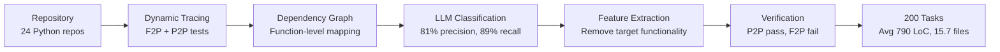
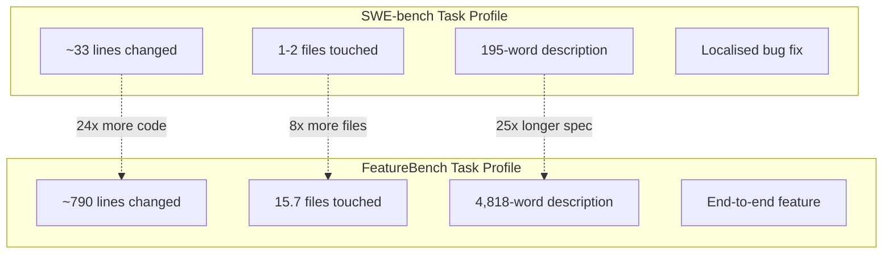

# FeatureBench and the Feature Gap: Why Your Codex CLI Agent Aces Bug Fixes but Struggles with Complex Features


---

Your agent resolves 75% of SWE-bench Verified issues. You tell it to add a new authentication provider that touches middleware, database schema, session handling, and documentation. It produces syntactically valid code in every file — and the integration test suite collapses with `NameError` cascades across half the codebase.

FeatureBench, published at ICLR 2026 by LiberCoders, finally puts a number on this gap [^1]. The benchmark evaluates agents on end-to-end feature development rather than isolated bug fixes, and the results are sobering: Claude Opus 4.5 under Claude Code — the same configuration that resolves 74.4% of SWE-bench Verified — succeeds on just 11.0% of FeatureBench tasks [^1]. GPT-5.1-Codex under the Codex scaffold fares only marginally better at 12.5% [^1].

This article dissects the FeatureBench findings, explains the failure modes that drive the gap, and maps practical Codex CLI configuration patterns that improve agent performance on complex, multi-file feature work.

## What FeatureBench Measures

SWE-bench tasks are typically localised bug fixes averaging 32.8 lines of changed code and 195 words of problem description [^1]. FeatureBench tasks are feature implementations averaging 790 lines of code across 15.7 files, with problem descriptions averaging 4,818 words and 62.7 test assertions per task [^1].

The benchmark uses a test-driven extraction pipeline: it traces fail-to-pass and pass-to-pass unit tests through a dependency graph to identify feature-level coding tasks spanning multiple commits and pull requests [^1]. The process requires roughly three minutes of human setup per repository, making it scalable and repeatable [^1].

The current dataset comprises 200 tasks from 24 open-source Python repositories, with a 30-task lite split for rapid evaluation and a 100-task fast split averaging 57.2 seconds per instance [^2].



## The Scorecard: Feature Development Humbles Every Agent

The full benchmark results reveal a consistent pattern — no agent configuration breaks 13% [^1]:

| Agent + Model | Lite (30 tasks) | Full (200 tasks) | Input Tokens/Task |
|---|---|---|---|
| Codex + GPT-5.1-Codex | 20.0% | 12.5% | 6.6M |
| Claude Code + Claude Opus 4.5 | 20.0% | 11.0% | 9.0M |
| OpenHands + Gemini-3-Pro | 10.0% | 4.5% | 6.2M |
| OpenHands + DeepSeek-V3.2 | 6.7% | 5.5% | 3.1M |
| OpenHands + Qwen3-Coder | 6.7% | 3.5% | 2.0M |

Two numbers stand out. First, the token consumption: Codex burns 6.6 million input tokens per task at a 12.5% success rate [^1]. That is roughly \$13–20 per attempt at current GPT-5.1-Codex pricing ⚠️. Second, the from-scratch penalty: L2 tasks (implementing features without existing codebase structure) drop success rates to 5.9–8.8%, compared with 11.4–13.9% for L1 incremental tasks [^1].

## Why Bug Fixes Are Easy and Features Are Hard

FeatureBench's error analysis of Claude Opus 4.5 failures identifies four dominant failure modes [^1]:

### 1. Cross-File Symbol Resolution Collapse

`NameError` is the single most frequent failure category. Agents focus on local edits without re-establishing references across file boundaries [^1]. When a feature requires a new class in `models.py` that is imported by `views.py`, referenced in `serializers.py`, and registered in `urls.py`, the agent reliably creates the class but inconsistently propagates the import chain.

### 2. Lazy Attribute Resolution

Rather than reading files to retrieve accurate prototypes, agents guess component interfaces — producing `TypeError` and `AttributeError` failures [^1]. This is the coding-agent equivalent of hallucination: the model generates plausible but incorrect function signatures, default arguments, or return types.

### 3. Context Window Saturation

With 790 lines of changed code across 15.7 files, feature tasks push agents into the outer reaches of their effective context. The 9.0M input tokens consumed by Claude Code per task suggests repeated re-reading of the same files as context compacts and re-expands [^1].

### 4. Logically Incorrect Implementations

`AssertionError` peaks in failures, indicating code that parses and runs but produces wrong results [^1]. The agent satisfies the syntactic contract without understanding the semantic intent — a problem that unit-test visibility dramatically improves.



## Codex CLI Patterns That Close the Gap

FeatureBench's ablation studies reveal two levers that dramatically improve agent performance: visible unit tests (43–50 percentage point improvement) and explicit interface definitions (3–7 point improvement) [^1]. Both map directly to Codex CLI configuration patterns.

### Pattern 1: Spec-Driven AGENTS.md with Interface Contracts

FeatureBench shows that removing function signatures drops success rates by 3–7 points [^1]. In Codex CLI, the equivalent is an AGENTS.md that declares interface contracts upfront:

```markdown
<!-- AGENTS.md -->
## Feature Development Protocol

Before writing any implementation code:
1. Read ALL files that import from or are imported by the target module
2. List every function signature you will create or modify
3. Confirm the import chain: where each new symbol is defined, exported, and consumed

Never guess a function signature. Run `grep -rn "def function_name"` to verify.
```

This directive directly addresses the lazy attribute resolution failure mode. It forces the agent to read before writing — the behaviour FeatureBench's authors identify as the critical gap [^1].

### Pattern 2: Test-First PostToolUse Hooks

The 43–50 percentage point improvement from visible tests is the largest single lever FeatureBench identifies [^1]. In Codex CLI, you can enforce test-first development through a PostToolUse hook that runs the relevant test suite after every file write:

```toml
# .codex/config.toml
[[hooks]]
event = "PostToolUse"
tool = "write"
command = "python -m pytest tests/ -x --tb=short -q 2>&1 | tail -20"
timeout_ms = 30000
```

This gives the agent continuous test feedback — the same signal that FeatureBench found most impactful. The `-x` flag (stop on first failure) keeps output concise and focuses the agent on the immediate breakage.

### Pattern 3: Hierarchical Planning with /plan and Delegation

FeatureBench's L2 (from-scratch) tasks reveal that agents struggle without existing codebase structure [^1]. Codex CLI's `/plan` mode addresses this by forcing the agent to build a structured plan before implementation:

```bash
# Start with explicit planning
codex --model gpt-5.5 "/plan Add OAuth2 authentication provider \
  with PKCE flow, touching middleware, models, views, serializers, \
  and URL configuration. List every file you will create or modify \
  and the symbols each file will export."
```

For tasks spanning more than ten files, Codex CLI v0.142's delegation modes allow decomposing the work across subagent threads [^3]. Set delegation to `explicit-request-only` to maintain control:

```toml
# .codex/config.toml
[agent]
delegation = "explicit-request-only"

[agent.rollout_budget]
max_tokens = 2000000
```

The rollout token budget prevents runaway consumption — critical given FeatureBench's finding that agents burn millions of tokens on complex features [^1] [^3].

### Pattern 4: Cross-File Symbol Verification via Stop Hook

The `NameError` cascade — FeatureBench's most common failure mode — can be caught before the agent declares victory:

```toml
# .codex/config.toml
[[hooks]]
event = "Stop"
command = """
python -c "
import py_compile, sys, pathlib
errors = []
for f in pathlib.Path('.').rglob('*.py'):
    try:
        py_compile.compile(str(f), doraise=True)
    except py_compile.PyCompileError as e:
        errors.append(str(e))
if errors:
    print('COMPILE ERRORS:')
    for e in errors[:10]:
        print(e)
    sys.exit(1)
"
"""
timeout_ms = 15000
```

This Stop hook compiles every Python file before the session ends. It catches missing imports, undefined names, and syntax errors — the exact failure categories that dominate FeatureBench results [^1].

### Pattern 5: Extended Iteration Budget

FeatureBench's ablation found that increasing maximum agent steps from 50 to 500 improved results [^1]. In Codex CLI, the equivalent is ensuring the agent has sufficient turns and tokens:

```toml
# .codex/config.toml
[model]
max_tokens = 16384

[agent]
max_turns = 200
```

Combined with the rollout token budget from Pattern 3, this gives the agent room to iterate without unlimited spend.

## Running FeatureBench Against Your Codex CLI Configuration

FeatureBench supports Codex CLI as a first-class evaluation target [^2]. To benchmark your configuration:

```bash
# Install FeatureBench
pip install featurebench

# Run the fast split (100 tasks, ~57s each)
fb infer --agent codex --model gpt-5.5 --split fast

# Evaluate results
fb eval -p runs/<timestamp>/output.jsonl --split fast
```

The fast split provides a representative signal in under two hours. Run it before and after applying the patterns above to measure their impact on your specific codebase profile.

## What This Means for How You Use Codex CLI

FeatureBench confirms what many senior developers suspected: agent performance on isolated bug fixes is a poor predictor of performance on the work that actually fills your sprint board. The 74% → 11% drop from SWE-bench to FeatureBench is not a model failure — it is a harness and workflow failure [^1].

The practical implication is that complex feature work requires a different Codex CLI configuration than quick fixes. Bug fixes work well in the default configuration with minimal AGENTS.md guidance. Feature development demands explicit planning phases, interface verification hooks, continuous test feedback, cross-file compilation checks, and controlled delegation budgets.

The gap between 12.5% and the theoretical ceiling is not going to be closed by the next model release alone. It requires treating the agent harness — your AGENTS.md, your hooks, your planning workflow — as a first-class engineering surface.

## Citations

[^1]: Chen, J., et al. "FeatureBench: Benchmarking Agentic Coding for Complex Feature Development." ICLR 2026. [arXiv:2602.10975](https://arxiv.org/abs/2602.10975)

[^2]: LiberCoders. "FeatureBench — Official Implementation." GitHub, 2026. [github.com/LiberCoders/FeatureBench](https://github.com/LiberCoders/FeatureBench)

[^3]: OpenAI. "Codex CLI v0.142.0 Release Notes." GitHub Releases, 22 June 2026. [github.com/openai/codex/releases](https://github.com/openai/codex/releases)

[^4]: OpenAI. "Custom instructions with AGENTS.md." Codex Developer Documentation, 2026. [developers.openai.com/codex/guides/agents-md](https://developers.openai.com/codex/guides/agents-md)

[^5]: OpenAI. "Best practices — Codex." Codex Developer Documentation, 2026. [developers.openai.com/codex/learn/best-practices](https://developers.openai.com/codex/learn/best-practices)

[^6]: OpenAI. "Using PLANS.md for multi-hour problem solving." Codex Cookbook, 2026. [developers.openai.com/cookbook/articles/codex_exec_plans](https://developers.openai.com/cookbook/articles/codex_exec_plans)

[^7]: OpenAI. "Advanced Configuration — Codex." Codex Developer Documentation, 2026. [developers.openai.com/codex/config-advanced](https://developers.openai.com/codex/config-advanced)
