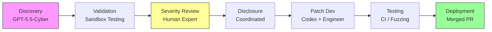
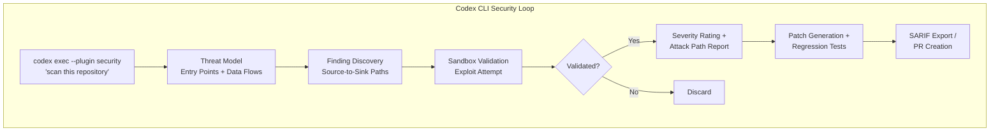

# Patch the Planet: What OpenAI's Open-Source Security Initiative Means for Codex CLI Defensive Workflows


---

On 22 June 2026, OpenAI launched **Patch the Planet** — a Daybreak initiative built with Trail of Bits, HackerOne, and Calif that aims to find and fix vulnerabilities in widely used open-source software using GPT-5.5-Cyber and expert human review [^1]. The initiative represents the sharpest example yet of coding agents operating as security partners rather than code generators.

For Codex CLI users, Patch the Planet is not just news — it is a blueprint. The workflows, tooling, and architectural patterns that Trail of Bits deployed across 19 projects in week one map directly onto the hooks, permission profiles, and AGENTS.md directives available in every Codex CLI installation.

---

## The Initiative: Scope and Structure

Patch the Planet covers the full defensive loop: discovery, validation, severity review, disclosure, patch development, testing, and deployment [^1]. More than 30 projects have committed to participate, with initial targets including cURL, NATS Server, pyca/cryptography, Sigstore, aiohttp, Go, freenginx, Python, python.org, urllib3, PyPI, SimpleX, Valkey, and RustCrypto [^2].



Participating projects receive ChatGPT Pro access, conditional Codex Security access, and API credits for development workflows [^3]. This is not a one-off audit — Trail of Bits has dedicated security engineers working full-time with Codex and GPT-5.5-Cyber across the project portfolio [^2].

---

## Week One Results

The initial five-day sprint produced concrete numbers [^2]:

| Metric | Count |
|--------|-------|
| Bugs discovered | Hundreds |
| Pull requests filed | 64 |
| Issues filed | 51 |
| Projects covered | 19 |
| Patches merged | 37 |

Contributions extended beyond bug fixes to include testing improvements, CI security scanning, and supply-chain tooling [^2]. The breadth matters — Trail of Bits explicitly stated that their approach differs from standard vulnerability reporting because "with our experts orchestrating and triaging findings, we handle the work of fixing and hardening the code alongside the people who maintain it" [^2].

---

## GPT-5.5-Cyber: The Security-Specialised Model

GPT-5.5-Cyber is available through OpenAI's limited Trusted Access for Cyber programme and outperforms the standard GPT-5.5 on every security benchmark [^3]:

| Benchmark | GPT-5.5-Cyber | GPT-5.5 Standard |
|-----------|---------------|-------------------|
| CyberGym | 85.6% | 81.8% |
| ExploitGym | 39.5% | 25.95% |
| SEC-bench Pro | 69.8% | 63.1% |

The model's ability to sustain deeper analysis across large codebases is what makes it effective for security work — it can analyse repositories, identify security-sensitive components, determine whether vulnerable code is reachable, validate findings, and develop and test patches [^3].

### Autonomous Fuzzing

Perhaps the most striking technical achievement from week one: GPT-5.5-Cyber autonomously constructed a "full fuzzing lab" featuring sanitiser builds, seed corpora generated from existing tests, and harnesses across a dozen entry points — completed in under one day [^2]. It "successfully built a harness that injected operating system backpressure to identify novel issues by reaching previously unexplored buggy states" [^2].

### Differential Testing

The model cross-referenced implementations of identical algorithms across projects, comparing behavioural outputs to surface discrepancies in cryptographic standards implementations [^2]. This methodology uncovered AES-GCM implementation discrepancies in PyCA and X.509 certificate validation differences across libraries [^2].

---

## Codex Security Plugin: The CLI Surface

The Codex Security plugin, updated alongside Patch the Planet, brings the same analysis pipeline into the CLI as a first-party plugin [^4]. Since its cloud research preview in March 2026, Codex Security has scanned over 30 million commits across 30,000+ codebases, with human reviewers confirming more than 70,000 fixed findings [^3].

The plugin exposes four skills covering the full application security triage cycle [^4]:

1. **Repository scanning** — threat modelling, finding discovery, validation, and attack-path analysis
2. **Deep scanning** — high-recall analysis of security-sensitive components
3. **Diff-scoped review** — scanning recent code changes rather than the full codebase
4. **Single-finding remediation** — generating codebase-specific patches for individual vulnerabilities

Export formats include SARIF, CodeQL, CSV, JSON, approval-gated GitHub/Jira/Linear issues, and private draft GitHub Security Advisories [^4].



---

## Vulnerability Types Surfaced

The initial sprint revealed a diverse range of vulnerability categories [^2]:

- **Cookie scope regression** in aiohttp — session cookies leaking across domains
- **Digest authentication** challenges from incorrect origin handling
- **Resource limit enforcement** timing issues allowing brief bypass windows
- **AES-GCM implementation discrepancies** in PyCA cryptography
- **X.509 certificate validation** differences across TLS libraries
- **Authorisation gaps** in python.org legacy APIs

These are not trivial linting findings. They are reachable, exploitable issues in projects that underpin large swathes of the internet's infrastructure.

---

## What This Means for Codex CLI Users

You do not need Trusted Access or a Trail of Bits engagement to apply Patch the Planet patterns. Every mechanism the initiative relies upon has a Codex CLI analogue.

### 1. AGENTS.md as a Security Directive Surface

Trail of Bits explicitly recommended that projects implement `AGENTS.md` files directing models to relevant security documentation [^2]. For your own projects, this means:

```toml
# .codex/AGENTS.md excerpt for security-aware sessions

## Security Context

- All input validation is in `src/validation/`. Check there before adding new endpoints.
- Known attack surfaces: file upload (see SECURITY.md §3), OAuth callback (§4).
- Never disable TLS certificate verification, even in tests.
- Run `make security-scan` before committing changes to authentication code.
```

This is the simplest force multiplier available — a text file that biases every Codex CLI session towards security-aware behaviour without requiring plugins or configuration changes.

### 2. PostToolUse Hooks as Security Gates

The Patch the Planet workflow validates findings in sandboxed environments before reporting them. You can approximate this pattern with a PostToolUse hook that runs a lightweight scanner after file edits:

```toml
# config.toml
[[hooks]]
event = "PostToolUse"
tool = "write_file"
command = "semgrep --config=auto --error $CODEX_FILE_PATH 2>/dev/null || echo 'Security finding detected — review before committing'"
timeout_ms = 15000
```

This catches common vulnerability patterns — hardcoded secrets, SQL injection, path traversal — immediately after the agent writes code, before the changes propagate further into the session.

### 3. Diff-Scoped Security Reviews in CI

The Codex Security plugin's diff-scoped review mode maps directly onto a `codex exec` invocation in a CI pipeline:


```bash
# GitHub Actions step
- name: Security diff review
  run: |
    codex exec --plugin security \
      "Review the diff between ${{ github.event.pull_request.base.sha }} and HEAD for security issues. \
       Focus on authentication, authorisation, input validation, and cryptographic usage. \
       Output findings as SARIF." \
      > security-findings.sarif
    # Upload to GitHub Code Scanning
    gh api repos/${{ github.repository }}/code-scanning/sarifs \
      -f sarif="$(cat security-findings.sarif | gzip | base64)"
```


### 4. Permission Profiles for Security Isolation

When running security analysis, restrict the agent's own attack surface with a dedicated permission profile:

```toml
[permissions.security-audit]
extends = ":read-only"

# Allow reading everything except credentials
[[permissions.security-audit.deny-read]]
path = "**/.env*"
[[permissions.security-audit.deny-read]]
path = "**/credentials*"
[[permissions.security-audit.deny-read]]
path = "**/*secret*"

# Allow writing only to the findings directory
[[permissions.security-audit.allow-write]]
path = "security-findings/**"

# No network access during analysis
[[permissions.security-audit.deny-network]]
host = "*"
```

This ensures that a security scanning session cannot inadvertently exfiltrate sensitive data or modify production code.

---

## The AGENTS.md Security Pattern from Trail of Bits

Trail of Bits' recommendation to implement `AGENTS.md` files for security context deserves special attention [^2]. Their guidance suggests three categories of content:

1. **Threat model pointers** — directing agents to existing security documentation, threat models, and past vulnerability reports
2. **Severity documentation** — project-specific severity criteria so agents can triage findings appropriately
3. **Deduplication guidance** — helping agents compare new findings against existing issues to avoid noise

This aligns with the broader AGENTS.md harness engineering pattern where the file acts as a natural-language harness constraining agent behaviour [^5]. For security-sensitive projects, the AGENTS.md file becomes the primary mechanism for encoding institutional security knowledge into every agent interaction.

---

## From Initiative to Practice: A Practical Checklist

If you maintain open-source projects or work on security-sensitive codebases, the Patch the Planet workflow suggests a concrete adoption path:

1. **Add security context to AGENTS.md** — threat model pointers, known attack surfaces, security-sensitive directories
2. **Enable the Codex Security plugin** — `codex plugin add security` for local scanning
3. **Configure a PostToolUse security hook** — run Semgrep, Bandit, or `cargo audit` after file writes
4. **Set up diff-scoped CI scanning** — `codex exec --plugin security` in your PR pipeline
5. **Create a security-audit permission profile** — read-only with targeted deny rules for credentials
6. **Export findings as SARIF** — integrate with GitHub Code Scanning or your vulnerability management platform

---

## The Broader Signal

Patch the Planet is significant beyond its immediate bug count. It demonstrates that the coding agent security story has moved from "agents introduce vulnerabilities" to "agents find and fix them at scale." The Daybreak initiative has already surfaced 24 Linux kernel privilege escalation exploits, 34 FreeBSD vulnerabilities, and browser vulnerabilities across Chrome, Safari, and Firefox [^3].

For Codex CLI users, the practical implication is that the same model family powering your daily development work — GPT-5.5 and its Cyber variant — has been validated as a security tool by one of the industry's most respected security firms. The hooks, plugins, and configuration surfaces in Codex CLI exist precisely to let you wire this capability into your own workflow.

The gap between "Trail of Bits using Codex to patch cURL" and "you using Codex to scan your PR" is a `config.toml` edit and an AGENTS.md file.

---

## Citations

[^1]: OpenAI, "Patch the Planet: a Daybreak initiative to support open source maintainers," openai.com, 22 June 2026. [https://openai.com/index/patch-the-planet/](https://openai.com/index/patch-the-planet/)

[^2]: Trail of Bits, "Introducing Patch the Planet," blog.trailofbits.com, 22 June 2026. [https://blog.trailofbits.com/2026/06/22/introducing-patch-the-planet/](https://blog.trailofbits.com/2026/06/22/introducing-patch-the-planet/)

[^3]: OpenAI, "Daybreak: Tools for securing every organization in the world," openai.com, 22 June 2026. [https://openai.com/index/daybreak-securing-the-world/](https://openai.com/index/daybreak-securing-the-world/)

[^4]: OpenAI Developers, "Plugin quickstart – Codex Security," developers.openai.com, 2026. [https://developers.openai.com/codex/security/plugin](https://developers.openai.com/codex/security/plugin)

[^5]: OpenAI Developers, "AGENTS.md – Codex," developers.openai.com, 2026. [https://developers.openai.com/codex/agents-md](https://developers.openai.com/codex/agents-md)
