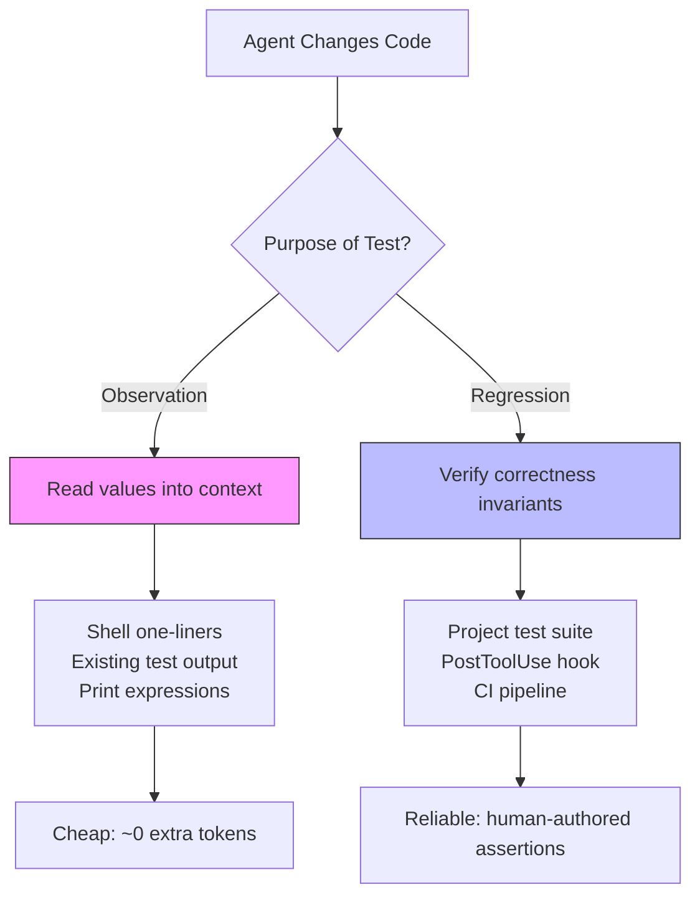

# Rethinking Agent-Generated Tests: Why Your Codex CLI Agent Writes Print Statements, Not Assertions, and What to Do About It


---

A widely held assumption in the coding-agent community is that agents which write more tests resolve more issues. A February 2026 study from Singapore Management University and Alibaba systematically dismantles that belief — and the implications for how you configure Codex CLI testing workflows are significant [^1].

## The Contrarian Finding

Chen et al. analysed trajectories from six frontier LLMs on SWE-bench Verified — Claude Opus 4.5, Gemini 3 Pro, GPT-5.2, Kimi K2 Thinking, MiniMax M2, and DeepSeek v3.2 Reasoner — and discovered three things that should change how you think about agent testing [^1]:

1. **Test-writing frequency does not predict resolution.** Resolved and unresolved tasks exhibit near-identical test-writing rates within each model. MiniMax M2 wrote tests in 99.0% of resolved tasks and 97.9% of unresolved ones. Kimi K2-T: 97.5% vs 97.3% [^1].

2. **GPT-5.2 barely writes tests at all — and matches top performers.** With a test-writing rate of just 0.8% on resolved tasks (3 out of 359), GPT-5.2 achieved 71.8% resolution, within striking distance of Claude Opus 4.5 at 74.4% [^1].

3. **When agents do write tests, they overwhelmingly use print statements, not assertions.** The print-to-assertion ratio across all models averages approximately 4.8:1. Claude Opus 4.5 produces 25.00 value-revealing prints per task against just 5.16 assertions [^1].

The agents are not testing. They are observing.

## Observational Feedback Channels, Not Test Suites

The study introduces a taxonomy that clarifies what agent-generated tests actually contain [^1]:

### Assertion Categories

| Category | Description | Share |
|----------|-------------|-------|
| C1 — Sanity | Type checks, non-null guards | 14.9–19.8% |
| C2 — Property | Attribute presence, shape validation | 33.6–41.4% |
| C3 — Relational | Comparisons between computed values | 3.0–7.9% |
| C4 — Exact | Hard-coded expected values | 34.5–42.9% |

### Print Categories

| Category | Description | Share |
|----------|-------------|-------|
| P1 — Value/Content | Dumping variable contents | 69.7–77.5% |
| P2 — Structural | Inspecting shapes, lengths, keys | 3.5–6.6% |
| P3 — Exception/Status | Catching and printing errors | 19.1–25.0% |

The dominance of P1 prints (up to 77.5%) reveals the real function: agents write `print(result)` to read values back into the context window, not to enforce invariants. The "test" file is a scratchpad, not a regression suite [^1].

## The Prompt Intervention Proof

The researchers ran a controlled prompt-intervention experiment, modifying instructions to either encourage or discourage test writing [^1]:

- **Encouraging GPT-5.2 to write tests:** 64.4% of tasks transitioned from no-test to has-test. Resolution change? McNemar p = 1.000 — no significant effect.
- **Discouraging Kimi K2-T from writing tests:** 68.4% of tasks transitioned from has-test to no-test. Resolution change? McNemar p = 0.228 — no significant effect.
- **Discouraging DeepSeek v3.2-R from writing tests:** 75.2% transitioned to no-test. McNemar p = 0.435 — again, not significant.

Test volume is orthogonal to resolution success. What matters is something else entirely.

## The Cost of Observational Testing

Suppressing test writing produced dramatic token savings with zero resolution penalty [^1]:

| Model | API Calls | Input Tokens | Output Tokens |
|-------|-----------|--------------|---------------|
| Kimi K2-T (discouraged) | −35.4% | −49.0% | −43.1% |
| DeepSeek v3.2-R (discouraged) | −24.5% | −32.9% | −14.0% |
| GPT-5.2 (encouraged) | +5.5% | +9.0% | +19.8% |

When Kimi K2-T stopped writing observational tests, it consumed half the input tokens while solving the same problems. That is a direct cost reduction you can achieve today in Codex CLI.

## What This Means for Codex CLI Configuration

The paper's central conclusion is that **scaffold-level orchestration of testing, rather than model-native test-writing behaviour, is the architecturally relevant variable** [^1]. Codex CLI provides precisely the scaffold machinery to act on this finding.

### 1. Stop Asking the Agent to Write Tests — Orchestrate Tests Externally

The default instinct when writing `AGENTS.md` is to add directives like "write tests for every change." The research suggests this is counterproductive. Instead, use Codex CLI's hook system to run your existing test suite after every code change [^2]:

```toml
# .codex/hooks/post_tool_use.sh — run project tests after file writes
#!/bin/bash
EVENT=$(cat)
TOOL=$(echo "$EVENT" | jq -r '.tool_name')

if [ "$TOOL" = "apply_patch" ] || [ "$TOOL" = "write" ]; then
  echo '{"decision": "approve"}'
  # Run existing test suite in background
  npm test --silent 2>&1 | tail -20
else
  echo '{"decision": "approve"}'
fi
```

This separates the feedback signal (test results flowing back into context) from the feedback mechanism (agent writing throwaway print scripts). The project's real test suite provides richer, more reliable signals than agent-generated observational code [^2].

### 2. Use AGENTS.md to Redirect Agent Observation Behaviour

Rather than banning test writing outright, redirect the agent's observational instinct towards more efficient channels. The research shows agents want to read values back into context — give them cheaper ways to do it [^3]:

```markdown
# AGENTS.md — Testing and Observation

## Testing
- Do NOT write new test files to observe intermediate values
- Run existing tests with `pytest tests/ -x --tb=short`
- To inspect values, use the shell directly: `python -c "from mymodule import X; print(X.compute())"`
- If you need to verify behaviour, read the existing test output rather than writing new tests

## Verification
- After every code change, run `make check` (lints + tests)
- The PostToolUse hook will run the test suite automatically — read its output
```

This acknowledges the agent's need for observational feedback whilst eliminating the 49% token overhead of writing and executing throwaway test files [^1] [^3].

### 3. Separate Agent Exploration from Regression Protection

The research distinguishes between two functions that "testing" conflates in agent workflows:



For **observation**, the agent needs fast, cheap feedback. Shell one-liners and reading existing test output satisfy this without generating files. For **regression protection**, your human-authored test suite, executed via hooks, provides genuine verification that agent-generated print statements never will [^1] [^2].

### 4. Configure Named Profiles for Testing Strategy

Different models have radically different test-writing behaviours. GPT-5.2 writes almost no tests natively; Kimi K2-T writes tests in 97.5% of tasks [^1]. Use Codex CLI named profiles to optimise per model [^4]:

```toml
# ~/.codex/profiles/low-test-model.toml
# For models that naturally avoid test generation (e.g. o3, o4-mini)
[agent]
model = "o4-mini"

[instructions]
additional = """
Focus on code changes. Run existing tests via `make test` to verify.
Do not write new test files.
"""

# ~/.codex/profiles/high-test-model.toml
# For models that over-generate tests — redirect to observation
[agent]
model = "gemini-3-pro"

[instructions]
additional = """
Do not write test files to observe values.
Use shell commands: python -c "..." or node -e "..."
Run existing tests with `npm test` after changes.
"""
```

Launch with `codex --profile low-test-model` to apply the appropriate testing strategy for the model in use [^4].

### 5. Use Stop Hooks as Scaffold-Level Test Gates

The paper argues scaffold-level test orchestration outperforms model-native test writing [^1]. Codex CLI's Stop hook enforces this at the architecture level — the agent cannot complete a turn without passing the project's real tests [^2]:

```bash
#!/bin/bash
# .codex/hooks/stop.sh — block completion if tests fail
TEST_OUTPUT=$(npm test 2>&1)
EXIT_CODE=$?

if [ $EXIT_CODE -ne 0 ]; then
  echo '{"decision": "reject", "reason": "Tests failing. Fix before completing."}'
  echo "$TEST_OUTPUT" | tail -30
else
  echo '{"decision": "approve"}'
fi
```

This is the scaffold doing what the agent cannot: enforcing regression constraints through external verification rather than self-generated observational scripts [^2].

### 6. CI Pipelines with codex exec — External Test Orchestration at Scale

For headless CI workflows, `codex exec` combined with external test orchestration implements the paper's recommendation cleanly [^5]:

```bash
# CI pipeline: agent fixes code, scaffold runs tests
codex exec \
  --model o4-mini \
  --approval-mode full-auto \
  "Fix the failing test in src/parser.rs. Do not write new test files. \
   Run 'cargo test' to verify your fix."

# Post-agent verification (scaffold level)
cargo test --release 2>&1
```

The agent writes code; the scaffold runs tests. The separation is architecturally clean and empirically supported [^1] [^5].

## The Broader Lesson: Agents Are Not Developers

The print-to-assertion ratio of 4.8:1 reveals something fundamental about how LLMs use tests [^1]. A human developer writes tests to prevent future regressions — a forward-looking act. An agent writes `print(x)` to read a value back into its context window — a backward-looking act. These are different activities that happen to share the same file format.

Once you internalise this distinction, the configuration choices become obvious:

- **Observation** → shell commands, existing test output, cheap and ephemeral
- **Verification** → project test suite, hooks, CI gates, durable and human-authored
- **Never** → agent-generated test files consumed as regression suites

The research does not say testing is unimportant. It says that *agent-generated* testing, as currently practised, is an expensive form of `print()` that should be replaced by scaffold-level orchestration — exactly what Codex CLI's hook system was designed to provide.

## Citations

[^1]: Chen, Z., Sun, Z., Shi, Y., Peng, C., Gu, X., Lo, D., & Jiang, L. (2026). "Rethinking the Value of Agent-Generated Tests for LLM-Based Software Engineering Agents." arXiv:2602.07900v2. [https://arxiv.org/abs/2602.07900](https://arxiv.org/abs/2602.07900)

[^2]: OpenAI. (2026). "Hooks — Codex CLI." OpenAI Developer Documentation. [https://developers.openai.com/codex/hooks](https://developers.openai.com/codex/hooks)

[^3]: OpenAI. (2026). "Best Practices — Codex CLI." OpenAI Developer Documentation. [https://developers.openai.com/codex/learn/best-practices](https://developers.openai.com/codex/learn/best-practices)

[^4]: OpenAI. (2026). "CLI Command Line Options — Codex CLI." OpenAI Developer Documentation. [https://developers.openai.com/codex/cli/reference](https://developers.openai.com/codex/cli/reference)

[^5]: OpenAI. (2026). "CLI — Codex." OpenAI Developer Documentation. [https://developers.openai.com/codex/cli](https://developers.openai.com/codex/cli)
