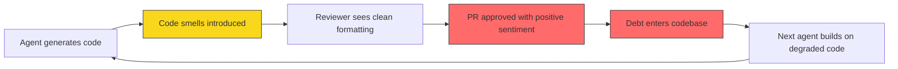
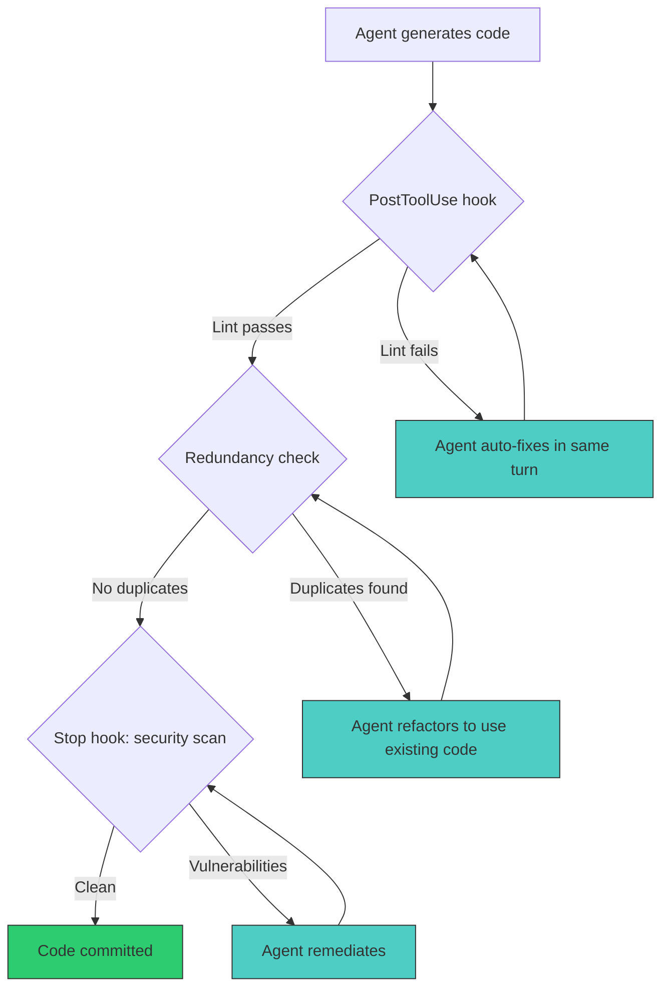

# Silent Technical Debt in AI-Generated Code: What 302,000 Commits Reveal and How Codex CLI Defends Against It


---

Two large-scale empirical studies published at MSR 2026 converge on an uncomfortable finding: AI coding agents systematically introduce technical debt that human reviewers fail to catch, and nearly a quarter of the resulting defects persist indefinitely. This article unpacks the numbers and maps every finding to a concrete Codex CLI defence pattern.

## The Evidence: Two Studies, One Conclusion

### Debt Behind the AI Boom

Liu et al. analysed **302,579 verified AI-authored commits** across 6,299 GitHub repositories, covering five major AI coding tools: GitHub Copilot, Claude, Cursor, Gemini, and Devin [^1]. They identified **484,366 distinct issues** using static analysis, distributed as follows:

| Category | Count | Share |
|---|---|---|
| Code smells | 432,748 | 89.3% |
| Correctness issues | 28,931 | 6.0% |
| Security issues | 22,687 | 4.7% |

The five most common code smells were broad exception handling (41,374 cases), unused variables (28,272), unused arguments (24,357), shadowed outer variables (20,647), and protected-member access violations (19,796) [^1].

Critically, the debt does not self-heal. **22.7% of AI-introduced issues survived to the latest repository HEAD**, with cohorts older than nine months showing a 22.8% persistence rate — essentially identical to fresh commits at 21.3% [^1]. Once an AI-generated smell enters the codebase, it tends to stay.

The net-impact analysis adds nuance: AI tools fix slightly more code smells than they introduce (439,817 fixed vs 432,748 introduced), but for **correctness issues AI introduces 1.5× more than it fixes**, and for **security issues the ratio is worse still** [^1].

### More Code, Less Reuse

Huang et al. studied AI-generated pull requests in Python repositories and found that agents produce code with a **maximum redundancy score 1.87× higher** than human-authored code (0.2867 vs 0.1532, p<0.001) [^2]. Agents systematically ignored existing utility functions and reimplemented logic from scratch, inflating the codebase without adding capability.

The most striking finding concerns reviewer sentiment. Despite measurable quality deficiencies, **human reviewers expressed more neutral or positive emotions towards AI-generated PRs** than towards human-authored ones [^2]. Agentic PRs attracted less disgust, less anger, and less surprise — the very signals that ordinarily trigger closer inspection.

## Why Reviewers Miss It

The sentiment asymmetry is not mysterious. AI-generated code tends to be syntactically clean, well-formatted, and conventionally structured. It passes the visual sniff test. The defects — unused arguments, redundant implementations, broad exception handlers — require semantic understanding that a quick diff review does not provide [^2].

This creates a ratchet effect: agents introduce structural debt, reviewers wave it through, and subsequent agents build on the degraded codebase without questioning the existing patterns. The debt compounds silently.



## Codex CLI Defence Patterns

### 1. PostToolUse Lint Gates

The most direct defence against the top code smells is a `PostToolUse` hook that runs static analysis after every file write. The hook catches broad exceptions, unused variables, and shadowed names before they reach a commit.

```toml
# ~/.config/codex/config.toml
[[hooks]]
event = "PostToolUse"
match_tool = "write_file"
command = "ruff check --select E722,F841,F811,W0612 --output-format=json $CODEX_FILE_PATH"
on_fail = "inject"
```

When `on_fail = "inject"`, a failing lint result is fed back into the agent's context as a system message. The agent sees the violation and fixes it in the same turn — no human intervention required [^3].

For Python projects, target the specific rule codes that map to the MSR findings:

| MSR Finding | Ruff Rule | Description |
|---|---|---|
| Broad exception handling | `E722` | Bare `except:` without type |
| Unused variables | `F841` | Local variable assigned but never used |
| Unused arguments | `ARG001` | Unused function argument |
| Shadowed outer variables | `F811` | Redefinition of unused name |
| Undefined variables | `F821` | Undefined name |

### 2. AGENTS.md Reuse Directives

The 1.87× redundancy gap stems from agents not knowing what already exists. An `AGENTS.md` section that explicitly maps the codebase's reusable modules closes this gap at prompt time:

```markdown
## Code Reuse Requirements

Before writing new utility functions, check these existing modules:
- `src/utils/http.py` — HTTP client wrappers, retry logic, auth helpers
- `src/utils/validation.py` — input validation, schema checks
- `src/utils/datetime_helpers.py` — timezone conversions, date parsing
- `src/common/errors.py` — custom exception hierarchy (never use bare except)

NEVER reimplement functionality that already exists in the modules above.
When adding new shared logic, add it to the appropriate existing module
rather than creating a new file.

## Exception Handling

Always catch specific exception types. Use the hierarchy in `src/common/errors.py`.
Never write `except:` or `except Exception:` without re-raising.
```

The Huang et al. study showed that the redundancy problem is not a model capability limitation but a context problem — the agent simply does not know what already exists [^2]. Explicit AGENTS.md directives provide that context at zero token cost beyond the initial file read [^4].

### 3. Pre-Commit Security Scanning

The Liu et al. finding that AI introduces more security issues than it fixes demands a gate that catches vulnerabilities before they reach `main`. Codex CLI's hook system can enforce this via a `Stop` hook that runs before any commit:

```toml
[[hooks]]
event = "Stop"
command = "bandit -r src/ -f json -q --severity-level medium"
on_fail = "block"
```

The `block` action prevents the agent from completing its turn until the security scan passes. For the two dominant vulnerability categories — path traversal (8,677 cases) and unsafe format strings (4,792 cases) — Bandit's `B108` and `B608` rules provide direct coverage [^1] [^5].

### 4. Redundancy Detection with PostToolUse

To catch the reuse problem mechanically, wire a duplicate-code detector into the PostToolUse pipeline:

```toml
[[hooks]]
event = "PostToolUse"
match_tool = "write_file"
command = "jscpd --min-lines 5 --reporters json --output /tmp/jscpd $CODEX_FILE_PATH"
on_fail = "inject"
```

When `jscpd` detects that a newly written block duplicates existing code, the agent receives the match location and can refactor to call the existing implementation instead [^6].

### 5. Named Profiles for Debt-Prone Tasks

The Liu et al. study found significant variation between AI tools: Gemini commits introduced issues at a 29.1% rate versus GitHub Copilot's 17.4% [^1]. Model choice matters. Codex CLI's named profiles let you route debt-prone tasks to stronger models:

```toml
[profiles.careful]
model = "gpt-5.5"
approval_policy = "on-request"
reasoning_effort = "high"

[profiles.quick]
model = "gpt-5.3-codex-spark"
approval_policy = "auto-review"
reasoning_effort = "medium"
```

Use `codex --profile careful` for refactoring, dependency upgrades, and security-sensitive changes — tasks where the MSR data shows the highest debt introduction rates. Reserve `--profile quick` for well-scoped, test-covered changes where the lint gate catches regressions [^7].

### 6. Enterprise-Wide Quality Gates via requirements.toml

For organisations, `requirements.toml` enforces quality standards that individual developers cannot bypass:

```toml
[features]
skip_user_hooks = false
skip_project_hooks = false

[managed_hooks]
[[managed_hooks.PostToolUse]]
command = "ruff check --select E722,F841,F811,ARG001,F821"
on_fail = "inject"
description = "Mandatory lint gate — targets top five AI code smells from MSR 2026 findings"
```

Managed hooks from `requirements.toml` run even when user-level and project-level hooks are skipped, ensuring consistent enforcement across every developer's Codex session [^8].

## The Compound Effect



Each layer addresses a specific failure mode from the empirical evidence:

- **PostToolUse lint** catches the 89.3% of issues that are code smells
- **Redundancy detection** addresses the 1.87× reuse gap
- **Security scanning** targets the correctness and security issues that AI introduces faster than it fixes
- **AGENTS.md directives** prevent the problem at generation time rather than catching it after the fact

The critical insight from both studies is that the debt is *silent* — it passes visual review and accumulates because nobody measures it. Automated gates that run on every file write transform a human perception problem into a mechanical enforcement problem.

## Measuring Your Own Debt Rate

Before tuning your hooks, establish a baseline. Run static analysis across your last 100 agent-authored commits:

```bash
# Extract agent commits (adjust author pattern to match your setup)
git log --author="codex" --format="%H" -100 > /tmp/agent_commits.txt

# Analyse each commit's diff for introduced issues
while read hash; do
  git diff "${hash}^..${hash}" --name-only -- '*.py' | \
    xargs -I{} ruff check {} --output-format=json 2>/dev/null
done < /tmp/agent_commits.txt | jq -s 'length'
```

Compare the result against your human-authored commits over the same period. If the ratio exceeds the 1.5× correctness threshold from the Liu et al. study, your hooks need tightening [^1].

## Conclusion

The MSR 2026 findings are not an indictment of AI-assisted coding — they are a calibration. AI agents fix roughly as many code smells as they introduce, but they consistently create net-new correctness and security debt that human reviewers systematically miss. The defence is not to reduce AI usage but to instrument it: PostToolUse hooks for immediate feedback, AGENTS.md for reuse awareness, security scanning before commit, and redundancy detection to break the duplication reflex. Every one of these patterns is available in Codex CLI today, and every one maps directly to a quantified failure mode from the empirical evidence.

---

## Citations

[^1]: Liu, Y., Widyasari, R., Zhao, Y., Irsan, I.C., Chen, J. & Lo, D. (2026). *Debt Behind the AI Boom: A Large-Scale Empirical Study of AI-Generated Code in the Wild*. arXiv:2603.28592. [https://arxiv.org/abs/2603.28592](https://arxiv.org/abs/2603.28592)

[^2]: Huang, H., Jaisri, P., Shimizu, S., Chen, L., Nakashima, S. & Rodríguez-Pérez, G. (2026). *More Code, Less Reuse: Investigating Code Quality and Reviewer Sentiment towards AI-generated Pull Requests*. MSR 2026. arXiv:2601.21276. [https://arxiv.org/abs/2601.21276](https://arxiv.org/abs/2601.21276)

[^3]: OpenAI. (2026). *Hooks — Codex CLI*. OpenAI Developers. [https://developers.openai.com/codex/hooks](https://developers.openai.com/codex/hooks)

[^4]: OpenAI. (2026). *Custom instructions with AGENTS.md — Codex CLI*. OpenAI Developers. [https://developers.openai.com/codex/guides/agents-md](https://developers.openai.com/codex/guides/agents-md)

[^5]: PyCQA. (2026). *Bandit — A Security Linter for Python*. GitHub. [https://github.com/PyCQA/bandit](https://github.com/PyCQA/bandit)

[^6]: Kucherenko, A. (2026). *jscpd — Copy/Paste Detector for Programming Source Code*. GitHub. [https://github.com/kucherenko/jscpd](https://github.com/kucherenko/jscpd)

[^7]: OpenAI. (2026). *Configuration Reference — Codex CLI*. OpenAI Developers. [https://developers.openai.com/codex/config-reference](https://developers.openai.com/codex/config-reference)

[^8]: OpenAI. (2026). *Managed Configuration — Codex Enterprise*. OpenAI Developers. [https://developers.openai.com/codex/enterprise/managed-configuration](https://developers.openai.com/codex/enterprise/managed-configuration)
