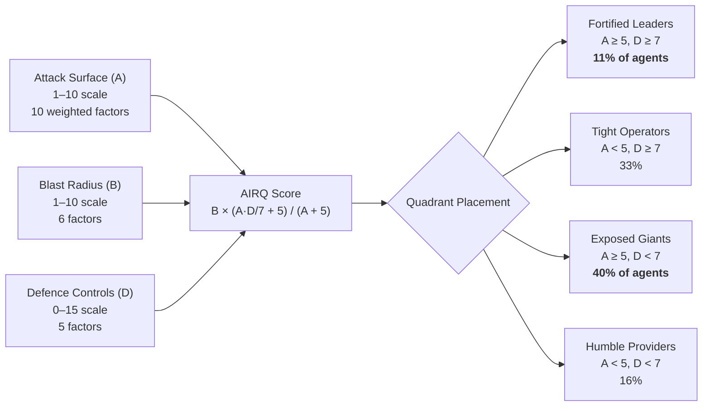
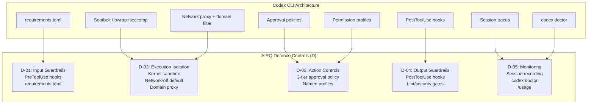

# The AIRQ Report: Only 11 Per Cent of AI Agents Pass the Security Bar — Where Codex CLI Stands


---

The AI Risk Quadrant (AIRQ), published on 3 June 2026 by Adversa AI with contributors from OWASP, CoSAI, CSA, and NIST, is the largest independent security assessment of production AI agents to date [^1]. It scored 100 commercial and publicly available agents across three dimensions — attack surface, blast radius, and defence controls — and the headline finding is stark: only 11 per cent land in the Fortified Leaders quadrant where high capability pairs with strong defences [^2]. Coding agents and computer-use agents rank as the two riskiest categories on all three axes [^1].

This article unpacks the AIRQ methodology, explains what it reveals about coding agent security as a class, and maps its scoring dimensions to Codex CLI's defence architecture so you can assess your own posture.

## The AIRQ Framework: Three Dimensions of Agent Risk

The AIRQ score combines three independent measurements into a composite that rewards capability only when paired with defence [^3]:



**Attack Surface (A)** measures how easily an agent can be compromised, weighted across ten factors including user input (12%), external data ingestion (14%), tool execution (15%), memory systems (10%), and configuration integrity (8%) [^3]. Each factor scores 0–4, with evidence penalties of up to +2.0 for demonstrated CVEs at CVSS ≥ 7.0 [^3].

**Blast Radius (B)** measures the damage a compromised agent can cause: code execution scope, file-system access, network reach, credential exposure, autonomous actions, and deployment access [^3].

**Defence Controls (D)** scores five lifecycle stages from 0–3 each: input guardrails, execution isolation, action controls (approval gates), output guardrails, and monitoring [^3]. Crucially, evidence tiers cap scores — architecturally inferred controls cap at 1, vendor-documented at 2, and only publicly verifiable implementations score up to 3 [^3].

## The Lethal Trifecta

The report's most arresting finding is structural: 98 per cent of agents exhibit what AIRQ calls the *lethal trifecta* — simultaneous private data access, exposure to untrusted content, and the ability to take outbound actions [^2]. When all three conditions coexist, the framework enforces a minimum attack surface floor of 4.8 [^3], meaning even well-defended agents cannot score below the threshold for meaningful exposure.

For coding agents specifically, this is inescapable. Any agent that reads repository files (private data), ingests external documentation or web search results (untrusted content), and executes shell commands (outbound actions) carries the trifecta by definition.

## Coding Agents: The Riskiest Category

AIRQ splits coding agents into two sub-groups with distinct risk profiles [^1]:

| Sub-group | Average Attack Surface | Key Differentiator |
|---|---|---|
| Autonomous coding agents | 8.1 | Full shell access, file-system writes, multi-step tool chains |
| Interactive copilots | 5.6 | Suggestion-based, limited execution scope |

Three findings stand out:

1. **Tool execution alone explains 76 per cent of blast radius variation** [^2]. Agents with unrestricted shell access carry dramatically more risk than those that constrain execution.
2. **No coding agent ships real-time egress inspection** [^1]. Data leaves through the same channels the agent uses to communicate — meaning exfiltration is architecturally unblocked in every scored agent.
3. **83 per cent of claimed defences lack independent verification** [^2]. Closed-source agents that describe their security controls in documentation but provide no public audit or open-source implementation score lower under AIRQ's evidence-tiered scoring.

## What Fortified Leaders Get Right

The 11 per cent that reach Fortified Leaders share common traits:

- **Documented, tested sandboxing** reduces risk by approximately 2.6× [^2]
- **Container or cloud-level isolation** achieves a 6× risk reduction [^2]
- **Approval gates on irreversible actions** prevent the 38 per cent of agents that complete irreversible actions before monitoring can trigger [^2]
- **Open-source or auditable implementations** unlock higher evidence-tier scoring [^3]

## Mapping AIRQ Dimensions to Codex CLI

Codex CLI's defence architecture maps directly to AIRQ's scoring categories. Here is how each defence control stage applies:

### D-01: Input Guardrails

Codex CLI's `requirements.toml` managed hooks and `PreToolUse` hook pipeline filter inputs before execution [^4]. Managed configuration allows enterprise administrators to enforce input guardrails centrally, with hooks that run before tool invocations reach the sandbox [^5].

```toml
# requirements.toml — managed PreToolUse hook for input scanning
[[hooks]]
event = "PreToolUse"
command = "python3 /opt/security/scan_input.py"
timeout_ms = 5000
```

### D-02: Execution Isolation

This is Codex CLI's strongest dimension. The sandbox operates at the kernel level [^4]:

- **macOS**: Seatbelt policies via `sandbox-exec` restrict file-system writes, network access, and process spawning
- **Linux**: `bwrap` plus `seccomp` provide namespace isolation with syscall filtering
- **Windows**: WSL2 or native restricted tokens

Network access is disabled by default — a critical differentiator given AIRQ's finding that no coding agent ships egress inspection [^1]. When enabled, Codex CLI routes traffic through a domain-filtering proxy with allowlist-first logic [^4]:

```toml
[sandbox_workspace_write]
network_access = true

[features.network_proxy]
domains = { "api.openai.com" = "allow", "*" = "deny" }
```

This proxy architecture addresses the egress gap AIRQ identified. While it is not real-time deep packet inspection, domain-level filtering blocks the most common exfiltration vector — arbitrary outbound HTTP to attacker-controlled endpoints.

### D-03: Action Controls

Codex CLI provides three approval policies that map directly to AIRQ's action controls scoring [^4]:

| Policy | Behaviour | AIRQ Implication |
|---|---|---|
| `on-request` | Approval required for sandbox escalations and network operations | Highest D-03 score: human-in-the-loop for all state-mutating actions |
| `untrusted` | Auto-approves reads, requires approval for writes | Moderate: reduces approval fatigue whilst gating destructive operations |
| `never` | No approval prompts | Lowest: convenience at the cost of control |

Named permission profiles allow teams to enforce stricter policies for specific task types:

```bash
codex --sandbox workspace-write --ask-for-approval on-request
```

### D-04: Output Guardrails

`PostToolUse` hooks run after every tool execution, enabling output scanning, lint gates, and security checks before results propagate [^5]:

```toml
[[hooks]]
event = "PostToolUse"
command = "python3 /opt/security/scan_output.py"
timeout_ms = 10000
```

### D-05: Monitoring

Codex CLI's session recording captures full tool-call trajectories, and the `/usage` command provides token-level cost visibility [^6]. The `codex doctor` diagnostic command surfaces environmental issues that might weaken the security posture [^6].



## The Gravitee Report: Corroborating Evidence

The Gravitee State of AI Agent Security 2026 report, surveying 900+ executives and practitioners, reinforces AIRQ's findings from the operational side [^7]:

- **88 per cent** of organisations confirmed or suspected AI agent security incidents in the past year
- Only **47.1 per cent** of deployed agents are actively monitored or secured
- **45.6 per cent** rely on shared API keys for agent-to-agent authentication
- Only **14.4 per cent** report all AI agents going live with full security and IT approval

The gap between executive confidence (82 per cent feel existing policies are adequate) and the technical reality mirrors AIRQ's finding that claimed defences rarely survive independent verification [^7].

## Practical Scoring: Assess Your Own Posture

Use AIRQ's framework to score your Codex CLI deployment. The scoring favours default configuration — opt-in hardening does not raise scores under the framework's conservative methodology [^3].

**Attack Surface checklist:**
- ⚠️ Does your agent ingest external web content? (`web_search = "live"` increases A-02)
- ⚠️ Do you use persistent memories? (increases A-03 per MemMorph-class attacks)
- ⚠️ Are MCP servers from untrusted sources enabled? (increases A-10)

**Blast Radius checklist:**
- Does `workspace-write` scope match the minimum required directory?
- Is network access disabled unless explicitly needed?
- Are credential files excluded from readable paths?

**Defence Controls checklist:**
- Are `PreToolUse` and `PostToolUse` hooks configured?
- Is the approval policy set to `on-request` or `untrusted`?
- Are session traces retained for incident response?

## The Open-Source Advantage

AIRQ's evidence-tiered scoring structurally favours open-source implementations. Closed-source agents cap at Tier 1 (architecturally inferred) for defence claims, while open-source agents with published sandboxing code can reach Tier 3 (publicly verifiable) [^3]. Codex CLI's open-source sandbox implementation on GitHub enables independent audit and verification — a significant scoring advantage [^8].

This aligns with a broader trend: the agents that score highest on defence controls are those whose security mechanisms are auditable, not merely described.

## Conclusion

The AIRQ report crystallises what the security research community has been documenting in fragments: the AI agent ecosystem has a defence deficit. Coding agents sit at the apex of risk — highest attack surface, highest blast radius, lowest defences. The 11 per cent that pass the bar do so through kernel-level isolation, disabled-by-default networking, approval gates, and auditable implementations.

Codex CLI's architecture addresses each of AIRQ's five defence control stages, but the framework scores *default configuration*, not potential. If your deployment runs with `--ask-for-approval never` and `network_access = true` without domain filtering, you have neutralised the defences that separate Fortified Leaders from Exposed Giants.

The actionable takeaway: treat every AIRQ dimension as a configuration audit. Your agent's security posture is not what it *can* do — it is what it *does* do out of the box.

## Citations

[^1]: Adversa AI, "AI Risk Quadrant for agents: AIRQ methodology and top 100," adversa.ai/blog/airq-ai-risk-quadrant-for-agents-top-100-agents-scored-for-attack-defense-blast-radius/, June 2026.
[^2]: Help Net Security, "Only 11% of production agents pass the AI agent security bar," helpnetsecurity.com/2026/06/03/research-ai-agent-security-capability/, 3 June 2026.
[^3]: AIRQ Framework, "AI Agent Security Risk Scoring," airiskquadrant.com/framework, 2026.
[^4]: OpenAI, "Agent approvals & security – Codex CLI," developers.openai.com/codex/agent-approvals-security, 2026.
[^5]: OpenAI, "Configuration Reference – Codex CLI," developers.openai.com/codex/config-reference, 2026.
[^6]: OpenAI, "Codex CLI Changelog," developers.openai.com/codex/changelog, June 2026.
[^7]: Gravitee, "State of AI Agent Security 2026 Report: When Adoption Outpaces Control," gravitee.io/blog/state-of-ai-agent-security-2026-report-when-adoption-outpaces-control, February 2026.
[^8]: OpenAI, "openai/codex – GitHub," github.com/openai/codex, 2026.
