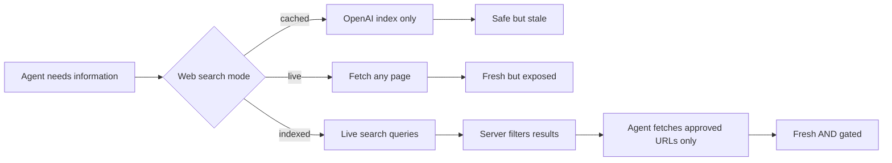
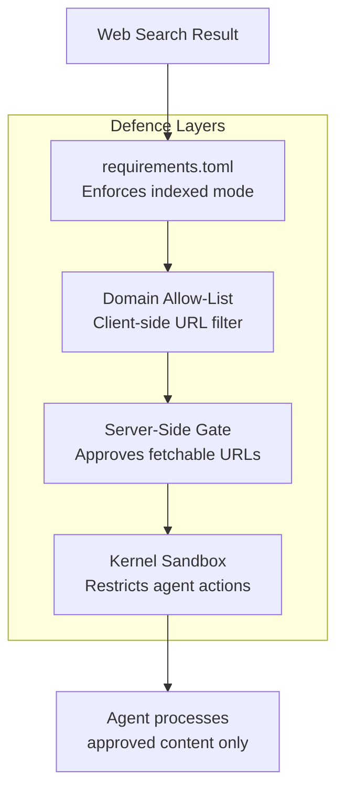

# Indexed Web Search: How Codex CLI v0.142 Bridges the Gap Between Cached Safety and Live Freshness


Codex CLI has offered two web search modes since early 2026: cached, which serves pre-indexed results from an OpenAI-maintained index, and live, which fetches pages directly from the open web[^1]. The trade-off was stark — cached mode sacrificed freshness for safety, whilst live mode opened the agent to prompt injection from arbitrary web content[^2]. With v0.142.0 (22 June 2026), a third option arrives: **indexed** mode, which permits live search queries whilst restricting direct page access to server-approved URLs[^3].

This article covers the mechanics of indexed mode, how it differs from cached and live, the security model it introduces, configuration patterns for different deployment scenarios, and how it interacts with existing defences like domain allow-lists and the kernel sandbox.

## The Problem With Two Extremes

Every web search result is untrusted input. A page fetched by a coding agent can contain hidden instructions — invisible prompt injection payloads — that redirect the agent's behaviour[^2]. The Cymulate disclosure in May 2026 demonstrated this concretely: a crafted web page could trigger remote code execution in Codex CLI on Windows via prompt injection combined with binary hijacking[^4].

Cached mode mitigates this by never fetching live pages. The agent searches against a pre-indexed corpus maintained by OpenAI, meaning the content has been crawled and sanitised before the agent sees it[^1]. The cost is staleness — if a library released a breaking change yesterday, the cache may not reflect it yet.

Live mode solves the freshness problem but opens the door to any page on the internet. Even with domain allow-lists (introduced in the `tools.web_search` object form), the agent fetches content from those domains in real time, and a compromised or malicious page on an allowed domain can still inject instructions[^2][^5].



## How Indexed Mode Works

Indexed mode introduces a separation between **searching** and **fetching**. When the agent invokes the web search tool in indexed mode[^3][^6]:

1. **Search queries run live.** The agent's query hits the web in real time, returning current results — not cached snapshots.
2. **Page access is server-gated.** Direct page fetches are restricted to URLs that the server has approved. The agent cannot follow arbitrary links or fetch pages outside the approved set.
3. **The server controls the gate.** On the wire, indexed mode sends `index_gated_web_access: true` alongside the search request, signalling to the backend that external web access should be filtered through the server's approval logic[^6].

The practical effect: the agent sees fresh search snippets and can reason about current information, but it cannot fetch the full content of a page unless the server has whitelisted the URL. This closes the primary prompt injection vector — fetching attacker-controlled pages — whilst preserving the freshness that live search provides.

### What the Server Approves

The server-side approval logic is not configurable by the end user in the current implementation. OpenAI's backend determines which URLs are safe to fetch based on its own content policies and indexing[^6]. This is a deliberate design choice: the security boundary sits at the server, not the client, preventing local configuration errors from exposing the agent to malicious content.

For enterprise deployments using the app-server protocol, the indexed mode integrates with the existing hosted search infrastructure. App-server clients receive the same gating behaviour, meaning that a team running Codex through their own app-server deployment inherits the same URL restrictions[^7].

## Configuration

Indexed mode is set via the familiar `web_search` key in `config.toml`[^3][^6]:

```toml
# ~/.codex/config.toml
web_search = "indexed"
```

For standalone web search (the mode where the agent can perform web searches as a first-class operation within code-mode flows), enable it alongside indexed mode[^6]:

```toml
web_search = "indexed"

[features]
standalone_web_search = true
```

### The Four Modes at a Glance

| Mode | Search | Page Fetch | Default When | Prompt Injection Risk |
|------|--------|------------|--------------|----------------------|
| `disabled` | No | No | Explicitly set | None |
| `cached` | Pre-indexed | No | Standard sandbox modes | Minimal — content pre-screened |
| `indexed` | Live | Server-approved only | Explicitly set | Low — server gates fetches |
| `live` | Live | Any URL | `--yolo` / full-access sandbox | High — arbitrary content |

### Configuration Precedence

The standard Codex CLI configuration precedence applies[^1][^8]:

1. CLI flags (`--search` forces live mode)
2. Project config (`.codex/config.toml`)
3. Profile files (`--profile`)
4. User config (`~/.codex/config.toml`)
5. System config (`/etc/codex/config.toml`)
6. Built-in defaults (`cached`)

Note that `--yolo` and other full-access sandbox settings still override `web_search` to `live`, not `indexed`[^1]. If you want indexed mode in a permissive sandbox, set it explicitly in your project config to override the sandbox default.

### Backward Compatibility

The implementation preserves backward compatibility by maintaining existing boolean wire values — `cached` maps to `false`, `live` to `true`, and `indexed` uses its own distinct value[^6]. Without an explicit `indexed` selection, existing configurations behave identically to before v0.142.

## Layering With Existing Defences

Indexed mode does not replace your other security controls — it adds a layer. Here is how it composes with the existing defence stack:

### Domain Allow-Lists

The `tools.web_search` object form still accepts `allowed_domains`[^5]:

```toml
[tools.web_search]
allowed_domains = ["docs.python.org", "developer.mozilla.org", "github.com"]
```

In indexed mode, domain allow-lists act as a **client-side pre-filter** on top of the server-side gating. Even if the server approves a URL, the agent will only fetch it if the domain matches the allow-list. This creates defence in depth — two independent gates must agree before the agent sees page content.

### Kernel Sandbox

The kernel-level sandbox (Seatbelt on macOS, bwrap+seccomp on Linux) remains the ultimate backstop[^9]. Even if a prompt injection payload reaches the agent through an approved page, the sandbox restricts what the agent can do with it — no arbitrary network egress, no filesystem writes outside the working directory, no process execution outside the sandbox boundary.

### requirements.toml

For managed enterprise deployments, `requirements.toml` can enforce the web search mode across all users[^10]:

```toml
# requirements.toml — enforced by the organisation
web_search = "indexed"  # users cannot override to "live"
```

This prevents individual developers from escalating to live mode, ensuring the server-gated security boundary applies uniformly.



## When to Use Each Mode

### Solo Developer on a Trusted Network

Indexed mode is the sensible new default. You get live search freshness without exposing the agent to arbitrary page content. If you need full page access for a specific task, switch to live mode for that session:

```bash
codex --search "debug this webpack error"
```

### Team With Shared Configuration

Set indexed mode in the project `.codex/config.toml` and layer domain allow-lists for the documentation sources your stack depends on:

```toml
web_search = "indexed"

[tools.web_search]
allowed_domains = [
    "docs.python.org",
    "react.dev",
    "github.com",
    "developer.mozilla.org",
    "pkg.go.dev"
]
```

### Enterprise With Managed Policies

Enforce indexed mode via `requirements.toml` and disable standalone web search if your security posture requires it:

```toml
# requirements.toml
web_search = "indexed"

[features]
standalone_web_search = false
```

### Air-Gapped or High-Security Environments

Disable web search entirely. Indexed mode still requires network access to the search API:

```toml
web_search = "disabled"
```

## Interaction With v0.142 Features

Indexed mode shipped alongside several other v0.142 features that interact with it[^3]:

- **Rollout token budgets** constrain total token spend, which includes tokens consumed by web search results. In indexed mode, the server-gated fetches tend to return more focused content than unrestricted live fetches, potentially reducing token waste from irrelevant page content[^3].
- **Scheduled UTC time reminders** mean the agent knows the current time, making it more likely to search for date-relevant information ("Python 3.13 release notes 2026" rather than generic queries). Indexed mode benefits from this because fresher queries return more relevant server-approved results[^11].
- **Multi-agent delegation modes** determine whether subagents inherit the parent's web search configuration. In `explicit-request-only` delegation mode, subagents do not perform web searches unless the parent explicitly requests it, adding another layer of control over web access[^3].

## What Indexed Mode Does Not Do

- **It does not prevent all prompt injection.** Search snippets themselves can contain injection payloads. The server gating reduces the attack surface by preventing full-page fetches of attacker-controlled content, but it does not eliminate the risk entirely[^2].
- **It does not replace domain allow-lists.** The server gate and client allow-list are independent controls that compose additively.
- **It does not work offline.** Unlike cached mode, which can return results from a pre-downloaded index, indexed mode requires a live connection to the search API.
- **It is not user-configurable at the URL level.** You cannot add your own URLs to the server's approved list. The gate is server-side and managed by OpenAI[^6].

## Practical Recommendation

If you are currently running with `web_search = "cached"` and occasionally switching to `live` when you need fresh results, indexed mode is the upgrade you should make today. It eliminates the manual mode-switching whilst maintaining a security posture closer to cached than live.

Update your user config:

```toml
# ~/.codex/config.toml
web_search = "indexed"
```

Then verify it is active:

```bash
codex doctor
```

The `codex doctor` output includes your active web search mode in the configuration summary[^12]. If you see `indexed`, the server-gated security boundary is in effect.

## Citations

[^1]: OpenAI, "Config basics — Codex," OpenAI Developers, 2026. [https://developers.openai.com/codex/config-basic](https://developers.openai.com/codex/config-basic)

[^2]: OpenAI, "Agent approvals & security — Codex," OpenAI Developers, 2026. [https://developers.openai.com/codex/agent-approvals-security](https://developers.openai.com/codex/agent-approvals-security)

[^3]: OpenAI, "Changelog — Codex," OpenAI Developers, 22 June 2026 (v0.142.0 entry). [https://developers.openai.com/codex/changelog](https://developers.openai.com/codex/changelog)

[^4]: Cymulate, "When a Web Search Becomes a Backdoor: Remote Code Execution in Codex CLI via Prompt Injection and Binary Hijacking on Windows," Cymulate Blog, May 2026. [https://cymulate.com/blog/codex-cli-rce-prompt-injection-mitigations/](https://cymulate.com/blog/codex-cli-rce-prompt-injection-mitigations/)

[^5]: OpenAI, "Configuration Reference — Codex," OpenAI Developers, 2026. [https://developers.openai.com/codex/config-reference](https://developers.openai.com/codex/config-reference)

[^6]: winston-openai, "Add indexed web search mode," Pull Request #28489, openai/codex, June 2026. [https://github.com/openai/codex/pull/28489](https://github.com/openai/codex/pull/28489)

[^7]: OpenAI, "App Server — Codex," OpenAI Developers, 2026. [https://developers.openai.com/codex/app-server](https://developers.openai.com/codex/app-server)

[^8]: OpenAI, "Sample Configuration — Codex," OpenAI Developers, 2026. [https://developers.openai.com/codex/config-sample](https://developers.openai.com/codex/config-sample)

[^9]: D. Vaughan, "Codex CLI Network Security: requirements.toml Enforcement, Landlock, and Air-Gapped Deployments," Codex Knowledge Base, 31 March 2026. [https://codex.danielvaughan.com/2026/03/31/codex-cli-network-security-requirements-toml/](https://codex.danielvaughan.com/2026/03/31/codex-cli-network-security-requirements-toml/)

[^10]: D. Vaughan, "Codex CLI Web Search Configuration: Cached vs Live Modes, Domain Allow-Lists, and Prompt Injection Defence," Codex Knowledge Base, 9 May 2026. [https://codex.danielvaughan.com/2026/05/09/codex-cli-web-search-configuration-cached-live-domain-allow-lists-prompt-injection-defence/](https://codex.danielvaughan.com/2026/05/09/codex-cli-web-search-configuration-cached-live-domain-allow-lists-prompt-injection-defence/)

[^11]: D. Vaughan, "Time-Aware Agents: How Codex CLI v0.142 Gives Your Agent a Clock," Codex Knowledge Base, 23 June 2026. [https://codex.danielvaughan.com/2026/06/23/codex-cli-v0142-time-awareness-scheduled-utc-reminders-clock-curr-time-tool-temporal-agent-workflows/](https://codex.danielvaughan.com/2026/06/23/codex-cli-v0142-time-awareness-scheduled-utc-reminders-clock-curr-time-tool-temporal-agent-workflows/)

[^12]: OpenAI, "Features — Codex CLI," OpenAI Developers, 2026. [https://developers.openai.com/codex/cli/features](https://developers.openai.com/codex/cli/features)
