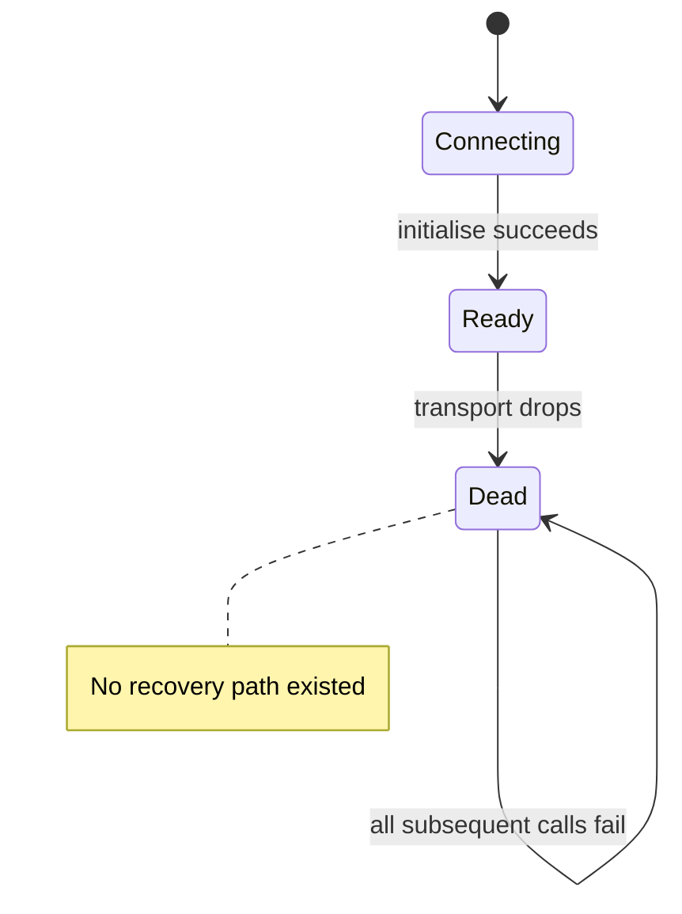
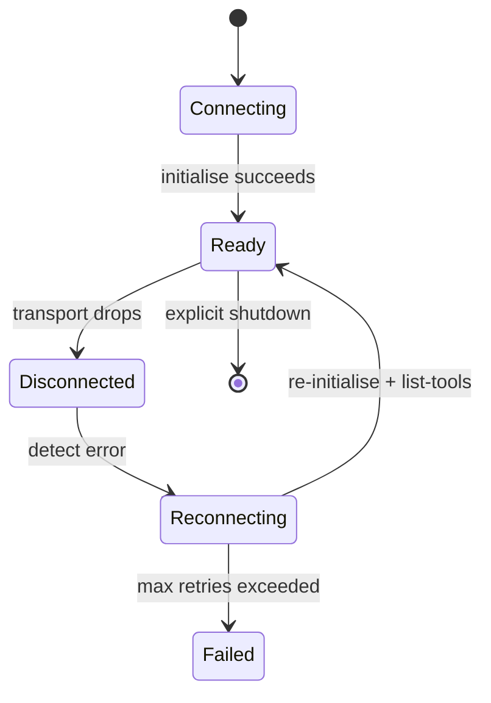
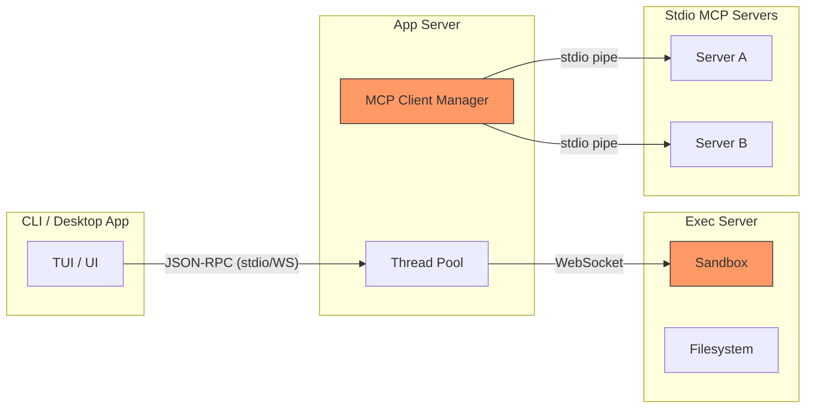

# Session Resilience at Last: How Codex CLI v0.141–v0.142 Stopped Exec-Server and MCP Sessions Dying on Transient Disconnects


---

For months, long-running Codex CLI sessions had a notorious failure mode: a transient network hiccup — a Wi-Fi blip, a VPN reconnection, a cloud proxy rotating its signed URL — would silently kill exec-server processes and stdio MCP server connections, leaving the session in a permanently degraded state where every subsequent tool call returned `Transport closed` [^1]. Fresh `codex exec` subprocesses on the same machine continued working perfectly, confirming the problem lay in session-level connection management rather than the servers themselves [^2].

Versions 0.141.0 (18 June 2026) and 0.142.0 (22 June 2026) shipped a coordinated set of fixes that finally make exec-server processes and stdio MCP sessions survive transient disconnects, including signed-URL refresh and retry-safe stdin writes [^3][^4]. This article examines the problem, the architectural response, and what you need to configure to benefit.

## The Problem: One-Shot Initialisation and No Recovery Path

The root cause was architectural. Codex's MCP client used `AsyncManagedClient` with a cached `Shared<Future>` startup result — initialisation was effectively one-shot [^5]. `RmcpClient` had `Connecting → Ready` states but no explicit `Disconnected` or `Reconnecting` lifecycle [^5]. When the underlying stdio pipe or WebSocket dropped, the client had nowhere to go.



The model API's SSE streams already had retry-with-backoff logic, but the MCP transport path had no equivalent resilience [^5]. Practically, recovery meant either issuing a manual `RefreshMcpServers` command, triggering `config/mcpServer/reload`, or restarting the entire CLI process [^5].

For interactive sessions, that was merely annoying. For `codex exec` pipelines and long-horizon goal threads running unattended, it was catastrophic — a brief network interruption could silently derail hours of autonomous work.

## What v0.141 and v0.142 Changed

The fixes spanned at least four pull requests (#28374, #28512, #28546, #28895) across the two releases [^6]. Together they addressed three distinct resilience surfaces.

### 1. Exec-Server Process Survival

The exec-server — Codex's sandboxed command execution and filesystem operations layer, which can run in the same process as the app-server or be split across machines [^7] — now maintains process state across transient connection drops. Previously, a broken WebSocket between the app-server and a remote exec-server would orphan running processes. The new implementation preserves the process handle and output stream, reconnecting the notification channel (`process/outputDelta`, `process/exited`) once the transport recovers [^7].

### 2. Stdio MCP Session Continuity

Stdio MCP servers — launched via `command` with optional `args`, `env`, and `cwd` configuration [^8] — now survive the same class of transient disconnects. The fix introduces transport-layer reconnection: when the stdio pipe signals an error, the client recreates the transport, re-runs `initialize` and `list-tools`, and retries the failed request [^5][^6].



### 3. Signed-URL Refresh and Retry-Safe Stdin

Remote exec-server connections authenticated via signed URLs now handle credential rotation transparently [^3]. When a signed URL expires mid-session, the client refreshes it before retrying. Stdin writes are made retry-safe — idempotent markers prevent duplicate input delivery if a write must be replayed after reconnection [^3].

## The App-Server Architecture Context

Understanding where these fixes sit requires a quick look at Codex's two-process architecture [^7]:

| Component | Responsibility | Transport |
|-----------|---------------|-----------|
| **App-server** | Conversations, model interaction, thread management | stdio (JSONL), WebSocket, Unix socket |
| **Exec-server** | Sandboxed command execution, filesystem operations | WebSocket (experimental since v0.119.0) |

The app-server implements bidirectional JSON-RPC 2.0 messaging [^7]. When request ingress is full, it rejects new requests with error code `-32001` (`Server overloaded; retry later`) and clients are expected to implement exponential backoff with jitter [^7]. The exec-server exposes a WebSocket endpoint for remote or app-server workflows [^7].

Threads have a lifecycle of `create → work → compact → archive → restore`, with a 30-minute grace period before idle threads with no subscribers are unloaded [^7]. The `turn/steer` API appends input to in-flight turns without creating new turns — critical for handling intermediate client disconnections during active work [^7].



The orange-highlighted components — the MCP client manager and the sandbox connection — are where the resilience fixes land.

## Configuration: Required vs Optional MCP Servers

The `required` flag in your MCP server configuration now interacts with the resilience layer [^8]. If you mark a server as `required: true` and it fails to initialise, `thread/start` and `thread/resume` both fail rather than degrading gracefully [^8]. With the new reconnection logic, a transiently failing required server will be retried before the thread is declared failed.

```toml
# .codex/config.toml — MCP server with resilience-aware settings
[mcp_servers.my-tools]
command = "npx"
args = ["-y", "@my-org/mcp-tools"]
required = true
startup_timeout_sec = 15
tool_timeout_sec = 120
```

The `startup_timeout_sec` (default 10 seconds) and `tool_timeout_sec` (default 60 seconds) are worth tuning for servers that need warm-up time or perform heavy operations [^8]. The reconnection logic respects these timeouts on re-initialisation.

### MCP Startup Status Notifications

v0.141 added richer MCP server status visibility for app-server integrations via `mcpServer/startupStatus/updated` notifications [^4]. Clients can now observe the full lifecycle:

- Server starting
- Server ready (tools discovered)
- Server disconnected (transient)
- Server reconnecting
- Server failed (permanent)

This is particularly useful for desktop app and IDE integrations that need to surface MCP health in their UI.

## What Remains Open

The resilience improvements in v0.141–v0.142 are significant but not complete. Several issues remain open on the repository:

1. **No proactive health monitoring.** There is still no heartbeat or periodic health check to detect a dropped MCP transport before the next tool call fails [^5]. Detection remains reactive — the reconnection logic triggers on the first failed operation after a disconnect.

2. **Startup-time failures.** Servers that never connect initially (as distinct from those that connect and then drop) still lack an automatic retry mechanism beyond the initial `startup_timeout_sec` window [^9]. Only the built-in `codex_apps` server benefits from cached tool snapshots for survivorship [^9].

3. **WebSocket fallback delays.** Reconnection through WebSocket transports can still experience delays, particularly with idle connections and subagent-triggered stream disconnects [^10].

⚠️ The exact retry count and backoff strategy for the new MCP reconnection logic are not documented in the public changelog or configuration reference. The values appear to be hard-coded in the Rust client implementation.

## Practical Implications

### For Interactive Sessions

The days of manually restarting MCP servers mid-session should be largely over. If you previously ran `/mcp reload` after every VPN reconnection or laptop lid-close, the new transport-layer reconnection handles this automatically.

### For codex exec Pipelines

Unattended `codex exec` runs are the primary beneficiary. A CI runner experiencing a brief network interruption no longer produces silently degraded results — the exec-server process survives and MCP sessions reconnect.

### For Remote Development

Combined with the Noise Protocol relay channels also shipped in v0.141 [^4], remote exec-server connections now have both encryption and resilience. Cross-platform remote execution preserves executor-native working directories, shells, AGENTS.md discovery, and sandbox behaviour across operating systems [^3][^4].

### For Goal Threads

v0.142 also restored goal-first thread persistence — threads with goals are once again persisted and returned by `thread/list` [^3]. Combined with session resilience, this means long-horizon goal threads can survive both context compaction and transient disconnects without losing their objective.

## Upgrading

```bash
# Update to the latest stable release
codex update

# Verify your version
codex --version
# Should show 0.142.0 or later

# Check MCP server health
codex doctor
# The Authentication and Background Server sections
# now reflect reconnection-capable MCP state
```

If you are pinning versions for your team (via `requirements.toml`), update your minimum:

```toml
[codex]
min_version = "0.142.0"
```

## Citations

[^1]: GitHub Issue #16899 — *CLI session loses stdio MCP connections after initial successful calls; fresh codex exec still works*. [https://github.com/openai/codex/issues/16899](https://github.com/openai/codex/issues/16899)

[^2]: GitHub Issue #16899, reporter observation — fresh subprocess probes maintain 100% success rate while session-level calls fail. [https://github.com/openai/codex/issues/16899](https://github.com/openai/codex/issues/16899)

[^3]: OpenAI Codex Changelog — v0.142.0 (22 June 2026): *"Exec-server processes and stdio MCP sessions now survive transient disconnects, including signed-URL refresh and retry-safe stdin writes."* [https://developers.openai.com/codex/changelog](https://developers.openai.com/codex/changelog)

[^4]: OpenAI Codex Changelog — v0.141.0 (18 June 2026): *"Authenticated, end-to-end encrypted Noise relay channels"* for remote executors; richer MCP server status visibility. [https://developers.openai.com/codex/changelog](https://developers.openai.com/codex/changelog)

[^5]: GitHub Issue #11489 — *MCP client does not auto-reconnect after disconnect*. Documents `AsyncManagedClient` one-shot initialisation, missing `Disconnected/Reconnecting` lifecycle, and lack of health monitoring. [https://github.com/openai/codex/issues/11489](https://github.com/openai/codex/issues/11489)

[^6]: Releasebot — Codex Updates June 2026. PRs #28374, #28512, #28546, #28895 referenced for resilience improvements. [https://releasebot.io/updates/openai/codex](https://releasebot.io/updates/openai/codex)

[^7]: OpenAI Developer Documentation — *App Server*. Architecture documentation covering JSON-RPC 2.0 protocol, thread lifecycle, process/spawn API, and turn/steer mechanics. [https://developers.openai.com/codex/app-server](https://developers.openai.com/codex/app-server)

[^8]: OpenAI Developer Documentation — *Model Context Protocol*. MCP server configuration reference including `required`, `startup_timeout_sec`, `tool_timeout_sec`, and transport options. [https://developers.openai.com/codex/mcp](https://developers.openai.com/codex/mcp)

[^9]: GitHub Issue #11489, comment by HamburgJ (20 June 2026) — startup-time failures lack recovery; only `codex_apps` benefits from cached tool snapshots. [https://github.com/openai/codex/issues/11489](https://github.com/openai/codex/issues/11489)

[^10]: SmartScope — *Codex CLI Reconnecting Fix: WebSocket Fallback and Recovery Guide (June 2026)*. [https://smartscope.blog/en/generative-ai/chatgpt/codex-cli-reconnecting-issue-2025/](https://smartscope.blog/en/generative-ai/chatgpt/codex-cli-reconnecting-issue-2025/)
