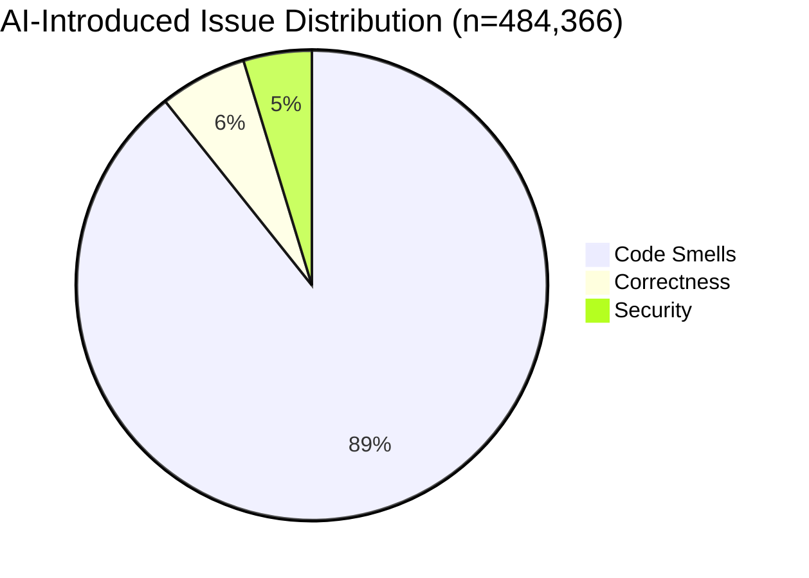
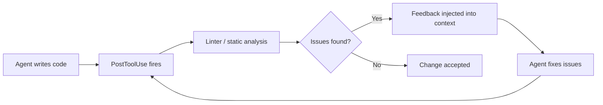
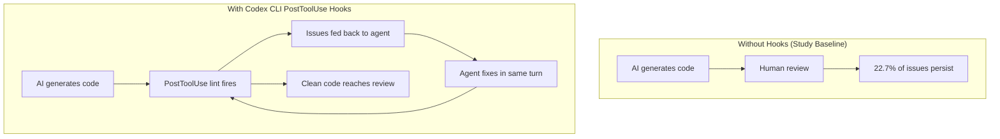

# Debt Behind the AI Boom: What 302,000 AI-Authored Commits Reveal About Technical Debt — and How Codex CLI's Hook Pipeline Stops It Accumulating


---

## The Numbers That Should Worry You

Every engineering leader knows AI coding assistants accelerate delivery. Fewer have asked what happens to the code six months later. Liu et al. answered that question in *Debt Behind the AI Boom* (arXiv:2603.28592), a large-scale empirical study analysing **302,579 verified AI-authored commits** across **6,299 GitHub repositories** covering five major AI coding tools [^1]. The results are sobering: AI-generated code introduces persistent quality issues at scale, and nearly a quarter of them are still sitting in production codebases months later.

This article unpacks the study's key findings, maps them to the specific code smell and security patterns that affect coding agent workflows, and shows how Codex CLI's hook pipeline — particularly PostToolUse — provides a systematic defence against the silent accumulation of AI-induced technical debt.

---

## What the Study Found

### Scale and Methodology

The researchers identified AI-authored commits using explicit Git metadata (commit messages, trailers, and bot signatures) across Python, JavaScript, and TypeScript repositories with a minimum of 100 GitHub stars. Attribution accuracy was validated at 99.0% on a sampled subset, with issue validity inter-rater agreement reaching Cohen's κ = 0.851 [^1].

Static analysis ran on every commit, comparing the codebase state before and after each change to isolate issues the AI tool *introduced* rather than inherited.

### The Headline Numbers

| Metric | Value |
|--------|-------|
| Total issues detected | 484,366 |
| Commits introducing ≥1 issue | 27,677 (9.1%) |
| Repositories with AI-introduced issues | 3,946 (62.6%) |
| Issues persisting at HEAD | 22.7% (105,364) |

That last figure is the critical one. More than one in five AI-introduced issues survive into the latest version of the repository — they are not caught in review, not fixed in follow-up commits, and not removed by refactoring [^1].

### Issue Type Breakdown



**Code smells** dominate at 89.3% (432,748 issues). The top five patterns tell a consistent story about how AI assistants write code [^1]:

1. **Broad exception handling** — 41,374 cases (8.5%). The agent catches `Exception` or uses bare `except:` instead of targeting specific error types.
2. **Unused variables/parameters** — 28,272 cases (5.8%). Dead code left over from exploratory generation.
3. **Unused arguments** — 24,357 cases (5.0%). Function signatures carry parameters the body never references.
4. **Shadowed outer variables** — 20,647 cases (4.3%). Inner scope names collide with outer scope, creating subtle bugs.
5. **Access to protected members** — 19,796 cases (4.1%). The agent reaches into `_private` attributes rather than using public interfaces.

**Correctness issues** account for 6.0% (28,931 issues), led by undefined variables (23,856 cases) — the agent references names that do not exist in scope [^1].

**Security issues** make up 4.7% (22,687 issues). Path traversal via `path.join`/`path.resolve` leads at 8,677 cases, followed by unsafe format strings at 4,792 [^1].

### The Net Balance Problem

Here is the finding that complicates the "AI fixes more than it breaks" narrative: for code smells, AI tools collectively fixed slightly more than they introduced (439,817 fixed vs 432,748 introduced — a net reduction of 7,069). But for **security issues, AI introduces approximately 1.5× more than it fixes** [^1]. The agent is a net contributor to your security debt.

### Per-Tool Comparison

| Tool | Commits Analysed | Avg Issues/Commit | % Commits with Issues |
|------|-----------------|-------------------|----------------------|
| GitHub Copilot | 118,012 | 1.19 | 17.4% |
| Claude | 138,249 | 1.95 | 26.3% |
| Cursor | 19,587 | 1.48 | 23.9% |
| Gemini | 12,429 | 1.51 | 29.1% |
| Devin | 14,302 | 0.89 | 22.1% |

Devin's lower issues-per-commit rate likely reflects its autonomous agent architecture, which runs its own test suites before committing [^1]. Codex CLI's architecture follows a similar pattern — but with configurable enforcement rather than opaque internal checks.

### Persistence by Age

Issues introduced more than nine months ago persist at 22.8%. Issues between three and six months old persist at 28.2% [^1]. Technical debt from AI-generated code does not self-resolve. Without active remediation, it calcifies.

---

## Why AI Agents Produce These Patterns

The top code smells in the study map directly to known LLM generation behaviours:

**Broad exception handling** occurs because models have been trained on vast quantities of tutorial code, Stack Overflow answers, and quick-start examples where `except Exception` is the norm [^2]. The model optimises for "code that runs" rather than "code that fails precisely".

**Unused variables and shadowing** result from the iterative nature of agent-driven development. The agent writes a first pass, modifies it after tool feedback, and leaves artefacts from earlier iterations. Without a post-generation cleanup pass, dead code accumulates [^3].

**Path traversal vulnerabilities** emerge because `path.join()` and `path.resolve()` are the obvious, frequently-seen patterns for file path construction. The model does not reason about whether user-controlled input could escape intended directories — it reproduces the most common pattern [^4].

---

## Codex CLI's Defence Architecture

Codex CLI (v0.142.0 stable as of 22 June 2026) provides a layered defence against exactly the issue categories the study identifies [^5]. The key mechanism is the **hook pipeline** — lifecycle events that fire at defined points in the agentic loop and can run arbitrary scripts to inspect, warn, or block [^6].

### The Hook Pipeline



The critical hook for technical debt prevention is **PostToolUse**, which fires after every `Bash`, `apply_patch`, and MCP tool call [^6]. By wiring a linter into this hook, every code change the agent makes is automatically inspected before the agent moves on.

### Practical Configuration: Catching the Top Five Smells

Here is a minimal `hooks.json` that runs Ruff (for Python) or ESLint (for JavaScript/TypeScript) after every file modification:

```json
{
  "hooks": {
    "PostToolUse": [
      {
        "matcher": "^(Bash|apply_patch)$",
        "hooks": [
          {
            "type": "command",
            "command": "/usr/bin/python3 .codex/hooks/lint_check.py",
            "statusMessage": "Running static analysis",
            "timeout": 30
          }
        ]
      }
    ]
  }
}
```

The hook script receives `tool_name`, `tool_input`, and `tool_response` via stdin and returns a JSON verdict [^6]. A minimal implementation:

```python
#!/usr/bin/env python3
"""PostToolUse hook: run Ruff on changed Python files."""
import json, subprocess, sys

event = json.load(sys.stdin)
result = subprocess.run(
    ["ruff", "check", "--select", "E722,F841,F811,W0621,W0212", "."],
    capture_output=True, text=True, timeout=25
)

if result.returncode != 0:
    print(json.dumps({
        "decision": "block",
        "reason": f"Static analysis found issues:\n{result.stdout}",
    }))
else:
    print(json.dumps({"decision": "approve"}))
```

The Ruff rule selection maps directly to the study's top findings [^7]:

| Study Finding | Ruff Rule | Description |
|--------------|-----------|-------------|
| Broad exception handling | E722 | Bare `except` |
| Unused variables | F841 | Local variable assigned but never used |
| Shadowed outer variable | F811 | Redefinition of unused name |
| Unused arguments | — | Requires pylint W0613 or custom check |
| Protected member access | — | Requires pylint W0212 |

For JavaScript/TypeScript projects, the equivalent ESLint rules are `no-unused-vars`, `no-shadow`, `no-empty`, and the `security/detect-non-literal-fs-filename` plugin for path traversal [^8].

### Enterprise Enforcement via requirements.toml

For organisations deploying Codex CLI at scale, `requirements.toml` ensures these hooks cannot be bypassed [^6]:

```toml
[features]
hooks = true

[hooks]
allow_managed_hooks_only = true
managed_dir = "/etc/codex/managed-hooks"

[[hooks.PostToolUse]]
matcher = "^(Bash|apply_patch)$"

[[hooks.PostToolUse.hooks]]
type = "command"
command = "python3 /etc/codex/managed-hooks/lint_check.py"
timeout = 30
statusMessage = "Managed lint check"
```

With `allow_managed_hooks_only = true`, user-level and project-level hooks are skipped entirely. Only the organisation's managed hooks run — ensuring every developer's agent session enforces the same quality gate [^6].

### Complementary Defences

The PostToolUse lint hook addresses code smells and correctness. For the study's security findings, Codex CLI provides additional layers [^5]:

- **Kernel-level sandbox** (Seatbelt on macOS, bwrap+seccomp on Linux) — path traversal vulnerabilities in generated code cannot reach files outside the sandbox, limiting blast radius even when the linter misses them.
- **Disabled-by-default networking** — generated code that attempts network access (a prerequisite for many exploitation chains) is blocked unless explicitly permitted via domain allow-lists.
- **PreToolUse hooks** — can inspect and block dangerous commands *before* execution, complementing PostToolUse's after-the-fact analysis.

### AGENTS.md: Preventing Smells at Generation Time

The study's top code smells can also be reduced *before* they are generated by specifying coding standards in `AGENTS.md` [^9]:

```markdown
## Coding Standards

- Never use bare `except:` or `except Exception`. Always catch specific exception types.
- Remove all unused variables and parameters before committing.
- Never access protected members (`_name`) from outside the owning class.
- Use `pathlib.Path` for all file path operations; never use string concatenation with `os.path.join` on user input.
```

This shifts prevention left — the model sees the constraints in its system context and generates compliant code more often, reducing the load on PostToolUse hooks.

---

## The Feedback Loop That Matters

The study's 22.7% persistence rate represents codebases *without* systematic post-generation quality gates. In a Codex CLI workflow with PostToolUse hooks, the agent receives lint feedback immediately and fixes issues in the same turn — before the code ever reaches a commit, let alone a pull request.



This is the architectural difference between an AI assistant that generates code and hopes someone reviews it, and an AI agent with an integrated quality feedback loop.

---

## Practical Takeaways

1. **Wire PostToolUse to your existing linter.** The study's top five code smells are all detectable by standard static analysis tools. The hook takes thirty minutes to set up and catches issues in real time.

2. **Focus security rules on path traversal and format strings.** These two categories account for 59% of AI-introduced security issues in the study. ESLint's `security` plugin and Ruff's `S` rules cover both [^7] [^8].

3. **Use AGENTS.md to prevent, hooks to enforce.** Specifying coding standards in AGENTS.md reduces issue generation rates; PostToolUse hooks catch what slips through.

4. **Deploy managed hooks for team-wide consistency.** The study shows issue rates vary significantly by tool (17.4%–29.1% of commits). Managed hooks via `requirements.toml` normalise quality regardless of which model or tool a developer uses.

5. **Do not assume AI debt self-resolves.** The study's persistence data is unambiguous: without intervention, 22.7% of issues remain indefinitely. Automated, immediate feedback loops are essential.

---

## Citations

[^1]: Liu, Y., Widyasari, R., Zhao, Y., Irsan, I.C., Chen, J. & Lo, D. (2026). "Debt Behind the AI Boom: A Large-Scale Empirical Study of AI-Generated Code in the Wild." *arXiv:2603.28592*. [https://arxiv.org/abs/2603.28592](https://arxiv.org/abs/2603.28592)

[^2]: Pearce, H., Ahmad, B., Tan, B., Dolan-Gavitt, B. & Karri, R. (2022). "Asleep at the Keyboard? Assessing the Security of GitHub Copilot's Code Contributions." *IEEE S&P 2022*. [https://arxiv.org/abs/2108.09293](https://arxiv.org/abs/2108.09293)

[^3]: Huang, H. et al. (2026). "More Code, Less Reuse: Investigating Code Quality and Reviewer Sentiment towards AI-generated Pull Requests." *MSR 2026*. [https://arxiv.org/abs/2601.21276](https://arxiv.org/abs/2601.21276)

[^4]: SQ Magazine (2026). "AI Coding Security Vulnerability Statistics 2026." [https://sqmagazine.co.uk/ai-coding-security-vulnerability-statistics/](https://sqmagazine.co.uk/ai-coding-security-vulnerability-statistics/)

[^5]: OpenAI (2026). "Codex CLI Features." *OpenAI Developers*. [https://developers.openai.com/codex/cli/features](https://developers.openai.com/codex/cli/features)

[^6]: OpenAI (2026). "Hooks — Codex." *OpenAI Developers*. [https://developers.openai.com/codex/hooks](https://developers.openai.com/codex/hooks)

[^7]: Ruff Documentation (2026). "Rule Reference." [https://docs.astral.sh/ruff/rules/](https://docs.astral.sh/ruff/rules/)

[^8]: ESLint Plugin Security (2026). "eslint-plugin-security." [https://github.com/eslint-community/eslint-plugin-security](https://github.com/eslint-community/eslint-plugin-security)

[^9]: OpenAI (2026). "AGENTS.md — Codex CLI." *OpenAI Developers*. [https://developers.openai.com/codex/cli/agents-md](https://developers.openai.com/codex/cli/agents-md)
