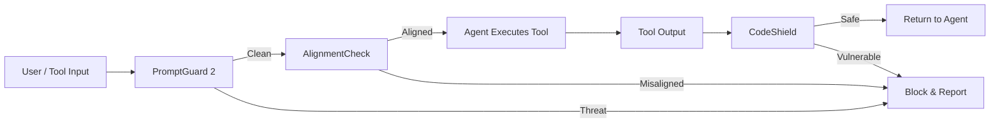
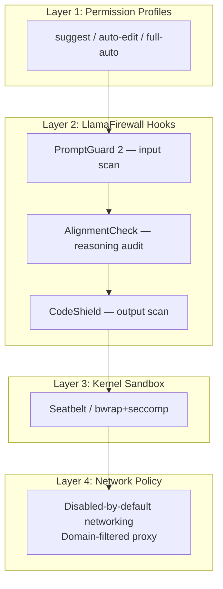

# LlamaFirewall and Codex CLI: Wiring Meta's Three-Scanner Guardrail into Your Agent's Hook Pipeline


---

Coding agents write code, execute shell commands, and orchestrate tool calls — all against untrusted inputs. The default security posture for most teams is "trust the sandbox and hope for the best." Meta's LlamaFirewall offers a more rigorous alternative: a three-scanner guardrail framework purpose-built for agentic workloads, open-sourced under PurpleLlama and already running in production at Meta [^1]. This article explains LlamaFirewall's architecture, benchmarks its efficacy, and shows how to wire it into Codex CLI's hook pipeline so every tool call passes through PromptGuard 2, AlignmentCheck, and CodeShield before or after execution.

## Why Coding Agents Need Runtime Guardrails

Codex CLI's kernel-level sandbox (Seatbelt on macOS, bwrap + seccomp on Linux) prevents escaped processes from touching the host filesystem or network [^2]. But the sandbox answers a different question: _can this process reach the resource?_ It does not answer _should this agent be doing this at all?_

Consider three attack classes the sandbox alone cannot stop:

1. **Indirect prompt injection** — a poisoned `README.md` or dependency description that steers the agent towards exfiltrating secrets via a legitimate tool call [^3].
2. **Goal hijacking** — a multi-turn conversation where accumulated context gradually shifts the agent's objective away from the user's intent [^1].
3. **Insecure code generation** — the agent writes code containing CWE-327 weak cryptography or CWE-78 OS command injection, which the sandbox happily executes because the code itself is syntactically valid [^4].

Runtime guardrails sit between the agent's intent and its actions, inspecting inputs, reasoning chains, and outputs at each tool-use boundary.

## LlamaFirewall Architecture

LlamaFirewall employs a conditional, sequential defence model with three independent scanners [^1]:



### PromptGuard 2

An 86M-parameter classifier trained to detect direct and indirect jailbreak attempts, including obfuscated variants embedded in tool outputs [^1]. On the AgentDojo benchmark (97 task domains), PromptGuard 2 alone reduced the attack success rate (ASR) from 17.6% to 7.5% with minimal loss in task utility [^5].

### AlignmentCheck

A chain-of-thought auditor that inspects the agent's reasoning tokens for goal hijacking, policy violations, and sensitive data exfiltration attempts [^1]. AlignmentCheck monitors the token stream for behavioural divergence from user-defined goals and organisational policies. On AgentDojo, it achieved a lower ASR of 2.9%, though at higher computational cost [^5].

### CodeShield

An online static analysis engine supporting syntax-aware pattern matching across eight programming languages [^4]. CodeShield uses both Semgrep and regex-based rules to detect insecure patterns mapped to CWE identifiers — weak hashing (CWE-327/CWE-328), OS command injection (CWE-78), and similar vulnerability classes [^4]. It achieved 96% precision and 79% recall on a labelled dataset of insecure code completions [^5].

### Combined Efficacy

When all three scanners operate together, LlamaFirewall achieves a 90% reduction in ASR — from 17.6% down to 1.75% — with a modest utility drop from 47.7% to 42.7% on AgentDojo [^5].

## Codex CLI's Hook Pipeline

Codex CLI exposes a lifecycle hook system that fires deterministic scripts at defined points during agent execution [^6]. The hooks relevant for guardrail integration are:

| Hook Event | Timing | Guardrail Use |
|---|---|---|
| `PreToolUse` | Before tool execution | Scan inputs; block or rewrite dangerous calls |
| `PostToolUse` | After tool execution | Scan outputs; inject security context |
| `SessionStart` | Session initialisation | Load scanner configuration |
| `Stop` | Session end | Emit security audit summary |

Hooks are configured in `hooks.json` or inline in `config.toml`, discovered at both user (`~/.codex/`) and project (`<repo>/.codex/`) levels [^6].

### PreToolUse: Input Scanning

A PreToolUse hook receives the full tool call as JSON — including the exact Bash command, file path, or MCP tool name — before anything executes [^6]. The hook script can:

- **Allow** the call (exit 0, return `permissionDecision: "allow"`)
- **Deny** the call with a reason fed back to the model (exit 2 with stderr, or return `permissionDecision: "deny"`)
- **Rewrite** the tool input before execution (return `updatedInput`)

```json
{
  "PreToolUse": [
    {
      "matchers": [".*"],
      "handlers": [
        {
          "type": "command",
          "command": "llamafirewall-scan --mode pretool",
          "timeout": 5,
          "statusMessage": "Scanning input with LlamaFirewall..."
        }
      ]
    }
  ]
}
```

### PostToolUse: Output Scanning

PostToolUse fires after the tool produces output, including for non-zero exit codes [^6]. This is where CodeShield inspects generated code:

```json
{
  "PostToolUse": [
    {
      "matchers": ["Bash", "apply_patch", "Edit", "Write"],
      "handlers": [
        {
          "type": "command",
          "command": "llamafirewall-scan --mode posttool --scanner codeshield",
          "timeout": 10,
          "statusMessage": "Scanning output with CodeShield..."
        }
      ]
    }
  ]
}
```

The PostToolUse handler can inject `additionalContext` — a system message appended to the conversation — warning the model about detected vulnerabilities [^6]. This nudges the agent to self-correct without halting the session.

## Wiring LlamaFirewall to Codex CLI

### Step 1: Install LlamaFirewall

LlamaFirewall is distributed as a Python package via PyPI [^7]:

```bash
pip install llamafirewall
```

For Codex CLI integration, you also need a thin wrapper script that accepts hook JSON on stdin and returns the expected hook response format.

### Step 2: Create the Scanner Script

The scanner script bridges LlamaFirewall's Python API to Codex CLI's hook JSON protocol:

```python
#!/usr/bin/env python3
"""llamafirewall-scan: Bridge between Codex CLI hooks and LlamaFirewall."""
import json
import sys
from llamafirewall import LlamaFirewall, ScannerType

fw = LlamaFirewall(
    scanners=[
        ScannerType.PROMPT_GUARD,
        ScannerType.ALIGNMENT_CHECK,
        ScannerType.CODE_SHIELD,
    ]
)

def scan_pretool(hook_input: dict) -> dict:
    tool_input = json.dumps(hook_input.get("tool_input", {}))
    result = fw.scan(content=tool_input, content_type="tool_input")
    if result.is_blocked:
        return {
            "hookSpecificOutput": {
                "permissionDecision": "deny",
                "permissionDecisionReason": f"LlamaFirewall: {result.reason}"
            }
        }
    return {"hookSpecificOutput": {"permissionDecision": "allow"}}

def scan_posttool(hook_input: dict) -> dict:
    tool_response = hook_input.get("tool_response", "")
    result = fw.scan(content=tool_response, content_type="code_output")
    if result.has_warnings:
        return {
            "continue": True,
            "hookSpecificOutput": {
                "additionalContext": f"CodeShield warning: {result.summary}"
            }
        }
    return {"continue": True}

if __name__ == "__main__":
    hook_input = json.load(sys.stdin)
    mode = sys.argv[1] if len(sys.argv) > 1 else "pretool"
    if mode == "--mode=pretool":
        output = scan_pretool(hook_input)
    else:
        output = scan_posttool(hook_input)
    json.dump(output, sys.stdout)
```

### Step 3: Register as a Managed Hook

For enterprise teams, register the hook in `requirements.toml` so it is auto-trusted across the organisation [^6]:

```toml
[hooks.managed]
llamafirewall-pretool = { event = "PreToolUse", command = "llamafirewall-scan --mode=pretool" }
llamafirewall-posttool = { event = "PostToolUse", command = "llamafirewall-scan --mode=posttool" }
```

Managed hooks bypass the per-user trust review prompt, making them suitable for policy enforcement at scale [^6].

## Defence-in-Depth: How the Layers Compose

Codex CLI's existing security model provides sandbox isolation and permission profiles. LlamaFirewall adds semantic inspection. The combination creates a four-layer defence:



Each layer addresses a different failure mode:

| Layer | Prevents | Example |
|---|---|---|
| Permission profiles | Unintended autonomy | Agent writes to production config in `suggest` mode |
| LlamaFirewall hooks | Semantic attacks | Poisoned README triggers secret exfiltration |
| Kernel sandbox | Process escape | Malicious `curl` to attacker-controlled server |
| Network policy | Data exfiltration | DNS tunnelling of environment variables |

## Performance Considerations

LlamaFirewall's latency budget matters when it sits in the hot path of every tool call. Key numbers from Meta's evaluation [^5]:

- **PromptGuard 2 (86M)**: Sub-100ms inference on CPU; suitable for PreToolUse without noticeable delay.
- **AlignmentCheck**: Higher latency due to chain-of-thought analysis; best deployed on PostToolUse where blocking is less disruptive.
- **CodeShield**: Static analysis runs in under 200ms for typical code blocks; well within Codex CLI's default 600-second hook timeout [^6].

For latency-sensitive workflows, configure PromptGuard 2 on PreToolUse (blocking) and AlignmentCheck + CodeShield on PostToolUse (advisory), using `additionalContext` rather than hard blocks.

### Selective Scanner Activation

Not every tool call needs all three scanners. Use hook matchers to target specific tools:

```json
{
  "PreToolUse": [
    {
      "matchers": ["Bash", "mcp__.*"],
      "handlers": [{ "type": "command", "command": "llamafirewall-scan --mode=pretool --scanner promptguard" }]
    }
  ],
  "PostToolUse": [
    {
      "matchers": ["Bash", "apply_patch", "Edit", "Write"],
      "handlers": [{ "type": "command", "command": "llamafirewall-scan --mode=posttool --scanner codeshield" }]
    }
  ]
}
```

## Limitations and Open Questions

**LlamaFirewall does not speak MCP natively** — it has no built-in awareness of the Model Context Protocol's tool schema or capability negotiation [^8]. The hook bridge script must extract relevant fields from the Codex CLI hook JSON and pass them as plain text to LlamaFirewall's scan API.

**AlignmentCheck requires reasoning tokens** — if the model does not emit chain-of-thought (e.g., when using `o3-mini` in low-reasoning mode), AlignmentCheck has limited material to audit [^1].

**Adaptive attacks remain a concern** — research from Zhan et al. (2025) demonstrates that adaptive attackers who know the guardrail architecture can craft inputs that bypass even well-tuned defences, consistently achieving over 50% ASR against state-of-the-art guardrails when adaptive strategies are employed [^9]. LlamaFirewall's 1.75% ASR was measured against non-adaptive attacks on AgentDojo.

**CodeShield coverage is partial** — eight languages with Semgrep + regex rules cannot match the breadth of dedicated SAST tools like Semgrep Pro or SonarQube [^4]. Treat CodeShield as a fast first-pass filter, not a replacement for CI pipeline security scanning.

## Conclusion

LlamaFirewall fills a gap that Codex CLI's sandbox architecture deliberately leaves open: semantic inspection of what the agent intends to do, not just what the operating system permits. By wiring PromptGuard 2 into PreToolUse and CodeShield into PostToolUse, teams get a measurable reduction in attack surface — from 17.6% baseline ASR to 1.75% — without abandoning the speed and autonomy that make coding agents useful. The integration requires a thin Python bridge script and a few lines of hook configuration. For enterprise deployments, managed hooks in `requirements.toml` make the guardrail mandatory across every developer's Codex CLI instance.

---

## Citations

[^1]: Chennabasappa, S. et al. (2025). "LlamaFirewall: An open source guardrail system for building secure AI agents." arXiv:2505.03574. [https://arxiv.org/abs/2505.03574](https://arxiv.org/abs/2505.03574)

[^2]: OpenAI. (2026). "Sandbox — Codex CLI." OpenAI Developers. [https://developers.openai.com/codex/concepts/sandboxing](https://developers.openai.com/codex/concepts/sandboxing)

[^3]: Greshake, K. et al. (2023). "Not What You've Signed Up For: Compromising Real-World LLM-Integrated Applications with Indirect Prompt Injection." arXiv:2302.12173. [https://arxiv.org/abs/2302.12173](https://arxiv.org/abs/2302.12173)

[^4]: Meta. (2026). "LlamaFirewall Workflow and Detection Components." PurpleLlama Documentation. [https://meta-llama.github.io/PurpleLlama/LlamaFirewall/docs/documentation/llamafirewall-architecture/workflow-and-detection-components](https://meta-llama.github.io/PurpleLlama/LlamaFirewall/docs/documentation/llamafirewall-architecture/workflow-and-detection-components)

[^5]: MarkTechPost. (2025). "Meta AI Open-Sources LlamaFirewall: A Security Guardrail Tool to Help Build Secure AI Agents." [https://www.marktechpost.com/2025/05/08/meta-ai-open-sources-llamafirewall-a-security-guardrail-tool-to-help-build-secure-ai-agents/](https://www.marktechpost.com/2025/05/08/meta-ai-open-sources-llamafirewall-a-security-guardrail-tool-to-help-build-secure-ai-agents/)

[^6]: OpenAI. (2026). "Hooks — Codex CLI." OpenAI Developers. [https://developers.openai.com/codex/hooks](https://developers.openai.com/codex/hooks)

[^7]: PyPI. (2026). "llamafirewall." Python Package Index. [https://pypi.org/project/llamafirewall/](https://pypi.org/project/llamafirewall/)

[^8]: MorphLLM. (2026). "Best AI Coding Agents (June 2026): Scored Leaderboard." [https://www.morphllm.com/best-ai-coding-agents-2026](https://www.morphllm.com/best-ai-coding-agents-2026)

[^9]: Pasquini, D. et al. (2025). "Adaptive Attacks Break Defenses Against Indirect Prompt Injection Attacks on LLM Agents." arXiv:2503.00061. [https://arxiv.org/abs/2503.00061](https://arxiv.org/abs/2503.00061)
