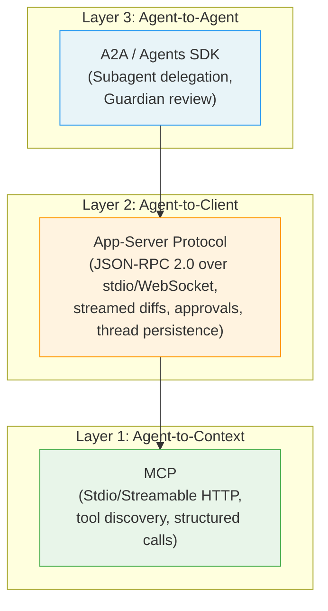
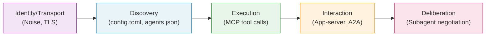

# The Protocol Stack Under Your Agent: What a New Taxonomy of LLM Communication Protocols Reveals About Codex CLI's Architecture


---

Every time you type a prompt into Codex CLI, at least three distinct communication protocols fire before the first token arrives. A freshly published taxonomy paper — *A Technical Taxonomy of LLM Agent Communication Protocols* (arXiv:2606.19135) [^1] — classifies nine open-source protocols across five architectural dimensions and exposes a communication trilemma that every agent framework must navigate. Codex CLI's layered protocol stack turns out to be a textbook example of how to resolve that trilemma in practice.

## The Taxonomy in Sixty Seconds

Sander et al. analysed nine protocols through five iterative coding cycles, arriving at five classification dimensions [^1]:

| Dimension | What it captures |
|-----------|-----------------|
| **Counterparty** | Agent-to-agent, agent-to-context (tools), or hybrid |
| **Payload** | Structured data, conversation text, or hybrid |
| **Interaction state** | Stateless or session-persistent |
| **Discovery** | Static, centralised registry, decentralised, or hybrid |
| **Schema flexibility** | Single fixed schema, multiple predefined, or runtime-negotiated |

The nine protocols span the full spectrum: MCP (Anthropic) for tool integration, A2A (Google/Linux Foundation) for agent-to-agent collaboration, ACP (IBM/BeeAI) for RESTful agent coordination, LAP (LangChain) for deployment, ANP for decentralised peer-to-peer exchange, Agora for deliberative negotiation, LMOS (Eclipse) for transport-agnostic capability sharing, agents.json for API discovery, and agntcy for Internet of Agents infrastructure [^1].

## The Communication Trilemma

The paper's most consequential finding is the **communication trilemma**: no single protocol can simultaneously maximise versatility (diverse message types), efficiency (minimal overhead), and portability (low adoption friction) [^1]. MCP maximises efficiency and portability by constraining itself to structured tool calls over JSON-RPC. A2A maximises versatility by supporting streaming updates, state synchronisation, and artifact exchange. Agora and ANP push runtime schema negotiation at the cost of complexity.

The practical implication: production agent systems need a *stack* of protocols, each optimised for a different layer of the problem.

## Codex CLI's Three-Protocol Stack

Codex CLI resolves the trilemma by deploying three protocols at three distinct layers, each chosen for a different point on the trilemma surface.



### Layer 1: MCP for tool integration

Codex CLI uses MCP exactly as the taxonomy predicts a context-focused, stateless, structured-payload protocol should be used [^2]. Each MCP server is configured in `config.toml` with either a `command` (stdio transport) or a `url` (Streamable HTTP transport) [^2]:

```toml
[mcp_servers.filesystem]
command = "npx"
args = ["-y", "@anthropic-ai/mcp-filesystem"]
enabled_tools = ["read_file", "write_file"]
default_tools_approval_mode = "auto"
startup_timeout_sec = 10
tool_timeout_sec = 60
```

The taxonomy classifies MCP as stateless with static discovery and multiple predefined schemas [^1]. That maps directly to how Codex treats MCP servers: each server advertises its tool list and optional `instructions` field during initialisation, Codex snapshots those capabilities, and every subsequent tool call is a standalone JSON-RPC request with no server-side session state [^2].

Security governance sits above the protocol layer. The `enabled_tools` / `disabled_tools` allowlists and `approval_mode` settings (`auto`, `prompt`, `approve`) enforce policy without modifying MCP itself [^2]. When `requirements.toml` is managed by an enterprise admin, PostToolUse hooks can gate every MCP tool invocation through external validators [^3].

### Layer 2: App-server for client communication

OpenAI explicitly tried — and rejected — using MCP as the client-facing protocol [^4]. The app-server protocol is a bidirectional JSON-RPC 2.0 stream over stdio, WebSocket, or Unix sockets, designed for the interaction patterns MCP cannot support: streamed diffs, approval workflows, thread persistence, and server-initiated notifications [^4].

In the taxonomy's terms, the app-server protocol is:

- **Counterparty**: hybrid (serves both UI clients and programmatic integrations)
- **Payload**: hybrid (structured events plus conversation text)
- **Interaction state**: session-persistent (threads survive across connections)
- **Discovery**: static (clients connect to a known local process)
- **Schema flexibility**: multiple (versioned capabilities with `experimentalApi` opt-in) [^4]

The session lifecycle follows a strict sequence: `initialize` → `initialized` → `thread/start` → `turn/start` → streamed `item/*` notifications → `turn/complete` [^4]. Authentication on WebSocket uses capability tokens with SHA-256 verification or signed bearer tokens [^4].

This is precisely the gap the taxonomy identifies: no context-focused protocol in their sample supports the stateful, streamed, bidirectional interaction that a rich coding agent client demands [^1].

### Layer 3: A2A for agent-to-agent delegation

When Codex CLI delegates work to subagents — whether through the built-in multi-agent delegation modes (`disabled`, `explicit-request-only`, `proactive`) or through the OpenAI Agents SDK integration — the communication shifts to an agent-to-agent pattern [^5]. The Agents SDK exposes Codex as an MCP server with two tools (`codex()` and `codex-reply()`), enabling external orchestrators to embed Codex in multi-agent pipelines [^5][^6].

The taxonomy classifies A2A as supporting multiple schemas, session state, centralised discovery, and hybrid payloads [^1] — exactly the profile required for multi-turn subagent coordination where the parent agent needs streaming updates, error propagation (a v0.142 fix ensures parent agents receive terminal subagent errors instead of empty successful completions [^7]), and artifact exchange.

## Mapping the Taxonomy to Daily Configuration

The taxonomy's five dimensions translate directly into configuration decisions Codex CLI developers make every day:

| Taxonomy dimension | Codex CLI configuration surface | Example |
|---|---|---|
| Counterparty | `mcp_servers` vs subagent delegation mode | MCP for tools, delegation for parallel coding tasks |
| Payload | `approval_mode` per tool | `auto` for structured-only tools, `prompt` for tools producing side effects |
| Interaction state | Thread persistence, `thread/resume` | Resume long-running refactoring sessions across SSH disconnects |
| Discovery | `config.toml` scope (global vs project) | Project-scoped `.codex/config.toml` for team-standard MCP servers |
| Schema flexibility | `experimentalApi` capability flag | Opt into new app-server features before they stabilise |

## The Privacy and Policy Gap

The taxonomy identifies a critical deficiency: "a notable gap across all investigated protocols is the widespread absence of privacy safeguards, compliance checks, and policy enforcement" [^1]. Codex CLI addresses this gap outside the protocol layer through:

- **requirements.toml**: enterprise-managed policy enforcement with managed hooks, MCP allowlisting, and sandbox configuration [^3]
- **Kernel-level sandbox**: Seatbelt (macOS) and bwrap+seccomp (Linux) enforce filesystem and network boundaries regardless of what any protocol permits [^8]
- **Guardian subagent review**: a risk-based automated reviewer that evaluates commands against policy rules before execution [^4]
- **Noise Protocol relay channels**: end-to-end encrypted communication for remote executors using X25519, ML-KEM-768, AES-256-GCM, and SHA-256, with handshakes bound to `environment_id`, `executor_registration_id`, and `stream_id` [^9]

The taxonomy authors propose that protocol-level policy enforcement is an open research problem [^1]. Codex CLI's approach — policy as a layer above the protocol, enforced by the harness — may prove more practical than embedding governance into each protocol specification.

## Toward a Federated Protocol Stack

The paper concludes that the field will converge on "a federated, layered protocol stack" rather than a single dominant standard [^1], mirroring the OSI model:



Codex CLI already implements four of these five layers. The missing piece — Layer 5 deliberation, where agents negotiate interaction styles at runtime — maps to the `proactive` delegation mode introduced in v0.142, where the agent autonomously decides when and how to spawn subagents [^7]. Whether this constitutes true runtime schema negotiation or merely automated task routing is an open question the taxonomy framework helps clarify.

## Practical Takeaways

1. **Don't fight the trilemma.** Use MCP for tool integration (efficiency + portability), the app-server protocol for client UX (versatility + state), and A2A/Agents SDK for multi-agent coordination (versatility + session persistence). Trying to force one protocol to serve all three roles is an architectural anti-pattern.

2. **Scope MCP servers to projects, not users.** The taxonomy shows that static discovery (MCP's model) works when the set of tools is known. Project-scoped `.codex/config.toml` files make tool configuration reproducible across team members [^2].

3. **Govern above the protocol.** The taxonomy confirms that no protocol embeds meaningful policy enforcement. Use `requirements.toml` and managed hooks to fill the gap rather than waiting for protocol-level governance that may never arrive [^3].

4. **Watch the A2A convergence.** Google's A2A, now under Linux Foundation governance with 50+ partners [^10], is the most likely candidate for standardised agent-to-agent communication. Codex CLI's Agents SDK integration already speaks a compatible dialect. Teams building multi-agent pipelines should design for A2A interoperability now.

5. **Treat the app-server protocol as an API, not an implementation detail.** With stdio, WebSocket, and Unix socket transports, the app-server protocol is Codex CLI's most underutilised integration point. Custom clients — CI dashboards, Slack bots, IDE extensions — can subscribe to thread events without polling [^4].

## Citations

[^1]: Sander, L., Gidey, H.K., Lenz, A. & Knoll, A. (2026). *A Technical Taxonomy of LLM Agent Communication Protocols*. arXiv:2606.19135. [https://arxiv.org/abs/2606.19135](https://arxiv.org/abs/2606.19135)

[^2]: OpenAI. (2026). *Model Context Protocol — Codex*. OpenAI Developers. [https://developers.openai.com/codex/mcp](https://developers.openai.com/codex/mcp)

[^3]: OpenAI. (2026). *Agent approvals & security — Codex*. OpenAI Developers. [https://developers.openai.com/codex/agent-approvals-security](https://developers.openai.com/codex/agent-approvals-security)

[^4]: OpenAI. (2026). *App Server — Codex*. OpenAI Developers. [https://developers.openai.com/codex/app-server](https://developers.openai.com/codex/app-server)

[^5]: OpenAI. (2026). *Use Codex with the Agents SDK*. OpenAI Developers. [https://developers.openai.com/codex/guides/agents-sdk](https://developers.openai.com/codex/guides/agents-sdk)

[^6]: OpenAI. (2026). *Subagents — Codex*. OpenAI Developers. [https://developers.openai.com/codex/subagents](https://developers.openai.com/codex/subagents)

[^7]: OpenAI. (2026). *Changelog — Codex*. OpenAI Developers. [https://developers.openai.com/codex/changelog](https://developers.openai.com/codex/changelog)

[^8]: OpenAI. (2026). *CLI — Codex*. OpenAI Developers. [https://developers.openai.com/codex/cli](https://developers.openai.com/codex/cli)

[^9]: viyatb-oai. (2026). *exec-server: add Noise relay transport*. GitHub PR #26242. [https://github.com/openai/codex/pull/26242](https://github.com/openai/codex/pull/26242)

[^10]: Zylos Research. (2026). *Agent Interoperability Protocols 2026: MCP, A2A, ACP and the Path to Convergence*. [https://zylos.ai/research/2026-03-26-agent-interoperability-protocols-mcp-a2a-acp-convergence/](https://zylos.ai/research/2026-03-26-agent-interoperability-protocols-mcp-a2a-acp-convergence/)
