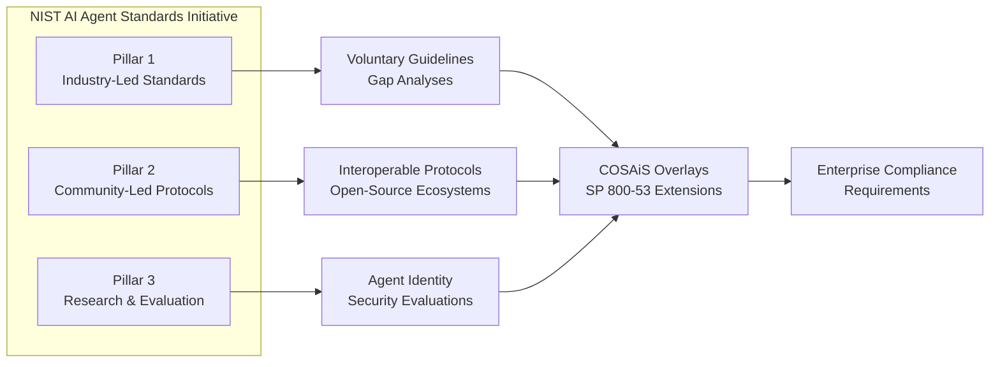
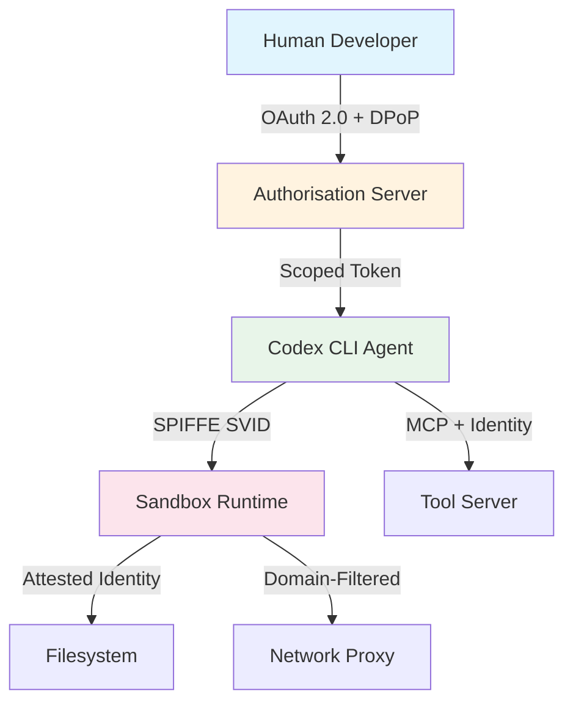

# The NIST AI Agent Standards Initiative: What It Means for Codex CLI and Your Compliance Roadmap


---

On 17 February 2026, NIST's Centre for AI Standards and Innovation (CAISI) launched the AI Agent Standards Initiative — the first US government programme dedicated to interoperability and security standards for agentic AI systems [^1]. Four months on, listening sessions have concluded, the COSAiS overlay project is producing drafts, and the NCCoE concept paper on agent identity has attracted more than 200 public comments [^2]. If your organisation deploys Codex CLI — or any coding agent that executes code, accesses files, and calls external tools — this initiative will shape your compliance obligations from late 2026 onwards.

This article maps the initiative's three strategic pillars, the emerging COSAiS control overlays, and the NCCoE identity architecture to Codex CLI's existing security primitives, showing what already satisfies draft requirements and where gaps remain.

## The Three Pillars

CAISI organised the initiative around three strategic pillars [^1]:

1. **Industry-led standards** — NIST hosts technical convenings and gap analyses to produce voluntary guidelines, coordinating with international standards bodies.
2. **Community-led protocols** — identifying barriers to interoperable agent protocols, with NSF funding open-source ecosystems through its Pathways to Enable Secure Open-Source Ecosystems programme.
3. **Research investment** — fundamental research into agent authentication, identity infrastructure, and security evaluations.



The practical output is converging on two deliverables: the COSAiS control overlays extending SP 800-53 for AI systems, and the NCCoE concept paper defining agent identity and authorisation architecture [^3] [^4].

## The Six Threat Categories

NIST AI 100-2 E2025 identifies six threat categories distinct to agentic systems [^5]:

| Threat | Description | Coding Agent Relevance |
|--------|-------------|----------------------|
| Indirect prompt injection | Adversarial instructions in documents, tool outputs | Repository files, dependency metadata, PR descriptions |
| Agent memory poisoning | Gradual corruption of knowledge bases | Codex Memories, AGENTS.md, cached context |
| Supply chain attacks | Compromised agent tools | MCP servers, plugins, npm/pip packages |
| Autonomous action execution | Real-world actions without oversight | File writes, shell execution, git operations |
| Dynamic tool-switching | Expanding attack surface per session | MCP tool discovery, plugin activation |
| Specification gaming | Optimising metrics whilst violating intent | Passing tests without addressing root cause |

NIST's empirical red-teaming via AgentDojo-Inspect found that novel attack techniques targeting AI agents achieved an 81 per cent task-hijacking success rate, compared with 11 per cent for baseline attacks [^5]. Multi-attempt scenarios raised success rates from 57 per cent to 80 per cent with 25 attempts, meaning single-run security assessments provide false assurance [^5].

## COSAiS: SP 800-53 Overlays for AI Agents

The Control Overlays for Securing AI Systems (COSAiS) project extends NIST SP 800-53 Rev. 5 with dedicated overlays for single-agent and multi-agent deployments [^3]. Publication is expected late 2026 to 2027. The overlays add AI-specific enhancement requirements to existing control families:

### Access Control (AC) — Least Privilege for Agents

**SP 800-53 AC-6 (Least Privilege)** requires that systems enforce the most restrictive set of rights needed for each task. For coding agents, this means scoped filesystem access, network restrictions, and tool-level permissions.

Codex CLI's `requirements.toml` already implements this through declarative policy:

```toml
[policy]
approval_policy = "on-request"
sandbox_mode = "workspace-write"

[network]
network_access = false
allowed_domains = ["registry.npmjs.org", "pypi.org"]

[mcp]
allowed_servers = ["github", "jira"]
```

The `sandbox_mode` hierarchy — `locked-network`, `workspace-write`, `full-auto` — maps directly to graduated AC-6 enforcement [^6]. Enterprise administrators enforce baselines through managed `requirements.toml` that project-level configuration cannot weaken [^7].

### Audit and Accountability (AU) — Agent Action Logging

**SP 800-53 AU-3 (Content of Audit Records)** requires sufficient detail to reconstruct events. Coding agents executing shell commands, writing files, and calling APIs generate audit-relevant events at a rate traditional logging was not designed for.

Codex CLI's telemetry stack addresses this through:

- **Rollout files** — session-level JSONL recording every tool call, model response, and user approval [^8]
- **OpenTelemetry integration** — `[otel]` configuration in `requirements.toml` exports spans to enterprise SIEM systems [^9]
- **Turn-diff tracking** — git-level change attribution per agent turn [^8]

```toml
[otel]
exporter = "otlp-http"
endpoint = "https://otel-collector.internal:4318"
log_user_prompt = false
```

The `log_user_prompt = false` default satisfies privacy considerations whilst maintaining action-level audit trails.

### System and Communications Protection (SC) — Sandbox Enforcement

**SP 800-53 SC-7 (Boundary Protection)** requires monitoring and controlling communications at external boundaries. Codex CLI's kernel-level sandbox — Seatbelt on macOS, bwrap + seccomp-bpf on Linux — enforces boundaries below the application layer [^6]. The managed proxy intercepts all network traffic, enforcing domain allowlists regardless of what the agent requests.

## The NCCoE Identity Architecture

The NCCoE concept paper proposes three technologies for agent identity and authorisation [^4]:

1. **OAuth 2.0 with extensions** — Rich Authorisation Requests (RAR), Pushed Authorisation Requests (PAR), and Demonstrating Proof-of-Possession (DPoP) bind agent permissions to delegated scope and human user identity.
2. **SPIFFE/SPIRE** — workload identity and cryptographic attestation for agent processes.
3. **Model Context Protocol** — carrying identity assertions through agent communication channels.



### Where Codex CLI Aligns

Codex CLI's authentication model already implements several elements of this architecture:

- **Enterprise access tokens** (v0.138+) bind sessions to organisational identity [^10]
- **Managed proxy** enforces network policies at the transport layer, carrying credential context
- **Permission profiles** scope filesystem, network, and tool access per project or environment [^6]
- **Noise Protocol relay channels** (v0.141+) provide end-to-end encrypted, authenticated communication for remote execution [^11]

### Where Gaps Remain

Three areas require attention:

1. **Per-action authorisation tokens** — Codex CLI does not yet issue scoped OAuth tokens per tool call. The NCCoE model envisions fine-grained, per-action credential scoping rather than session-level access.
2. **SPIFFE/SPIRE integration** — no current mechanism for cryptographic workload attestation of the Codex agent process itself. ⚠️ This gap may narrow as the AAIF (Agentic AI Foundation) develops interoperability standards.
3. **Cross-agent identity federation** — when Codex delegates to subagents or MCP servers, identity assertions do not currently propagate through the delegation chain in a standards-compliant format.

## Practical Compliance Roadmap

Based on the initiative's timeline, organisations deploying Codex CLI should prepare in three phases:

### Phase 1: Inventory (Now)

NIST's guidance emphasises that organisations cannot demonstrate compliance readiness without first enumerating their AI agent deployments [^5]. Document:

- Which repositories have Codex CLI access
- What tool servers (MCP) are connected
- Which human identities can approve agent actions
- What data sources agents can read

### Phase 2: Baseline Controls (Q3–Q4 2026)

Align existing Codex CLI configuration with emerging COSAiS requirements:

```toml
# requirements.toml — COSAiS-aligned baseline
[policy]
approval_policy = "on-request"        # AC-6: explicit approval
sandbox_mode = "workspace-write"       # SC-7: boundary protection

[network]
network_access = true
allowed_domains = ["api.github.com", "registry.npmjs.org"]

[hooks]
managed_hooks = true                   # AU-3: action logging

[otel]
exporter = "otlp-http"
endpoint = "https://siem.internal:4318"
log_user_prompt = false                # Privacy preservation
```

### Phase 3: Advanced Controls (2027)

As COSAiS overlays finalise and the NCCoE identity architecture matures:

- Implement SPIFFE-based workload identity for agent processes
- Deploy OAuth 2.0 RAR/DPoP for per-action authorisation
- Integrate NIST AI Agent Test Suite (expected Q4 2026) into CI pipelines [^2]
- Run multi-attempt red-team scenarios per AgentDojo-Inspect methodology [^5]

## The Listening Sessions: What Emerged

CAISI held sector-specific listening sessions from March through April 2026, gathering deployment evidence from healthcare, finance, and education [^12]. Key findings relevant to coding agent deployments:

- **Healthcare participants** raised questions about HIPAA disclosure tracking when agents query multiple systems — directly analogous to a coding agent accessing multiple repositories with different access policies [^12]
- **Finance participants** highlighted KYC/AML requirements where agent actions must maintain full auditability — mapping to Codex CLI's rollout file and OTel export requirements [^12]
- **Cross-sector consensus** emerged that least-privilege enforcement must be dynamic, not static — agents should not inherit broad permissions by default [^1]

Codex CLI's `requirements.toml` hierarchy — system-level baselines that project-level configuration cannot weaken — directly implements this "deny-by-default, grant-per-task" model [^7].

## What This Means for Your Team

The NIST AI Agent Standards Initiative is not yet regulatory mandate, but it establishes the vocabulary and control framework that sector-specific regulations will reference. FedRAMP AI requirements are expected to derive from COSAiS overlays [^5]. ISO/IEC 42001 assessments already reference NIST AI risk management frameworks.

For teams already running Codex CLI with managed `requirements.toml`, enterprise access tokens, and OpenTelemetry export, the compliance gap is manageable. The kernel-level sandbox, declarative policy enforcement, and session-level audit trails map cleanly to COSAiS's AC, AU, and SC control families.

The harder work lies ahead: per-action authorisation, cryptographic workload attestation, and cross-agent identity federation are architectural capabilities that neither Codex CLI nor any competing coding agent fully implements today. The organisations that begin inventorying their agent deployments and aligning configuration baselines now will be best positioned when voluntary guidelines become procurement requirements.

## Citations

[^1]: NIST, "Announcing the AI Agent Standards Initiative for Interoperable and Secure Innovation," 17 February 2026. [https://www.nist.gov/news-events/news/2026/02/announcing-ai-agent-standards-initiative-interoperable-and-secure](https://www.nist.gov/news-events/news/2026/02/announcing-ai-agent-standards-initiative-interoperable-and-secure)

[^2]: Cloud Security Alliance, "NIST AI Agent Standards: Listening Sessions and Emerging Controls," 16 April 2026. [https://labs.cloudsecurityalliance.org/research/csa-research-note-nist-ai-agent-standards-20260416-csa-style/](https://labs.cloudsecurityalliance.org/research/csa-research-note-nist-ai-agent-standards-20260416-csa-style/)

[^3]: NIST CSRC, "SP 800-53 Control Overlays for Securing AI Systems (COSAiS)," 2026. [https://csrc.nist.gov/projects/cosais](https://csrc.nist.gov/projects/cosais)

[^4]: NIST CSRC, "Accelerating the Adoption of Software and AI Agent Identity and Authorization — Concept Paper," 5 February 2026. [https://csrc.nist.gov/pubs/other/2026/02/05/accelerating-the-adoption-of-software-and-ai-agent/ipd](https://csrc.nist.gov/pubs/other/2026/02/05/accelerating-the-adoption-of-software-and-ai-agent/ipd)

[^5]: Cloud Security Alliance, "NIST AI Agent Security: Red-Teaming Guidance and Enterprise Compliance," March 2026. [https://labs.cloudsecurityalliance.org/research/csa-research-note-nist-ai-agent-red-teaming-standards-202603/](https://labs.cloudsecurityalliance.org/research/csa-research-note-nist-ai-agent-red-teaming-standards-202603/)

[^6]: OpenAI, "Agent Approvals & Security — Codex," 2026. [https://developers.openai.com/codex/agent-approvals-security](https://developers.openai.com/codex/agent-approvals-security)

[^7]: OpenAI, "Managed Configuration — Codex Enterprise," 2026. [https://developers.openai.com/codex/enterprise/managed-configuration](https://developers.openai.com/codex/enterprise/managed-configuration)

[^8]: OpenAI, "Changelog — Codex," v0.142.0, 22 June 2026. [https://developers.openai.com/codex/changelog](https://developers.openai.com/codex/changelog)

[^9]: Codex Knowledge Base, "Codex Enterprise Analytics and Compliance APIs," May 2026. [https://codex.danielvaughan.com/2026/05/11/codex-enterprise-analytics-compliance-apis-governance-dashboards/](https://codex.danielvaughan.com/2026/05/11/codex-enterprise-analytics-compliance-apis-governance-dashboards/)

[^10]: Codex Knowledge Base, "Codex CLI v0.138: Desktop Handoff, Enterprise Access Tokens," June 2026. [https://codex.danielvaughan.com/2026/06/09/codex-cli-v0138-release-guide-desktop-handoff-access-tokens-performance-plugin-automation/](https://codex.danielvaughan.com/2026/06/09/codex-cli-v0138-release-guide-desktop-handoff-access-tokens-performance-plugin-automation/)

[^11]: Codex Knowledge Base, "Codex CLI v0.141 Noise Protocol Relay Channels," June 2026. [https://codex.danielvaughan.com/2026/06/20/codex-cli-v0141-noise-protocol-relay-channels-remote-executor-end-to-end-encrypted-security/](https://codex.danielvaughan.com/2026/06/20/codex-cli-v0141-noise-protocol-relay-channels-remote-executor-end-to-end-encrypted-security/)

[^12]: NIST, "CAISI to Host Listening Sessions on Barriers to AI Adoption," February 2026. [https://www.nist.gov/news-events/news/2026/02/caisi-host-listening-sessions-barriers-ai-adoption](https://www.nist.gov/news-events/news/2026/02/caisi-host-listening-sessions-barriers-ai-adoption)
