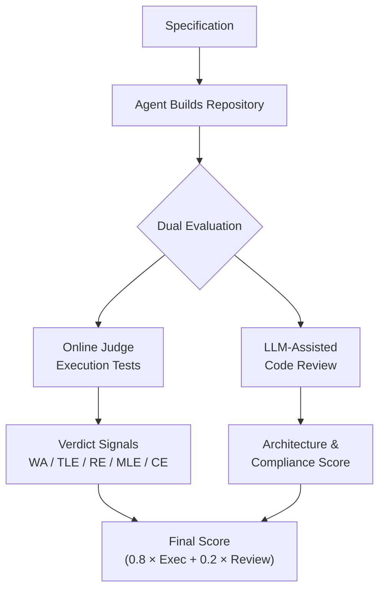
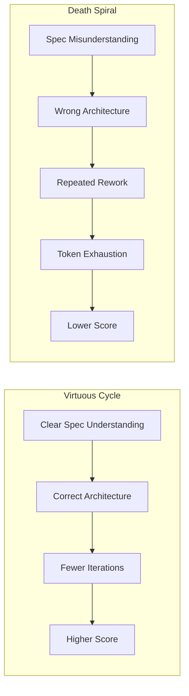
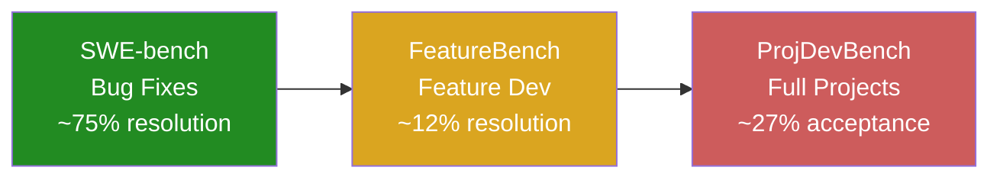

# ProjDevBench and the Greenfield Gap: Why Your Codex CLI Agent Tops the Project Development Leaderboard — and Where It Still Falls Short


---

Most coding agent benchmarks test whether an agent can fix an existing bug in an existing codebase. ProjDevBench asks a harder question: *can your agent build an entire project from a specification?* The answer, according to the February 2026 paper, is "sometimes" — and the failure modes reveal practical lessons for anyone using Codex CLI for greenfield work.

## What ProjDevBench Measures

ProjDevBench (arXiv:2602.01655) is a benchmark that evaluates AI coding agents on end-to-end project development rather than isolated issue resolution [^1]. Where SWE-bench hands an agent a repository with a failing test and asks it to produce a patch, ProjDevBench provides a high-level specification and expects a complete, executable repository back.

The benchmark comprises 20 programming problems across eight categories: Algorithm, Management, Game, Interpreter, Assembly, Data Structure, Storage, and Optimisation [^1]. Each problem requires the agent to make architecture decisions, implement functional code, and iteratively refine its solution — the same workflow a senior developer follows when starting a project from scratch.

### Dual Evaluation Protocol

ProjDevBench scores agents using a weighted formula that combines two signals [^1]:

```
Final Score = 0.8 × Execution Score + 0.2 × Code Review Score
```

The execution score comes from an Online Judge (OJ) system that runs the agent's code against test cases, producing verdict-level signals (Wrong Answer, Time Limit Exceeded, Runtime Error, Memory Limit Exceeded). The code review score uses LLM-assisted evaluation validated against human annotators at 85.2% accuracy and κ = 0.710 inter-annotator agreement [^1].



## The Leaderboard: Codex Leads, but Nobody Dominates

Six coding agents were evaluated via their command-line interfaces: Codex CLI, Cursor, Augment, Claude Code, GitHub Copilot, and Gemini CLI [^1]. The headline result: Codex on GPT-5 leads the overall leaderboard at 77.85%.

| Agent | Model | Easy | Hard | Overall |
|-------|-------|------|------|---------|
| Codex CLI | GPT-5 | 79.81 | 71.95 | **77.85** |
| Cursor | Gemini-3-Pro | 76.03 | 73.18 | 75.32 |
| Augment | GPT-5 | 76.88 | 58.78 | 72.35 |
| Cursor | Sonnet-4.5 | 74.03 | 61.43 | 70.88 |
| Cursor | GPT-5 | 71.90 | 71.69 | 71.85 |
| Augment | Sonnet-4.5 | 73.83 | 58.93 | 70.10 |

*Source: ProjDevBench leaderboard, arXiv:2602.01655 [^1]*

Two observations stand out. First, Codex CLI's lead widens on hard problems — its 71.95 hard-task score versus Augment's 58.78 suggests the harness advantage compounds with problem difficulty [^2]. Second, Cursor on Gemini-3-Pro achieves the second-highest overall score, demonstrating that model choice alone does not determine outcomes; the agent scaffold matters.

### The Mean Acceptance Rate Problem

Despite Codex's lead, the mean acceptance rate across all agents is just 27.38% (484 out of 1,768 submissions) [^1]. Nearly three-quarters of all attempts fail. This is a fundamentally different failure profile from SWE-bench, where frontier agents now routinely exceed 70% resolution rates on verified subsets [^3].

## Where Agents Fail: The Five Failure Modes

The failure mode breakdown reveals where greenfield development remains hard for agents [^1]:

| Failure Type | Share |
|--------------|-------|
| Wrong Answer | 41.86% |
| Time Limit Exceeded | 13.91% |
| Runtime Error | 7.01% |
| Compile Error | 4.52% |
| Memory Leak | 3.51% |
| Memory Limit Exceeded | 1.36% |
| Other | 0.45% |

### 1. Specification Misalignment (Wrong Answer — 41.86%)

The dominant failure mode is producing code that compiles and runs but gives incorrect results. Agents misinterpret specification requirements, implement incomplete functionality, or miss edge cases entirely [^1]. This is the greenfield equivalent of "it works on my machine" — the code does *something*, but not the right thing.

### 2. Algorithmic Complexity Failures (TLE — 13.91%)

Agents consistently choose brute-force approaches over algorithmically efficient solutions. The paper highlights cases where an O(K×N log N) implementation was needed but agents produced O(K×N²), passing small test cases but failing at scale [^1].

### 3. Resource Management (Memory Leaks + MLE — 4.87%)

Nearly 5% of failures stem from memory management issues — exception-unsafe code, unbounded allocations, and leaked resources. These are the kinds of bugs that only surface under sustained load or with large inputs [^1].

### 4. Runtime Errors (7.01%)

Null pointer dereferences, index-out-of-bounds, and unhandled exceptions. These failures suggest agents generate structurally plausible code without verifying runtime invariants.

### 5. Compilation Failures (4.52%)

The fact that over 4% of submissions fail to compile — despite agents having access to build tools — indicates insufficient feedback loop integration during development.

## The Token-Score Paradox

One of ProjDevBench's most striking findings is the strong negative correlation between interaction volume and score [^1]:

- **Tokens vs. score:** ρ = −0.734
- **Turns vs. score:** ρ = −0.668

Agents averaged 138 turns and 4.81 million tokens per problem [^1]. The more an agent struggles — requesting more turns and consuming more tokens — the worse it performs. This is not merely a correlation artefact: it reflects genuine thrashing behaviour where agents spiral through failed approaches without converging.



This has direct implications for Codex CLI users managing rollout token budgets (available since v0.142.0 [^4]). A runaway greenfield session can consume millions of tokens without productive progress.

## Code Review vs. Execution: The Sonnet Surprise

An interesting cross-cutting finding: Claude Sonnet 4.5 produced higher code review scores (averaging 80+) than GPT-5, even though GPT-5 achieved higher execution correctness [^1]. Sonnet's code was better structured and more specification-compliant, but less likely to produce the *correct* output.

This has practical implications for Codex CLI's multi-model routing. If you need code that passes tests, GPT-5 or GPT-5.5 remain the better choice. If you need code that a human reviewer will accept without extensive refactoring, a Sonnet-backed review pass adds value — a pattern achievable via Codex CLI's `codex exec` for automated review pipelines [^5].

## What This Means for Codex CLI Users

ProjDevBench's findings map directly to Codex CLI configuration decisions for greenfield projects.

### Write Better Specifications in AGENTS.md

The 41.86% wrong-answer rate is fundamentally a specification problem. When building new projects with Codex CLI, front-load specification detail in your `AGENTS.md` file [^6]:

```markdown
# AGENTS.md — Greenfield Project Guidance

## Architecture Requirements
- Use the repository pattern for data access
- All public API endpoints require input validation
- Error handling: return typed Result objects, never throw raw exceptions
- Time complexity: no O(n²) algorithms on collections > 1000 items

## Edge Cases to Handle
- Empty input collections
- Unicode strings in all text fields
- Concurrent access to shared state
- Graceful degradation when external services are unavailable

## Acceptance Criteria
- All tests pass, including edge case tests
- No compiler warnings
- Memory: no allocations in hot paths without pooling
```

### Use PostToolUse Hooks as Compilation Gates

ProjDevBench's 4.52% compile-error rate should be zero. Configure a `PostToolUse` hook in `requirements.toml` that runs the build after every file write [^7]:

```toml
[[hooks]]
event = "PostToolUse"
tool = "write_file"
command = "make build 2>&1 | tail -20"
blocking = true
```

This catches compilation failures immediately rather than letting the agent accumulate broken code across multiple files.

### Set Token Budget Guardrails

Given the negative correlation between token usage and score, configure rollout token budgets to prevent death-spiral sessions [^4]:

```toml
[rollout]
token_budget = 2000000
budget_reminder_threshold = 0.75
budget_exhaustion_action = "abort"
```

Two million tokens is generous for most greenfield tasks. If your agent hits 75% of that budget, the reminder forces a checkpoint — either the approach is working and can be completed within budget, or it's time to intervene with a different strategy.

### Decompose Hard Problems Before Delegation

ProjDevBench's hard-task scores drop significantly for every agent except Cursor on Gemini-3-Pro. Codex CLI's subagent delegation (up to 6 concurrent subagents [^8]) lets you decompose complex projects into manageable units:

```bash
# Scaffold the architecture first, then delegate components
codex "Read the spec in SPEC.md. Create the project structure \
  and interface definitions only — no implementations yet."

# Then delegate implementation of each component
codex "Implement the storage layer per the interfaces in src/storage/"
codex "Implement the API layer per the interfaces in src/api/"
```

This mirrors the finding that agents handle "basic functionality and data structures" well [^1] — the key is to ensure each delegated task stays within that comfort zone.

### Run Architecture Review as a Separate Pass

Since code review scores and execution scores diverge, run a dedicated architecture review pass after implementation using `codex exec` [^5]:

```bash
codex exec "Review the project in ./src for: \
  1. Specification compliance against SPEC.md \
  2. Algorithmic complexity — flag any O(n²) or worse \
  3. Resource management — check for leaks and unbounded allocations \
  4. Edge case coverage in tests" --json
```

This leverages the finding that LLM-assisted code review achieves 85.2% accuracy against human annotators [^1] — useful as a pre-merge gate, though not a replacement for human review.

## ProjDevBench in Context

ProjDevBench fills a gap between existing benchmarks:



The progression is clear: as task scope expands from patch to feature to project, agent performance drops sharply. SWE-bench's 75%+ resolution rates [^3] give way to FeatureBench's ~12% [^9] and ProjDevBench's 27%. Codex CLI's 77.85% weighted score on ProjDevBench is strong *relative* to other agents, but the absolute acceptance rate across the benchmark remains sobering.

The practical takeaway: Codex CLI is the best available tool for greenfield project development, but "best available" still requires significant human guidance on specification, architecture decomposition, and quality gates. The benchmark data tells you exactly where to invest that guidance — specification clarity, algorithmic complexity constraints, and resource management policies — all expressible through `AGENTS.md` and `requirements.toml`.

## Citations

[^1]: Lu, P., Zhang, S., Hou, Y., et al. "ProjDevBench: Benchmarking AI Coding Agents on End-to-End Project Development." arXiv:2602.01655, February 2026. [https://arxiv.org/abs/2602.01655](https://arxiv.org/abs/2602.01655)

[^2]: "Best AI Coding Agents (June 2026): Scored Leaderboard." MorphLLM, June 2026. [https://www.morphllm.com/best-ai-coding-agents-2026](https://www.morphllm.com/best-ai-coding-agents-2026)

[^3]: "SWE-bench Verified Leaderboard." SWE-bench, 2026. [https://www.swebench.com](https://www.swebench.com)

[^4]: "Changelog — Codex CLI v0.142.0." OpenAI Developers, 22 June 2026. [https://developers.openai.com/codex/changelog](https://developers.openai.com/codex/changelog)

[^5]: "Non-interactive mode — Codex." OpenAI Developers, 2026. [https://developers.openai.com/codex/noninteractive](https://developers.openai.com/codex/noninteractive)

[^6]: "Custom instructions with AGENTS.md — Codex." OpenAI Developers, 2026. [https://developers.openai.com/codex/guides/agents-md](https://developers.openai.com/codex/guides/agents-md)

[^7]: "Advanced Configuration — Codex." OpenAI Developers, 2026. [https://developers.openai.com/codex/config-advanced](https://developers.openai.com/codex/config-advanced)

[^8]: "Features — Codex CLI." OpenAI Developers, 2026. [https://developers.openai.com/codex/cli/features](https://developers.openai.com/codex/cli/features)

[^9]: Chen, X., et al. "FeatureBench: Benchmarking AI Coding Agents on End-to-End Feature Development." arXiv:2602.10975, February 2026. [https://arxiv.org/abs/2602.10975](https://arxiv.org/abs/2602.10975)
