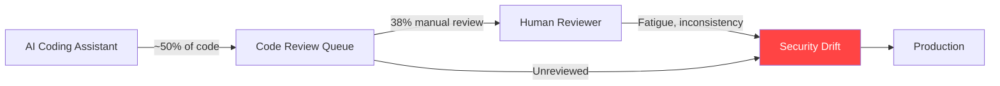
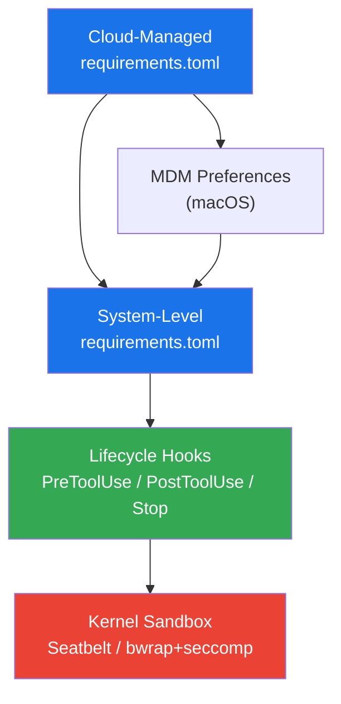
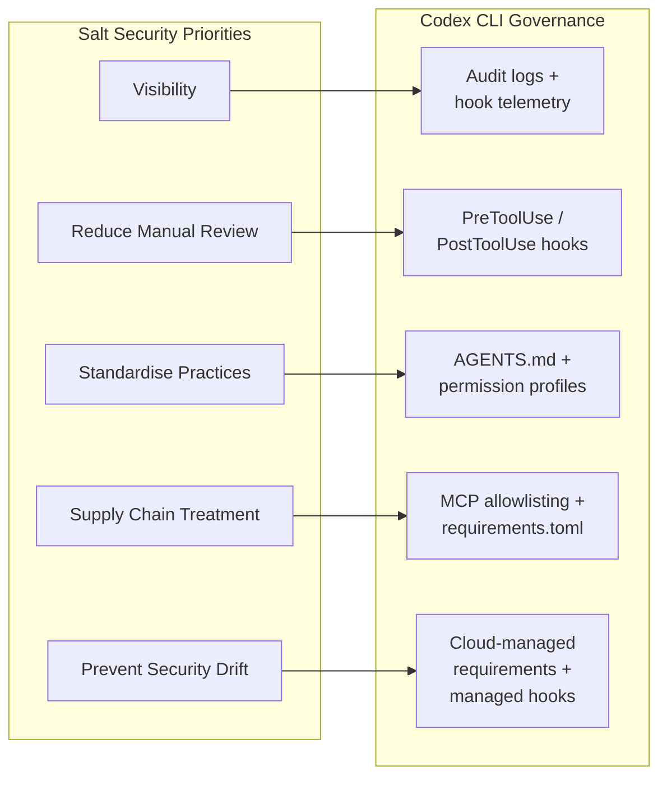

# Nine in Ten Security Leaders Fear AI-Generated Code — How Codex CLI's Governance Stack Addresses the Gap


---

## The Numbers That Should Worry You

Salt Security's June 2026 report, *AI Coding Assistants and the New Security Challenge*, surveyed 100 IT security leaders across the UK and US and delivered a stark finding: **90 per cent have active concerns about the security risks introduced by AI-generated code** [^1]. That figure alone is noteworthy, but the structural details are worse.

Sixty-seven per cent report that AI coding assistants are now widely adopted across their development teams [^1]. AI assistants now generate **nearly half of all enterprise code** [^1]. Yet 38 per cent of organisations still rely primarily on manual review to catch the problems those tools introduce [^1], and 29 per cent identify insecure coding patterns as the leading risk [^1]. Fifteen per cent cite misalignment with internal security policies — code that works but violates the organisation's own rules [^1].

The report warns of **security drift**: the widening gap between what policy mandates and what actually ships, driven by reviewer fatigue and inconsistent enforcement at machine-speed volumes [^1]. Larger enterprises (500+ employees) face the worst of it, struggling with governance consistency across distributed development environments [^1].

Salt Security's companion *1H 2026 State of AI and API Security Report* reinforces the picture. Nearly 49 per cent of organisations are "entirely blind to machine-to-machine traffic" — they cannot monitor what their AI agents do at the API layer [^2]. Seventy-nine per cent of security leaders report increased boardroom scrutiny of AI security risks [^2]. Forty-seven per cent have delayed production releases due to security concerns with autonomous systems [^2]. Only 23.5 per cent find existing security tools "very effective" at preventing attacks [^2].

## Why Manual Review Cannot Scale

The governance problem is architectural, not staffing-related. Consider the throughput asymmetry:



A senior developer reviewing AI-generated code still reads at human speed. An AI assistant generating 500 lines per hour produces a review backlog that compounds daily. The 38 per cent of organisations relying on manual review are running a system that degrades under load — precisely when adoption grows, review quality falls [^1].

Salt Security's response was **Salt Code**, launched 1 June 2026 — an MCP-connected policy enforcement layer that sits inside coding assistants and enforces OWASP API Top 10, MCP Security Top 10, and LLM Security Top 10 policies at generation time [^3]. Salt Code supports Codex CLI, Claude Code, Cursor, GitHub Copilot, Windsurf, Kiro, Gemini CLI, and Antigravity [^3].

But Codex CLI does not need a third-party product to address most of what Salt Security's research identified. The governance stack is built in.

## Codex CLI's Four-Layer Governance Architecture

Codex CLI ships a layered governance model that maps directly to Salt Security's five recommended priorities — visibility, reduced manual review dependence, standardised practices, supply chain treatment, and security drift prevention [^1].



### Layer 1: requirements.toml — Policy Enforcement

The `requirements.toml` file is the enterprise constraint layer. Admins define what users **cannot** override [^4]:

```toml
# Enforce safe sandbox modes — block danger-full-access
allowed_sandbox_modes = ["read-only", "workspace-write"]

# Require auto-review for all tool calls
allowed_approval_policies = ["on-request"]
allowed_approvals_reviewers = ["auto_review"]

# Restrict permission profiles
allowed_permission_profiles = [":swe", ":review"]
default_permission_profile = ":swe"

# Control web search exposure
allowed_web_search_modes = ["cached"]
```

When a user's configuration conflicts with an enforced rule, Codex falls back to a compatible value and notifies the user [^4]. This is not a recommendation — it is a hard constraint that cannot be bypassed from the CLI.

Requirements resolve from three sources in strict precedence order: cloud-managed requirements (Business/Enterprise ChatGPT plans), macOS MDM preferences, and system-level `requirements.toml` files [^4]. The first matching source wins per setting.

### Layer 2: MCP Server Allowlisting

Salt Security's research found that 48.3 per cent of organisations cannot differentiate legitimate AI agents from malicious bots at the API layer [^2]. Codex CLI addresses the analogous plugin and MCP risk with an **allowlist model**:

```toml
# requirements.toml — MCP server restrictions
[[mcp_servers]]
name = "filesystem"
identity = "sha256:abc123..."

[[mcp_servers]]
name = "postgres"
identity = "sha256:def456..."
```

Codex enables an MCP server only when both its name and identity match an approved entry; all others are disabled by policy [^4]. This treats MCP servers as a supply chain artefact — exactly what Salt Security recommends organisations do with AI coding assistants themselves [^1].

### Layer 3: Lifecycle Hooks — Automated Review at Machine Speed

The hook system is where Codex CLI directly replaces the manual review bottleneck that 38 per cent of organisations still depend on [^1]. Three hook types intercept the agent lifecycle [^5]:

**PreToolUse** runs before every tool call — Bash commands, file edits, MCP tool invocations. A security scanner hook can block operations before they execute:

```json
{
  "PreToolUse": [
    {
      "matcher": ".*",
      "handlers": [
        {
          "type": "command",
          "command": "/usr/local/bin/security-scan --stdin",
          "timeout": 30,
          "statusMessage": "Scanning for policy violations..."
        }
      ]
    }
  ]
}
```

Exit code `2` blocks the operation; the reason goes to stderr and is relayed to the model [^5].

**PostToolUse** runs after execution, reviewing outputs for sensitive data leakage, insecure patterns, or policy violations. It cannot undo completed operations but can inject feedback that redirects the agent's next action [^5].

**Stop** hooks run when a conversation turn completes. They can trigger continuation (returning `{"decision": "block", "reason": "..."}`) to force additional validation passes — effectively creating automated review cycles without human intervention [^5].

### Layer 4: Managed Hooks — Enterprise Enforcement

The critical distinction for enterprise governance: **managed hooks cannot be disabled by users** [^5]. Organisations deploy them via MDM, endpoint management, or cloud policy:

```toml
# requirements.toml — managed hooks
[features]
hooks = true

[hooks]
managed_dir = "/etc/codex/hooks"
allow_managed_hooks_only = true
```

Setting `allow_managed_hooks_only = true` disables user, project, session, and plugin hooks while preserving enterprise-mandated security checks [^4]. The hook scripts live in `managed_dir`, deployed and updated by the organisation's endpoint management tooling — not by the developer and not by the agent [^5].

This directly addresses Salt Security's finding that governance consistency degrades across distributed development environments [^1]. The policy travels with the tool, not with the developer's configuration.

## Mapping Salt's Five Priorities to Codex CLI



| Salt Priority | Codex CLI Mechanism | Configuration Surface |
|---|---|---|
| Visibility into AI-generated code | Audit transcripts, hook telemetry, `/usage` token tracking | Session JSON output, hook stderr logging |
| Reduce manual review dependence | PreToolUse/PostToolUse automated scanning | `hooks.json`, managed `requirements.toml` |
| Standardise secure practices | `AGENTS.md` repository directives, named permission profiles (`:swe`, `:review`) | Repository root, `config.toml` |
| Supply chain treatment | MCP server allowlisting by name + identity hash | `requirements.toml` `[[mcp_servers]]` |
| Prevent security drift | Cloud-managed requirements, `allow_managed_hooks_only` | ChatGPT admin console, MDM, system `requirements.toml` |

## The Salt Code Overlap

Salt Code connects to coding assistants via MCP and enforces policies from a centralised Posture Governance Engine covering OWASP API Top 10, MCP Security Top 10, and LLM Security Top 10 [^3]. For Codex CLI users, Salt Code arrives as an MCP server that the agent can call — or that a managed PreToolUse hook can invoke.

The practical question is whether Salt Code provides value beyond what Codex CLI's native governance already delivers. Three scenarios favour the external tool:

1. **Cross-tool consistency**: organisations running Codex CLI, Cursor, and Copilot simultaneously need one policy engine across all three. Salt Code provides this; Codex CLI's `requirements.toml` governs only Codex surfaces [^3].
2. **Pre-built policy libraries**: Salt Code ships OWASP and regulatory compliance rules out of the box [^3]. Codex CLI hooks require organisations to write or source their own scanning scripts.
3. **API-layer visibility**: Salt's AG-SPM (Agentic Security Posture Management) monitors agent-to-API relationships including undocumented "Shadow MCP" servers [^2] — a layer Codex CLI does not inspect.

For single-tool deployments, Codex CLI's native stack covers the governance gap that Salt Security's research identifies. For heterogeneous agent environments, Salt Code fills the cross-tool orchestration role.

## The Kernel Sandbox as Final Defence

Every governance layer above operates at the application level. Codex CLI's kernel-level sandbox — Seatbelt on macOS, bwrap with seccomp-BPF on Linux — provides the containment layer that no policy engine can replicate from userspace [^6]. Even if a hook fails, a policy misconfigures, or an MCP server misbehaves, the sandbox constrains filesystem access, blocks network egress (unless explicitly allowed via domain-filtered proxy), scrubs environment variables, and kills processes on parent death [^6].

Salt Security's research found that only 23.5 per cent of organisations consider their existing security tools effective [^2]. The kernel sandbox is not a security tool in the traditional sense — it is a containment boundary. It does not detect; it prevents. That architectural distinction is why Codex CLI's defence model works where scanner-based approaches degrade under volume.

## Practical Deployment

For teams acting on Salt Security's findings, the minimum viable governance configuration for Codex CLI:

```toml
# /etc/codex/requirements.toml

# Constrain sandbox to safe modes
allowed_sandbox_modes = ["read-only", "workspace-write"]

# Enforce automated review
allowed_approval_policies = ["on-request"]

# Lock web search to cached mode
allowed_web_search_modes = ["cached"]

# Enable managed hooks, disable user hooks
[features]
hooks = true

[hooks]
managed_dir = "/etc/codex/hooks"
allow_managed_hooks_only = true
```

Deploy scanning scripts to `/etc/codex/hooks/` via your endpoint management tooling. The hooks execute on every tool call. The policy travels with every Codex CLI installation. Security drift stops at the source.

## Citations

[^1]: Salt Security / Censuswide, *AI Coding Assistants and the New Security Challenge*, June 2026. [https://www.prnewswire.com/news-releases/new-research-reveals-9-in-10-security-leaders-concerned-about-ai-generated-code-risks-302788323.html](https://www.prnewswire.com/news-releases/new-research-reveals-9-in-10-security-leaders-concerned-about-ai-generated-code-risks-302788323.html)

[^2]: Salt Security, *1H 2026 State of AI and API Security Report*, June 2026. [https://salt.security/blog/the-era-of-agentic-security-is-here-key-findings-from-the-1h-2026-state-of-ai-and-api-security-report](https://salt.security/blog/the-era-of-agentic-security-is-here-key-findings-from-the-1h-2026-state-of-ai-and-api-security-report)

[^3]: Salt Security, "Salt Security launches Salt Code," 1 June 2026. [https://salt.security/press-releases/salt-security-launches-salt-code-the-first-agentic-security-solution-to-enforce-security-policies-inside-ai-coding-assistants](https://salt.security/press-releases/salt-security-launches-salt-code-the-first-agentic-security-solution-to-enforce-security-policies-inside-ai-coding-assistants)

[^4]: OpenAI, "Managed configuration – Codex," June 2026. [https://developers.openai.com/codex/enterprise/managed-configuration](https://developers.openai.com/codex/enterprise/managed-configuration)

[^5]: OpenAI, "Hooks – Codex," June 2026. [https://developers.openai.com/codex/hooks](https://developers.openai.com/codex/hooks)

[^6]: OpenAI, "Agent approvals & security – Codex," June 2026. [https://developers.openai.com/codex/agent-approvals-security](https://developers.openai.com/codex/agent-approvals-security)
