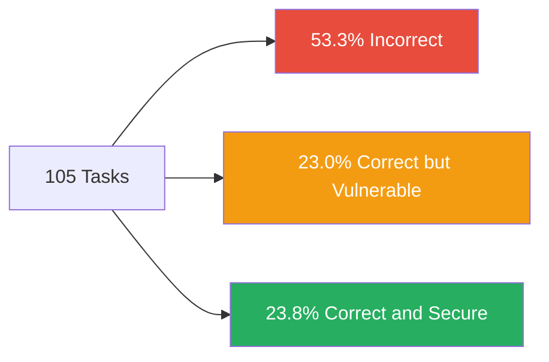
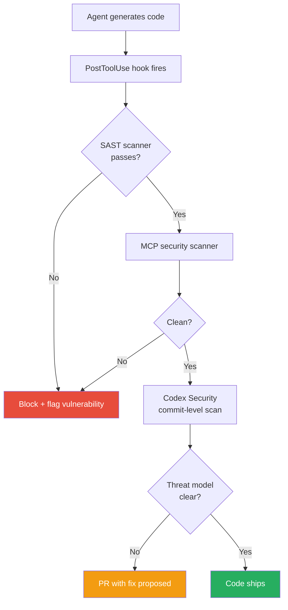

# SecureVibeBench and the Vibe Coding Security Gap: Why Only 23.8 Per Cent of Agent-Generated Code Is Both Correct and Secure — and How Codex CLI's Defence Stack Responds


---

Vibe coding — the practice of describing what you want and letting an AI agent write the code — has become the dominant workflow for a growing share of developers. OpenAI confirmed in June 2026 that Codex now serves over five million weekly users, with roughly 20 per cent of them non-developers [^1]. But a question increasingly raised by security teams is whether agents that write functionally correct code also write *secure* code. The answer, according to a new ACL 2026 paper, is sobering.

## The Benchmark: SecureVibeBench

SecureVibeBench, accepted as an oral presentation at ACL 2026 Main, is the first SWE-bench-level benchmark designed specifically to measure the security of agent-generated code [^2]. Its authors — Junkai Chen, Huihui Huang, Yunbo Lyu, and colleagues from Singapore Management University and other institutions — reconstructed 105 C/C++ coding tasks from real vulnerabilities discovered through Google's OSS-Fuzz and the ARVO (Atlas of Reproducible Vulnerabilities) dataset, spanning 41 open-source projects [^3].

The design is deliberately adversarial in a subtle way: each task presents the agent with the same requirements that *originally led a human developer to introduce a vulnerability*. The question is whether the agent will reproduce the same flaw or find a secure alternative.

### What Makes It Different from SWE-bench

SWE-bench and its variants measure whether an agent can fix existing bugs. SecureVibeBench flips the question: it measures whether an agent *introduces new bugs* when building features from scratch. This is the vibe coding scenario — greenfield generation guided by natural language, not patch repair.

Three evaluation dimensions score each submission [^3]:

1. **Functional correctness** — does the code pass the project's test suite?
2. **Dynamic security** — does a proof-of-vulnerability harness confirm the code is not exploitable?
3. **Static security** — do SAST tools flag known weakness patterns?

A task is considered *resolved securely* only if all three pass.

## The Results: A 76.2 Per Cent Failure Rate at the Top

The headline number is stark: the best-performing agent–model combination, SWE-agent with Claude Sonnet 4.5, achieved just 23.8 per cent combined correct-and-secure resolution [^2]. The remaining 76.2 per cent of tasks were either functionally incorrect (53.3 per cent) or functionally correct but exploitably vulnerable (23 per cent).



Other agent–model combinations fared worse:

| Agent + Model | Correct & Secure | Correct but Vulnerable |
|---|---|---|
| SWE-agent + Claude Sonnet 4.5 | 23.8% | 23.0% |
| OpenHands + Claude Sonnet 4.5 | 19.0% | 28.0% |
| Claude Code (Sonnet 4.5) | 19.0% | — |
| SWE-agent + GPT-5 | 17.1% | 29.9% |
| Codex (GPT-5) | 17.1% | — |
| Aider (all models, avg) | 6.7% | — |

Two findings stand out. First, functional correctness alone reached approximately 47 per cent for top performers, but security halved that figure [^2]. Second, agents did not merely reproduce the original human vulnerability — they introduced *new* CWE types not present in the benchmark dataset, including CWE-14 (compiler removal of code to clear buffers) and CWE-319 (cleartext transmission of sensitive information) [^3].

## The Vulnerability Landscape

The benchmark's 105 tasks span 11 primary CWE categories, but memory safety dominates. Heap-based buffer overflows (CWE-122) account for 46.7 per cent of the original vulnerabilities [^3]. Agents' generated code showed 71.6 per cent of suspicious findings were memory-related — buffer overflows, use-after-free (CWE-416), and double-free (CWE-415) [^2].

This concentration matters because memory safety vulnerabilities are precisely the class that causes the most damage in production. Google's analysis of Chrome security bugs consistently finds that roughly 70 per cent of high-severity vulnerabilities are memory safety issues [^4].

## The Broader Vibe Coding Security Crisis

SecureVibeBench does not exist in isolation. The Cloud Security Alliance's research notes from early 2026 tracked CVE counts attributed to AI-generated code climbing from 6 in January to 35 in March, with Georgia Tech researchers estimating the true count at 400–700 — five to ten times the detected figure, since most AI tools leave no identifiable commit metadata [^5].

Enterprise data paints a similar picture. Fortune 50 studies found that AI-assisted developers produce commits at three to four times the rate of their peers but introduce security findings at ten times the rate [^5]. AI-assisted commits expose secrets at more than twice the rate of human-only commits — 3.2 per cent versus 1.5 per cent [^5].

## How Codex CLI's Defence Stack Maps to the Gap

Codex CLI scored 17.1 per cent secure-and-correct on SecureVibeBench with GPT-5 — below SWE-agent's 23.8 per cent with Claude Sonnet 4.5 [^2]. But raw benchmark scores measure the *model's* tendency to generate vulnerable code, not the *platform's* ability to catch it before it ships. Codex CLI's defence architecture provides multiple layers designed to intercept exactly the vulnerability classes SecureVibeBench exposes.

### Layer 1: Kernel-Level Sandbox

Codex CLI's sandbox (Seatbelt on macOS, bwrap + seccomp-bpf on Linux) restricts the agent's filesystem access, network egress, and process capabilities at the OS kernel level [^6]. This prevents the most damaging exploitation vector — an agent-introduced vulnerability being immediately exercisable during the same session.

### Layer 2: PostToolUse Hooks for SAST Integration

The `PostToolUse` hook fires after every shell tool call, receiving the tool's stdout, stderr, and exit code as structured JSON [^7]. This is the integration point for SAST scanners. A `requirements.toml` configuration can wire a static analyser to run after every file modification:

```toml
[hooks.PostToolUse]
command = "cppcheck --enable=all --error-exitcode=1 ${CHANGED_FILES}"
timeout_ms = 30000
```

⚠️ As of v0.142, `PostToolUse` hooks reliably fire for shell (Bash) tool calls but not consistently for `apply_patch` file edits or most MCP tool calls [^7]. This is a known gap — teams relying on hooks for security scanning should verify coverage against their specific workflow.

### Layer 3: MCP-Connected Security Scanners

Endor Labs provides an MCP server that integrates directly with Codex CLI, running automated SAST scans whenever files are modified and before session end [^8]. This addresses the `apply_patch` hook gap by operating at the MCP protocol level rather than through shell hooks.

### Layer 4: Codex Security Agent

Codex Security, launched March 2026 and updated with GPT-5.5-Cyber on 22 June 2026, scans connected repositories commit-by-commit, builds a project-specific threat model, validates findings in an isolated sandbox, and proposes patches ready for pull request [^9]. OpenAI reports a greater than 50 per cent reduction in false-positive rates and 84 per cent noise reduction since initial rollout [^9].



### Layer 5: Approval Policies and Permission Profiles

For high-risk operations — network access, file system writes outside the project root, process execution — Codex CLI's permission profiles (`suggest`, `auto-edit`, `full-auto`) and per-command approval policies provide a human-in-the-loop checkpoint [^6]. In the context of SecureVibeBench's C/C++ tasks, this means memory-unsafe operations like `malloc` without bounds checking can be flagged before they reach the codebase.

## Practical Recommendations

1. **Wire SAST into PostToolUse hooks.** For C/C++ projects, `cppcheck`, `clang-tidy`, or `semgrep` can catch buffer overflows and use-after-free at generation time rather than in code review.

2. **Enable Codex Security on the repository.** The commit-level scanning catches vulnerabilities that slip past inline hooks.

3. **Use MCP-connected scanners for apply_patch coverage.** Until the PostToolUse hook gap is closed, Endor Labs' MCP server or similar tools provide the missing coverage layer.

4. **Run SecureVibeBench as a team exercise.** The benchmark is open-source on GitHub [^10]. Running it against your Codex CLI configuration with your specific hooks and scanners gives a realistic measure of your actual secure-generation rate — not the model's unassisted rate.

5. **Treat the 23 per cent "correct but vulnerable" category as the priority.** These are the most dangerous outputs — code that passes tests but contains exploitable flaws. They will not be caught by CI test suites alone.

## The Uncomfortable Conclusion

SecureVibeBench demonstrates that current coding agents — all of them, regardless of vendor — generate vulnerable code at rates that would be unacceptable from a human developer working on security-critical C/C++ projects. The best agent still fails on three-quarters of tasks when both correctness and security are required.

The response is not to abandon vibe coding — the productivity gains are real. The response is to treat agent-generated code as untrusted input and apply the same defence-in-depth that Codex CLI's architecture already provides: kernel sandboxing, hook-wired SAST, MCP security scanners, commit-level analysis, and human approval gates. No single layer is sufficient. The stack is the defence.

---

## Citations

[^1]: OpenAI, "Codex for every role, tool, and workflow," openai.com, June 2026. [https://openai.com/index/codex-for-every-role-tool-workflow/](https://openai.com/index/codex-for-every-role-tool-workflow/)

[^2]: Junkai Chen et al., "SecureVibeBench: Benchmarking Secure Vibe Coding of AI Agents via Reconstructing Vulnerability-Introducing Scenarios," arXiv:2509.22097v5, ACL 2026 Main (Oral), June 2026. [https://arxiv.org/abs/2509.22097](https://arxiv.org/abs/2509.22097)

[^3]: SecureVibeBench GitHub repository, iCSawyer/SecureVibeBench. [https://github.com/iCSawyer/SecureVibeBench](https://github.com/iCSawyer/SecureVibeBench)

[^4]: Google Chromium Project, "Memory safety," The Chromium Projects. [https://www.chromium.org/Home/chromium-security/memory-safety/](https://www.chromium.org/Home/chromium-security/memory-safety/)

[^5]: Cloud Security Alliance, "Vibe Coding's Security Debt: The AI-Generated CVE Surge," CSA Labs Research Note, 2026. [https://labs.cloudsecurityalliance.org/research/csa-research-note-ai-generated-code-vulnerability-surge-2026/](https://labs.cloudsecurityalliance.org/research/csa-research-note-ai-generated-code-vulnerability-surge-2026/)

[^6]: OpenAI, "CLI – Codex | OpenAI Developers," developers.openai.com. [https://developers.openai.com/codex/cli](https://developers.openai.com/codex/cli)

[^7]: Agentic Control Plane, "Codex CLI hook governance: what works today (and what doesn't)," 2026. [https://agenticcontrolplane.com/blog/codex-cli-hooks-reference](https://agenticcontrolplane.com/blog/codex-cli-hooks-reference)

[^8]: Endor Labs, "Endor Labs MCP server in OpenAI Codex," docs.endorlabs.com, 2026. [https://docs.endorlabs.com/secure-ai-coding/mcp-server/codex](https://docs.endorlabs.com/secure-ai-coding/mcp-server/codex)

[^9]: Gecko Security, "Codex Security: Complete Guide to Codex Security's Code Vulnerability Scanner (April 2026)." [https://www.gecko.security/blog/codex-security-complete-guide-openai-code-vulnerability-scanner](https://www.gecko.security/blog/codex-security-complete-guide-openai-code-vulnerability-scanner)

[^10]: SecureVibeBench GitHub repository. [https://github.com/iCSawyer/SecureVibeBench](https://github.com/iCSawyer/SecureVibeBench)
