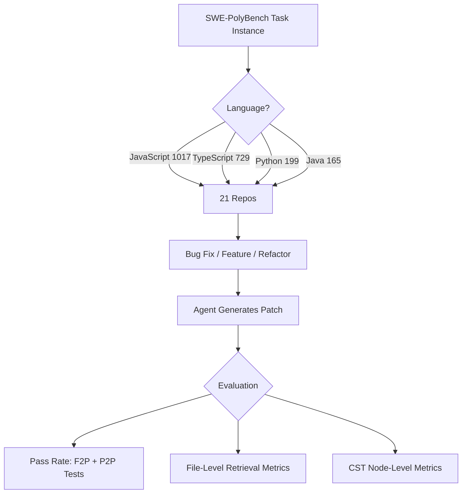
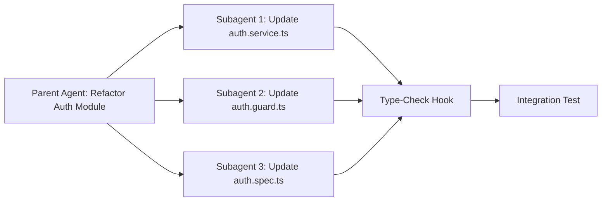

# SWE-PolyBench and the Polyglot Performance Gap: What Multi-Language Benchmarks Reveal About Codex CLI's Real-World Effectiveness


---

Most coding agent benchmarks tell a comforting story: pass rates climbing towards 90%, issue resolution becoming routine, frontier models outperforming junior developers. But that story is told almost entirely in Python. Amazon's SWE-PolyBench strips away the monolingual comfort blanket and asks the question that matters for production teams: how well do agents actually perform across the languages you ship?

The answer, bluntly, is *far worse* — and the gap is not explained by model capability alone. This article examines what SWE-PolyBench measures, where the performance cliffs appear, and what Codex CLI practitioners can do about them.

## The Python Monoculture Problem

SWE-bench Verified, the benchmark that dominates agent leaderboards, draws exclusively from CPython[^1]. When OpenAI reports GPT-5.5 scoring 88.7% on SWE-bench Verified[^2], or when Anthropic reports Claude Opus 4.5 at 79.4%[^3], those numbers describe Python-only performance on a curated subset of predominantly single-file bug fixes.

Real codebases look nothing like this. The 2024 Stack Overflow Developer Survey found JavaScript leading at 62.3%, with TypeScript at 38.5%, Java at 30.3%, and Python at 51.0%[^4]. Most teams ship in at least two of these. SWE-PolyBench exists because the existing benchmark landscape was actively misleading polyglot teams about what agents could deliver.

ByteDance's Multi-SWE-bench (NeurIPS 2025) was the first major attempt to address this, spanning eight languages with 1,632 instances[^5]. SWE-PolyBench, released by Amazon Science in April 2025 and updated through 2026, takes a complementary approach: deeper coverage of the four dominant web and enterprise languages with richer evaluation metrics[^6].

## What SWE-PolyBench Actually Measures

The benchmark comprises 2,110 task instances drawn from 21 open-source repositories across four languages[^6]:

| Language | Instances | Repositories |
|---|---|---|
| JavaScript | 1,017 | — |
| TypeScript | 729 | — |
| Python | 199 | — |
| Java | 165 | — |

Tasks divide into bug fixes (1,572), feature requests (463), and refactoring (62). Crucially, SWE-PolyBench tasks require modifying an average of 2.6 files per instance, versus 1.6 for SWE-bench — 63% more files[^6]. The benchmark also ships two curated subsets: SWE-PolyBench500, a stratified sample of 125 instances per language, and SWE-PolyBench_Verified, a 382-instance subset validated for task solvability[^6].

Beyond raw pass rates, SWE-PolyBench introduces Concrete Syntax Tree (CST) retrieval metrics — precision and recall measured not at file level but at the level of individual syntax tree nodes[^6]. This matters because a file-level metric says "the agent found the right file"; a CST metric says "the agent navigated to the right class, method, or expression within that file". The distinction separates agents that locate code from agents that understand it.



## The Numbers That Matter

Amazon evaluated three open-source agents — Aider-PB, SWE-Agent-PB, and Agentless-PB — all running on Claude 3.5 Sonnet[^6]. The results expose the polyglot performance gap starkly:

| Agent | Python | Java | TypeScript | JavaScript | Overall |
|---|---|---|---|---|---|
| Aider-PB | 24.1% | 16.4% | 13.0% | 10.7% | 14.1% |
| SWE-Agent-PB | 20.1% | 13.3% | 6.5% | 8.3% | 10.2% |
| Agentless-PB | 21.6% | 10.9% | 4.7% | 5.7% | 7.8% |

Python pass rates run 9–16 percentage points higher than the next-best language. JavaScript and TypeScript — the two most widely used languages in professional development — see pass rates collapse to single digits for two of the three agents[^6].

The file retrieval gap is equally telling. SWE-Agent-PB achieves 51.6% file recall in Java but drops sharply in JavaScript and TypeScript[^6]. Aider-PB's efficiency advantage (using only 19–20% of the input tokens consumed by its competitors) suggests that brute-force context loading is not the answer — targeted retrieval is[^6].

### Complexity Versus Performance

Intuitively, you might expect structural complexity to predict difficulty. Java has the highest structural complexity in the dataset: 66.06% mixed node changes per patch, with an average of 9.81 node modifications[^6]. Yet Java outperforms TypeScript on pass rates across all three agents.

This counterintuitive result suggests that the performance gap is driven not by language complexity but by the agent's ability to *navigate* language-specific idioms. Java's explicit type declarations and rigid package structure may paradoxically help agents locate the right code, even when the required changes are structurally complex. TypeScript's structural typing, type narrowing, and module resolution paths create navigation challenges that current agents handle poorly.

Multi-file modifications compound the problem everywhere. Single-file patches achieve roughly 17.7% pass rates with Aider-PB; patches touching three or more files drop below 10%[^6].

## What This Means for Codex CLI Users

Codex CLI on GPT-5.5 is a stronger agent than the Claude 3.5 Sonnet configurations tested in SWE-PolyBench[^2]. ⚠️ No published SWE-PolyBench evaluation exists for Codex CLI specifically, so direct score comparisons are not possible. However, the *pattern* — Python outperforming other languages, multi-file tasks degrading sharply — is structural and model-independent. The Aider Polyglot Leaderboard confirms the same trend with frontier models: Claude Opus 4.5 leads at 89.4% on polyglot editing, but language variance persists[^7].

The practical implication: if your team ships production code in JavaScript, TypeScript, or Java, the headline SWE-bench numbers overstate what your agent will deliver. You need language-aware mitigation strategies.

## Closing the Gap: Language-Aware Codex CLI Configuration

### 1. Per-Directory AGENTS.md for Language Boundaries

Codex CLI discovers `AGENTS.md` files hierarchically, walking from the Git root to the current working directory[^8]. In a polyglot monorepo, exploit this to inject language-specific instructions at the service boundary:

```
repo-root/
├── AGENTS.md                    # Shared conventions
├── services/
│   ├── api-gateway/             # TypeScript
│   │   └── AGENTS.md            # TS-specific rules
│   ├── payment-service/         # Java
│   │   └── AGENTS.md            # Java-specific rules
│   └── analytics/               # Python
│       └── AGENTS.md            # Python-specific rules
```

A TypeScript-specific `AGENTS.md` might include:

```markdown
## TypeScript Service Rules

- Run `npx tsc --noEmit` after every file change to catch type errors immediately
- Use `tsconfig.json` path aliases — never use relative paths deeper than `../`
- When modifying a function signature, always check all call sites using the TypeScript language server
- Prefer `unknown` over `any`; justify every `as` cast with a comment
- Run `npm test -- --changedSince=main` after completing changes
```

### 2. PostToolUse Compilation Hooks

SWE-PolyBench data shows that TypeScript agents fail disproportionately on type-related errors[^6]. A PostToolUse hook that runs the type checker after every file write catches these early:

```toml
# config.toml
[hooks.PostToolUse.typescript_check]
command = "npx tsc --noEmit --pretty 2>&1 | head -20"
match_tools = ["write_file", "apply_patch"]
match_globs = ["**/*.ts", "**/*.tsx"]
on_failure = "report"
```

For Java, the equivalent might invoke `mvn compile -q` or `gradle classes`:

```toml
[hooks.PostToolUse.java_compile]
command = "mvn compile -q 2>&1 | tail -10"
match_tools = ["write_file", "apply_patch"]
match_globs = ["**/*.java"]
on_failure = "report"
```

### 3. Model Selection by Task Complexity

SWE-PolyBench demonstrates that multi-file tasks are where agents collapse. Codex CLI's `review_model` and profile system allow you to route complex cross-file work to a more capable model while keeping routine single-file fixes on a cost-efficient one[^9]:

```toml
# ~/.codex/profiles/polyglot-heavy.toml
model = "gpt-5.5"
model_reasoning_effort = "high"
```

```toml
# ~/.codex/profiles/quick-fix.toml
model = "gpt-5.4-mini"
model_reasoning_effort = "medium"
```

Invoke with `codex --profile polyglot-heavy` for cross-service refactoring, `codex --profile quick-fix` for localised bug fixes.

### 4. LSP Integration for Navigation

The CST retrieval metrics in SWE-PolyBench highlight that *finding the right code* is the bottleneck, not *generating the patch*. Codex CLI's MCP server support enables language server protocol integration, giving the agent compiler-grade navigation for TypeScript (`typescript-language-server`), Java (Eclipse JDT or `jdtls`), and other languages[^10].

Configure a TypeScript language server as an MCP server:

```json
{
  "mcpServers": {
    "typescript-lsp": {
      "command": "npx",
      "args": ["typescript-language-server", "--stdio"]
    }
  }
}
```

This gives the agent access to go-to-definition, find-all-references, and type-checking diagnostics — exactly the retrieval capabilities that SWE-PolyBench's CST metrics reward.

### 5. Subagent Decomposition for Multi-File Tasks

Given that pass rates halve when tasks span three or more files, decompose multi-file work into single-file subagent tasks where possible. Codex CLI's built-in subagent system can parallelise modifications across independent files, with each subagent receiving focused context[^11]:



## The Benchmark Literacy Angle

SWE-PolyBench also exposes methodological limitations worth noting. The benchmark uses LLM-based task classification for bug fix/feature/refactoring labels, acknowledges potential data leakage from publicly available training data, and lacks human verification of solution correctness[^6]. These caveats apply equally to SWE-bench and its derivatives.

The practical takeaway: treat any single benchmark number as a *signal*, not a *specification*. When a vendor reports a headline figure, check the language distribution. If it is Python-only, mentally apply a 40–60% discount for your TypeScript or Java workload, based on the cross-language degradation patterns observed in both SWE-PolyBench and Multi-SWE-bench[^5][^6].

## What Comes Next

The multi-language benchmark space is maturing rapidly. SWE-rebench V2 extends language-agnostic task collection at scale[^12]. The Aider Polyglot Leaderboard provides ongoing tracking of frontier model performance across languages[^7]. Amazon's SWE-PolyBench_Verified subset enables rapid experimentation without the overhead of the full 2,110-instance suite[^6].

For Codex CLI users, the message is clear: the agent is only as good as the language-specific scaffolding you provide. Per-directory `AGENTS.md` files, PostToolUse compilation hooks, LSP-powered navigation, and subagent decomposition are not optimisations — they are prerequisites for polyglot projects.

The Python-centric benchmark era told you agents were nearly solved. SWE-PolyBench tells you they are barely started. Both are correct; they are just measuring different things.

## Citations

[^1]: SWE-bench: Can Language Models Resolve Real-World GitHub Issues? [https://www.swebench.com/](https://www.swebench.com/)
[^2]: OpenAI, "Introducing GPT-5.5" (2026). [https://openai.com/index/introducing-gpt-5-5/](https://openai.com/index/introducing-gpt-5-5/)
[^3]: SWE-bench Verified Leaderboard. [https://llm-stats.com/benchmarks/swe-bench-verified](https://llm-stats.com/benchmarks/swe-bench-verified)
[^4]: Stack Overflow Developer Survey 2024: Most Popular Technologies. [https://survey.stackoverflow.co/2024/technology](https://survey.stackoverflow.co/2024/technology)
[^5]: Multi-SWE-bench: A Multilingual Benchmark for Issue Resolving (NeurIPS 2025). [https://openreview.net/forum?id=MhBZzkz4h9](https://openreview.net/forum?id=MhBZzkz4h9)
[^6]: Avnish et al., "SWE-PolyBench: A multi-language benchmark for repository level evaluation of coding agents" (arXiv:2504.08703). [https://arxiv.org/abs/2504.08703](https://arxiv.org/abs/2504.08703)
[^7]: Aider Polyglot Leaderboard. [https://aider.chat/docs/leaderboards/](https://aider.chat/docs/leaderboards/)
[^8]: OpenAI, "Custom instructions with AGENTS.md". [https://developers.openai.com/codex/guides/agents-md](https://developers.openai.com/codex/guides/agents-md)
[^9]: OpenAI, "Configuration Reference — Codex". [https://developers.openai.com/codex/config-reference](https://developers.openai.com/codex/config-reference)
[^10]: OpenAI, "LSP Integration for Codex CLI" — GitHub issue #14799. [https://github.com/openai/codex/issues/14799](https://github.com/openai/codex/issues/14799)
[^11]: OpenAI, "Subagents — Codex". [https://developers.openai.com/codex/subagents](https://developers.openai.com/codex/subagents)
[^12]: SWE-rebench V2: Language-Agnostic SWE Task Collection at Scale. [https://arxiv.org/abs/2602.23866](https://arxiv.org/abs/2602.23866)
