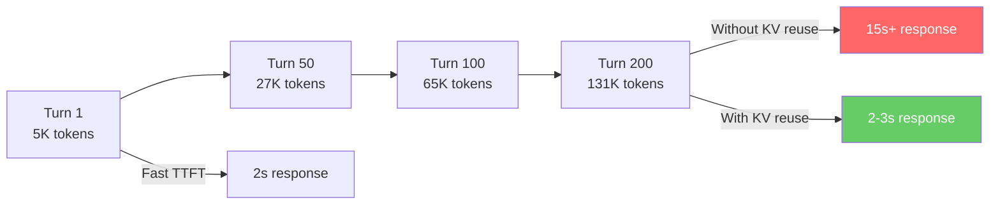
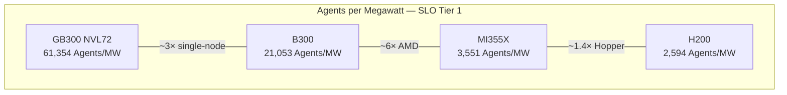
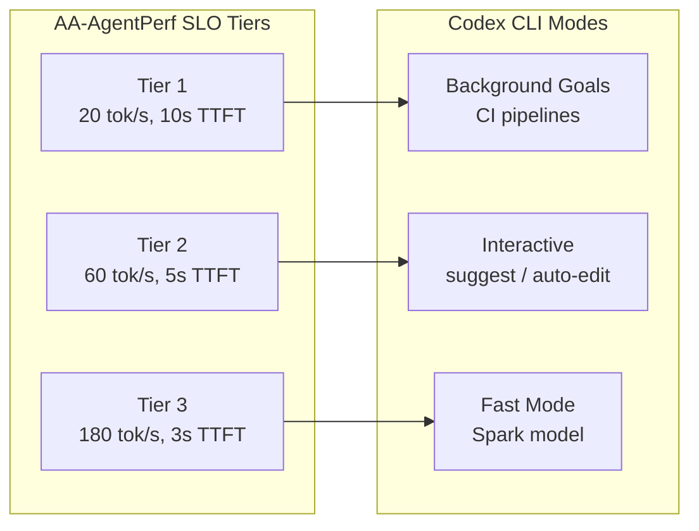

# AA-AgentPerf and the Infrastructure Bottleneck: What the First Agentic Inference Benchmark Means for Codex CLI at Scale


---

Every coding agent benchmark to date measures the same thing: can the model produce the right patch? SWE-bench, Terminal-Bench, KiloBench — all ask whether the agent succeeds. None ask whether the infrastructure behind it can serve a hundred agents simultaneously without collapsing time-to-first-token from two seconds to twenty. AA-AgentPerf, launched on 12 June 2026 by Artificial Analysis, is the first benchmark built to answer that question [^1]. For teams running Codex CLI at scale — whether through OpenAI's API, Azure AI Foundry, Amazon Bedrock, or self-hosted inference with Ollama and vLLM — the results reshape how you think about hardware selection, provider choice, and cost.

## Why Agent Inference Is Different

Traditional LLM benchmarks assume a request-response pattern: one prompt in, one completion out, measure latency, move on. Coding agents do something fundamentally different. A single Codex CLI session in Goal Mode can run for 200 turns [^2], accumulating context that balloons from a few thousand tokens to over 131,000 tokens as tool results, file contents, and reasoning chains pile up [^1]. The output pattern is equally unusual — mostly short tool calls and code edits punctuated by longer reasoning stretches [^1].

This creates three infrastructure challenges that standard benchmarks ignore:

1. **KV cache pressure** — the same prefix returns turn after turn, and serving stacks that cannot reuse cached key-value pairs recompute attention over the entire context every round
2. **Concurrency scaling** — enterprise teams do not run one agent; they run dozens or hundreds simultaneously across CI pipelines, code review automation, and developer workstations
3. **Sustained SLO compliance** — an agent that responds in two seconds on turn one but takes fifteen seconds by turn 150 is functionally broken for long-horizon work



## What AA-AgentPerf Measures

AA-AgentPerf replays authentic coding agent trajectories captured from open-source repositories across twelve or more programming languages [^1]. Rather than synthetic prompts, the benchmark uses real session recordings where agents navigated codebases, called tools, edited files, and iterated — the exact workload profile of a Codex CLI session.

The lead metric is **Agents per Megawatt (Agents/MW)**: the maximum number of concurrent agents a hardware platform can sustain at each service-level objective tier [^1]. Three SLO tiers define acceptable performance for DeepSeek V4 Pro:

| Tier | Output Speed | P95 TTFT | Use Case |
|------|-------------|----------|----------|
| 1 | 20 tokens/s | ≤ 10s | Background CI agents |
| 2 | 60 tokens/s | ≤ 5s | Interactive development |
| 3 | 180 tokens/s | ≤ 3s | Fast mode / pair programming |

The benchmark permits production optimisations — KV cache reuse, speculative decoding, disaggregated prefill/decode — that synthetic benchmarks typically disable [^1]. This is a deliberate design choice: real deployments use these techniques, so benchmarks that forbid them measure the wrong thing.

## The Results: A 20× Generational Leap

The initial results, published on 12 June 2026, reveal stark differences across hardware generations [^3] [^4]:

| Platform | Config | Agents/MW (Tier 1) | Agents/GPU |
|----------|--------|-------------------|------------|
| NVIDIA GB300 NVL72 | Rack-scale, disaggregated | 61,354 | 57.5 |
| NVIDIA B300 | Single node, disaggregated | 21,053 | — |
| AMD MI355X | — | 3,551 | — |
| NVIDIA H200 | — | 2,594 | 1.4 |

The GB300 NVL72 delivers approximately 20× the concurrent agent capacity per megawatt compared to the previous-generation H200 [^4]. The 72-GPU NVLink fabric enables efficient KV cache sharing across the entire rack, which directly addresses the prefix-reuse pattern that coding agents generate [^4].



## What This Means for Codex CLI Teams

### OpenAI API Users: Provider Selection Matters

If you use Codex CLI through the OpenAI API — the default configuration — your inference runs on OpenAI's infrastructure and you have no direct hardware choice. But the benchmark explains *why* OpenAI's pricing and rate limits look the way they do. Agentic workloads consume 5–30× more tokens than standard chat interactions [^5], and a single Codex CLI task can push 400K to 2M cumulative input tokens through the API [^5]. The hardware underneath directly determines what OpenAI can offer at what price point.

Teams hitting rate limits during heavy Goal Mode usage should consider:

- **Rollout token budgets** (shipped in v0.142.0) to prevent runaway token consumption across agent threads [^6]
- **Model routing** via `config.toml` profiles — using GPT-5.3-Codex-Spark at 1,000+ tokens/s for simple edits, reserving GPT-5.5 for complex reasoning [^7]
- **Amazon Bedrock** (GA since 1 June 2026) for reserved capacity pricing that smooths cost spikes [^7]

### Self-Hosted Inference: Hardware Choice Is Strategy

Codex CLI's `--oss` flag and custom provider configuration let you point the CLI at any OpenAI Responses API-compatible endpoint [^8]. For teams running self-hosted inference with vLLM, Ollama, or TGI, AA-AgentPerf's results are directly actionable.

A minimal self-hosted Codex CLI configuration:

```toml
# ~/.codex/config.toml
[providers.internal]
name = "Internal vLLM Cluster"
base_url = "https://inference.internal.example.com/v1"
wire_api = "responses"
env_key = "INTERNAL_API_KEY"

[profiles.self-hosted]
provider = "internal"
model = "deepseek-v4-pro"
approval_mode = "auto-edit"
```

The benchmark data says: if you are provisioning hardware for 50 concurrent Codex CLI agents in CI, the difference between Hopper and Blackwell is not incremental — it is the difference between needing 36 GPUs (H200 at 1.4 agents/GPU) and needing 1 GPU (GB300 at 57.5 agents/GPU) [^4]. ⚠️ Real-world figures will vary with model size, quantisation, and serving stack configuration, but the directional gap is enormous.

### The SLO Tier Map to Codex CLI Modes

AA-AgentPerf's three SLO tiers map cleanly onto Codex CLI's operating modes:



**Tier 1** (20 tokens/s, 10s TTFT) suffices for background Goal Mode tasks and CI pipeline agents where latency is tolerable. **Tier 2** (60 tokens/s, 5s TTFT) matches the interactive `suggest` and `auto-edit` approval modes where developers wait for each response. **Tier 3** (180 tokens/s, 3s TTFT) aligns with Codex CLI's Fast Mode and GPT-5.3-Codex-Spark, where the model sacrifices some reasoning depth for conversational speed [^7].

## The Cost Dimension AA-AgentPerf Exposes

The Agents/MW metric is fundamentally an economics metric. At enterprise scale, inference power consumption dominates operational cost. Current estimates put agentic coding workloads at \$150–\$250 per developer per month for Claude Code, with power users significantly exceeding that band [^5]. Codex CLI's token consumption is comparable.

The 20× efficiency gap between Blackwell and Hopper translates directly to cost per agent-hour. For organisations evaluating whether to run inference internally or consume API credits, AA-AgentPerf provides the first hardware-specific data to inform that calculation rather than relying on API pricing alone.

## What AA-AgentPerf Does Not Cover

The benchmark has deliberate scope limitations worth noting:

- **Model quality is out of scope** — AA-AgentPerf measures throughput and latency, not whether the model produces correct patches. It complements, rather than replaces, SWE-bench and Terminal-Bench [^1].
- **Single model only** — initial results cover DeepSeek V4 Pro exclusively. GPT-oss-120b and additional models are planned for future waves [^1].
- **Context ceiling** — trajectories currently cap at ~131K tokens. Future iterations plan to extend to 1M tokens [^1], which will stress KV cache management further and likely widen the hardware gap.
- **No cost-per-task metric yet** — Agents/MW captures power efficiency but not total cost of ownership including networking, storage, and cooling. Cost-per-task analytics are on the roadmap [^1].

## Practical Takeaways

1. **Benchmark your provider, not just your model.** If your Codex CLI sessions degrade noticeably after turn 50, the bottleneck may be inference infrastructure, not model capability.
2. **Match SLO tier to workflow.** Background CI agents do not need Tier 3 latency. Over-provisioning wastes capacity that could serve more concurrent agents.
3. **Self-hosted teams: plan for the agentic workload profile.** Standard LLM serving benchmarks (single-turn, short-context) will dramatically overestimate how many Codex CLI agents your cluster can handle.
4. **Watch the AA-AgentPerf leaderboard.** As a live benchmark accepting continuous vendor submissions [^1], results will evolve as serving stacks improve and new hardware arrives.

---

## Citations

[^1]: Artificial Analysis, "First results from AA-AgentPerf: the hardware benchmark for the agent era," 12 June 2026. [https://artificialanalysis.ai/articles/aa-agentperf](https://artificialanalysis.ai/articles/aa-agentperf)

[^2]: OpenAI, "Using Goals in Codex," OpenAI Cookbook, 2026. [https://developers.openai.com/cookbook/examples/codex/using_goals_in_codex](https://developers.openai.com/cookbook/examples/codex/using_goals_in_codex)

[^3]: CryptoBriefing, "AA-AgentPerf releases initial results for DeepSeek V4 Pro benchmark, showing NVIDIA Blackwell dominance," June 2026. [https://cryptobriefing.com/aa-agentperf-deepseek-v4-pro-benchmark-results/](https://cryptobriefing.com/aa-agentperf-deepseek-v4-pro-benchmark-results/)

[^4]: NVIDIA, "NVIDIA Achieves Leading Agentic Coding Performance on First Agentic AI Benchmark," NVIDIA Technical Blog, June 2026. [https://developer.nvidia.com/blog/nvidia-achieves-leading-agentic-coding-performance-on-first-agentic-ai-benchmark/](https://developer.nvidia.com/blog/nvidia-achieves-leading-agentic-coding-performance-on-first-agentic-ai-benchmark/)

[^5]: MorphLLM, "AI Coding Costs (2026): Claude vs Codex vs Gemini, Real Monthly Spend From Token Math (\$20 to \$1,000+)," 2026. [https://www.morphllm.com/ai-coding-costs](https://www.morphllm.com/ai-coding-costs)

[^6]: OpenAI, "Changelog — Codex," OpenAI Developers, June 2026. [https://developers.openai.com/codex/changelog](https://developers.openai.com/codex/changelog)

[^7]: Daniel Vaughan, "Codex CLI After the Pro Boost: Rate Limit Reality, Token Economics, and Cost Optimisation for June 2026," Codex Knowledge Base, 2 June 2026. [https://codex.danielvaughan.com/2026/06/02/codex-cli-post-promotion-rate-limits-token-economics-cost-optimisation-june-2026/](https://codex.danielvaughan.com/2026/06/02/codex-cli-post-promotion-rate-limits-token-economics-cost-optimisation-june-2026/)

[^8]: Shashi Jagtap, "Codex CLI: Running GPT-OSS and Local Coding Models with Ollama, LM Studio, and MLX," Superagentic AI / Medium, 2026. [https://medium.com/superagentic-ai/codex-cli-running-gpt-oss-and-local-coding-models-with-ollama-lm-studio-and-mlx-4b796e39404b](https://medium.com/superagentic-ai/codex-cli-running-gpt-oss-and-local-coding-models-with-ollama-lm-studio-and-mlx-4b796e39404b)
