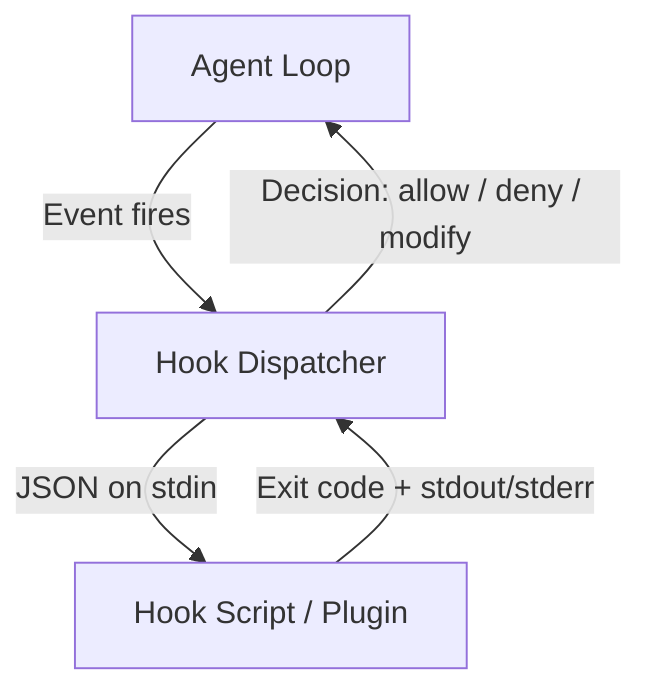
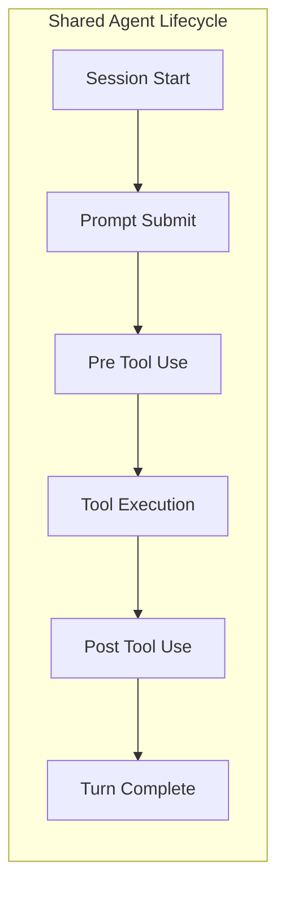
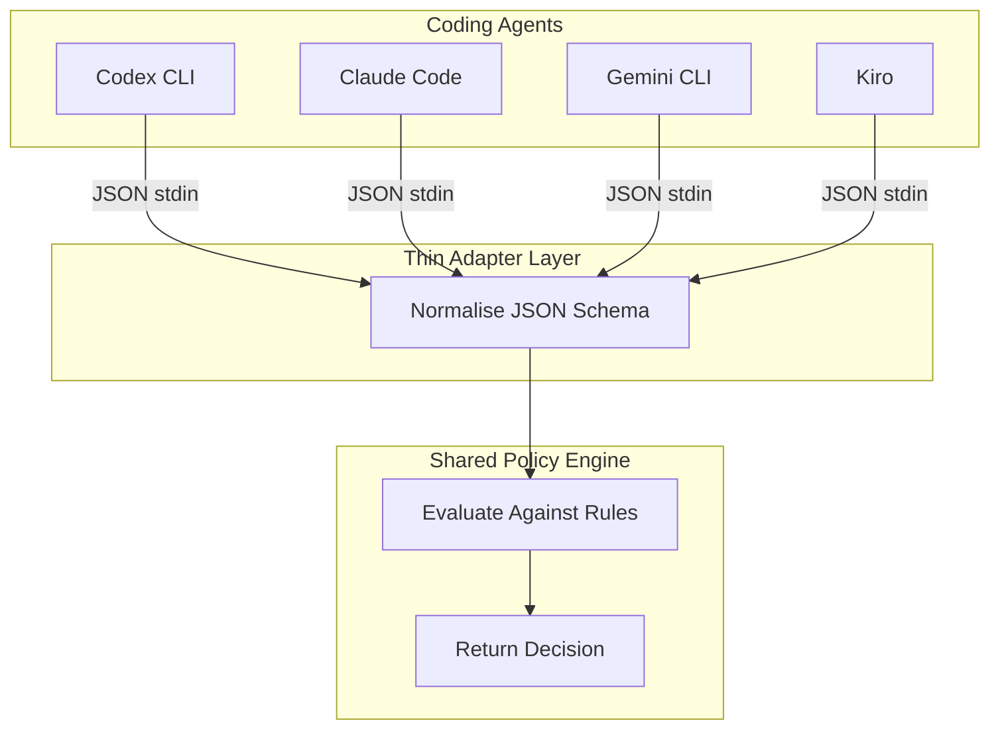

# The Agent Hook Convergence: How Five Coding Agents Arrived at the Same Extensibility Pattern — and What It Means for Portable Governance


---

Every major terminal-native coding agent now ships a hook system. Codex CLI has ten hook events [^1]. Claude Code exposes seven event types plus conditional hooks [^2]. Gemini CLI added hooks in v0.26.0 with `BeforeTool` and `AfterTool` events [^3]. Kiro launched with agent hooks tied to prompt submission, tool invocation, and agent completion [^4]. OpenCode takes a different surface — TypeScript plugin modules — but wires into the same lifecycle points via `tool.execute.before` and `tool.execute.after` handlers [^5].

The convergence is not coordinated. No standard body mandated it. Yet the five harnesses independently arrived at nearly identical architectural primitives: a JSON-on-stdin protocol, exit-code-based flow control, and a shared set of lifecycle interception points that map onto one another with remarkable precision. This article examines where the hook surfaces align, where they diverge, and what the convergence means for teams that need portable agent governance across multiple tools.

## The Shared Architecture Pattern

Strip away the configuration syntax and every hook system follows the same three-layer design:



**Layer 1 — Event emission.** The agent loop emits a structured event at a defined lifecycle point (before tool use, after tool use, session start, prompt submission).

**Layer 2 — Dispatch.** The harness serialises context to JSON on stdin, invokes the hook process, and waits for it to complete synchronously.

**Layer 3 — Decision.** The hook returns a decision via exit code (0 = allow, 2 = deny/block in most implementations) and optional JSON on stdout that can modify inputs, inject context, or override permission decisions.

### Exit Code Semantics

The exit code convention has converged almost exactly:

| Exit Code | Codex CLI [^1] | Claude Code [^2] | Gemini CLI [^3] | Kiro CLI [^4] |
|-----------|----------------|-------------------|-----------------|---------------|
| 0 | Allow / success | Allow / success | Allow / success | Allow / success |
| 2 | Deny / block | — (uses JSON) | — | Block (PreToolUse) |
| Non-zero | Error / warning | Error / warning | Error / warning | Error / warning |

Claude Code diverges slightly: it relies on JSON output fields rather than exit code 2 for blocking decisions, though its command hooks do interpret non-zero exits as failures [^2]. Codex CLI and Kiro share the exit-code-2-means-deny convention most precisely [^1][^4].

## Mapping the Hook Surfaces

The five agents expose different numbers of events, but the core lifecycle points map cleanly onto one another:



### Event Mapping Table

| Lifecycle Point | Codex CLI | Claude Code | Gemini CLI | Kiro | OpenCode |
|----------------|-----------|-------------|------------|------|----------|
| Session start | `SessionStart` | `PreSession` | `BeforeAgent` | — | `session.start` |
| Prompt submit | `UserPromptSubmit` | `Notification` | — | `UserPromptSubmit` | — |
| Pre-tool use | `PreToolUse` | `PreToolUse` | `BeforeTool` | `PreToolUse` | `tool.execute.before` |
| Post-tool use | `PostToolUse` | `PostToolUse` | `AfterTool` | `PostToolUse` | `tool.execute.after` |
| Permission request | `PermissionRequest` | — | — | — | — |
| Pre-compaction | `PreCompact` | — | — | — | — |
| Post-compaction | `PostCompact` | `PostCompaction` | — | — | — |
| Subagent start | `SubagentStart` | — | — | — | — |
| Subagent stop | `SubagentStop` | — | — | — | — |
| Turn complete | `Stop` | `PostResponse` | `AfterAgent` | `AgentComplete` | `response.complete` |

The universal pair is **PreToolUse / PostToolUse** — every agent implements it [^1][^2][^3][^4][^5]. This is the minimum viable governance surface: intercept what the agent is about to do, and inspect what it actually did.

## Configuration Surface Comparison

The configuration approaches split into two camps:

### Declarative JSON/TOML (Codex CLI, Claude Code, Gemini CLI, Kiro)

Codex CLI uses either `hooks.json` or TOML sections in `config.toml` [^1]:

```toml
[[hooks.PreToolUse]]
matcher = "^Bash$"

[[hooks.PreToolUse.hooks]]
type = "command"
command = "/usr/local/bin/check-command-safety.sh"
timeout = 30
```

Claude Code stores hooks in `.claude/settings.json` [^2]:

```json
{
  "hooks": {
    "PreToolUse": [
      {
        "matcher": "Bash",
        "hooks": [
          {
            "type": "command",
            "command": "./hooks/validate-bash.sh"
          }
        ]
      }
    ]
  }
}
```

Kiro places hook definitions in `.kiro/hooks/` as JSON files with trigger, matcher, and action fields [^4]. Gemini CLI follows a similar JSON configuration under `.gemini/hooks/` [^3].

### Programmatic Plugins (OpenCode)

OpenCode uses TypeScript modules in `.opencode/plugins/` [^5]:

```typescript
import type { Plugin } from "@opencode-ai/plugin";

export default function myPlugin(): Plugin {
  return {
    name: "safety-gate",
    hooks: {
      "tool.execute.before": async (input, output) => {
        if (input.tool === "bash" && input.args.includes("rm -rf")) {
          return { blocked: true, reason: "Destructive command blocked" };
        }
      }
    }
  };
}
```

The programmatic approach offers more flexibility but sacrifices the declarative portability that makes the JSON-based hooks easy to audit, version-control, and share across teams.

## The Portable Governance Opportunity

The convergence creates a practical opportunity for enterprise teams: **write your governance logic once and deploy it across multiple agents.** The PreToolUse / PostToolUse pair shares enough structural similarity that a single validation script can serve as a hook for Codex CLI, Claude Code, Gemini CLI, and Kiro with a thin adapter layer.

### What a Portable Hook Looks Like

A governance hook that blocks dangerous shell commands needs to:

1. Read JSON from stdin containing `tool_name` and `tool_input`
2. Evaluate the command against a policy (allow-list, deny-list, regex patterns)
3. Return exit code 0 (allow) or exit code 2 (deny) with a reason on stderr

The JSON schema differs slightly between agents — Codex CLI uses `tool_name` and `tool_input` [^1], Claude Code uses `tool_name` and `input` [^2], Gemini CLI uses `toolName` and `toolInput` [^3] — but the structural delta is small enough that a normalisation function of fewer than twenty lines bridges all four.



Endor Labs demonstrated this pattern in June 2026 with their agent governance product, which uses PreToolUse hooks to evaluate every MCP call against organisational policies across multiple coding agents [^6]. Their approach layers server-side policy management on top of the hook surface so security teams can update rules once for all developers.

## Where the Convergence Breaks Down

### Trust and Provenance

Codex CLI has the most mature trust model: hooks are hashed, non-managed hooks require explicit review before execution, and managed hooks (system-level, MDM-deployed, or via `requirements.toml`) are auto-trusted [^1]. Claude Code trusts project-level hooks if the project is trusted. Gemini CLI and Kiro have simpler trust models without hash-based verification. OpenCode trusts all installed plugins.

For enterprise deployments, Codex CLI's trust chain — system hooks at `/etc/codex/` overriding project hooks, with hash-based change detection — remains the most governance-friendly [^1].

### Hook Scope and Depth

Codex CLI uniquely exposes `SubagentStart`, `SubagentStop`, `PreCompact`, and `PostCompact` events [^1]. These matter for multi-agent workflows where a parent agent delegates to child agents. Without subagent hooks, governance policies apply only to the root agent, leaving delegated work ungoverned.

Claude Code compensates with `PostCompaction` hooks that re-inject agent identity after context compression [^2], addressing a different failure mode: governance context being lost during long sessions.

### Prompt-Based and Agent-Based Hooks

Claude Code introduced a second tier beyond command hooks: **prompt-based hooks** that use a Claude model to evaluate conditions, and **agent-based hooks** that spawn a subagent for complex decisions [^2]. Neither Codex CLI, Gemini CLI, Kiro, nor OpenCode offer this capability today.

Codex CLI parses `type: "prompt"` and `type: "agent"` in its hook configuration but does not execute them — the fields are reserved for future use [^1]. This suggests OpenAI intends to close the gap.

## The Missing Standard

The MCP 2026 roadmap emphasises audit logging, policy enforcement, and compliance hooks for enterprise adoption [^7]. But MCP addresses tool *invocation* — the communication between agent and tool server — not the agent loop lifecycle where hooks operate.

What the ecosystem lacks is a **Hook Interoperability Protocol**: a shared schema for hook events, a standard JSON envelope for tool-use context, and agreed exit-code semantics. The convergence has produced *de facto* alignment, but without a formal specification, each agent's hook surface drifts independently.

The closest proposal comes from the agent interoperability discussion around MCP, A2A, and ACP [^8], but none of these protocols address the hook layer. Hooks sit *above* the tool protocol and *below* the orchestration protocol — in a gap that no current standard covers.

## Practical Recommendations

**For teams using a single agent:** invest in hooks now. The PreToolUse/PostToolUse pair is stable across all five agents and is the highest-leverage governance surface available.

**For teams using multiple agents:** build a thin adapter that normalises hook JSON schemas across Codex CLI, Claude Code, Gemini CLI, and Kiro. Target the four universal fields: event name, tool name, tool input, and working directory.

**For enterprise security teams:** Codex CLI's managed hooks with hash-based trust and system-level override paths offer the strongest governance primitive today [^1]. Pair them with MCP tool allowlisting and `requirements.toml` policies for defence in depth.

**For Codex CLI users specifically:** the ten-event hook surface (SessionStart through Stop) is the broadest available. Use SubagentStart/SubagentStop hooks to extend governance to delegated work — a capability no other agent currently matches.

```toml
# Codex CLI: governance hooks for the full agent lifecycle
[[hooks.PreToolUse]]
matcher = ".*"

[[hooks.PreToolUse.hooks]]
type = "command"
command = "/usr/local/bin/governance-gate.sh"
timeout = 10

[[hooks.SubagentStart]]
matcher = ".*"

[[hooks.SubagentStart.hooks]]
type = "command"
command = "/usr/local/bin/subagent-policy-check.sh"
timeout = 10
```

## Conclusion

The agent hook convergence is the clearest signal yet that coding agent architecture has stabilised around a shared set of lifecycle primitives. Five independently developed harnesses arrived at JSON-on-stdin dispatch, exit-code flow control, and PreToolUse/PostToolUse interception — not because a standard demanded it, but because the engineering constraints of governing an autonomous agent loop admit few viable designs.

The gap is not in the hooks themselves but in the interoperability layer above them. Until a formal Hook Interoperability Protocol emerges — or MCP extends to cover the agent lifecycle — teams writing portable governance will bridge the delta with adapter scripts. The good news: that delta is small and shrinking.

## Citations

[^1]: OpenAI, "Hooks — Codex CLI," OpenAI Developers, June 2026. [https://developers.openai.com/codex/hooks](https://developers.openai.com/codex/hooks)

[^2]: Anthropic, "Automate actions with hooks — Claude Code," Claude Code Documentation, June 2026. [https://code.claude.com/docs/en/hooks-guide](https://code.claude.com/docs/en/hooks-guide)

[^3]: Google, "Hooks — Gemini CLI," Gemini CLI Documentation, 2026. [https://geminicli.com/docs/hooks/](https://geminicli.com/docs/hooks/)

[^4]: AWS, "Hooks — Kiro," Kiro Documentation, June 2026. [https://kiro.dev/docs/hooks/](https://kiro.dev/docs/hooks/)

[^5]: SST, "Plugins — OpenCode," OpenCode Documentation, 2026. [https://opencode.ai/docs/plugins/](https://opencode.ai/docs/plugins/)

[^6]: Endor Labs, "Introducing Agent Governance: Using Hooks to Bring Visibility to AI Coding Agents," Endor Labs Blog, June 2026. [https://www.endorlabs.com/learn/introducing-agent-governance-using-hooks-to-bring-visibility-to-ai-coding-agents](https://www.endorlabs.com/learn/introducing-agent-governance-using-hooks-to-bring-visibility-to-ai-coding-agents)

[^7]: Model Context Protocol, "The 2026 MCP Roadmap," MCP Blog, 2026. [https://blog.modelcontextprotocol.io/posts/2026-mcp-roadmap/](https://blog.modelcontextprotocol.io/posts/2026-mcp-roadmap/)

[^8]: Zylos Research, "Agent Interoperability Protocols 2026: MCP, A2A, ACP and the Path to Convergence," March 2026. [https://zylos.ai/research/2026-03-26-agent-interoperability-protocols-mcp-a2a-acp-convergence/](https://zylos.ai/research/2026-03-26-agent-interoperability-protocols-mcp-a2a-acp-convergence/)
