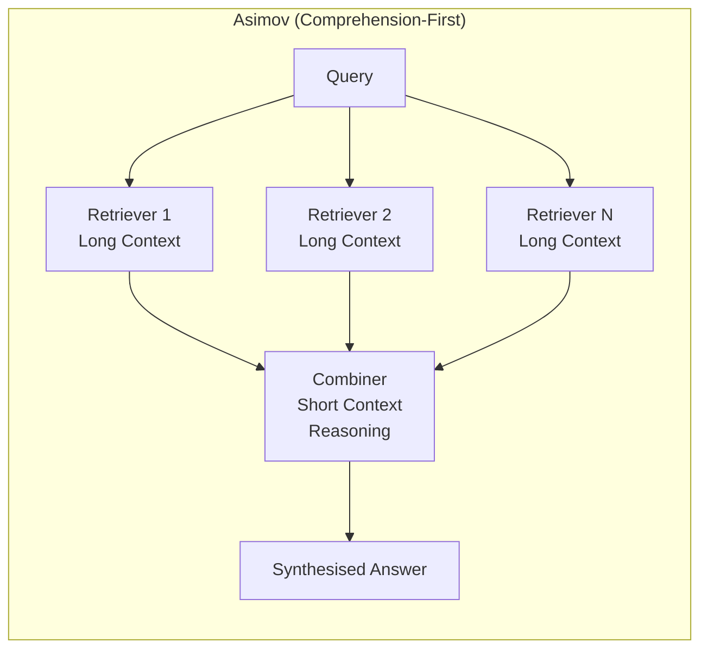
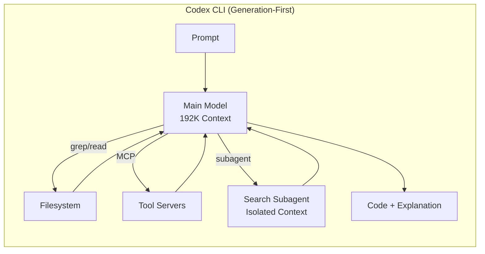
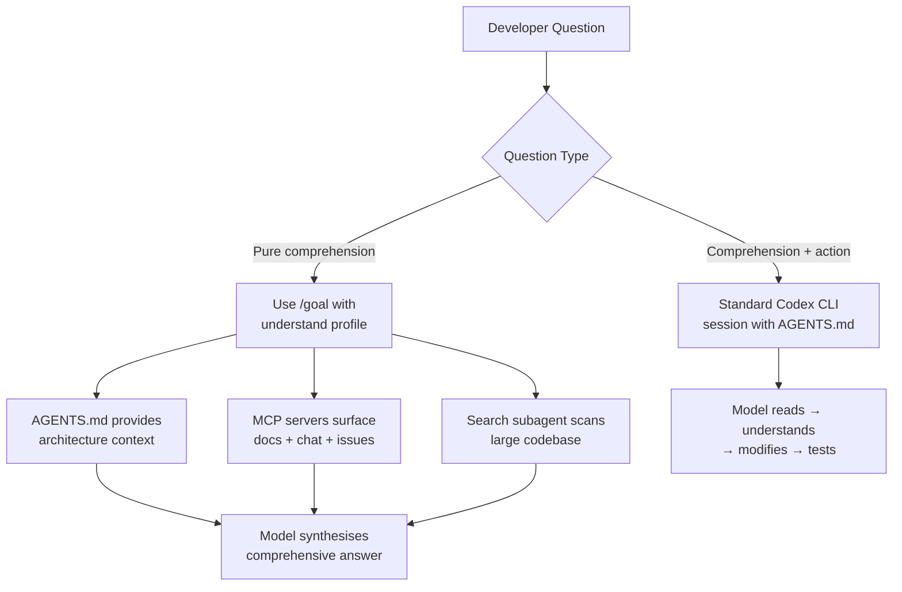

# Asimov and the Comprehension-First Agent: What Reflection AI's Retriever-Combiner Architecture Reveals About Code Understanding — and How Codex CLI Approaches the Same Problem Differently


---

Engineers spend roughly 70 per cent of their working time understanding existing systems, debugging, and collaborating — and only about 10 per cent actually writing new code[^1]. Yet until recently, every major coding agent optimised almost exclusively for that 10 per cent. Reflection AI's Asimov, launched in July 2025 and still in early access as of June 2026, takes the opposite bet: comprehension first, generation second[^2]. Its retriever-combiner multi-agent architecture is architecturally distinct from anything Codex CLI, Claude Code, or Cursor currently ship.

This article dissects Asimov's architecture, compares it to Codex CLI's approach to codebase understanding, and identifies the practical lessons for teams configuring their own comprehension workflows today.

## The Problem Both Tools Address

Large codebases are hostile to single-pass reasoning. A 50,000-file monorepo cannot fit in any model's context window. The question is how to bridge the gap between what the model can hold and what the developer needs understood.

Codex CLI and Asimov answer this question with fundamentally different architectures:





## Asimov's Retriever-Combiner Architecture

Asimov's design separates retrieval from reasoning into distinct agent roles[^3]:

**Retrievers**: Multiple small, long-context agents that independently scan different data sources — code files, architecture documentation, GitHub discussions, chat histories, and project management tools[^4]. Each retriever operates in its own context window, allowing the system to process far more material than any single model could hold.

**Combiner**: A single large, short-context reasoning agent that synthesises the retrievers' findings into a coherent answer[^3]. By keeping the combiner's context short, Asimov concentrates reasoning capacity on the distilled signal rather than raw source material.

This separation has a specific advantage: the retrievers can be specialised and parallelised. One retriever might scan the Go module graph whilst another reads the last month of Slack discussions about a migration. The combiner never sees the raw noise — only the relevant extracts.

### Persistent Memory and Tribal Knowledge

Asimov introduces a "Memories" system where senior engineers can annotate the knowledge graph with commands like `@asimov remember X works in Y way`[^4]. These memories persist across sessions and include role-based access control (RBAC), so architecture decisions recorded by a staff engineer remain visible to the team without being editable by junior contributors.

This addresses a genuine gap. Most coding agents treat every session as stateless or, at best, carry forward a compacted summary. Asimov treats institutional knowledge as a first-class, persistent, access-controlled data layer.

### Performance Claims

In blind testing with maintainers of major open-source projects, Asimov's answers to complex comprehension questions were preferred 60–80 per cent of the time over Cursor Ask and Claude Code (Sonnet 3.7 and 4)[^2]. ⚠️ These are vendor-reported figures from controlled evaluations; no independent replication has been published.

### Current Limitations

As of June 2026, Asimov remains in early access with selective team onboarding[^5]. The waitlist has been active since July 2025 and general availability has not been announced. Asimov currently uses third-party models rather than Reflection AI's own, though the company states it is "actively training our own models to improve Asimov's performance"[^2]. Reflection AI's \$25 billion valuation and SpaceX computing partnership suggest significant infrastructure investment[^6], but the product itself remains pre-GA.

## How Codex CLI Approaches Code Comprehension

Codex CLI takes a generation-first architecture — the same model that writes code also reads it — but has accumulated a substantial set of comprehension-oriented features across its 2026 releases.

### Single-Model Agentic Loop with Tool Use

Rather than separating retrieval into dedicated agents, Codex CLI gives its main model (GPT-5.5 at the frontier, GPT-5.4 as default) direct access to filesystem tools — `grep`, `read`, `glob` — within a 192,000-token context window[^7]. The model decides what to read, when to read it, and how much context to retain.

This creates a different trade-off from Asimov's architecture:

| Dimension | Asimov | Codex CLI |
|-----------|--------|-----------|
| Retrieval | Dedicated parallel retriever agents | Main model drives search tools |
| Reasoning context | Short, distilled | Full 192K, shared with code |
| Data sources | Code + docs + chat + PM tools | Code + AGENTS.md + MCP servers |
| Persistent memory | First-class Memories with RBAC | AGENTS.md + session history |
| Code generation | Secondary capability | Primary capability |
| Availability | Early access (waitlist) | GA, 4M+ weekly users[^8] |

### AGENTS.md as Static Comprehension Context

Codex CLI's `AGENTS.md` system serves a similar function to Asimov's Memories, albeit without RBAC or dynamic annotation[^9]. Teams place project-level instructions, architectural decisions, and coding conventions in `AGENTS.md` files at the repository root or in subdirectories:

```markdown
# AGENTS.md

## Architecture
This monorepo uses a hexagonal architecture. Domain logic lives in
`internal/domain/`. Ports are interfaces in `internal/ports/`. Adapters
(HTTP, gRPC, Postgres) live in `internal/adapters/`.

## Testing Conventions
- Unit tests use table-driven patterns with `testify/assert`
- Integration tests require `// +build integration` tag
- Never mock the domain layer; test through ports

## Dependencies
The `auth` package uses PASETO v4 tokens. Do NOT suggest JWT migration.
```

Every Codex CLI session automatically loads the relevant `AGENTS.md` files, giving the model architectural context without consuming retrieval turns[^9]. Per-directory `AGENTS.md` files let teams encode different conventions for different parts of a monorepo — the frontend team's React patterns need not pollute the backend team's Go conventions.

### Search Subagents for Large Codebases

For repositories too large for the main model to search efficiently, Codex CLI supports search subagents that run in isolated context windows[^10]. The WarpGrep pattern — a reinforcement-learning-trained search subagent — returns only the `file:line-range` spans the main model needs, preventing search noise from consuming the reasoning budget.

Since v0.142.2 (25 June 2026), MCP tool search is enabled by default when servers support it[^11]. This uses BM25 ranking over `ToolSearchEntry.search_text` with exact-name match prepending, allowing the agent to discover relevant tools from large MCP server catalogues without loading every tool definition into context.

### MCP as an Extensible Comprehension Layer

Where Asimov ingests Slack, email, and project management data natively, Codex CLI achieves similar reach through MCP (Model Context Protocol) servers[^12]. Teams can connect:

- **Documentation servers** that index internal wikis and architecture decision records
- **Issue tracker servers** that surface relevant Jira or Linear tickets
- **Communication servers** that query Slack channel history

The difference is configuration overhead: Asimov integrates these sources as first-party features, whilst Codex CLI requires teams to deploy and configure MCP servers. The trade-off is flexibility — Codex CLI's MCP approach works with any data source that someone writes a server for, rather than being limited to Asimov's supported integrations.

### Context Compaction for Long Sessions

Codex CLI's `/compact` command and automatic compaction manage the comprehension-generation tension within long sessions[^13]. When context approaches the window limit, compaction summarises earlier turns whilst preserving the most recent code state. This allows multi-hour debugging sessions where the model builds understanding incrementally — reading code, forming hypotheses, running tests, refining — without losing the thread.

## Architectural Lessons for Practitioners

### When Comprehension-First Wins

Asimov's architecture is strongest in scenarios where:

1. **The question spans multiple data sources** — understanding why a service fails requires correlating code changes, infrastructure modifications, and team communications
2. **The codebase is too large for any single context window** — the parallel retriever approach scales horizontally
3. **Institutional knowledge matters more than code changes** — knowing *why* a decision was made, not just *what* the code does

### When Generation-First Wins

Codex CLI's architecture is strongest when:

1. **The task requires both understanding and modification** — reading code to understand it, then editing it, in a single agentic loop
2. **Tool use is central** — running tests, checking compiler output, executing scripts as part of the comprehension process
3. **The team needs production-ready output** — Codex CLI's sandbox, approval policies, and PostToolUse hooks provide governance that pure comprehension tools lack

### Building Comprehension Workflows in Codex CLI Today

Teams wanting Asimov-style comprehension from Codex CLI can approximate the retriever-combiner pattern using existing features:

```toml
# config.toml — comprehension-optimised profile
[profiles.understand]
model = "gpt-5.5"
approval_policy = "unless-allow-listed"
personality = "pragmatic"

[profiles.understand.agents]
search_model = "gpt-5.4-mini"
```

Combined with a comprehensive `AGENTS.md` that encodes architectural decisions, and MCP servers that surface documentation and communication history, this configuration gives Codex CLI many of the comprehension advantages Asimov promises — whilst retaining the ability to act on that understanding immediately.



## The Convergence Ahead

The distinction between comprehension-first and generation-first agents is likely temporary. Asimov is "actively training" its own models[^2], which will presumably add stronger code generation. Codex CLI's subagent architecture already supports dedicated retrieval agents, and the MCP ecosystem continues to add data source integrations.

The real question is whether the retriever-combiner separation — dedicating specialised agents to retrieval and a separate agent to reasoning — produces measurably better comprehension than a single powerful model with good tools. Asimov's 60–80 per cent preference rate over Claude Code suggests it might, but those results come from a vendor in early access, not an independent benchmark.

For teams working today, the practical approach is clear: invest in `AGENTS.md` as your institutional memory layer, connect MCP servers to your documentation and communication tools, and use search subagents for large codebases. Whether those features live inside Codex CLI, Asimov, or both, the underlying principle is the same — comprehension is the bottleneck, and the tools that solve it will define the next phase of AI-assisted development.

## Citations

[^1]: Asimov product positioning citing industry research on engineering time allocation. [DevOps.com — Beyond Code Generation: How Asimov is Transforming Engineering Team Collaboration](https://devops.com/beyond-code-generation-how-asimov-is-transforming-engineering-team-collaboration/)

[^2]: Sequoia Capital coverage of Reflection AI Asimov launch and architecture. [Sequoia Capital — Reflection AI Launches Asimov Code Comprehension Agent](https://sequoiacap.com/article/reflection-ai-asimov/)

[^3]: Asimov retriever-combiner multi-agent architecture description. [The Decoder — Reflection unveils Asimov: an AI agent built to track every step of software development](https://the-decoder.com/reflection-unveils-asimov-an-ai-agent-built-to-track-every-step-of-software-development/)

[^4]: Asimov data source integration and Memories feature. [DevOps.com — Beyond Code Generation](https://devops.com/beyond-code-generation-how-asimov-is-transforming-engineering-team-collaboration/)

[^5]: Asimov availability status as of June 2026. [Turing Post — Inside Reflection AI: The \$20B Open-Model Startup That Has Yet to Ship](https://www.turingpost.com/p/reflectionai)

[^6]: Reflection AI SpaceX computing partnership and valuation. [Startup Fortune — SpaceX lands a \$6.3 billion computing deal with Reflection AI](https://startupfortune.com/spacex-lands-a-63-billion-computing-deal-with-reflection-ai-and-is-quietly-becoming-the-infrastructure-backbone-of-frontier-ai/)

[^7]: Codex CLI context window and tool use architecture. [OpenAI Developers — CLI Features](https://developers.openai.com/codex/cli/features)

[^8]: Codex CLI weekly active user count. [OpenAI — Gartner 2026 Agentic Coding Leader](https://openai.com/index/gartner-2026-agentic-coding-leader/)

[^9]: Codex CLI AGENTS.md custom instructions. [OpenAI Developers — Custom instructions with AGENTS.md](https://developers.openai.com/codex/guides/agents-md)

[^10]: Codex CLI search subagent and WarpGrep pattern. [Codex Knowledge Base — Context Compaction Deep Dive](https://codex.danielvaughan.com/2026/04/14/context-compaction-deep-dive-codex-cli-claude-code-opencode/)

[^11]: Codex CLI v0.142.2 MCP tool search by default. [GitHub — openai/codex Releases](https://github.com/openai/codex/releases)

[^12]: Codex CLI MCP server integration. [OpenAI Developers — CLI](https://developers.openai.com/codex/cli)

[^13]: Codex CLI context compaction architecture. [Codex Knowledge Base — Context Compaction Architecture](https://codex.danielvaughan.com/2026/03/31/codex-cli-context-compaction-architecture/)
