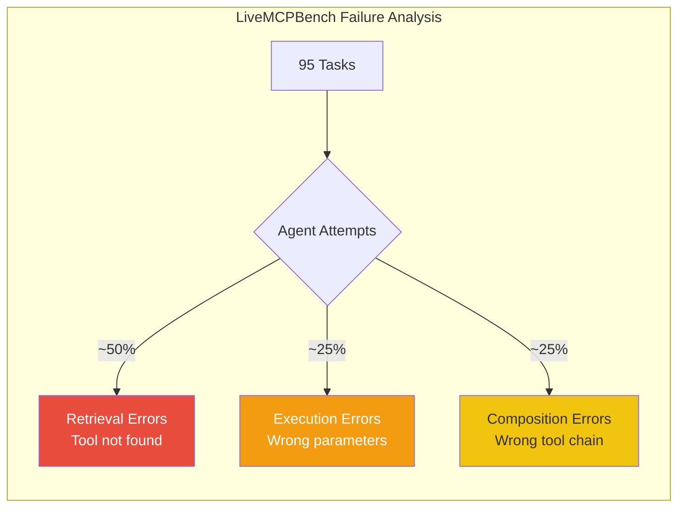
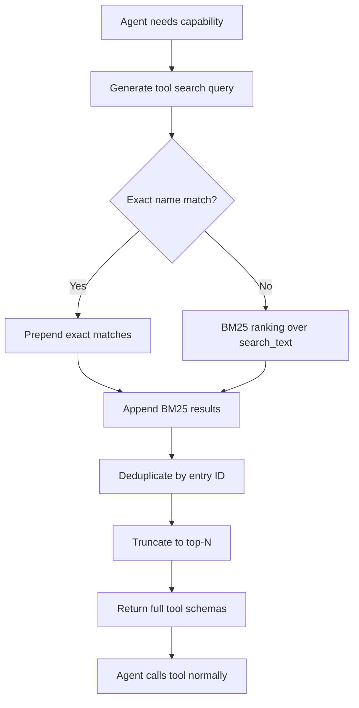

# MCP Tool Search by Default: How Codex CLI Tackles the Retrieval Bottleneck That Defeats Most Coding Agents


---

The Model Context Protocol ecosystem has crossed a scale threshold that breaks naive tool integration. With registries listing thousands of MCP servers and individual workflows routinely spanning a dozen or more, the question is no longer *can your agent call tools* but *can it find the right ones without drowning in schema tokens*. Codex CLI v0.142.2, released today (25 June 2026), answers by making MCP tool search the default behaviour whenever servers advertise the capability [^1]. This article examines what the research says about the tool retrieval problem, how Codex CLI's BM25-based search mechanism works under the hood, and how the approach compares to the academic alternatives emerging from the same problem space.

## The Retrieval Bottleneck: What LiveMCPBench Reveals

LiveMCPBench (Mo et al., revised February 2026) is the first comprehensive benchmark designed to evaluate LLM agents in realistic, tool-rich MCP environments [^2]. The numbers are sobering:

- **95 real-world tasks** across six domains (Office, Lifestyle, Leisure, Finance, Travel, Shopping) grounded in **70 MCP servers exposing 527 tools** [^2]
- Claude Sonnet 4 led at 78.95% task success; most models managed only 30–50% [^2]
- **Retrieval errors accounted for nearly half of all failures** — agents simply could not find the right tools from the 527-tool collection [^2]
- Top performers averaged **2.71–3.4 tools per task**, whilst weaker models used approximately 1, revealing a critical inability to compose multi-tool workflows [^2]

The benchmark's MCP Copilot Agent routes tools using a weighted combination of server description similarity and tool description similarity [^2]. Even with this purpose-built retrieval layer, the dominant failure mode was not execution errors or hallucinated parameters — it was tools never being surfaced in the first place.



## The Context Window Tax

The root cause is architectural. Traditional MCP integration injects every tool's JSON schema into the prompt at session start. The GitHub MCP server alone consumes over 4,600 tokens for 26 tools [^3]. Scale that to a professional workflow with a dozen servers and you are burning tens of thousands of tokens before the agent reads a single line of your code.

OpenAI, Anthropic, and Google all enforce API limits preventing integration of more than 128 tools simultaneously [^4]. Even within those limits, context consumed by tool schemas is context unavailable for reasoning about code.

## How Codex CLI's Tool Search Works

Codex CLI addresses this with a deferred tool loading architecture. Rather than injecting all MCP tool schemas at session start, it loads a lightweight search index and fetches full definitions on demand [^5].

### The BM25 Ranking Engine

The implementation lives in `codex-rs/core/src/tools/handlers/tool_search.rs`. When an agent needs a tool, the handler:

1. Receives a natural-language query describing the required capability
2. Ranks all deferred tools using **BM25** over `ToolSearchEntry.search_text`, which includes tool names, descriptions, and parameter metadata [^5]
3. Returns the top-N matches with full schemas, making them callable
4. The agent proceeds with the retrieved tools as though they had been loaded from the start

```toml
# config.toml — MCP server with tool search enabled
[mcp_servers.github]
command = "npx"
args = ["-y", "@modelcontextprotocol/server-github"]

# Tools are deferred by default in v0.142.2 when
# the server advertises tool_search capability
```

### Deferred vs Disabled: A Critical Distinction

Codex CLI distinguishes between **deferred** and **disabled** tools [^5]:

- **Deferred**: Still discoverable and callable via tool search. The schema is not loaded into context until needed.
- **Disabled**: Completely removed. The agent cannot find or call the tool under any circumstances.

This distinction matters. Use `disabled_tools` to permanently exclude tools the agent should never touch. Use deferral (the default with tool search) for tools that are legitimate but infrequently needed.

### The Exact-Name Match Fix

A known issue (GitHub #21503) identified that BM25 ranking could fail to return tools even when queried by exact name [^5]. When multiple deferred tools with overlapping descriptions competed for top-N slots, exact-name matches were sometimes excluded. The fix prepends normalised exact-name matches (canonical names, callable names, raw MCP tool names) before BM25 results, deduplicates by entry ID, and truncates to the requested limit [^5].



## Activation: When Does Tool Search Engage?

Tool search activates automatically when MCP tool descriptions would consume more than 10% of the available context window [^6]. In practice, this means:

- A single server with fewer than 20 simple tools: schemas loaded directly
- Multiple servers or a server with 50+ tools: tool search kicks in, deferring schemas

In v0.142.2, MCP tools employ tool search **by default** when the server supports it [^1]. This eliminates the need for manual configuration — the system adapts to the tool landscape automatically.

## Academic Alternatives: ScaleMCP and MCP-Zero

Codex CLI's approach is not the only solution to the tool retrieval problem. Two recent papers propose complementary architectures.

### MCP-Zero: Active Tool Discovery

MCP-Zero (arXiv:2506.01056) restores tool discovery autonomy to the agent itself [^3]. Instead of pre-loading schemas or relying on external retrieval, the agent generates structured requests specifying `server` (platform domain) and `tool` (operation type) fields when it identifies a capability gap.

Key results:
- **98% token reduction** on APIBank whilst maintaining accuracy [^3]
- **60–98% prompt length reduction** across evaluation settings [^3]
- Accuracy drops only 3% in multi-turn conversations versus 30–40% for static injection when tool pools expand 40× [^3]

### ScaleMCP: Retrieval-Augmented Tool Selection

ScaleMCP (arXiv:2505.06416) gives agents an `MCP Retrieval Tool` — a dedicated function for searching relevant servers by keyword [^4]. The system auto-synchronises with MCP servers using SHA-256 hashes of tool definitions, detecting changes without manual intervention.

Evaluated against **5,000 MCP servers** and **140,000 query instances**, GPT-o3 achieved 94.4% accuracy with vector search plus Cohere reranking [^4]. The paper also introduces Tool Document Weighted Average (TDWA), selectively weighting tool name, description, parameters, and synthetic questions rather than simple concatenation [^4].

### Comparison

| Approach | Retrieval Method | Token Overhead | Scale Tested | Codex CLI Alignment |
|---|---|---|---|---|
| Codex CLI tool_search | BM25 over search_text | ~90–95% reduction [^6] | Production workloads | — |
| MCP-Zero | Agent-generated structured requests | 98% reduction [^3] | 308 servers, 2,797 tools [^3] | Complementary |
| ScaleMCP | Dedicated retrieval tool + reranking | Significant reduction [^4] | 5,000 servers, 140K queries [^4] | Partially aligned |
| LiveMCPBench baseline | Static schema injection | No reduction | 70 servers, 527 tools [^2] | Superseded |

## Practical Implications

### For Teams with 5+ MCP Servers

The default-on behaviour in v0.142.2 means no configuration changes are needed. If your servers advertise tool search capability, Codex CLI will defer their schemas automatically. Monitor with `codex mcp list` to verify which tools are deferred versus loaded.

### For MCP Server Authors

Ensure your server's tool descriptions are semantically rich. BM25 ranking depends on the quality of `search_text` — terse or generic descriptions will rank poorly. Include the problem domain, action verbs, and key parameter names in your tool descriptions.

### For Enterprise Deployments

The 128-tool API limit [^4] is no longer the binding constraint. With tool search, you can connect dozens of MCP servers without hitting context or API limits. The practical ceiling shifts to the quality of your tool descriptions and the precision of the BM25 index.

## What Remains Unsolved

Tool search addresses retrieval but not **composition**. LiveMCPBench shows that even the best models compose only 2.71–3.4 tools per task [^2]. The next frontier is multi-tool orchestration — teaching agents not just to find individual tools but to chain them into coherent workflows. ⚠️ Whether Codex CLI's subagent delegation (v0.142.0) meaningfully improves composition rates has not been benchmarked against LiveMCPBench's task set.

## Citations

[^1]: OpenAI, "Codex CLI v0.142.2 Release Notes," GitHub, 25 June 2026. [https://github.com/openai/codex/releases](https://github.com/openai/codex/releases)

[^2]: G. Mo et al., "LiveMCPBench: Can Agents Navigate an Ocean of MCP Tools?," arXiv:2508.01780v2, revised February 2026. [https://arxiv.org/abs/2508.01780](https://arxiv.org/abs/2508.01780)

[^3]: G. Mo et al., "MCP-Zero: Active Tool Discovery for Autonomous LLM Agents," arXiv:2506.01056v3, 2026. [https://arxiv.org/abs/2506.01056](https://arxiv.org/abs/2506.01056)

[^4]: X. Chen et al., "ScaleMCP: Dynamic and Auto-Synchronizing Model Context Protocol Tools for LLM Agents," arXiv:2505.06416, 2025. [https://arxiv.org/abs/2505.06416](https://arxiv.org/abs/2505.06416)

[^5]: OpenAI, "tool_search can miss exactly named deferred MCP tools, causing false unavailable conclusions," GitHub Issue #21503, 2026. [https://github.com/openai/codex/issues/21503](https://github.com/openai/codex/issues/21503)

[^6]: Claude Code Documentation, "MCP Tool Search: Save 95% Context," 2026. [https://claudefa.st/blog/tools/mcp-extensions/mcp-tool-search](https://claudefa.st/blog/tools/mcp-extensions/mcp-tool-search)
