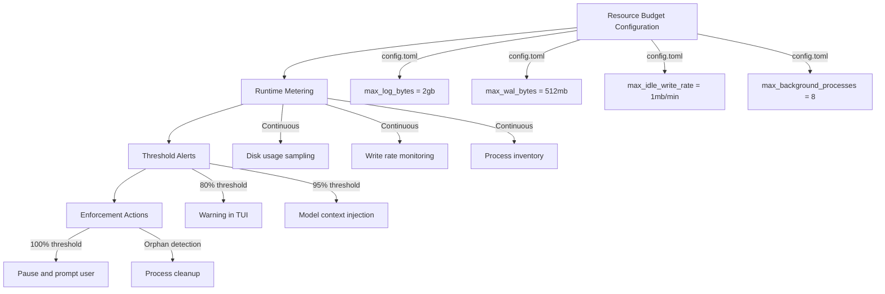

# Beyond Token Budgets: Why Codex CLI Needs Resource Budgets for Disk, I/O, and Process Lifecycle


---

Token budgets were the first obvious meter for coding agents. Codex CLI v0.142.0 shipped configurable rollout token budgets that track usage across agent threads, provide remaining-budget reminders, and abort turns when exhausted [^1]. But tokens are only one dimension of cost. The 640 TB/year SQLite TRACE logging bug [^2] — and the 137 GB checkpoint blob incident [^3] — proved that a terminal-native coding agent also spends disk, I/O bandwidth, file descriptors, background processes, and human trust. None of those resources had budgets, limits, or even visibility.

This article examines the emerging case for resource budgets in coding agents, maps the specific resource dimensions that Codex CLI currently leaves unmetered, and outlines what a resource-aware agent runtime would look like.

## The Resource Dimensions Token Budgets Miss

A *Developers Digest* analysis published in June 2026 identified seven resource dimensions that coding agents consume beyond tokens [^4]:

| Dimension | Risk | Codex CLI exposure |
|---|---|---|
| **Tokens** | Quota exhaustion, surprise bills | Rollout token budgets (v0.142.0) |
| **Disk** | Log growth, state bloat, SSD wear | `~/.codex/` state directory, unmetered |
| **I/O** | Laptop stalls, SSD endurance | SQLite WAL writes, unmetered |
| **Processes** | Orphaned agents, stuck file descriptors | exec-server, MCP stdio servers |
| **Network** | Runaway API calls, retry storms | OTel export only |
| **CI capacity** | Job floods from automated triggers | codex-action rate limiting |
| **Human review time** | Backlog growth, ambiguous diffs | No built-in metric |

Token budgets address row one. The remaining six rows have no first-class controls in Codex CLI as of v0.142.2.

## Case Study: The SQLite WAL Incident

The most dramatic illustration arrived on 14 June 2026, when Apache Flink PMC member Rui Fan reported 37 TB of writes in 21 days of normal Codex CLI use [^2]. The root cause: Codex CLI's feedback sink wrote SQLite logs at hardcoded TRACE level, ignoring the `RUST_LOG` environment variable entirely [^5]. With WAL mode enabled, every insert-delete cycle of 36,211 rows per 15-second window produced write amplification that consumer SSDs — typically rated at under 600 TBW — could not survive for 12 months [^2].

Three PRs (#29432, #29457, #29599) collectively reduced write volume by approximately 85% in v0.142.0 and v0.143.0 [^6]. But the fix was reactive. No budget, threshold, or alert existed to catch the problem before it consumed hardware.

A second incident involved checkpoint blobs. Codex Desktop creates git checkpoint refs storing full project tree snapshots. On repositories with large binary assets, these accumulate without automatic cleanup. One user reported 140 GB of checkpoint data that compressed to 5.7 GB after manual pruning [^3].

## What Codex CLI Currently Provides

Codex CLI is not entirely blind to its own resource footprint. Three mechanisms exist today:

### 1. `codex doctor`

The `codex doctor` command, introduced in v0.131.0, diagnoses installation health, configuration, authentication, runtime, Git, terminal, and app-server state [^7]. It reports environment diagnostics and supports `--json` output for automated pipelines. However, it does not report disk consumption of the state directory, WAL file sizes, write rates, active process counts, or log retention status.

### 2. OpenTelemetry Export

Codex CLI ships built-in OpenTelemetry support under the `[otel]` section of `~/.codex/config.toml` [^8]. Configuration accepts OTLP HTTP or gRPC exporters:

```toml
[otel]
exporter = "otlp-http"
endpoint = "https://ingest.signoz.cloud:443"
headers = { "signoz-ingestion-key" = "..." }
```

OTel captures traces, logs, and metrics from agent runs — API requests, SSE events, tool approvals, and tool results. But it focuses on the model interaction layer. Disk I/O, process lifecycle, and local state growth are not instrumented [^9].

### 3. Rollout Token Budgets

Configurable since v0.142.0, rollout token budgets track cumulative token consumption across threads in a goal or session [^1]. When the budget approaches exhaustion, Codex injects a remaining-budget reminder into the model context. When exhausted, the turn aborts. This is the only resource dimension with a true budget-limit-abort lifecycle.

## The Missing Resource Budget Stack

Drawing on the *Developers Digest* framework [^4] and the patterns established by container runtimes [^10], a resource-aware coding agent needs four layers:



### Layer 1: Configuration

Resource limits belong in `config.toml` alongside existing `[sandbox]` and `[otel]` sections:

```toml
[resources]
max_state_dir_bytes = "4gb"
max_wal_bytes = "512mb"
max_idle_write_rate = "1mb/min"
max_background_processes = 8
max_checkpoint_bytes = "2gb"
log_retention_days = 7
```

Enterprise operators using managed `config.toml` deployment [^11] would set fleet-wide defaults, with per-user overrides following the existing profile hierarchy.

### Layer 2: Runtime Metering

The agent runtime must sample resource consumption at regular intervals. The SQLite WAL incident showed that write rates can spike without warning [^2]. A practical implementation would:

- Poll `~/.codex/` directory size and individual database/WAL file sizes every 30 seconds
- Track cumulative bytes written per session via filesystem counters or `PRAGMA page_count` queries
- Maintain a process inventory of exec-server children, MCP stdio server PIDs, and background subagents
- Record idle-state write rates separately from active-session rates

### Layer 3: Threshold Alerts

Borrowing from Kubernetes resource quotas [^10], a two-tier alert system would inject warnings into both the TUI status line and the model context:

- **Warning (80%)**: Status bar indicator and optional OTel metric emission
- **Critical (95%)**: Inject a resource-budget reminder into the model context, mirroring how token budgets already inject remaining-budget warnings [^1]
- **Limit (100%)**: Pause execution and prompt the user for cleanup or budget increase

### Layer 4: Enforcement Actions

At the enforcement layer, the agent should:

- **Checkpoint compaction**: Automatically prune checkpoint blobs older than a configurable retention window
- **WAL checkpointing**: Force SQLite `PRAGMA wal_checkpoint(TRUNCATE)` when WAL files exceed their budget [^12]
- **Process reaping**: Detect and terminate orphaned exec-server and MCP server processes that outlive their parent session
- **Log rotation**: Implement time-based and size-based log retention, deleting feedback entries older than `log_retention_days`

## A Proposed `codex doctor resources` Command

Extending `codex doctor` with a `resources` subcommand would surface the information developers currently need `du`, `lsof`, and `sqlite3` to find:

```bash
$ codex doctor resources

State directory       ~/.codex/
  Total size          3.2 GB
  logs_2.sqlite       892 MB
  logs_2.sqlite-wal   147 MB  ⚠️  (29% of 512 MB budget)
  goals_1.sqlite      234 MB
  Checkpoint refs     1.8 GB  ⚠️  (90% of 2 GB budget)

Write rate (idle)     240 KB/min  ✓  (under 1 MB/min limit)
Write rate (active)   18 MB/min

Active processes      4
  codex (main)        PID 42901
  exec-server         PID 42903
  mcp-stdio (eslint)  PID 42910
  mcp-stdio (git)     PID 42912

Last WAL checkpoint   2026-06-25T14:32:00Z (18 min ago)
Log retention         7 days (oldest entry: 2026-06-19)

Safe cleanup:
  codex gc --checkpoints    # reclaim ~1.6 GB
  codex gc --logs --before 2026-06-22  # reclaim ~400 MB
```

This diagnostic surface would give developers the visibility they currently lack and provide automation hooks for CI environments where disk quotas are tight.

## The Broader Pattern: Agent Runtime Maturity

The resource budget gap is not unique to Codex CLI. Claude Code, Antigravity, Cursor Agent, and every other terminal-resident coding agent faces the same challenge: once an agent becomes a persistent work environment rather than a transient script, it needs the boring operational controls that mature runtimes provide [^4].

Container runtimes solved this problem a decade ago with cgroups, resource quotas, and liveness probes [^10]. Systemd solved it with `LimitFSIZE`, `LimitNPROC`, and journal rotation. The coding agent ecosystem has not yet built its equivalent — and the 640 TB/year incident demonstrates why it must.

The agent observability landscape is responding. Tools like Braintrust, Arize Phoenix, Helicone, and Grafana Cloud now offer Codex CLI integrations that track model-layer metrics [^13]. But they monitor the API boundary, not the local runtime. The gap between "how many tokens did my agent use" and "how many gigabytes did my agent write to disk" remains unmonitored.

## What Developers Should Do Now

Until Codex CLI ships native resource budgets, developers can implement manual guardrails:

1. **Monitor state directory size** with a cron job or shell alias:
   ```bash
   alias codex-disk='du -sh ~/.codex/ ~/.codex/*.sqlite ~/.codex/*.sqlite-wal 2>/dev/null'
   ```

2. **Check SSD health** using SMART data via `smartctl` (Linux) or `smartmontools` (macOS via Homebrew) [^2]

3. **Force WAL checkpoints** periodically:
   ```bash
   sqlite3 ~/.codex/logs_2.sqlite "PRAGMA wal_checkpoint(TRUNCATE);"
   ```

4. **Clean orphaned processes** after abnormal exits:
   ```bash
   pkill -f "codex.*exec-server" 2>/dev/null
   ```

5. **Set filesystem quotas** on the `~/.codex/` directory if your operating system supports per-directory quotas

6. **Export OTel metrics** to catch token-layer anomalies that may correlate with local resource spikes [^8]

## Conclusion

Token budgets were necessary but not sufficient. The SQLite TRACE logging incident, the checkpoint blob accumulation, and the growing catalogue of process-lifecycle issues demonstrate that coding agents need a resource budget stack spanning disk, I/O, processes, and network — with the same configure-meter-alert-enforce lifecycle that token budgets already implement. The agent tools that win adoption in enterprise environments will not merely generate better code; they will make their side effects legible, bounded, and recoverable.

---

## Citations

[^1]: OpenAI, "Changelog – Codex," developers.openai.com, 22 June 2026. [https://developers.openai.com/codex/changelog](https://developers.openai.com/codex/changelog)

[^2]: Rui Fan et al., "Codex SQLite feedback logs can write ~640 TB/year and rapidly consume SSD endurance," GitHub Issue #28224, openai/codex, 14 June 2026. [https://github.com/openai/codex/issues/28224](https://github.com/openai/codex/issues/28224)

[^3]: "Codex turn-diff checkpoint blobs silently consume 100+ GB disk space," GitHub Issue #29388, openai/codex, June 2026. [https://github.com/openai/codex/issues/29388](https://github.com/openai/codex/issues/29388)

[^4]: "Codex CLI Needs Resource Budgets, Not Just Token Budgets," *Developers Digest*, June 2026. [https://www.developersdigest.tech/blog/codex-cli-resource-budgets](https://www.developersdigest.tech/blog/codex-cli-resource-budgets)

[^5]: "OpenAI Codex CLI Bug Silently Writes 640 TB/Year to Your SSD: No Patch," *TechTimes*, 22 June 2026. [https://www.techtimes.com/articles/318876/20260622/openai-codex-cli-bug-silently-writes-640-tb-year-your-ssd-no-patch.htm](https://www.techtimes.com/articles/318876/20260622/openai-codex-cli-bug-silently-writes-640-tb-year-your-ssd-no-patch.htm)

[^6]: "The 640 TB Silent Killer: Anatomy of the Codex CLI SQLite Logging Bug," Codex Knowledge Base, 25 June 2026. [https://codex.danielvaughan.com/](https://codex.danielvaughan.com/)

[^7]: OpenAI, "Command line options – Codex CLI," developers.openai.com, 2026. [https://developers.openai.com/codex/cli/reference](https://developers.openai.com/codex/cli/reference)

[^8]: OpenAI, "Advanced Configuration – Codex," developers.openai.com, 2026. [https://developers.openai.com/codex/config-advanced](https://developers.openai.com/codex/config-advanced)

[^9]: "`codex exec` emits no OTel metrics; `codex mcp-server` emits no OTel telemetry at all," GitHub Issue #12913, openai/codex. [https://github.com/openai/codex/issues/12913](https://github.com/openai/codex/issues/12913)

[^10]: Kubernetes, "Resource Quotas," kubernetes.io, 2026. [https://kubernetes.io/docs/concepts/policy/resource-quotas/](https://kubernetes.io/docs/concepts/policy/resource-quotas/)

[^11]: OpenAI, "Configuration Reference – Codex," developers.openai.com, 2026. [https://developers.openai.com/codex/config-reference](https://developers.openai.com/codex/config-reference)

[^12]: SQLite, "Write-Ahead Logging," sqlite.org, 2026. [https://sqlite.org/wal.html](https://sqlite.org/wal.html)

[^13]: "AI Agent Monitoring: 2026 Observability Guide," Augment Code, 2026. [https://www.augmentcode.com/guides/ai-agent-monitoring](https://www.augmentcode.com/guides/ai-agent-monitoring)
