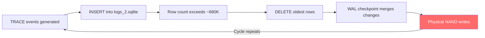

# The 640 TB Silent Killer: Anatomy of the Codex CLI SQLite Logging Bug — Detection, Root Cause, and SSD Defence


---

On 14 June 2026, GitHub user Rui Fan (@1996fanrui) opened Issue #28224 against `openai/codex` with a deceptively simple observation: over 21 days of uptime, their NVMe drive had absorbed roughly 37 TB of writes [^1]. Annualised, that works out to approximately **640 terabytes per year** — enough to exhaust the entire warranted endurance of a typical 1 TB consumer SSD (rated at ~600 TBW) in under twelve months [^2]. The culprit was not a rogue build process or a runaway test suite. It was a SQLite feedback logger that shipped at TRACE level by default — and ignored every standard mechanism to turn it down.

This article dissects the bug's root cause, explains why conventional monitoring missed it, walks through detection and mitigation, and draws broader lessons for anyone running long-lived developer tooling on local storage.

## The Root Cause: TRACE-Level Logging With No Off Switch

Codex CLI maintains a local SQLite database at `~/.codex/logs_2.sqlite` (with accompanying `-wal` and `-shm` files) for diagnostic telemetry. The feedback sink was initialised with a hardcoded global TRACE default [^1]:

```rust
Targets::new().with_default(Level::TRACE)
```

TRACE is the most verbose logging level in the Rust `tracing` ecosystem. It captures every internal event: raw WebSocket payloads, filesystem syscalls (including incidental reads of `/etc/passwd` and `ld.so.cache`), OpenTelemetry bridge events, and dependency-internal diagnostics [^3].

Critically, the sink **bypassed `RUST_LOG`**, the standard environment variable that Rust developers use to control log verbosity [^1]. Setting `RUST_LOG=info` or `RUST_LOG=warn` had no effect on the SQLite writer. There was no documented configuration to throttle it.

### Log Composition

Analysis of the retained database showed that TRACE-level entries accounted for **70.7% of retained bytes**, with `codex_otel` mirrored events contributing a further 25.3% [^1]. Roughly 96% of the logged volume served no practical diagnostic purpose for end users.

## Why Nobody Noticed: The Invisible Churn Pattern

The bug evaded detection for months — earlier related reports appeared as far back as April 2026 (Issue #17320) [^4] — because the database **never grew large on disc**. The logger operated a continuous insert-and-delete cycle: approximately 36,211 rows inserted every 15 seconds, with retention capped at around 680,000 rows [^1].



Standard disc space monitoring (`df`, `du`) showed a database of modest, stable size. The writes were invisible to any tool that only tracked file size rather than I/O throughput.

## Write Amplification: Why Small Files Cause Big Damage

The actual damage was magnified by **SQLite's WAL (Write-Ahead Logging) mode** and the underlying physics of NAND flash storage.

In WAL mode, every write operation first appends to a separate journal file (`logs_2.sqlite-wal`). Periodic checkpoint operations then merge the WAL back into the main database. When tens of thousands of insert-and-delete cycles run per minute, each checkpoint triggers substantial physical writes [^3].

Flash storage introduces a second layer of amplification. SSDs write in pages (typically 4–16 KB) but erase in blocks (typically 256 KB–4 MB). Modifying even a single byte requires reading the containing block, erasing it, and rewriting the entire block. The ratio of physical NAND writes to logical application writes — the **write amplification factor (WAF)** — commonly ranges from 2× to 10× depending on drive firmware and workload patterns [^5].

For Codex's churn-heavy workload, the effective WAF was likely at the upper end of this range, meaning the 640 TB/year logical write load could translate to several petabytes of actual NAND cell wear.

## Detection: How to Check Whether You Are Affected

### Step 1: Check Your Drive's Lifetime Writes

On Linux with an NVMe drive:

```bash
sudo smartctl -a /dev/nvme0 | grep "Data Units Written"
# Or:
sudo nvme smart-log /dev/nvme0
```

For SATA SSDs, read the `Total_LBAs_Written` SMART attribute. On macOS, `smartctl` is available via Homebrew (`brew install smartmontools`). On Windows, [CrystalDiskInfo](https://crystalmark.info/en/software/crystaldiskinfo/) provides a graphical view of the same data [^4].

### Step 2: Confirm Codex as the Source

```bash
# Check if the log database exists and its companion files
ls -la ~/.codex/logs_2.sqlite*

# Monitor I/O in real time (Linux)
iostat -x 5

# Trace writes to the specific file
sudo lsof ~/.codex/logs_2.sqlite
```

### Step 3: Estimate Your Exposure

If you have been running Codex CLI regularly since March 2026, a rough estimate is:

```
Daily writes ≈ 1.7 TB × (hours of Codex uptime / 24)
```

Compare against your drive's TBW rating (found in the manufacturer's datasheet or via SMART data) to assess remaining endurance.

## Mitigation and Fixes

### Official Fixes (v0.142.0 and v0.143.0)

Three pull requests were merged between 22–23 June 2026, collectively reducing write volume by approximately 85% [^1]:

| PR | Description | Version |
|---|---|---|
| #29432 | Stop logging every Responses WebSocket event | v0.142.0 |
| #29457 | Filter noisy targets from persistent logs | v0.142.0 |
| #29599 | Stop persisting bridged log events | v0.143.0 |

**Action:** Update to v0.143.0 or later. Run `codex --version` to check your current version.

### Interim Workaround: Redirect to RAM

On Linux and macOS where `/tmp` is backed by tmpfs (RAM-backed filesystem), symlink the database out of your SSD:

```bash
# Verify /tmp is tmpfs
df -h /tmp

# Remove existing database and redirect
rm -f ~/.codex/logs_2.sqlite ~/.codex/logs_2.sqlite-wal ~/.codex/logs_2.sqlite-shm
ln -s /tmp/codex_logs_2.sqlite ~/.codex/logs_2.sqlite
```

The database holds no conversation data — it is purely diagnostic telemetry — so losing it on reboot is harmless [^4].

### Nuclear Option: SQLite Trigger

For users who cannot update immediately and need the database to exist but remain empty:

```bash
sqlite3 ~/.codex/logs_2.sqlite \
  "CREATE TRIGGER IF NOT EXISTS block_log_inserts \
   BEFORE INSERT ON logs BEGIN SELECT RAISE(IGNORE); END;"
```

This silently drops every INSERT whilst keeping the database file present and valid [^1].

### CI/CD Environments

In ephemeral CI runners, point `~/.codex` to the runner's scratch tmpfs during job setup:

```bash
export HOME=$(mktemp -d)
# Or mount a tmpfs at ~/.codex
```

This ensures log writes never reach persistent storage [^4].

## The Broader Cost

The Register estimated that the bug "plausibly burned low-single-digit millions of dollars of SSD endurance across users during the March–June window" [^2]. With Codex CLI reaching 5 million weekly active developers by June 2026 [^6], even a small fraction of users running long sessions on consumer hardware faced material drive wear.

The episode highlights a class of bugs that is becoming more common as AI developer tools move from short-lived API calls to **long-running local processes**. A logging misconfiguration that would be trivial in a cloud service — where storage is provisioned and monitored — becomes destructive when it runs on a developer's personal laptop for weeks at a time.

## Lessons for Tool Authors and Operators

1. **Default to INFO, not TRACE.** Verbose logging belongs behind an explicit opt-in flag, not a hardcoded default.

2. **Respect the ecosystem's log-control conventions.** Ignoring `RUST_LOG` (or the equivalent in your language) removes the user's only standard throttle mechanism.

3. **Monitor I/O, not just disc space.** A database that stays 50 MB on disc can still write terabytes per day. Tools like `iotop`, `iostat`, and SMART monitoring catch what `df` misses.

4. **Audit write-heavy patterns in WAL-mode SQLite.** High-frequency insert-delete cycles in WAL mode are a known write amplification risk. Consider `PRAGMA journal_mode=DELETE` or batched writes with longer intervals for non-critical telemetry.

5. **Treat local developer machines as constrained environments.** They are not cloud VMs with replaceable block storage. SSD endurance is a finite, non-renewable resource.

## Citations

[^1]: Rui Fan (@1996fanrui), "Codex SQLite feedback logs can write ~640 TB/year and rapidly consume SSD endurance," GitHub Issue #28224, openai/codex, 14 June 2026. [https://github.com/openai/codex/issues/28224](https://github.com/openai/codex/issues/28224)

[^2]: "OpenAI Codex bombards SSDs with needless write operations, costing millions," The Register, 23 June 2026. [https://www.theregister.com/ai-and-ml/2026/06/23/openai-codex-bombards-ssds-with-needless-write-operations-costing-millions/](https://www.theregister.com/ai-and-ml/2026/06/23/openai-codex-bombards-ssds-with-needless-write-operations-costing-millions/)

[^3]: "OpenAI Codex has a critical bug that could kill your SSD in under a year," Notebookcheck, June 2026. [https://www.notebookcheck.net/OpenAI-Codex-has-a-bug-that-could-kill-your-SSD-in-under-a-year.1326191.0.html](https://www.notebookcheck.net/OpenAI-Codex-has-a-bug-that-could-kill-your-SSD-in-under-a-year.1326191.0.html)

[^4]: "Stop OpenAI Codex Writing 640 TB/Year to Your SSD," DEV Community, June 2026. [https://dev.to/indra_gustiprasetya_a80a/stop-openai-codex-writing-640-tbyear-to-your-ssd-2j8d](https://dev.to/indra_gustiprasetya_a80a/stop-openai-codex-writing-640-tbyear-to-your-ssd-2j8d)

[^5]: "Write amplification," Wikipedia. [https://en.wikipedia.org/wiki/Write_amplification](https://en.wikipedia.org/wiki/Write_amplification)

[^6]: "OpenAI Codex Statistics 2026," Gradually.ai. [https://www.gradually.ai/en/codex-statistics/](https://www.gradually.ai/en/codex-statistics/)
