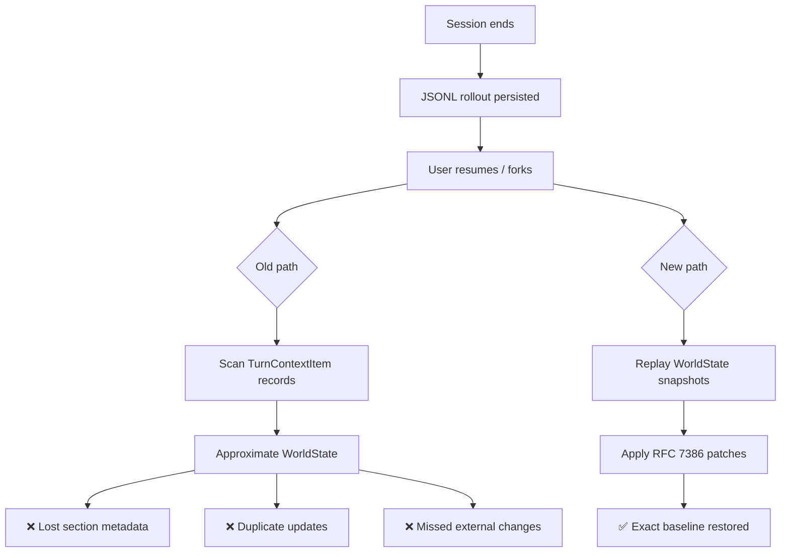

# World State Persistence: How Codex CLI Eliminated Context Loss on Session Resume, Fork, and Rollback


Session resume has been one of Codex CLI's most requested — and most unreliable — features. Users reported task drift after rate-limit recovery, duplicate file updates on fork, and lost environment context on rollback [^1][^2][^3]. The root cause was architectural: Codex CLI reconstructed world state from individual turn context items during replay, a lossy process that discarded section metadata and could suppress or duplicate environment changes.

On 25 June 2026, three coordinated pull requests landed in the Codex CLI repository — PRs #29833, #29835, and #29837 — shipping a durable world state persistence stack that replaces the old reconstruction-from-transcript approach with serialisable snapshots and incremental JSON merge patches [^4][^5][^6]. This article traces the architecture, the failure modes it eliminates, and how to take advantage of it.

## The Problem: Reconstructing State from Transcript

Every Codex CLI session persists as a JSONL rollout file under `~/.codex/sessions/` [^7]. When you run `codex resume --last` or `/fork` from the TUI, the client replays that JSONL to reconstruct the conversation context the model needs.

Before this change, the `WorldState` — Codex CLI's internal representation of the working directory, environment variables, and other environmental sections — maintained its comparison baseline using live Rust objects [^4]. These objects could not survive serialisation. On resume or fork, the system fell back to a synthetic conversion path: it scanned `TurnContextItem` records from the transcript and attempted to rebuild an approximation of the world state.

This approximation was lossy in three specific ways:

1. **Section metadata loss** — `TurnContextItem` records lacked the typed section identifiers that `WorldState` uses to group related environment facts, meaning resumed sessions could not compute accurate diffs against the pre-resume baseline.
2. **Duplicate updates** — without a reliable baseline, the model sometimes re-emitted file changes it had already applied, wasting tokens and risking conflicting edits [^1].
3. **Suppressed environment changes** — if an external process modified the working directory between session end and resume, the diff engine had no reliable baseline to detect the change, silently swallowing it.



## The Solution: A Three-Layer Persistence Stack

The fix shipped across three PRs, each building on the last.

### Part 1 — Serialisable Snapshots (PR #29833)

The first change makes `WorldState` snapshots serialisable by replacing live Rust path types with model-visible strings [^4]. Each `WorldStateSection` must now define two things:

- A **stable persisted identity** — a string key that survives across binary versions.
- A **serialisable snapshot type** — a representation that can round-trip through JSON without loss.

Only `WorldStateSnapshot` objects are stored in `ContextManager`, eliminating the parallel live-object baseline entirely. When a diff is needed, the system restores each section's typed snapshot and renders against it; if a snapshot is invalid (due to a schema change between versions), it falls back to rendering the full section, guaranteeing forward compatibility.

### Part 2 — Durable Persistence in Rollouts (PR #29835)

The second PR adds a new `world_state` rollout item type to the JSONL stream [^5]. State transitions are captured using two mechanisms:

| Mechanism | When Used | Content |
|---|---|---|
| **Full snapshot** | After initial context setup; after compaction resets the context window | Complete serialised `WorldStateSnapshot` |
| **RFC 7386 JSON merge patch** | When sampling steps or turns advance the baseline with non-empty changes | Delta-only patch against previous snapshot |

The write ordering is deliberate: model-visible history is written **before** its matching `WorldState` record, so an interrupted write can only cause a safe repeated update on replay — never a missed one [^5].

Backward compatibility is preserved because older binaries read rollout lines independently and simply skip unknown `world_state` records, retaining the rest of the thread without error.

### Part 3 — Replay on Reconstruction (PR #29837)

The final PR closes the loop by replaying persisted snapshots and patches during rollout reconstruction [^6]. On resume, fork, or rollback:

1. The reconstruction engine processes `world_state` records in order.
2. Full snapshots replace the current baseline outright.
3. RFC 7386 patches are applied incrementally.
4. Compaction is treated as a baseline reset, discarding pre-compaction state.
5. Rolled-back turns have their state discarded, restoring the baseline to the rollback point.

The synthetic conversion path from `TurnContextItem` to `WorldState` is removed entirely. `ContextManager` is hydrated directly from the reconstructed snapshots.

## Why RFC 7386 JSON Merge Patch?

RFC 7386 is a deliberately simple patching format: a JSON document where present keys replace their targets and `null` values delete keys [^8]. Codex CLI chose it over RFC 6902 (JSON Patch) for three reasons:

1. **Human readability** — merge patches look like the target document, making rollout JSONL easier to inspect during debugging.
2. **Idempotency** — applying the same merge patch twice produces the same result, which matters when interrupted writes cause replay of the last record.
3. **Compactness** — for the typical case where only one or two world state sections change per turn, a merge patch is smaller than a full snapshot and smaller than an array of JSON Patch operations.

## Practical Impact

### Resume After Rate Limits

The most common context-loss scenario — hitting a rate limit mid-session and resuming minutes later — is now reliable. The world state snapshot written before the rate-limited turn provides an exact baseline, so the model sees a precise diff of any filesystem changes that occurred during the pause rather than a reconstructed approximation [^1][^2].

### Fork with Divergent Environments

When you `/fork` a session to explore an alternative approach, the forked session now inherits an exact copy of the parent's world state baseline. Previously, the fork could diverge from the parent's understanding of the working directory, leading to phantom diffs or missed files.

### Rollback Without Side Effects

Rolling back to an earlier turn now restores the world state to exactly what it was at that turn. The model's next response will see accurate diffs from that point forward, eliminating the "ghost edits" problem where rolled-back changes still appeared in the model's context.

### Compaction Boundary Handling

Context compaction — where Codex CLI summarises older turns to free up the context window — now writes a fresh full snapshot as a baseline reset. This prevents the gradual drift that previously accumulated across multiple compaction cycles in long-running goal-mode sessions.

## Configuration

World state persistence is enabled by default in v0.143 alpha builds and requires no configuration changes [^4][^5][^6]. Existing sessions created with older versions will continue to work: the reconstruction engine falls back to full-section rendering when it encounters rollouts without `world_state` records.

Session rollout files will grow slightly due to the additional `world_state` lines. For a typical coding session with 50 turns, expect roughly 5–15 KB of additional storage — negligible relative to the tool-call output that dominates rollout file size.

## Verifying the Fix

You can inspect world state records in a session's rollout file:

```bash
# Find the latest session rollout
ls -t ~/.codex/sessions/*.jsonl | head -1

# Count world_state records
grep -c '"world_state"' ~/.codex/sessions/<session-id>.jsonl

# View the first full snapshot
grep '"world_state"' ~/.codex/sessions/<session-id>.jsonl | head -1 | jq .
```

A healthy session should show one full snapshot near the start and incremental patches interleaved with turn records thereafter.

## Architectural Lessons

The world state persistence stack illustrates a pattern worth noting for anyone building agentic systems:

1. **Separate serialisation from runtime representation** — the original design tied persistence to live Rust objects, making serialisation an afterthought. Inverting this — making the serialisable snapshot the primary representation — simplified the entire stack.
2. **Write ordering matters for crash safety** — by writing model-visible history before state records, an interrupted write can only produce a repeated update, never data loss.
3. **Incremental patches with periodic full snapshots** — a classic database technique (write-ahead log with checkpoints) applied to agent state, balancing storage efficiency with replay performance.

## Citations

[^1]: [Session resume after rate limit loses task intent and continues on wrong context — Issue #8310, openai/codex](https://github.com/openai/codex/issues/8310)
[^2]: [Feature: Resume CLI session after premature exit (Ctrl-C) and restore transcript context — Issue #3208, openai/codex](https://github.com/openai/codex/issues/3208)
[^3]: [Code and context rollback — Issue #6449, openai/codex](https://github.com/openai/codex/issues/6449)
[^4]: [[1/3] core: make world state snapshots serializable — PR #29833, openai/codex](https://github.com/openai/codex/pull/29833)
[^5]: [[2/3] core: persist world state in rollouts — PR #29835, openai/codex](https://github.com/openai/codex/pull/29835)
[^6]: [[3/3] core: replay persisted world state — PR #29837, openai/codex](https://github.com/openai/codex/pull/29837)
[^7]: [Session Resumption and Forking — openai/codex, DeepWiki](https://deepwiki.com/openai/codex/4.4-session-resumption-and-forking)
[^8]: [RFC 7386 — JSON Merge Patch, IETF](https://datatracker.ietf.org/doc/html/rfc7386)
