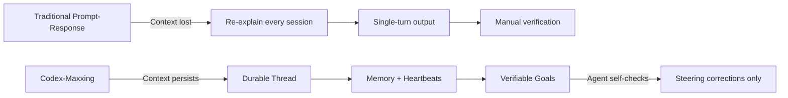
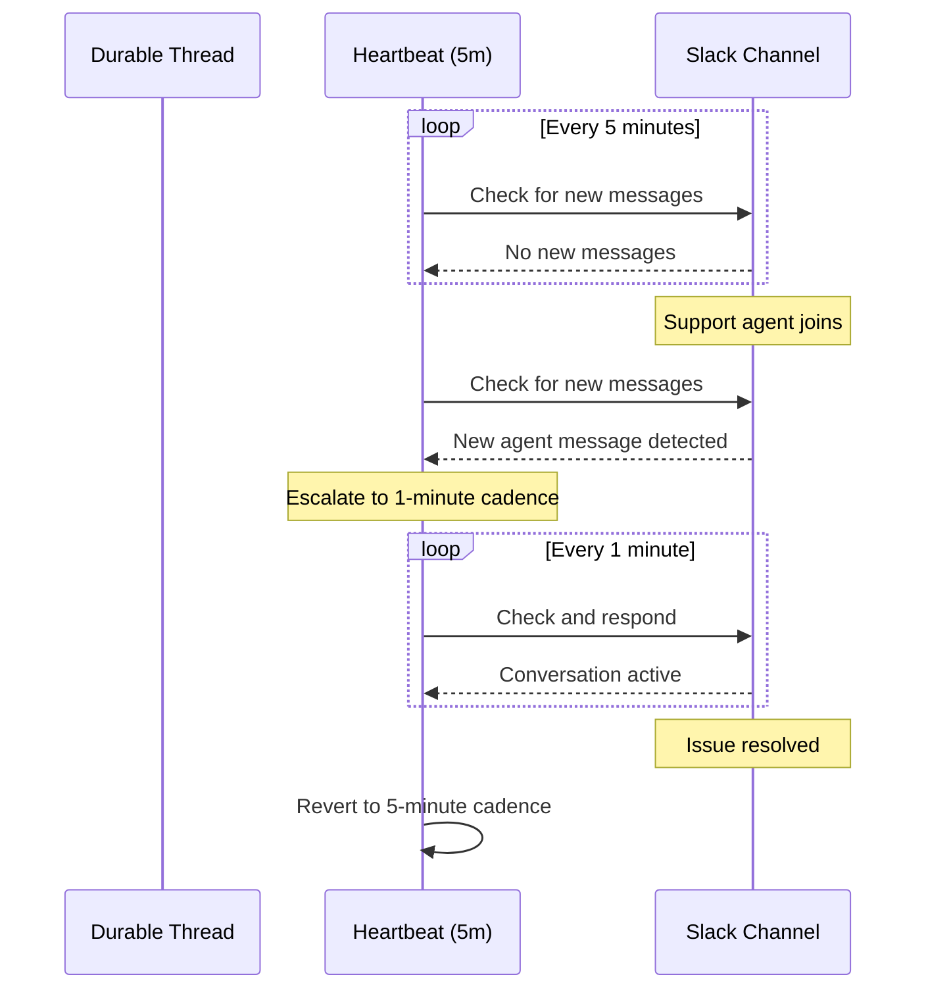
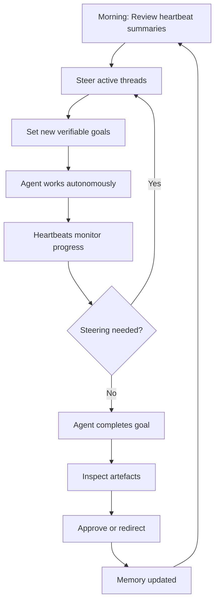

# Codex-Maxxing: The Six-Pillar Methodology for Long-Running Agent Work with Durable Threads, Memory, Heartbeats, and Verifiable Goals


---

Most developers treat Codex as a prompt-response tool: type an instruction, wait for output, iterate. That model works for discrete tasks — fix a bug, write a test, scaffold a module. It falls apart when the work stretches across hours or days: a multi-service migration, an ongoing PR review pipeline, a research-and-report cycle that spans a week.

OpenAI's *Codex-Maxxing* methodology, published on 22 June 2026, formalises what power users had already discovered by trial and error[^1]. It treats Codex not as a prompt box but as a persistent workspace — a collaborator that accumulates context, remembers decisions, monitors external systems, and checks its own progress against explicit success criteria.

This article breaks down the six pillars of codex-maxxing, maps each to concrete Codex CLI and Codex app features, and identifies the sharp edges that still need filing.

---

## The Shift: From Prompt-Response to Persistent Workspace

The prompt-response model has a fundamental scaling problem: context evaporates between sessions. Every new conversation starts cold. The developer must re-explain the project structure, the conventions, the decisions already made, and the current state of the work.

Codex-maxxing inverts this. The agent maintains a persistent relationship with the work, and the developer's role shifts from *instructing* to *steering*[^2].



---

## Pillar 1: Durable Threads

A durable thread is a long-running conversation pinned for continuous use. Rather than spawning fresh sessions, developers return to the same thread — the accumulated history of decisions, file changes, and reasoning remains available[^1][^2].

In the Codex app, durable threads are accessible via `Cmd-1` through `Cmd-9` keyboard shortcuts. In Codex CLI, session resume achieves the same effect:

```bash
# Resume the last session
codex --resume

# Resume a specific named session
codex --resume my-migration-thread
```

The trade-off is caching cost. As threads grow long, the model must process more history per turn. GPT-5.5 handles this through native compaction — automatically summarising older turns when the context window fills, then continuing coherently from the summary[^3]. This compaction was first trained into GPT-5.1-Codex-Max and has since been refined in subsequent models[^4].

### When to Fork vs Continue

Not every branch of work belongs in the same thread. The `/fork` command creates a new thread that inherits the parent's context but diverges independently:

```bash
# Fork the current thread for an experimental approach
/fork experimental-approach
```

Use forking when you want to test an alternative strategy without polluting the main thread's history. Use continuation when the work is sequential and context accumulation is valuable.

---

## Pillar 2: Structured Memory

As threads grow beyond a few dozen turns, raw message history becomes unwieldy. Memory provides a structured, editable layer on top — a notebook the agent consults before acting[^1][^2].

Codex offers two memory mechanisms:

**First-party memories** live in Settings > Personalisation > Memories. These persist across all threads and capture user preferences, project conventions, and recurring instructions. Think of them as a durable system prompt that the user can inspect and edit.

**Project-scoped memory** uses structured files the agent reads at thread start. Jason Liu's codex-maxxing workflow uses an Obsidian vault synchronised to GitHub with a specific directory structure[^2]:

```
memory/
  TODO.md           # Current task queue
  people/           # Key contacts and roles
  projects/         # Project state and decisions
  agent/            # Agent-specific instructions
  notes/            # Running observations
```

In Codex CLI, the equivalent is the `AGENTS.md` file and any files referenced in the system prompt or `instructions` field of `config.toml`:

```toml
[codex]
model = "gpt-5.5"
instructions = """
Read memory/TODO.md at the start of every session.
Update memory/projects/current-state.md after completing each goal.
"""
```

The key insight: memory must be *editable by both human and agent*. If the agent cannot update its own project notes after completing a step, the memory drifts from reality within hours.

---

## Pillar 3: Heartbeat Automations

A heartbeat is a thread-local automation — a recurring wake-up call that brings the agent back to the same conversation on a schedule[^1][^5]. This transforms Codex from a tool you invoke into a background process that monitors and acts.

Heartbeats were introduced as an early affordance in June 2026 and are available in the Codex app's thread automation settings[^5].

Practical examples from production codex-maxxing workflows[^2]:

| Heartbeat | Cadence | Action |
|-----------|---------|--------|
| Chief of Staff | Every 30 minutes | Check Slack and Gmail, draft replies to unanswered messages |
| PR Monitor | Every 15 minutes | Check open PRs for new comments, re-render updates |
| Deploy Watcher | Every 5 minutes | Monitor deployment status, escalate on failure |
| Feedback Loop | Dynamic | Start at 15 minutes, escalate to 1 minute when activity detected |

The dynamic cadence pattern deserves attention: a heartbeat can adjust its own frequency based on conditions. A support thread that checks every 5 minutes might escalate to every minute when it detects an agent has joined the conversation[^2].



### Heartbeats in Codex CLI

The CLI does not yet have first-class heartbeat support equivalent to the Codex app. The closest approximation uses external scheduling (cron, systemd timers, or CI pipelines) that invokes `codex --resume` on a schedule:

```bash
# Cron-based heartbeat: resume the monitoring thread every 15 minutes
*/15 * * * * cd /path/to/project && codex --resume pr-monitor --message "Check for new PR comments and respond"
```

This is admittedly less elegant than the app's built-in heartbeats, but it works for CI/CD monitoring and automated review workflows.

---

## Pillar 4: Mid-Turn Steering

Steering lets the developer inject instructions while the agent is actively working[^1][^6]. This is not a new concept — Codex CLI has supported it since Steer Mode stabilised in v0.98.0[^6] — but codex-maxxing elevates it from a feature to a workflow principle.

The key shift: instead of writing comprehensive upfront instructions that anticipate every decision, you start the agent on a broad goal and steer as you observe its approach.

Effective steering patterns:

- **Course correction**: "Stop using that library — use the standard library instead"
- **Scope adjustment**: "Make this smaller — just handle the happy path for now"
- **Chained actions**: "Open PR → wait for deploy → send the staging URL to Slack"
- **Approval gates**: "Show me the preview before posting"

The chained-action pattern is particularly powerful with durable threads. A single steering message can queue a sequence of actions that unfolds over minutes or hours, with the agent proceeding through each step and pausing at approval gates.

---

## Pillar 5: Verifiable Goals

The difference between a weak goal and a strong goal determines whether the agent can self-assess completion[^1][^2].

| Weak Goal | Strong Goal |
|-----------|-------------|
| "Refactor the auth module" | "Refactor the auth module — all existing tests must pass, no new dependencies, coverage must not drop below 85%" |
| "Write a migration script" | "Write a migration script that converts all v1 API responses to v2 format — verify against the 50 fixtures in test/fixtures/v1/" |
| "Update the docs" | "Update the docs to reflect the new API — every public function must have a docstring with at least one example" |

Strong goals give the agent testable exit criteria. With GPT-5.5's extended reasoning, the agent can run tests, check coverage, verify fixtures, and report whether the goal is met — or explain what remains[^3].

In Codex CLI, Goal Mode (activated with `--goal` or interactively) combines verifiable goals with multi-turn iteration. The agent keeps working until either the goal is met or it determines it cannot proceed without human input:

```bash
codex --goal "Migrate the payment service from REST to gRPC. \
  All existing integration tests must pass. \
  Generate a migration guide in docs/grpc-migration.md. \
  Run 'make test-integration' to verify."
```

---

## Pillar 6: Artifact Inspection

Codex-maxxing treats output not as a final deliverable but as a live artefact the developer inspects and annotates during the work[^1][^2]. The Codex app's side panel renders multiple artefact types:

- **Markdown** with inline commenting
- **Spreadsheets** with formula rendering and cell editing
- **CSVs** rendered as sortable tables
- **PDFs** including LaTeX-compiled documents
- **Slides** (Slidev format)
- **Web surfaces** — `index.html` static pages, Storybook component previews, Streamlit data apps, Remotion animation studios

For CLI workflows, the artifact panel maps to the file system. The agent writes output to files, and the developer inspects them with their usual tools. The `--notify` flag can trigger OS notifications when artifacts are ready for review:

```bash
codex --goal "Generate the quarterly report" --notify
```

---

## The Operating Loop in Practice

These six pillars compose into a daily operating loop:



The developer's time shifts from *doing the work* to *governing the work*: reviewing summaries, setting goals, steering when the agent drifts, and approving outputs. Human judgement remains in the loop for irreversible actions — deployments, public communications, financial transactions — while the agent handles the execution[^1].

---

## Current Model Landscape

The codex-maxxing methodology works with any current Codex model, but the choice matters for long-running work:

| Model | Best For | Compaction Support |
|-------|----------|-------------------|
| GPT-5.5 | Complex coding, research, computer use | Native compaction, strongest reasoning[^3] |
| GPT-5.4 | General coding and agentic tasks | Native compaction |
| GPT-5.4-mini | Fast subagent tasks, cost-sensitive work | Native compaction |
| GPT-5.3-Codex-Spark | Real-time pair programming (>1000 tok/s) | Limited (short sessions preferred)[^7] |

For long-running durable threads, GPT-5.5 or GPT-5.4 are the recommended choices. GPT-5.4-mini works well for heartbeat automations where speed matters more than depth[^3].

---

## Sharp Edges and Limitations

Codex-maxxing is not without friction:

1. **Memory drift**: If the agent updates memory files inconsistently, the structured memory diverges from the actual project state. Periodic human review of memory files is essential.

2. **Heartbeat cost**: Each heartbeat invocation consumes tokens even when there is nothing to act on. A 30-minute heartbeat running 24/7 accumulates meaningful cost over weeks.

3. **Compaction artefacts**: Despite native training, compaction can occasionally drop details that matter. For high-stakes work, explicitly instruct the agent to preserve specific decisions or constraints in memory files rather than relying solely on thread history.

4. **CLI heartbeat gap**: Codex CLI lacks first-class heartbeat support, requiring external scheduling workarounds. This is the most significant feature gap between the app and CLI surfaces for codex-maxxing workflows.

5. **Thread sprawl**: Without discipline, durable threads proliferate. Archive completed threads with `/archive` or `codex archive` to keep the workspace navigable[^5].

---

## Conclusion

Codex-maxxing is less a feature announcement than a recognition that the interaction model for AI coding tools has fundamentally changed. The prompt-response paradigm was adequate when models had short context windows and limited tool access. With native compaction, structured memory, heartbeat automations, and verifiable goals, the agent becomes a persistent collaborator that works between your sessions, not just during them.

The methodology is model-agnostic in principle but benefits enormously from GPT-5.5's extended reasoning and compaction capabilities. For teams already using Codex for multi-hour tasks, codex-maxxing provides a vocabulary and a structure for what they were doing intuitively. For teams still in the prompt-response paradigm, it is a roadmap for getting significantly more value from the same tool.

---

## Citations

[^1]: OpenAI, "Codex-maxxing for long-running work," OpenAI Blog, 22 June 2026. [https://openai.com/index/codex-maxxing-long-running-work/](https://openai.com/index/codex-maxxing-long-running-work/)

[^2]: Jason Liu, "Codex-maxxing," jxnl.github.io, 10 May 2026. [https://jxnl.github.io/blog/writing/2026/05/10/codex-maxxing/](https://jxnl.github.io/blog/writing/2026/05/10/codex-maxxing/)

[^3]: OpenAI, "Models — Codex," OpenAI Developers, accessed 25 June 2026. [https://developers.openai.com/codex/models](https://developers.openai.com/codex/models)

[^4]: OpenAI, "Building more with GPT-5.1-Codex-Max," OpenAI Blog, 2026. [https://openai.com/index/gpt-5-1-codex-max/](https://openai.com/index/gpt-5-1-codex-max/)

[^5]: OpenAI, "Changelog — Codex," OpenAI Developers, accessed 25 June 2026. [https://developers.openai.com/codex/changelog](https://developers.openai.com/codex/changelog)

[^6]: OpenAI, "Features — Codex CLI," OpenAI Developers, accessed 25 June 2026. [https://developers.openai.com/codex/cli/features](https://developers.openai.com/codex/cli/features)

[^7]: OpenAI, "Introducing GPT-5.3-Codex," OpenAI Blog, 2026. [https://openai.com/index/introducing-gpt-5-3-codex/](https://openai.com/index/introducing-gpt-5-3-codex/)
