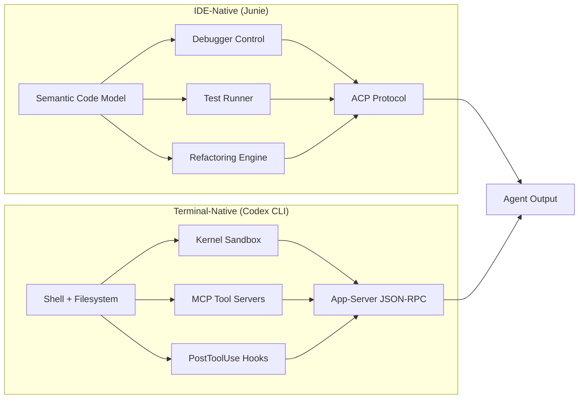
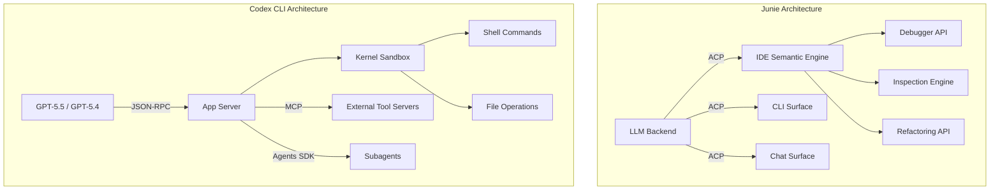

# Junie Goes GA: What JetBrains' IDE-Integrated Agent Reveals About the Terminal-Native vs IDE-Native Divide — and Where Codex CLI Stands


---

On 17 June 2026, JetBrains moved Junie — its AI coding agent — from beta to general availability[^1]. On the latest SWE-Rebench cycle, Junie claimed the number-one coding agent slot at 61.6 per cent resolved and 72.7 per cent pass@5[^1]. A week earlier, Codex CLI on GPT-5.5 had topped Terminal-Bench 2.1 at 83.4 per cent[^2]. Two agents, two benchmarks, two very different architectures — and the gap between them tells you more about where coding agents are heading than any single score.

This article dissects the architectural divide, compares concrete capabilities, and maps the trade-offs that matter when choosing one — or both — for a production workflow.

## Two Philosophies of Agent Design

The coding agent market has split along a fundamental axis: **IDE-native** agents that embed inside a graphical development environment, and **terminal-native** agents that treat the shell as their primary surface.



Junie's thesis is that a coding agent should use the IDE's own tooling — debugger, test runner, inspections, semantic index — the way a senior engineer would[^1]. Codex CLI's thesis is that everything a coding agent needs already exists in the terminal: compilers, linters, test harnesses, and the shell itself[^3].

Neither thesis is wrong. They optimise for different workflows.

## Architecture: ACP vs MCP

### Junie and the Agent Communication Protocol

Junie's GA release rebuilt its integration layer on the **Agent Communication Protocol (ACP)**, enabling a single agent backend to power the IDE plugin, CLI, and chat interface simultaneously[^1]. ACP handles bidirectional context-sharing: you can start a migration on your laptop's IDE, monitor progress from a phone, and review the resulting PR later[^4].

Critically, the Junie CLI can connect back into a running JetBrains IDE for shared context and semantic references[^4]. This means the CLI session is not a standalone process — it is a thin surface over the IDE's semantic model.

### Codex CLI and the MCP-First Stack

Codex CLI uses a three-protocol stack[^5]:

1. **MCP (Model Context Protocol)** for external tool servers — linters, databases, documentation indices
2. **App-server JSON-RPC** for client-to-harness communication
3. **Subagent delegation** via the Agents SDK for multi-agent orchestration

The distinction matters. Codex CLI's tools are composable Unix-style processes; Junie's tools are IDE APIs. When Codex CLI runs `eslint`, it spawns a real process inside a sandboxed environment. When Junie runs an inspection, it calls the IDE's internal analysis engine via ACP.



## The Benchmark Divergence

The fact that Junie leads SWE-Rebench whilst Codex CLI leads Terminal-Bench is not a contradiction — it reflects what each benchmark measures.

| Benchmark | Measures | Junie Score | Codex CLI Score |
|-----------|----------|-------------|-----------------|
| SWE-Rebench | Bug resolution across real repos | 61.6% resolved[^1] | ⚠️ Not separately reported |
| Terminal-Bench 2.1 | Terminal-native task completion | 71.0% (v2.0)[^6] | 83.4%[^2] |
| SWE-bench Verified | Verified patch resolution | ⚠️ Not separately reported | 72.1%[^2] |

Terminal-Bench rewards agents that work fluidly within shell workflows — piping output, reading logs, composing commands. SWE-Rebench evaluates end-to-end bug resolution where understanding class hierarchies and import chains matters. Junie's access to JetBrains' semantic code model — structural understanding of classes, imports, and usages rather than flat text[^1] — gives it an inherent advantage on tasks requiring deep code navigation.

Codex CLI's advantage emerges in infrastructure-heavy tasks: container orchestration, CI pipeline debugging, database migrations, and multi-service deployments where the shell is the natural control plane.

## Agentic Debugging: Junie's Differentiator

The most consequential GA feature is **agentic debugging**. Junie can drive the IDE's debugger autonomously: setting breakpoints, stepping through execution, inspecting variables, and iterating on fixes against live runtime state[^4]. This handles failure modes — race conditions, stale React state, API contract mismatches — that static analysis and `console.log` archaeology cannot address.

Codex CLI has no equivalent. Its debugging workflow relies on:

- Inserting diagnostic `print` statements
- Reading test output and stack traces
- Iterating through the `PostToolUse` hook pipeline for compilation feedback

For runtime bugs that manifest only under specific execution paths, Junie's debugger integration is a genuine capability gap. For build failures, type errors, and test regressions — the bread and butter of daily development — Codex CLI's shell-based approach is equally effective and often faster.

## Sandboxing: The Security Divide

This is where the comparison becomes lopsided. Codex CLI ships a **kernel-level sandbox** using `bwrap` (bubblewrap) on Linux and macOS sandboxing, with network isolation, filesystem restrictions, and `PreToolUse`/`PostToolUse` hook pipelines for policy enforcement[^3][^7]. Every shell command the agent executes runs inside this sandbox.

Junie, by contrast, ships no sandboxing or permission system[^6]. Commands execute with the user's full privileges. JetBrains' position is that IDE integration provides sufficient context awareness to avoid destructive operations — the agent uses the IDE's refactoring engine rather than raw `sed` commands.

For enterprise environments with compliance requirements, this is a material difference. Codex CLI's `requirements.toml` can enforce network allow-lists, filesystem boundaries, and approval policies at the organisational level[^7]. Junie relies on the developer's judgement and the IDE's own safety rails.

## Model Flexibility vs Model Depth

Junie is **LLM-agnostic** with bring-your-own-key support across Anthropic, OpenAI, Google, xAI, OpenRouter, and local runtimes including Ollama and LM Studio[^1][^4]. Cost becomes a dial you hold rather than a property of the tool.

Codex CLI locks you into OpenAI's model family — GPT-5.5, GPT-5.4, GPT-5.4-mini, and GPT-5.3-Codex[^3] — but those models are purpose-tuned for the Codex harness. The tight coupling between model and harness means Codex CLI can exploit model-specific features: structured tool calls, cached input tokens at 90 per cent discount, and the Codex-specific system prompt that reduces refusals on legitimate code operations[^8].

The trade-off is clear:

```toml
# Junie: model flexibility
# Any provider, any model, your own API keys
junie --model anthropic/claude-fable-5 --api-key $ANTHROPIC_KEY

# Codex CLI: model depth
# Tight harness integration, purpose-tuned models
codex --model gpt-5.5
```

## Pricing Comparison

| Dimension | Junie | Codex CLI |
|-----------|-------|----------|
| Free tier | None | Yes (limited)[^9] |
| Entry price | \$100/user/year (AI Pro)[^9] | \$8/month (Go plan)[^10] |
| Enterprise | Seat-based licensing | Token-based with organisational controls[^10] |
| BYOK savings | Full control over model costs | N/A — OpenAI models only |
| Billing model | Fixed per-user annual | Per-token with cached input discounts[^10] |

For teams already paying for JetBrains IDE licences, adding Junie is incremental. For teams that live in the terminal, Codex CLI's free tier and token-based billing offer a lower entry point.

## When to Use Which

### Choose Codex CLI when:

- Your workflow is terminal-centric — CI/CD, infrastructure, DevOps
- Security and sandboxing are non-negotiable
- You need `requirements.toml` governance and managed hooks
- Multi-agent orchestration via the Agents SDK matters
- You want open-source (Apache-2.0) transparency[^3]

### Choose Junie when:

- Your team lives in JetBrains IDEs and needs deep refactoring integration
- Runtime debugging of complex state bugs is a frequent bottleneck
- Model-agnostic deployment is a requirement (local inference, multiple providers)
- You want a single agent surface across IDE, CLI, and chat[^1]

### Use both when:

- Different team members have different editor preferences
- Some tasks (infrastructure, deployments) suit terminal agents whilst others (feature implementation, debugging) suit IDE agents
- You want SWE-Rebench-class code understanding **and** Terminal-Bench-class shell fluency

## The Convergence Trajectory

Both agents are converging. Junie launched a CLI in March 2026[^11], giving terminal users access to its planning and review features without an IDE. Codex CLI gained IDE extension support for VS Code and Zed, plus the Codex Desktop app for macOS and Windows[^3].

The architectural difference persists, though. Junie CLI connects back to a running IDE for semantic context[^4] — it is an IDE agent with a terminal surface. Codex CLI remains a terminal agent with IDE integrations bolted on. This distinction affects where each agent excels under pressure: Junie when you need the debugger, Codex CLI when you need the sandbox.

The market is not choosing one paradigm. It is choosing both — and the interesting engineering is happening in the protocol layers (ACP, MCP, A2A) that let these agents collaborate rather than compete.

## Citations

[^1]: JetBrains, "The JetBrains AI Coding Agent moves to general availability," JetBrains Blog, 17 June 2026. [https://blog.jetbrains.com/junie/2026/06/junie-coding-agent-out-of-beta/](https://blog.jetbrains.com/junie/2026/06/junie-coding-agent-out-of-beta/)

[^2]: MorphLLM, "Best AI Coding Agents (June 2026): Scored Leaderboard," June 2026. [https://www.morphllm.com/best-ai-coding-agents-2026](https://www.morphllm.com/best-ai-coding-agents-2026)

[^3]: OpenAI, "CLI – Codex," OpenAI Developers Documentation, June 2026. [https://developers.openai.com/codex/cli](https://developers.openai.com/codex/cli)

[^4]: Web Developer, "JetBrains Junie Leaves Beta With Agentic Debugging and Full IDE Integration," 18 June 2026. [https://webdeveloper.com/news/jetbrains-junie-ga-agentic-debugging/](https://webdeveloper.com/news/jetbrains-junie-ga-agentic-debugging/)

[^5]: OpenAI, "Subagents – Codex," OpenAI Developers Documentation, June 2026. [https://developers.openai.com/codex/subagents](https://developers.openai.com/codex/subagents)

[^6]: Terminal Trove, "Codex CLI vs Junie CLI," June 2026. [https://terminaltrove.com/compare/ai-coding-agents/codex-cli-vs-junie-cli/](https://terminaltrove.com/compare/ai-coding-agents/codex-cli-vs-junie-cli/)

[^7]: OpenAI, "Advanced Configuration – Codex," OpenAI Developers Documentation, June 2026. [https://developers.openai.com/codex/config-advanced](https://developers.openai.com/codex/config-advanced)

[^8]: OpenAI, "Best practices – Codex," OpenAI Developers Documentation, June 2026. [https://developers.openai.com/codex/learn/best-practices](https://developers.openai.com/codex/learn/best-practices)

[^9]: VibeCoding, "Junie vs OpenAI Codex CLI (2026): Pick Your Poison," June 2026. [https://vibecoding.app/compare/junie-vs-openai-codex-cli](https://vibecoding.app/compare/junie-vs-openai-codex-cli)

[^10]: OpenAI, "Pricing – Codex," OpenAI Developers Documentation, June 2026. [https://developers.openai.com/codex/pricing](https://developers.openai.com/codex/pricing)

[^11]: JetBrains, "Junie CLI, the LLM-agnostic coding agent, is now in Beta," JetBrains Blog, March 2026. [https://blog.jetbrains.com/junie/2026/03/junie-cli-the-llm-agnostic-coding-agent-is-now-in-beta/](https://blog.jetbrains.com/junie/2026/03/junie-cli-the-llm-agnostic-coding-agent-is-now-in-beta/)
