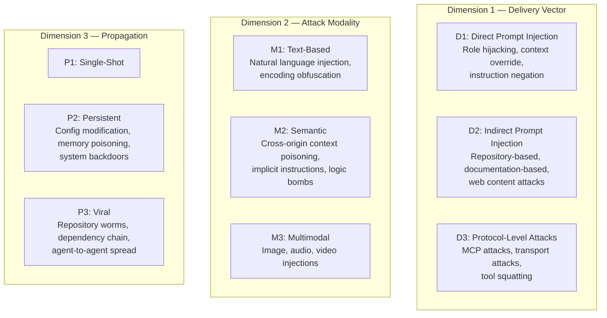
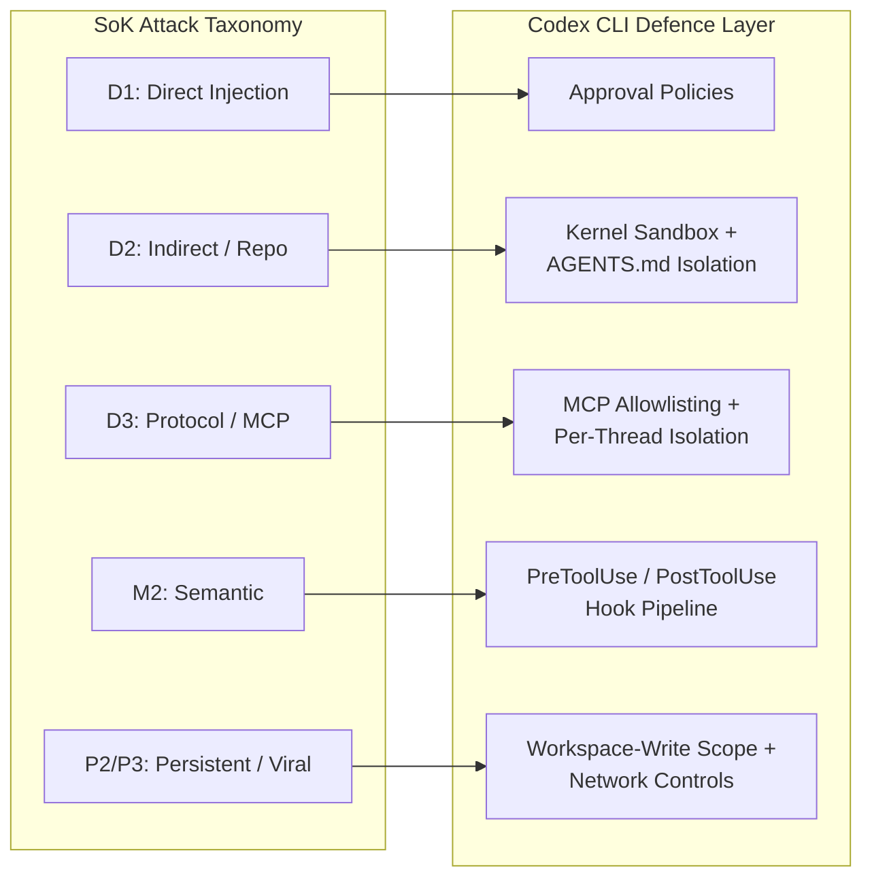

# 42 Ways to Hack Your Coding Agent: What the First SoK on Prompt Injection Means for Codex CLI's Defence Stack


---

A Systematization of Knowledge (SoK) paper published in January 2026 catalogued 42 distinct prompt injection attack techniques targeting agentic coding assistants, synthesised findings from 78 studies spanning 2021–2026, and found that adaptive attacks bypass state-of-the-art defences with success rates between 78 and 93 per cent [^1]. For teams running Codex CLI in production, the paper is the most comprehensive threat map available — and it maps surprisingly well onto Codex CLI's existing defence architecture. This article walks through the taxonomy, matches each attack class to the Codex CLI control that addresses it, and flags the gaps that remain open.

## The Paper at a Glance

Maloyan and Namiot's SoK — "Prompt Injection Attacks on Agentic Coding Assistants: A Systematic Analysis of Vulnerabilities in Skills, Tools, and Protocol Ecosystems" — analyses Claude Code, GitHub Copilot, Cursor, and emerging skill-based architectures [^1]. Its central claim is architectural: LLMs cannot reliably distinguish instructions from data, creating what the authors call a "Von Neumann Bottleneck Analogy" where context windows conflate code and data much as classic buffer overflows do [^1].

The paper proposes a three-dimensional taxonomy and evaluates 18 defence mechanisms, finding that none achieves more than 50 per cent mitigation against sophisticated adaptive attacks [^1].

## The Three-Dimensional Attack Taxonomy

The taxonomy organises 42 techniques across three orthogonal dimensions.



Any given attack occupies a point in this three-dimensional space. A poisoned `.cursorrules` file, for instance, is D2 × M2 × P2: indirect delivery via a repository artefact, semantic modality exploiting implicit trust in configuration, and persistent because it survives across sessions [^1].

## Five Attack Classes and Their Real-World CVEs

The SoK documents over 30 CVEs across major coding assistants [^1]. The five primary attack categories, with representative incidents:

### 1. Input Manipulation

Classic direct and indirect prompt injection. The AIShellJack framework demonstrated 314 unique payloads covering 70 MITRE ATT&CK techniques, exploiting `.cursorrules` and `.github/copilot-instructions.md` files [^1]. Success rates ranged from 41 to 84 per cent across platforms, with data exfiltration achieving the highest rate [^1].

### 2. Tool Poisoning

Malicious tool descriptions exploit the implicit trust agents place in tool metadata. The MalTool benchmark catalogued 6,487 malicious tools targeting LLM-based agents, with VirusTotal failing to detect the majority [^2]. Tool squatting — registering tools with names similar to legitimate ones — mirrors the typosquatting problem in package registries.

### 3. Protocol Exploitation

MCP vulnerabilities including tool shadowing (a malicious MCP server overriding a legitimate tool's description) and rug pulls (updating tool behaviour after approval). CVE-2025-49150 demonstrated RCE via MCP in Cursor [^1]. The Toxic Agent Flow attack used HTML comments in GitHub issues to coerce agents into accessing private files through repository tokens without confirmation prompts [^1].

### 4. Multimodal Injection

Non-textual attack vectors using images or encoded content. While less prevalent in terminal-based coding agents, the growing adoption of screenshot-based context (Chronicle, AppShots) expands this surface [^3].

### 5. Cross-Origin Context Poisoning

Semantic attacks exploiting code understanding. The Log-To-Leak technique operates through side channels: trigger conditions, tool binding, justification framing, and urgency pressure — making the agent believe exfiltration is a legitimate debugging step [^1].

## The Defence Scorecard: 18 Mechanisms, None Sufficient Alone

The SoK evaluated 18 defence mechanisms across three categories [^1]:

| Category | Mechanisms | Bypass Rate (Adaptive) |
|---|---|---|
| **Detection-based** | Input sanitisation, keyword filtering, regex, LLM classification, output monitoring | 78–93% |
| **Prevention-based** | Instruction hierarchy training, capability scoping, permission models, ETDI cryptographic provenance | 60–85% |
| **Runtime** | Multi-agent validation, PromptArmor, content moderation (Llama Guard, NeMo Guardrails) | 70–90% |

The core finding: no single mechanism works. The authors advocate defence-in-depth with architectural separation — policy gates, least privilege, and auditing — over brittle prompt filtering [^1].

## Mapping the Taxonomy to Codex CLI's Defence Stack

Codex CLI's architecture implements exactly the defence-in-depth strategy the SoK recommends. Here is how each attack dimension maps to Codex CLI controls.

### Against D1 (Direct Prompt Injection): Approval Policies

Codex CLI's three approval modes — `suggest`, `auto-edit`, and `full-auto` — gate tool execution at the user level [^4]. Even in `full-auto`, the kernel sandbox constrains what the agent can actually execute. Direct prompt injection can manipulate the model's intent, but the sandbox prevents that intent from reaching the filesystem or network without policy approval.

### Against D2 (Indirect Injection via Repositories): Sandbox + AGENTS.md Isolation

Repository-based attacks — poisoned rule files, malicious documentation — are the highest-risk vector. Codex CLI mitigates this through:

- **Kernel-level sandbox** (Seatbelt on macOS, bwrap + seccomp on Linux) that enforces filesystem write boundaries regardless of what the model believes it should do [^5]
- **AGENTS.md** as guidance, not executable policy — unlike `.cursorrules` in Cursor, AGENTS.md instructions are soft constraints shaped by the model but enforced by sandbox and hooks [^6]
- **External context isolation** via the `disable_on_external_context` flag in Memories configuration, preventing untrusted repository content from persisting into agent memory [^7]

### Against D3 (Protocol-Level / MCP Attacks): MCP Allowlisting and Per-Thread Isolation

The SoK's MCP attack vectors — tool shadowing, rug pulls, transport attacks — are addressed by:

- **MCP server allowlisting** in `requirements.toml`, restricting which MCP servers can be activated [^8]
- **Per-thread plugin MCP activation** (v0.141+), scoping MCP servers exclusively to the selecting thread with executor-bound filesystem resolution and frozen snapshots [^9]
- **Stdio-only filtering** that blocks non-stdio MCP transports, reducing the transport attack surface [^9]

### Against M2 (Semantic Attacks): PreToolUse/PostToolUse Hooks

Logic bombs and justification-framing attacks exploit the gap between model intent and tool execution. Codex CLI's hook pipeline provides the inspection layer:

```toml
# requirements.toml — PreToolUse hook blocking suspicious patterns
[[hooks]]
event = "PreToolUse"
command = ["python3", "scripts/injection-scanner.py"]
timeout_ms = 5000
on_failure = "block"
```

PreToolUse hooks fire before every tool call, enabling pattern matching, LLM-based classification, or integration with guardrail frameworks like LlamaFirewall [^10] [^11]. PostToolUse hooks can scan output for exfiltration indicators.

### Against P2/P3 (Persistent and Viral Propagation): Workspace-Scoped Writes + Network Controls

Persistent attacks modify configuration; viral attacks spread through repositories and dependencies. Codex CLI counters both:

- **Workspace-write sandbox** restricts file modifications to the project directory, preventing configuration poisoning in `~/.codex/` or system paths [^5]
- **Network disabled by default** in workspace-write mode, with domain-filtered proxy requiring explicit allowlists for outbound connections [^12]
- **Declarative permission profiles** that can be committed to version control, ensuring the entire team runs with identical security constraints [^4]



## The Platform Vulnerability Assessment

The SoK's Table IV rates each platform across its vulnerability dimensions [^1]:

| Platform | D2 (Indirect) | D3 (Protocol) | M2 (Semantic) | Overall |
|---|---|---|---|---|
| **Claude Code** | Medium | Low | Low | Low |
| **Cursor** | High | High | High | Critical |
| **Copilot** | High | Medium | Medium | High |

Codex CLI was not included in the original assessment but shares architectural properties with Claude Code's sandboxed model — kernel-level enforcement, disabled-by-default networking, and hook-based policy gates — suggesting a similarly low overall vulnerability rating. The key differentiator is Codex CLI's `requirements.toml` managed hooks, which provide enterprise-wide policy enforcement without relying on per-developer configuration [^8].

## What the SoK Gets Right — and Where Gaps Remain

### Confirmed by Codex CLI's Architecture

The SoK's central recommendation — defence-in-depth over prompt filtering — aligns precisely with Codex CLI's layered approach. The paper's finding that "LLMs cannot reliably distinguish between instructions and data" [^1] explains why Codex CLI enforces security at the sandbox and hook level rather than relying on the model to resist manipulation.

### Open Gaps

Three areas identified by the SoK remain partially unaddressed:

1. **Real-time egress inspection**: The SoK notes that no coding agent ships real-time egress inspection [^1]. Codex CLI's network proxy provides domain filtering but not deep packet inspection of exfiltrated content within allowed domains. ⚠️

2. **Multimodal injection via Chronicle/AppShots**: As Codex expands screenshot-based context features, the M3 (multimodal) attack surface grows. The current sandbox does not inspect image content for embedded instructions [^3]. ⚠️

3. **Agent-to-agent propagation (P3)**: Multi-agent delegation modes (v0.142+) create new propagation paths. While rollout token budgets constrain resource consumption, there is no explicit cross-thread prompt injection barrier beyond the per-thread MCP isolation [^13]. ⚠️

## Practical Recommendations

For teams hardening their Codex CLI deployments against the SoK's 42 attack techniques:

1. **Run in workspace-write mode** with network disabled by default — this blocks the majority of D2 and P2 attacks at the kernel level
2. **Deploy PreToolUse hooks** scanning for injection patterns, particularly for teams using MCP servers that ingest external content
3. **Restrict MCP servers** via `requirements.toml` allowlists — tool squatting and shadowing only work when arbitrary MCP servers can be activated
4. **Use named permission profiles** committed to version control, ensuring consistent security posture across the team
5. **Audit AGENTS.md files** in pull reviews — these are the primary indirect injection vector for repository-based attacks
6. **Enable `disable_on_external_context`** in Memories configuration for projects that process untrusted input

## Conclusion

The Maloyan–Namiot SoK is the most rigorous mapping of the prompt injection threat landscape for coding assistants published to date. Its 42-technique catalogue and three-dimensional taxonomy provide a structured framework for security assessment that goes beyond ad-hoc vulnerability disclosure. Codex CLI's defence stack — kernel sandbox, hook pipeline, MCP allowlisting, network controls, and approval policies — addresses the majority of the taxonomy's attack classes through architectural enforcement rather than prompt-level filtering. The open gaps — egress inspection, multimodal injection, and cross-agent propagation — represent the frontier for the next generation of coding agent security.

## Citations

[^1]: Maloyan, N. and Namiot, D. (2026) "Prompt Injection Attacks on Agentic Coding Assistants: A Systematic Analysis of Vulnerabilities in Skills, Tools, and Protocol Ecosystems," *arXiv:2601.17548*. Available at: [https://arxiv.org/abs/2601.17548](https://arxiv.org/abs/2601.17548)

[^2]: MalTool: Malicious Tool Attacks on LLM Agents (2026), *arXiv:2602.12194*. Available at: [https://arxiv.org/abs/2602.12194](https://arxiv.org/abs/2602.12194)

[^3]: OpenAI (2026) "Chronicle — Codex," *OpenAI Developers*. Available at: [https://developers.openai.com/codex/memories/chronicle](https://developers.openai.com/codex/memories/chronicle)

[^4]: OpenAI (2026) "Features — Codex CLI," *OpenAI Developers*. Available at: [https://developers.openai.com/codex/cli/features](https://developers.openai.com/codex/cli/features)

[^5]: OpenAI (2026) "CLI — Codex," *OpenAI Developers*. Available at: [https://developers.openai.com/codex/cli](https://developers.openai.com/codex/cli)

[^6]: OpenAI (2026) "Custom instructions with AGENTS.md — Codex," *OpenAI Developers*. Available at: [https://developers.openai.com/codex/guides/agents-md](https://developers.openai.com/codex/guides/agents-md)

[^7]: OpenAI (2026) "Changelog — Codex," *OpenAI Developers*. Available at: [https://developers.openai.com/codex/changelog](https://developers.openai.com/codex/changelog)

[^8]: OpenAI (2026) "Best practices — Codex," *OpenAI Developers*. Available at: [https://developers.openai.com/codex/learn/best-practices](https://developers.openai.com/codex/learn/best-practices)

[^9]: Codex CLI v0.141.0 release notes (18 June 2026). Available at: [https://github.com/openai/codex/releases](https://github.com/openai/codex/releases)

[^10]: OpenAI (2026) "Command line options — Codex CLI," *OpenAI Developers*. Available at: [https://developers.openai.com/codex/cli/reference](https://developers.openai.com/codex/cli/reference)

[^11]: Meta (2025) "LlamaFirewall," *arXiv:2505.03574*. Available at: [https://arxiv.org/abs/2505.03574](https://arxiv.org/abs/2505.03574)

[^12]: Codex CLI Network Proxy documentation. Available at: [https://developers.openai.com/codex/cli](https://developers.openai.com/codex/cli)

[^13]: Codex CLI v0.142.0 release notes (22 June 2026). Available at: [https://github.com/openai/codex/releases](https://github.com/openai/codex/releases)
