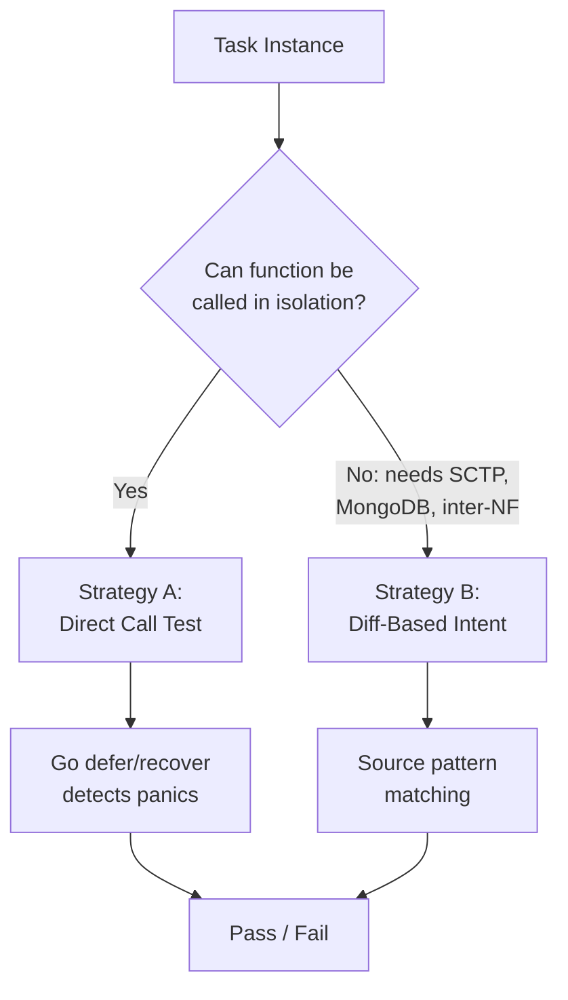
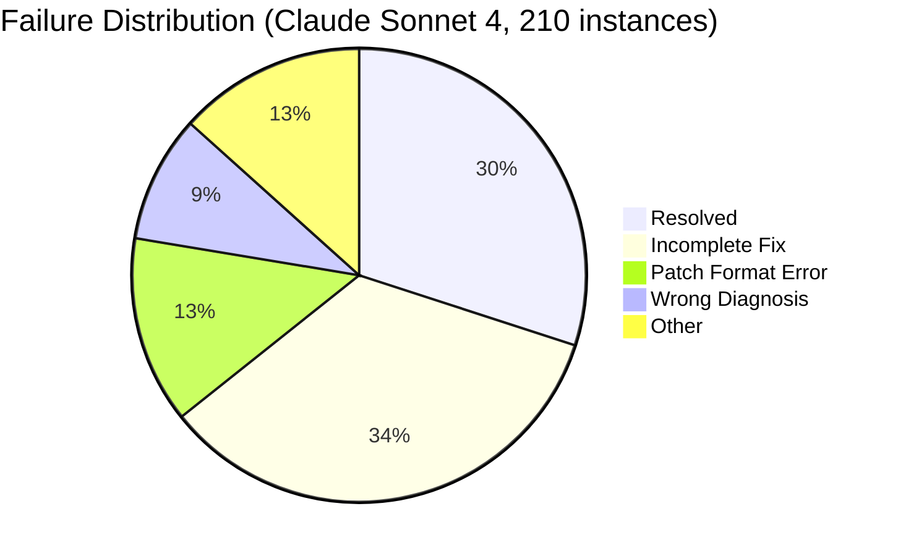
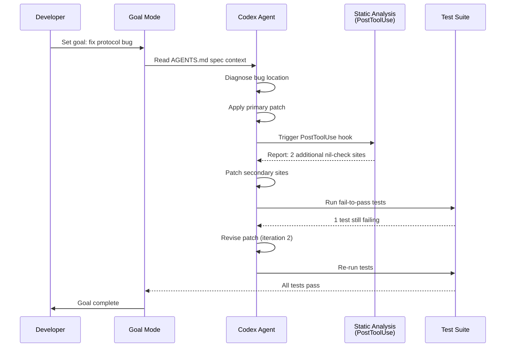

# SWE-Bench 5G and the Domain Knowledge Wall: What the First Telecom Coding Agent Benchmark Reveals About Specification-Driven Development with Codex CLI


---

Every SWE-bench variant to date has evaluated coding agents on Python-heavy, general-purpose repositories where the models' pre-training data gives them a structural advantage. SWE-Bench 5G (arXiv:2604.26278, April 2026) breaks that pattern entirely [^1]. It is the first benchmark to evaluate AI coding agents on 5G core network software — protocol-specified, distributed telecommunications code written in Go and C — and the results expose a failure mode that matters far beyond telecoms: **agents can diagnose bugs at rates exceeding 91%, yet resolve only 10–30% of them** [^1].

The gap between diagnosis and resolution is the domain knowledge wall. Understanding what it means for Codex CLI workflows is the subject of this article.

## What SWE-Bench 5G Measures

### The Dataset

SWE-Bench 5G draws from three open-source 5G core network implementations [^1]:

| Project | Language | Instances | Repositories | Notes |
|---------|----------|-----------|-------------|-------|
| **free5GC** | Go | 128 | 20 | Linux Foundation; modular, one repo per Network Function [^2] |
| **Open5GS** | C | 58 | 1 | Monolithic; widely deployed in research testbeds [^3] |
| **Magma** | Go/Python | 24 | 12 | Originally Meta; hybrid access gateway architecture [^4] |

That gives 210 validated task instances across 33 repositories, covering 7 Network Functions (AMF, SMF, UPF, NRF, AUSF, UDM, PCF) and spanning protocol-level bugs from nil-pointer dereferences to 3GPP specification compliance failures [^1].

### The Dual Test Strategy

Standard SWE-bench relies on fail-to-pass unit tests. Telecom code makes that impractical — many functions require live SCTP connections, MongoDB contexts, or inter-NF signalling that cannot be trivially mocked. SWE-Bench 5G addresses this with a dual strategy [^1]:

- **Strategy A (Direct Call):** Invokes buggy functions with crash-triggering inputs, using Go's `defer`/`recover` mechanism to detect panics. Applied to 68 instances.
- **Strategy B (Diff-Based Intent):** Verifies that the patched source contains expected fix patterns rather than testing runtime behaviour. Applied to 142 instances.



### 3GPP Specification Injection

For task instances whose original issues reference 3GPP Technical Specification clauses, the researchers constructed concise specification context documents averaging 350 tokens. These documents summarise protocol semantics — field optionality constraints, NF behaviour expectations — without revealing the fix [^1].

## The Results: Diagnosis Without Resolution

Four models were evaluated in multi-turn mode with a maximum of five iterations [^1]:

| Model | Resolve Rate | Patch Application Rate | Bug Diagnosis Rate |
|-------|-------------|----------------------|-------------------|
| Claude Sonnet 4 | **30.0%** | 79.5% | >91% |
| GPT-4.1 | 20.0% | 67.1% | >91% |
| Qwen3.5-Flash | 10.0% | 57.1% | >91% |
| Kimi-128k | 10.0% | 51.4% | >91% |

The headline number is the chasm between diagnosis (>91% across the board) and resolution (10–30%). On general-purpose SWE-bench Verified, Claude Sonnet 4 resolves substantially more — the 30% ceiling on 5G tasks represents a significant regression attributable to domain complexity [^1].

### Why Agents Fail

The dominant failure mode is **incomplete fixes**: agents address part of a bug but miss additional dereference sites, edge cases, or specification-mandated validation paths. Between 72 and 80 instances per model fell into this category [^1].

**Patch format errors** compound the problem for weaker models. Qwen3.5-Flash produced 75 instances and Kimi-128k produced 84 instances where correct reasoning produced non-matching `SEARCH` blocks — the agent understood the fix but could not express it as a valid patch against Go or C source with deeply nested NF signatures [^1].



### Specification Context: Conditional Gains

When 3GPP specification excerpts were injected for Claude Sonnet 4 across 50 task instances [^1]:

- **Specification-dependent bugs** (validation errors, protocol logic) saw +16.7% to +25.0% improvement in resolve rate.
- **Generic bugs** (nil checks, crash guards) saw 0% improvement.
- **Token overhead:** approximately 12%.

The implication is clear: domain knowledge helps, but only when the bug is specification-driven. Generic defensive coding requires iterative editing capability, not domain context.

## What This Means for Codex CLI

SWE-Bench 5G is not just a telecoms curiosity. It exposes three structural challenges that affect any team using Codex CLI on domain-specific codebases — financial protocols, medical device firmware, automotive control systems, or any software governed by external specifications.

### 1. AGENTS.md as a Specification Bridge

The benchmark's 350-token specification context documents are structurally identical to what belongs in a well-crafted `AGENTS.md` file [^5]. Codex CLI discovers `AGENTS.md` files by walking from the project root down to the current working directory, loading instructions at each level [^5].

For specification-driven codebases, this means your `AGENTS.md` should include:

```markdown
## Protocol Compliance

This project implements 3GPP TS 29.503 (UDM) and TS 29.509 (AUSF).

### Key Constraints
- All NAS message IEs marked OPTIONAL in the spec MUST be nil-checked
  before access. The 5GC treats missing optional IEs as valid absent values,
  not errors.
- SMF session context updates MUST validate against TS 23.502 procedure
  flows before applying state changes.
- Inter-NF HTTP/2 calls follow TS 29.500 error handling: 4xx responses
  are terminal, 5xx trigger retry with exponential backoff.
```

Research shows that developer-written `AGENTS.md` files improve agent task success rates by approximately 4% and reduce agent-generated bugs by 35–55% [^6]. SWE-Bench 5G's specification injection results suggest that for protocol-governed code, the gains are substantially larger — up to 25% on specification-dependent bugs [^1].

### 2. The Incomplete Fix Problem and PostToolUse Hooks

The benchmark's dominant failure mode — incomplete fixes that patch one dereference site but miss three others — maps directly to a known Codex CLI mitigation: PostToolUse hooks that run static analysis after every file write [^7].

For Go codebases (like free5GC), a PostToolUse hook running `go vet` and `staticcheck` would catch many of the nil-pointer omissions that SWE-Bench 5G agents missed:

```toml
# codex.toml — PostToolUse hook for Go projects
[[hooks.post_tool_use]]
command = "go vet ./..."
on_failure = "report"

[[hooks.post_tool_use]]
command = "staticcheck ./..."
on_failure = "report"
```

For C codebases (like Open5GS), equivalent hooks with `cppcheck` or `clang-tidy` catch the same class of incomplete fixes:

```toml
[[hooks.post_tool_use]]
command = "cppcheck --enable=all --error-exitcode=1 src/"
on_failure = "report"
```

### 3. Patch Format Errors and Language-Specific Configuration

SWE-Bench 5G's patch format error rates (28–84 instances per model) stem from Go and C's stricter type systems and deeply nested function signatures [^1]. Codex CLI's model selection directly affects this: GPT-5.5, the current recommended model for Codex, produces substantially fewer patch format errors than smaller models on typed languages [^8].

The configuration that matters:

```toml
# codex.toml — model selection for typed-language codebases
[model]
default = "gpt-5.5"   # Better patch formatting on Go/C
reasoning_effort = "high"  # Worth the token cost for specification-driven fixes
```

### 4. Multi-Turn Iteration Is Non-Negotiable

SWE-Bench 5G found that Qwen3.5-Flash achieved a 0% resolve rate in single-turn mode versus 10% in multi-turn (five iterations) [^1]. This confirms what Codex CLI's Goal Mode is designed for: sustained, multi-step reasoning where the agent can observe test failures, revise patches, and iterate [^9].

For specification-heavy codebases, Goal Mode's persistence across turns is essential. The agent needs to:

1. Read the failing test output
2. Cross-reference against specification constraints (from `AGENTS.md`)
3. Patch the primary site
4. Discover secondary sites via static analysis (PostToolUse hooks)
5. Re-run tests and iterate



## The Broader Pattern: Domain-Specific Benchmarks Are Coming

SWE-Bench 5G joins a growing family of domain-specific coding agent benchmarks that move beyond Python web applications [^1]:

- **SWE-Bench 5G** — Telecoms (Go, C)
- **SWE-PolyBench** — Multi-language (12 languages) [^10]
- **SecureVibeBench** — Security-critical C/C++ [^11]
- **ProjDevBench** — Greenfield project development [^12]

The common finding across all of them is that general-purpose benchmark performance does not predict domain-specific performance. Teams evaluating Codex CLI for regulated or specification-governed codebases should treat these specialised benchmarks as the relevant baseline, not SWE-bench Verified.

## Practical Takeaways

1. **Surface domain specifications in `AGENTS.md`.** SWE-Bench 5G demonstrates up to 25% improvement on specification-dependent bugs when protocol context is injected. Keep specification summaries under `project_doc_max_bytes` (32 KiB default) [^5].

2. **Wire PostToolUse hooks for your language's static analysis.** The incomplete fix problem is systematic — agents consistently miss secondary patch sites. `go vet`, `staticcheck`, `cppcheck`, and `clang-tidy` catch what the model misses.

3. **Select the strongest available model for typed languages.** Patch format errors scale inversely with model capability. GPT-5.5 on Codex produces substantially fewer malformed patches on Go and C than smaller alternatives [^8].

4. **Use Goal Mode for specification-driven fixes.** Single-turn performance on domain-specific code approaches zero. Multi-turn iteration with test feedback is the minimum viable workflow.

5. **Benchmark your own domain.** If your codebase is governed by external specifications (financial regulations, medical device standards, automotive safety), SWE-Bench 5G's methodology — fail-to-pass tests in Docker containers with specification context injection — is directly replicable.

---

## Citations

[^1]: Chen, J., Tang, J., Yang, X., & Lv, Z. (2026). *SWE-Bench 5G: Benchmarking AI Coding Agents on Telecom Network Engineering Tasks*. arXiv:2604.26278. [https://arxiv.org/abs/2604.26278](https://arxiv.org/abs/2604.26278)

[^2]: free5GC Project. *Open source 5G core network based on 3GPP R15*. GitHub. [https://github.com/free5gc/free5gc](https://github.com/free5gc/free5gc)

[^3]: Open5GS Project. *C-language Open Source implementation for 5G Core and EPC (Release-19)*. GitHub. [https://github.com/open5gs/open5gs](https://github.com/open5gs/open5gs)

[^4]: Magma Project. *Platform for building access networks and modular network services*. [https://magmacore.org/](https://magmacore.org/)

[^5]: OpenAI. *Custom instructions with AGENTS.md — Codex*. OpenAI Developers. [https://developers.openai.com/codex/guides/agents-md](https://developers.openai.com/codex/guides/agents-md)

[^6]: Augment Code. *How to Build Your AGENTS.md (2026)*. [https://www.augmentcode.com/guides/how-to-build-agents-md](https://www.augmentcode.com/guides/how-to-build-agents-md)

[^7]: OpenAI. *Security — Codex*. OpenAI Developers. [https://developers.openai.com/codex/security](https://developers.openai.com/codex/security)

[^8]: OpenAI. *Changelog — Codex*. OpenAI Developers. [https://developers.openai.com/codex/changelog](https://developers.openai.com/codex/changelog)

[^9]: OpenAI. *Run long horizon tasks with Codex*. OpenAI Developers. [https://developers.openai.com/blog/run-long-horizon-tasks-with-codex](https://developers.openai.com/blog/run-long-horizon-tasks-with-codex)

[^10]: SWE-PolyBench. *Multi-Language Benchmark for Coding Agents*. arXiv. Referenced from Codex Knowledge Base coverage.

[^11]: SecureVibeBench. *Secure Vibe Coding Benchmark (ACL 2026)*. arXiv:2509.22097v5.

[^12]: ProjDevBench. *Benchmarking AI Coding Agents on End-to-End Project Development*. arXiv:2602.01655.
