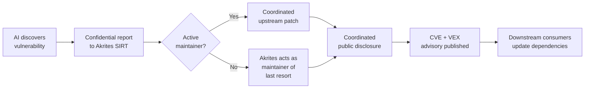
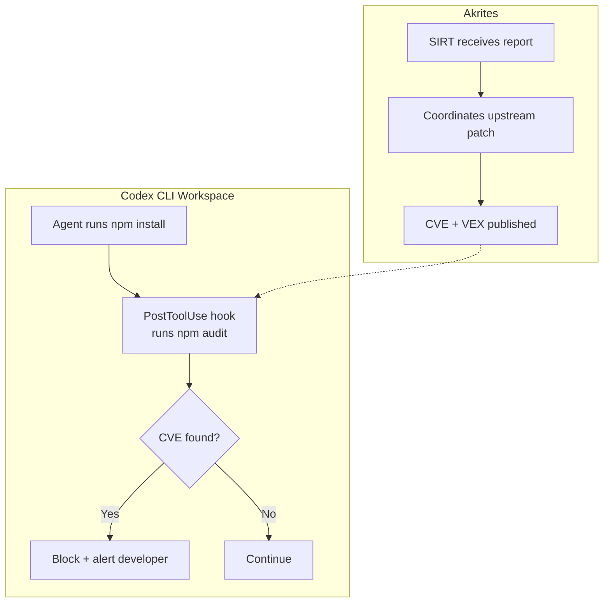

# Akrites and the AI Vulnerability Flood: What the Linux Foundation's Emergency Coalition Means for Codex CLI Developers and Open-Source Dependency Defence


---

On 25 June 2026, the Linux Foundation launched **Akrites**, a coordinated industry effort to identify, remediate, and responsibly disclose vulnerabilities in critical open-source software before they are exploited [^1]. Twenty founding members — including OpenAI, Anthropic, Google, Microsoft, Amazon, NVIDIA, and Red Hat — signed an open letter acknowledging a stark new reality: frontier AI models can scan a major open-source project and surface serious vulnerabilities in minutes, a task that previously required an expert weeks [^2].

For Codex CLI users, Akrites is not an abstract policy initiative. Every `npm install`, `pip install`, or `cargo add` pulls open-source dependencies into the sandbox. If AI-accelerated discovery outpaces upstream patching, your agent's workspace inherits the risk. This article maps Akrites to the Codex CLI developer workflow and shows how to build a dependency defence posture that keeps pace with machine-speed vulnerability discovery.

## The Problem: Negative Mean Time to Exploit

Linux Foundation CEO Jim Zemlin framed the urgency bluntly: "the mean time to exploit a vulnerability in software is now negative seven days" — meaning vulnerabilities are weaponised before they are publicly discovered [^3]. The Akrites open letter adds that fewer than 5% of the thousands of recently surfaced open-source vulnerabilities have received patches [^2].

The numbers from OpenAI's own security work reinforce the scale. Within its first thirty days, the Codex Security research preview scanned over 1.2 million commits across external repositories, surfacing 792 critical findings and 10,561 high-severity issues [^4]. Anthropic's red team used Claude to find 22 security-sensitive vulnerabilities in Firefox in a two-week engagement, 14 classified as high severity [^5].

This is the world Codex CLI operates in: the same agentic capabilities that write your code can also find the holes in your dependencies — and so can an adversary's agent.

## How Akrites Works

Akrites establishes three operational mechanisms under the Linux Foundation umbrella [^1]:



### 1. Shared Security Incident Response Team (SIRT)

A single, trusted SIRT receives vulnerability reports and manages remediation across projects. The design explicitly avoids the current pattern of "a flood of uncoordinated reports" that overwhelms maintainers [^1]. Reports follow confidentiality-first principles using industry-standard tooling: CVE identifiers, Traffic Light Protocol (TLP) markings, CWE classifications, CVSS scoring, EPSS predictions, and VEX statements [^3].

### 2. Upstream-First Remediation

Bug fixes flow back into each project's original repository, on maintainers' terms. Akrites does not fork or patch downstream — it coordinates with maintainers to land fixes upstream before public disclosure [^1].

### 3. Maintainer of Last Resort

Where a critical package has no active maintainer, Akrites assumes maintenance responsibility for security fixes. This addresses the long tail of abandoned-but-critical libraries that underpin production systems across banking, telecommunications, and utilities [^2].

Seed funding comes from Alpha-Omega, a Linux Foundation directed fund already addressing critical open-source vulnerabilities. Government defenders are coordinated through a public-private response channel [^1].

## Why Codex CLI Developers Should Care

OpenAI is a founding member of Akrites [^1]. This is not incidental — it reflects the dual reality that OpenAI's models both discover and depend on the same open-source ecosystem. Every Codex CLI workspace pulls from that ecosystem, and the agent's sandbox does not insulate you from vulnerable transitive dependencies that ship in your final artefact.

### The Dependency Attack Surface

A typical Node.js project pulls 300–1,000 transitive dependencies. A Python ML project can easily exceed 200. When AI models reduce vulnerability discovery time from weeks to minutes, the window between discovery and exploitation collapses. The Codex CLI sandbox prevents the agent from exfiltrating data at runtime, but it does nothing to prevent a vulnerable dependency from shipping into production.

### The Codex Security Plugin

The first-party Codex Security plugin, which reached the CLI in June 2026, exposes four skills covering the full application security triage cycle [^6]:

| Skill | Purpose |
|-------|---------|
| **Repository scan** | Broad sweep across the codebase for known vulnerability patterns |
| **Deep scan** | High-recall analysis of specific components |
| **Diff-scoped review** | Security review of uncommitted or staged changes |
| **Single-finding remediation** | Guided fix for an individual vulnerability with evidence |

Running a repository scan before merging agent-generated code is the minimum viable security practice. The plugin validates high-signal issues in an isolated environment before surfacing them, reducing false positives [^6].

## Building a Dependency Defence Posture with Codex CLI

The following configuration layers combine Codex CLI's existing governance features with Akrites-era security practices.

### Layer 1: PreToolUse Hook for Dependency Auditing

A `PreToolUse` hook can intercept `npm install`, `pip install`, `cargo add`, and similar commands to run an audit check before the agent adds new dependencies [^7]:

```toml
# .codex/config.toml — dependency audit hook

[[hooks]]
event = "PreToolUse"
tool = "shell"
command = "node .codex/hooks/dep-audit.mjs"
timeout_ms = 30000
```

The hook script inspects the pending command and triggers an audit:

```javascript
// .codex/hooks/dep-audit.mjs
import { readFileSync } from "fs";

const event = JSON.parse(readFileSync("/dev/stdin", "utf8"));
const cmd = event.tool_input?.command ?? "";

const installPatterns = [
  /npm\s+install/,
  /yarn\s+add/,
  /pnpm\s+add/,
  /pip\s+install/,
  /cargo\s+add/,
];

if (installPatterns.some((p) => p.test(cmd))) {
  // Allow the install, then a PostToolUse hook runs the audit
  process.exit(0);
}

process.exit(0);
```

### Layer 2: PostToolUse Audit Gate

After the dependency is installed, a `PostToolUse` hook runs the ecosystem-specific audit tool:

```toml
[[hooks]]
event = "PostToolUse"
tool = "shell"
command = "node .codex/hooks/post-install-audit.mjs"
timeout_ms = 60000
```

```javascript
// .codex/hooks/post-install-audit.mjs
import { readFileSync } from "fs";
import { execSync } from "child_process";

const event = JSON.parse(readFileSync("/dev/stdin", "utf8"));
const cmd = event.tool_input?.command ?? "";

if (/npm\s+install|yarn\s+add|pnpm\s+add/.test(cmd)) {
  try {
    execSync("npm audit --audit-level=high", { stdio: "pipe" });
  } catch {
    console.error("HIGH/CRITICAL vulnerabilities found — review before merge");
    process.exit(1); // Block further tool use until resolved
  }
}

process.exit(0);
```

### Layer 3: AGENTS.md Security Policy

Encode dependency governance in `AGENTS.md` so the model understands the project's security stance:

```markdown
## Security Policy

- NEVER add dependencies without checking for known CVEs
- Run `npm audit` after any dependency change
- Prefer well-maintained packages (last commit within 6 months)
- Flag any dependency with 0 maintainers or archived status
- When the Codex Security plugin is available, run a diff-scoped
  review before committing security-sensitive changes
```

### Layer 4: Permission Profile for CI

Lock down the CI permission profile to prevent the agent from bypassing audit checks:

```toml
[permissions.ci-secure]
read = ["/workspace/**"]
write = ["/workspace/src/**", "/workspace/tests/**"]
network = ["registry.npmjs.org", "pypi.org"]
```

This restricts network access to package registries and prevents writes outside `src/` and `tests/`, blocking the agent from modifying lock files or audit configurations [^8].

## The Akrites-Codex Feedback Loop



The feedback loop works because Akrites publishes CVEs and VEX statements through standard channels that `npm audit`, `pip-audit`, `cargo audit`, and similar tools already consume. When Akrites coordinates a patch and publishes the advisory, the next Codex CLI session that installs or updates dependencies will catch it — provided the hooks are in place.

## What Akrites Does Not Solve

Akrites addresses coordinated disclosure and upstream patching, but several gaps remain for Codex CLI developers:

- **Zero-day window**: Between AI discovery and Akrites disclosure, the vulnerability exists unpatched. The Codex Security plugin's diff-scoped review can catch patterns in your own code, but it cannot detect undisclosed vulnerabilities in upstream dependencies.
- **Transitive depth**: Audit tools flag direct and first-level transitive dependencies, but deeply nested vulnerabilities may not surface until the advisory propagates through the dependency graph.
- **Abandoned ecosystems**: Akrites's maintainer-of-last-resort commitment covers "critical packages," but the definition of critical is not yet published. Niche libraries in long-tail ecosystems may not qualify.
- **Agent-introduced dependencies**: When Codex CLI autonomously selects a library to solve a subtask, it may choose a package the developer has never evaluated. The AGENTS.md policy and PreToolUse hooks mitigate this, but do not eliminate it.

## Practical Checklist

For teams adopting Codex CLI in an Akrites-aware security posture:

1. **Install the Codex Security plugin** and run repository scans on every main branch merge [^6]
2. **Add PreToolUse/PostToolUse hooks** that gate dependency additions on `npm audit` / `pip-audit` / `cargo audit` [^7]
3. **Encode dependency policy in AGENTS.md** so the model avoids abandoned or flagged packages
4. **Pin a CI-secure permission profile** that restricts network access to known registries [^8]
5. **Monitor Akrites advisories** via standard CVE feeds — the VEX statements will flow into your existing audit tooling
6. **Run diff-scoped security reviews** on agent-generated PRs before merge, especially when the agent introduced new dependencies
7. **Track the Akrites "critical packages" list** when published — these are the dependencies most likely to receive accelerated patching

## Conclusion

Akrites represents the open-source ecosystem's acknowledgement that AI-accelerated vulnerability discovery has changed the security calculus. For Codex CLI developers, the response is not to retreat from open-source dependencies but to build a defence-in-depth workflow that matches the speed of machine-driven discovery: hooks that gate dependency changes, a security plugin that scans before merge, and advisories that flow through the same audit tools the ecosystem already trusts.

OpenAI's founding membership in Akrites signals that the company sees agentic coding and open-source security as the same problem, viewed from different angles. The models that write your code and the models that find the vulnerabilities are converging. Your workflow should converge too.

---

## Citations

[^1]: Linux Foundation, "Linux Foundation and Industry Leaders Launch Akrites to Defend Critical Open Source Software Against AI-Enabled Cyber Threats," press release, 25 June 2026. [https://www.linuxfoundation.org/press/linux-foundation-and-industry-leaders-launch-akrites-to-defend-critical-open-source-software-against-ai-enabled-cyber-threats](https://www.linuxfoundation.org/press/linux-foundation-and-industry-leaders-launch-akrites-to-defend-critical-open-source-software-against-ai-enabled-cyber-threats)

[^2]: Akrites Open Letter, akrites.org, 25 June 2026. [https://akrites.org/letter/](https://akrites.org/letter/)

[^3]: DevOps.com, "Akrites: The Latest Attempt to Protect Open-Source From AI Attacks Has Arrived," 26 June 2026. [https://devops.com/akrites-the-latest-attempt-to-protect-open-source-from-ai-attacks-has-arrived/](https://devops.com/akrites-the-latest-attempt-to-protect-open-source-from-ai-attacks-has-arrived/)

[^4]: The Hacker News, "OpenAI Codex Security Scanned 1.2 Million Commits and Found 10,561 High-Severity Issues," March 2026. [https://thehackernews.com/2026/03/openai-codex-security-scanned-12.html](https://thehackernews.com/2026/03/openai-codex-security-scanned-12.html)

[^5]: Help Net Security, "Critical open-source projects get a new security framework," 26 June 2026. [https://www.helpnetsecurity.com/2026/06/26/akrites-open-source-security-framework/](https://www.helpnetsecurity.com/2026/06/26/akrites-open-source-security-framework/)

[^6]: OpenAI Developers, "Plugin quickstart – Codex Security," 2026. [https://developers.openai.com/codex/security/plugin](https://developers.openai.com/codex/security/plugin)

[^7]: OpenAI Developers, "Hooks – Codex," 2026. [https://developers.openai.com/codex/hooks](https://developers.openai.com/codex/hooks)

[^8]: OpenAI Developers, "Configuration Reference – Codex," 2026. [https://developers.openai.com/codex/config-reference](https://developers.openai.com/codex/config-reference)
