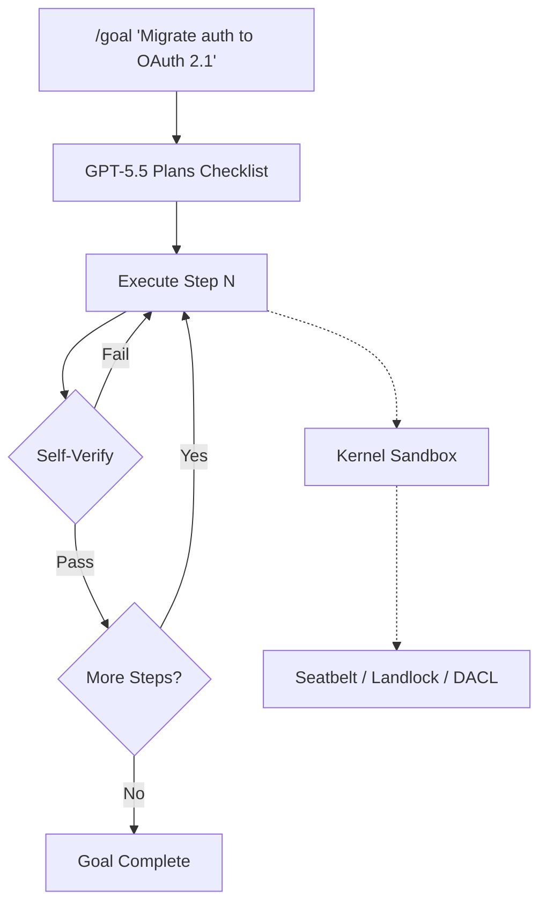
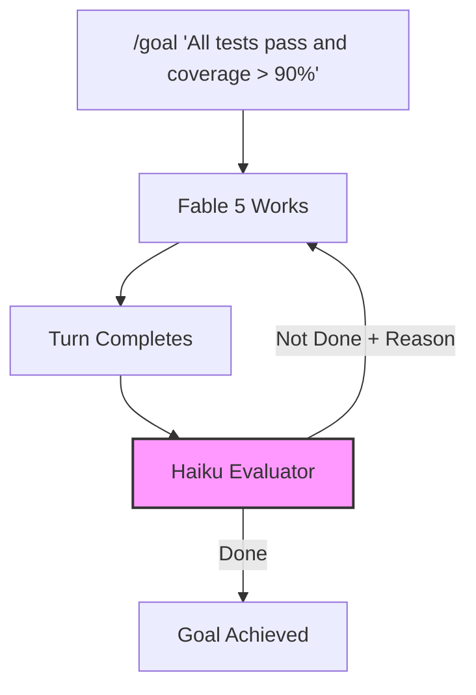
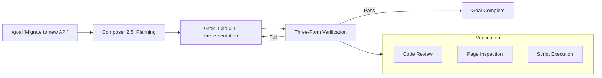

# The Autonomous Execution Convergence: Three Agents, Three Architectures, One /goal Command


Within five weeks of each other, the three dominant terminal-native coding agents — Codex CLI, Claude Code, and Grok Build — each shipped a `/goal` command that lets developers hand off a bounded objective, walk away, and return to verified results. The naming convergence is not coincidental: it reflects a shared conclusion that the turn-by-turn interaction model is the wrong abstraction for serious engineering work. But beneath the identical slash command lies three radically different architectural bets on how autonomous execution should work.

## The Timeline

The convergence happened fast[^1][^2][^3]:

| Agent | Command | GA / Beta Date | Underlying Model(s) |
|---|---|---|---|
| Codex CLI | `/goal` | GA — 21 May 2026 | GPT-5.5 (single model) |
| Claude Code | `/goal` | Stable — 11 May 2026 (v2.1.139) | Fable 5 + Haiku evaluator |
| Grok Build | `/goal` | Beta — 22 June 2026 | Composer 2.5 + Grok Build 0.1 |

All three removed the developer from the turn-by-turn loop for bounded tasks. All three added pause, resume, and status controls. All three run verification before marking a goal complete. The surface API is nearly identical — the architecture underneath is not.

## Architecture 1: Codex CLI — Single-Model Sandbox Loop

Codex CLI's Goal Mode runs a single model (GPT-5.5 by default, configurable to GPT-5.4 or GPT-5.3-Codex) inside the same kernel-level sandbox used for all agent execution[^4]. The model plans, executes, and self-verifies within one context window.



Key architectural choices:

- **Token budgets** enforce cost ceilings per goal. Configurable via `rollout_token_budget` in `config.toml`, the agent receives remaining-budget reminders and aborts when exhausted[^5].
- **Delegation modes** control whether the goal-running agent can spawn subagents: `disabled`, `explicit-request-only`, or `proactive`[^6].
- **Sandbox continuity** — the same Seatbelt (macOS), Landlock (Linux), or DACL (Windows) sandbox that constrains interactive sessions also constrains autonomous execution[^7]. No escape hatch.
- **Hook pipeline** — `PreToolUse` and `PostToolUse` hooks fire during autonomous execution exactly as they do in interactive mode, meaning enterprise governance rules apply identically[^8].

```toml
# config.toml — Goal Mode with budget and delegation
[goal]
rollout_token_budget = 500000
delegation_mode = "explicit-request-only"

[sandbox]
permission_profile = "locked-down"
```

The strength of this approach is simplicity: one model, one sandbox, one governance stack. The weakness is that self-verification lacks an independent perspective — the same weights that wrote the code also judge it.

## Architecture 2: Claude Code — Split Evaluator

Claude Code's `/goal` command introduced a genuinely novel mechanism: it separates the model that does the work from the model that decides whether the work is done[^9].



The evaluator — Haiku by default — receives the conversation transcript after each turn and returns a binary yes/no decision with a short reason[^10]. If the answer is no, the reason is injected into the next turn as guidance. The evaluator does not call tools; it can only judge what the working model has surfaced in conversation.

This split-model architecture provides genuine independence: the evaluator's weights are entirely separate from the executor's, reducing the risk of confirmation bias in self-assessment. The cost overhead is negligible — Haiku evaluation tokens are typically a rounding error compared to Fable 5 working tokens[^10].

Claude Code also offers complementary autonomous mechanisms: Auto Mode (shipped March 2026) for permission-free execution, Routines (April 2026) for scheduled tasks, and Background Agents for headless CI-style work[^11].

## Architecture 3: Grok Build — Multi-Model Pipeline with Arena Heritage

Grok Build's `/goal` takes the multi-model concept further than Claude Code, running a full pipeline across distinct models for distinct phases[^12]:



Key differentiators:

- **Two-model pipeline**: Composer 2.5 handles planning and complex instruction-following; Grok Build 0.1 handles code generation and execution[^12]. The rationale is that planning and implementation are fundamentally different cognitive tasks.
- **Three-form verification**: the agent checks its work through code review, page inspection (for frontend changes), and script execution — choosing verification methods appropriate to the change type[^13].
- **Subagent parallelism**: Grok Build can run up to eight parallel subagents within a single goal, each handling different aspects of the checklist simultaneously[^14].
- **Arena Mode heritage**: Grok Build's earlier Arena Mode — which scores and ranks competing outputs before developer review — influences the verification philosophy[^14]. The verification pass treats the agent's own output with the same scepticism it would apply to a competitor's.
- **Agent Dashboard**: the `grok dashboard` command (or `Ctrl+\`) provides a single screen for managing multiple concurrent goal sessions, with sessions sorted by state and blocker-first ordering[^15].

The weakness is cost: a SuperGrok Heavy subscription (\$300/month) is required for full `/goal` access[^16], and the multi-model pipeline burns tokens at both the planning and execution tiers. The 2-million-token context window from the underlying Grok-4.20 Beta infrastructure enables extended workflows but multiplies spend on long goals[^16].

## The Verification Problem

The most revealing difference across all three implementations is how they handle verification — the question of whether the autonomous agent's work is actually correct.

| Dimension | Codex CLI | Claude Code | Grok Build |
|---|---|---|---|
| **Verification model** | Same as executor | Independent (Haiku) | Three-form pipeline |
| **Verification scope** | Tool outputs + tests | Conversation transcript | Code + pages + scripts |
| **Cost of verification** | Zero marginal | Negligible (Haiku) | Significant (Composer 2.5) |
| **Independence** | None (self-check) | High (separate weights) | Medium (same org's models) |
| **Hook integration** | Full (`PreToolUse`/`PostToolUse`) | CLAUDE.md rules | Limited |
| **Sandbox** | Kernel-level | Container | ⚠️ Not documented |

Codex CLI compensates for single-model self-verification through its hook pipeline: a `PostToolUse` hook can run `cargo test`, `pytest`, or `eslint` after every tool invocation during autonomous execution, providing external ground truth that the model cannot game[^8]. This is arguably more robust than Claude Code's transcript-only evaluation, because it forces verification through actual execution rather than conversation analysis.

## Configuring Codex CLI Goal Mode for Production

For teams evaluating which autonomous execution model to adopt, Codex CLI's approach offers the most governance surface area. A production-ready configuration:

```toml
# config.toml — Production goal configuration
[goal]
rollout_token_budget = 750000
delegation_mode = "explicit-request-only"

[sandbox]
permission_profile = "locked-down"

[model]
default = "gpt-5.5"
```

```bash
# AGENTS.md — Goal-specific verification hooks
## Goal Mode Hooks

### PostToolUse: run-tests
Run the test suite after every file write during goal execution:
```

```jsonc
// .codex/hooks/post-tool-use-test.json
{
  "event": "PostToolUse",
  "tool": "write_file",
  "command": ["bash", "-c", "cd $CODEX_PROJECT_ROOT && npm test 2>&1 | tail -20"],
  "timeout_ms": 30000,
  "on_failure": "abort"
}
```

This configuration gives you:

1. **Budget ceiling** — 750K tokens prevents cost spirals on runaway goals
2. **Controlled delegation** — subagents spawn only when the goal explicitly requires them
3. **External verification** — `PostToolUse` hooks run the test suite after every write, providing ground truth independent of the model's self-assessment
4. **Sandbox containment** — kernel-level isolation persists through the entire autonomous run

## The Composable Stack Implication

The autonomous execution convergence is part of a broader trend. As The New Stack observed, Cursor, Claude Code, and Codex are forming a composable AI coding stack with orchestration, execution, and review layers rather than consolidating into a single tool[^17]. Goal Mode sits squarely in the execution layer — and the fact that all three agents now support it means developers can mix and match:

- Use Cursor for orchestration and file-level context
- Dispatch long-running goals to Codex CLI or Claude Code for execution
- Pull results back through MCP or Git for review

The `/goal` convergence makes this composition practical because the abstraction is the same: hand off an objective, get back verified results. The architecture underneath determines which trade-offs you accept.

## What This Means for Codex CLI Developers

Three takeaways:

**Self-verification is not enough.** Codex CLI's single-model architecture means you should always pair Goal Mode with `PostToolUse` hooks that run external verification. The model checking its own work is necessary but insufficient — hooks close the gap.

**Token budgets are your primary cost control.** Unlike Claude Code's negligible evaluator overhead or Grok Build's expensive multi-model pipeline, Codex CLI's cost scales linearly with a single model. The `rollout_token_budget` is not optional in production — it is the difference between a \$2 goal and a \$200 one.

**The sandbox advantage is real.** Codex CLI is the only agent that runs autonomous execution inside a kernel-level sandbox with no opt-out. Claude Code uses container isolation; Grok Build's sandboxing during `/goal` execution is not publicly documented[^16]. For regulated environments, this is not a minor distinction.

The autonomous execution race has converged on the same command name. The engineering underneath — single-model with hooks versus split-evaluator versus multi-model pipeline — remains genuinely different, and choosing the right approach depends on whether you optimise for cost, verification independence, or governance surface area.

## Citations

[^1]: OpenAI, "Codex Goal Mode reaches general availability", Codex Changelog, 21 May 2026. [https://developers.openai.com/codex/changelog](https://developers.openai.com/codex/changelog)
[^2]: Anthropic, "Keep Claude working toward a goal", Claude Code Documentation, May 2026. [https://code.claude.com/docs/en/goal](https://code.claude.com/docs/en/goal)
[^3]: xAI, "Introducing /goal", xAI News, 22 June 2026. [https://x.ai/news/introducing-goal](https://x.ai/news/introducing-goal)
[^4]: OpenAI, "Goal Mode: Persistent Objectives with Token Budgets and Autonomous Continuation", Codex Developer Documentation, 2026. [https://developers.openai.com/codex/cli/features](https://developers.openai.com/codex/cli/features)
[^5]: OpenAI, "Configurable rollout token budgets", Codex CLI v0.142.0 release notes, 22 June 2026. [https://github.com/openai/codex/releases](https://github.com/openai/codex/releases)
[^6]: OpenAI, "Multi-agent delegation modes", Codex Configuration Reference, 2026. [https://developers.openai.com/codex/config-reference](https://developers.openai.com/codex/config-reference)
[^7]: OpenAI, "Sandbox — Codex", Codex Developer Documentation, 2026. [https://developers.openai.com/codex/concepts/sandboxing](https://developers.openai.com/codex/concepts/sandboxing)
[^8]: OpenAI, "Features — Codex CLI", Codex Developer Documentation, 2026. [https://developers.openai.com/codex/cli/features](https://developers.openai.com/codex/cli/features)
[^9]: VentureBeat, "Claude Code's /goals separates the agent that works from the one that decides it's done", June 2026. [https://venturebeat.com/orchestration/claude-codes-goals-separates-the-agent-that-works-from-the-one-that-decides-its-done](https://venturebeat.com/orchestration/claude-codes-goals-separates-the-agent-that-works-from-the-one-that-decides-its-done)
[^10]: Anthropic, "Keep Claude working toward a goal — evaluator model", Claude Code Documentation, 2026. [https://code.claude.com/docs/en/goal](https://code.claude.com/docs/en/goal)
[^11]: Agensi, "Claude Code Background Agents + Skills: Autonomous Workflows", 2026. [https://www.agensi.io/learn/claude-code-background-agents-skills](https://www.agensi.io/learn/claude-code-background-agents-skills)
[^12]: MarkTechPost, "xAI Launches /goal in Grok Build, Adding Long-Running Autonomous Execution With Built-In Verification for Multi-Step Coding Tasks", 22 June 2026. [https://www.marktechpost.com/2026/06/22/xai-launches-goal-in-grok-build-adding-long-running-autonomous-execution-with-built-in-verification-for-multi-step-coding-tasks/](https://www.marktechpost.com/2026/06/22/xai-launches-goal-in-grok-build-adding-long-running-autonomous-execution-with-built-in-verification-for-multi-step-coding-tasks/)
[^13]: TechTimes, "Grok Build Ships Autonomous Execution: xAI Agent Now Plans, Runs, and Verifies", 24 June 2026. [https://www.techtimes.com/articles/318976/20260624/grok-build-ships-autonomous-execution-xai-agent-now-plans-runs-verifies.htm](https://www.techtimes.com/articles/318976/20260624/grok-build-ships-autonomous-execution-xai-agent-now-plans-runs-verifies.htm)
[^14]: DevOps.com, "xAI Enters the Coding Agent Race With Grok Build", 2026. [https://devops.com/xai-enters-the-coding-agent-race-with-grok-build/](https://devops.com/xai-enters-the-coding-agent-race-with-grok-build/)
[^15]: Blockchain News, "xAI Launches Grok Build Agent Dashboard for Developers", June 2026. [https://blockchain.news/news/xai-grok-build-agent-dashboard](https://blockchain.news/news/xai-grok-build-agent-dashboard)
[^16]: Basenor, "Grok's New /goal Feature: Autonomous AI Task Execution Explained", June 2026. [https://www.basenor.com/blogs/news/groks-new-goal-feature-autonomous-ai-task-execution-explained](https://www.basenor.com/blogs/news/groks-new-goal-feature-autonomous-ai-task-execution-explained)
[^17]: The New Stack, "Cursor, Claude Code, and Codex are merging into one AI coding stack nobody planned", June 2026. [https://thenewstack.io/ai-coding-tool-stack/](https://thenewstack.io/ai-coding-tool-stack/)
