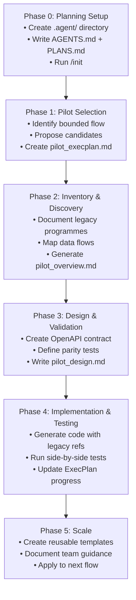
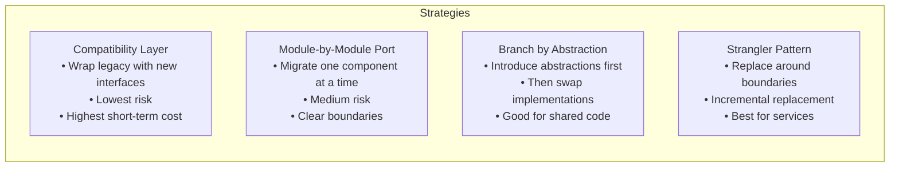
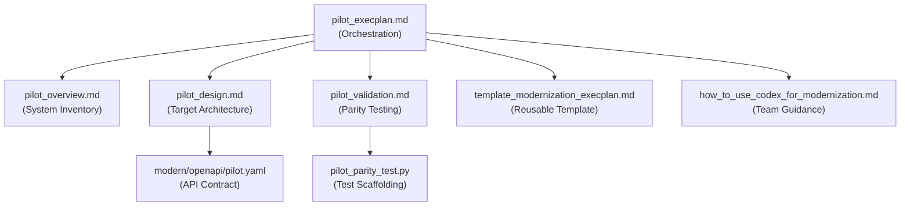

# The ExecPlan Pattern: Plan-Driven Code Migrations with Codex CLI


---

Most developers have inherited a codebase they wish they hadn't. The instinct is to rewrite everything at once — and the result is usually a second legacy system sitting beside the first. OpenAI's official Codex cookbook now formalises a disciplined alternative: the **ExecPlan pattern**, a structured approach to plan-driven code migrations that turns sprawling modernisation work into a sequence of small, testable, agent-executable steps [^1].

This article unpacks the ExecPlan pattern, shows how it integrates with Codex CLI's existing features (Goal Mode, `AGENTS.md`, rollout token budgets), and provides the configuration you need to start using it today.

## What Is an ExecPlan?

An ExecPlan is a self-contained markdown document that encodes everything a coding agent — or a human newcomer — needs to deliver a working feature or system change [^2]. It is not a ticket, not a design document in the traditional sense, and not a TODO list. It is a **living, executable specification** that the agent reads, follows, and updates as work progresses.

The OpenAI cookbook defines ExecPlans as design documents that enable complex tasks spanning multiple hours, functioning as living documents that guide implementation from design through completion [^2].

The key distinction from ordinary planning documents is the **self-containment requirement**: the reader receives only the current working tree and the single ExecPlan file. Every assumption must be stated inline. No external documentation is referenced unless it is checked into the repository.

## Anatomy of an ExecPlan

Every ExecPlan must include these sections [^2]:

### Mandatory Sections

| Section | Purpose |
|---------|---------|
| **Purpose / Big Picture** | What users can accomplish after implementation; how to observe it working |
| **Context and Orientation** | Current state of the system, key files and paths, assuming zero prior knowledge |
| **Plan of Work** | Prose narrative describing the sequence of edits with specific file locations |
| **Concrete Steps** | Exact commands to run, working directories, and expected output transcripts |
| **Validation and Acceptance** | How to exercise the system; acceptance phrased as verifiable behaviour |
| **Idempotence and Recovery** | Safe retry paths and rollback procedures |
| **Progress** | Checkbox list with timestamps showing actual current state |
| **Surprises & Discoveries** | Unexpected findings with evidence (test output preferred) |
| **Decision Log** | Course changes with rationale, date, and author |
| **Outcomes & Retrospective** | Results, gaps, and lessons learned at completion |

The format enforces a critical principle: **observable outcomes over internal attributes**. Acceptance criteria should read "navigating to `http://localhost:8080/health` returns HTTP 200 with body `OK`" rather than "added a `HealthCheck` struct" [^2].

## The Five-Phase Migration Framework

The code modernisation cookbook structures migrations into five phases, each building on the ExecPlan as a central artefact [^1]:



### Phase 0: Planning Setup

Before any migration work begins, establish the planning infrastructure:

```bash
mkdir -p .agent
codex --approval-mode full-auto \
  "Create AGENTS.md and .agent/PLANS.md following the ExecPlan template. \
   Use /init to generate initial agent guidance for this repository."
```

The `AGENTS.md` file should reference ExecPlans explicitly [^2]:

```markdown
## Planning

When writing complex features or significant refactors, use an ExecPlan
(as described in .agent/PLANS.md) from design to implementation.
```

This creates a shared vocabulary — when you tell Codex to "create an ExecPlan", it knows exactly what structure to produce.

### Phase 1: Pilot Selection

Choose a realistic but bounded flow. The cookbook uses a COBOL-based investment portfolio system as its running example [^1], but the pattern applies to any legacy stack: Java EE to Spring Boot, AngularJS to React, monolith to microservices.

```bash
codex "Propose three pilot candidates for modernisation. \
  For each, list involved programmes, jobs, data sources, \
  and business scenarios. Create pilot_execplan.md following \
  the ExecPlan template in .agent/PLANS.md."
```

### Phase 2: Inventory and Discovery

Generate a comprehensive inventory of the legacy surface:

```bash
codex "Create pilot_overview.md documenting: \
  - Legacy programmes, copybooks/includes, and orchestration jobs \
  - Data flows and sequences \
  - Business rules and technical risks \
  - Text diagrams showing component relationships"
```

The official guidance recommends documenting external contracts that must survive the transition — API endpoints, file formats, database schemas, message queues [^3].

### Phase 3: Design with Parity Testing

The cookbook emphasises creating an OpenAPI specification as a language-agnostic contract before writing any implementation code [^1]:

```bash
codex "Create an OpenAPI spec at modern/openapi/pilot.yaml \
  that captures the legacy system's external interface. \
  Then write pilot_validation.md with parity test scenarios \
  covering happy paths and edge cases."
```

This contract serves triple duty: scaffolding the implementation, generating test stubs, and defining integration points.

### Phase 4: Incremental Implementation

The critical principle here is **parity-first implementation** — the modernised code must produce identical outputs to the legacy system before any enhancements are considered [^1] [^3]:

```bash
codex /goal "Implement the pilot migration following pilot_execplan.md. \
  After each milestone: \
  1. Run parity tests comparing legacy vs modern output \
  2. Update the Progress section with timestamps \
  3. Document any surprises in the Discoveries section \
  4. Stop and report if any parity test fails."
```

Using `/goal` here is deliberate — Goal Mode maintains context across multiple turns and verifies completion criteria, which is essential for multi-hour migration work [^4].

## Migration Strategies

The official code migrations documentation identifies four incremental strategies [^3]:



Each strategy maps naturally to ExecPlan milestones. The strangler pattern, for instance, produces milestones like "route `/api/users` to the new service while preserving the legacy path as fallback" — each independently verifiable.

## Integrating ExecPlans with Codex CLI Features

### Rollout Token Budgets

Since v0.142.0, Codex CLI supports configurable rollout token budgets that track usage across agent threads and abort turns when exhausted [^5]. For migrations, this prevents a single phase from consuming your entire budget:

```toml
# ~/.codex/config.toml
[rollout]
token_budget = 500000
budget_warning_threshold = 0.8
```

Each ExecPlan milestone should complete within a predictable token envelope. If Phase 4 consistently exceeds budget, the milestones are too coarse-grained.

### Multi-Agent Delegation

For large migrations, v0.142.0's delegation modes allow you to parallelise independent migration streams [^5]:

```toml
[delegation]
mode = "explicit-request-only"
```

With `explicit-request-only`, subagents are spawned only when the ExecPlan explicitly calls for parallel work — preventing the agent from autonomously splitting tasks in ways that break migration ordering.

### Checkpoint Validation

The official guidance recommends running five validation layers after each milestone [^3]:

1. **Lint checks** — catch formatting and style regressions
2. **Type validation** — ensure interface contracts hold
3. **Focused unit tests** — verify component behaviour
4. **Contract tests** — confirm API compatibility
5. **Side-by-side legacy path verification** — compare actual outputs

This maps directly to Codex CLI hooks that can enforce validation gates:

```toml
# .codex/hooks.toml
[[hooks]]
event = "after-apply"
command = "make lint && make typecheck && make test-parity"
```

## ExecPlan Artefact Map

A complete migration produces a structured set of documents [^1]:



Phase 5 produces the final two artefacts — a reusable ExecPlan template and a team guidance document — making the pattern repeatable across subsequent migration streams.

## Non-Negotiable Principles

The official documentation is emphatic about several requirements that distinguish ExecPlans from ordinary planning documents [^2]:

1. **Self-containment**: The reader has only the working tree and the ExecPlan. Repeat assumptions. Embed all required knowledge.

2. **Prose over lists**: Write in plain sentences. Checklists appear only in the Progress section.

3. **Observable outcomes**: Acceptance criteria describe what you can see, not what the code looks like internally.

4. **Idempotency**: Every step must be safely repeatable. If a step can fail partway through, include retry procedures.

5. **Living maintenance**: Progress, Surprises, and Decision Log sections are updated at every stopping point with timestamps.

The bar is explicit: "a single, stateless agent — or a human novice — can read your ExecPlan from top to bottom and produce a working, observable result" [^2].

## When Not to Use ExecPlans

ExecPlans add overhead that is not always warranted. Skip them for:

- **Bug fixes** where the root cause is already known and the fix is localised
- **Feature additions** that touch fewer than five files
- **Refactors** contained within a single module

The pattern earns its keep when work spans multiple sessions, involves cross-cutting changes, or requires coordination between legacy and modern systems. The official cookbook positions ExecPlans for "complex tasks spanning multiple hours" [^2] — if your task completes in a single turn, a well-written prompt is sufficient.

## Practical Example: Java EE to Spring Boot

While the cookbook uses COBOL, the same framework applies to a Java EE migration. Here is a Phase 1 ExecPlan skeleton:

```markdown
# ExecPlan: Migrate UserService from EJB to Spring Boot

## Purpose / Big Picture

After this migration, the `/api/users` endpoints serve identical JSON
responses from a Spring Boot 3.4 application instead of the legacy
GlassFish EJB container. Both paths run simultaneously during the
transition period; a feature flag controls routing.

## Context and Orientation

The legacy UserService is an EJB 3.2 stateless session bean at
`src/main/java/com/acme/user/UserServiceBean.java`. It depends on
JPA 2.1 entities in `com.acme.user.entity` and is exposed via
JAX-RS at `/api/users`.

## Concrete Steps

    cd /workspace/acme-platform
    ./gradlew :user-service-spring:bootRun
    curl -s http://localhost:8081/api/users/1 | jq .

Expected output:
    {"id": 1, "name": "Jane Doe", "email": "jane@acme.com"}

## Validation and Acceptance

    ./gradlew :user-service-parity:test

All parity tests pass, confirming JSON output matches the legacy
service byte-for-byte (ignoring whitespace differences).

## Progress

- [ ] Create Spring Boot module with JPA 3.1 entities
- [ ] Migrate UserServiceBean logic to UserService @Service
- [ ] Wire JAX-RS endpoints to Spring @RestController
- [ ] Implement feature flag routing in API gateway
- [ ] Run parity tests
```

## Getting Started

To adopt the ExecPlan pattern in an existing repository:

```bash
# 1. Initialise agent guidance
codex /init

# 2. Add ExecPlan reference to AGENTS.md
echo '\n## Planning\nUse ExecPlans (see .agent/PLANS.md) for multi-file changes.' \
  >> AGENTS.md

# 3. Create your first ExecPlan
codex "Create an ExecPlan for migrating [component] from [legacy] to [target]. \
  Follow the template in .agent/PLANS.md. Start with Phase 0-1 only."
```

The ExecPlan pattern is not revolutionary — it is structured engineering discipline applied to agent-driven work. What makes it effective is that it gives the agent exactly the right amount of context, exactly the right acceptance criteria, and exactly the right recovery paths. The agent stops guessing and starts executing.

---

## Citations

[^1]: OpenAI, "Modernizing your Codebase with Codex," OpenAI Developer Cookbook, 2026. [https://developers.openai.com/cookbook/examples/codex/code_modernization](https://developers.openai.com/cookbook/examples/codex/code_modernization)

[^2]: OpenAI, "Using PLANS.md for multi-hour problem solving," OpenAI Developer Cookbook, 2026. [https://developers.openai.com/cookbook/articles/codex_exec_plans](https://developers.openai.com/cookbook/articles/codex_exec_plans)

[^3]: OpenAI, "Run code migrations — Codex use cases," OpenAI Developers, 2026. [https://developers.openai.com/codex/use-cases/code-migrations](https://developers.openai.com/codex/use-cases/code-migrations)

[^4]: OpenAI, "Features — Codex CLI," OpenAI Developers, 2026. [https://developers.openai.com/codex/cli/features](https://developers.openai.com/codex/cli/features)

[^5]: OpenAI, "Codex CLI Changelog — v0.142.0," OpenAI Developers, June 2026. [https://developers.openai.com/codex/changelog](https://developers.openai.com/codex/changelog)
