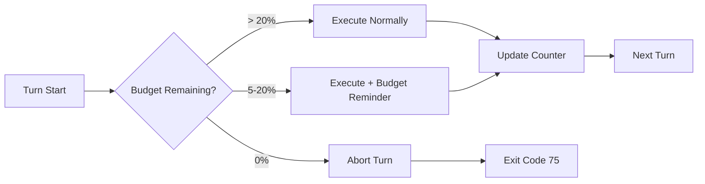
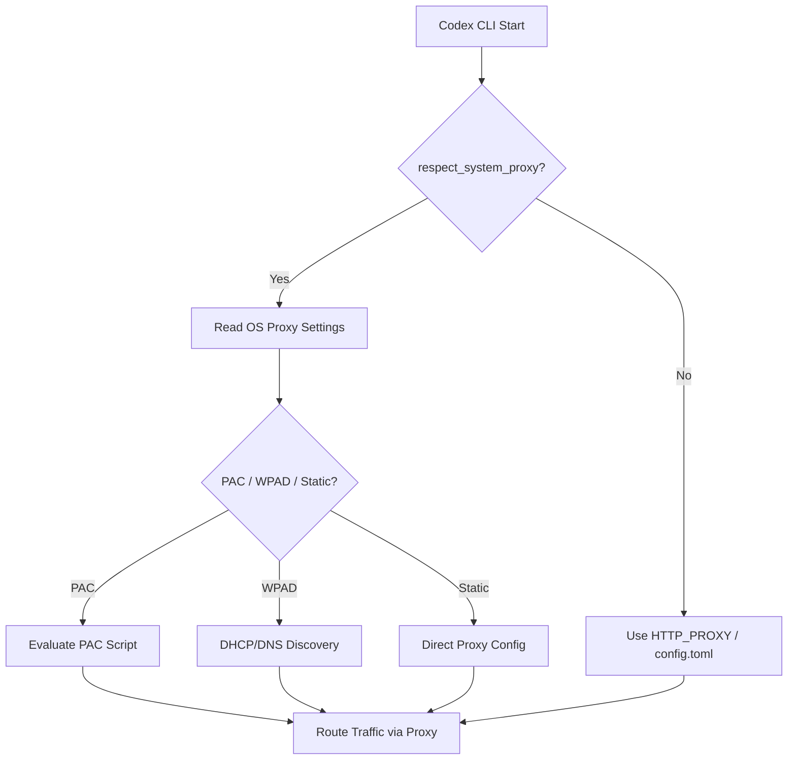

# Codex CLI v0.142 Stable Release Guide: Plugin Discovery, Token Budget Governance, Delegation Modes, and the Enterprise Network Stack


---

The v0.142 series (v0.142.0 on 22 June, v0.142.1 and v0.142.2 on 25 June 2026) is the most significant Codex CLI stable release since v0.140 introduced usage tracking and session deletion a fortnight earlier[^1]. Across 194 changes in the base release alone --- 39 features, 22 improvements, 12 performance gains, and 98 bug fixes --- and a further 34 changes in the two point releases, v0.142 reshapes how teams discover plugins, govern token spend, control multi-agent delegation, and connect through corporate proxies[^2][^3].

This guide covers every change that matters for production teams, grouped by theme rather than version number.

## Plugin Discovery and the Curated Marketplace

The `/plugins` command received its biggest overhaul since plugins launched in early 2026. Remote plugins now organise into three sections: **OpenAI Curated**, **Workspace**, and **Shared with me**[^1]. The curated section surfaces featured plugins ranked by the remote catalogue, replacing the flat alphabetical list that made discovery unreliable at scale[^3].

More significantly, eligible turns can now **recommend and install relevant plugins mid-conversation**[^1]. When Codex detects a task that matches a plugin's declared capabilities --- a Terraform plan, a Figma export, a Slack notification --- it suggests the plugin inline. One confirmation installs it, refreshes the tool list, and continues the turn. This moves plugin adoption from a pre-session configuration step to a just-in-time workflow.

```toml
# config.toml — restrict which marketplaces are visible
[plugins]
  marketplaces = ["openai-curated", "workspace"]
  auto_recommend = true  # allow mid-turn plugin recommendations
```

Supporting changes in v0.142.2 add dedicated **dark-mode logos** for plugins via local manifests and remote catalogues, ensuring the TUI remains readable in both themes[^3].

## Configurable Rollout Token Budgets

Token budgets are no longer limited to Goal Mode's per-objective cap. v0.142.0 introduces **rollout token budgets** that track cumulative token usage across agent threads, provide remaining-budget reminders as the budget depletes, and abort turns when the budget is exhausted[^1][^2].

This is the governance primitive that enterprise teams have been requesting since Codex crossed five million weekly users in early June[^4]. A team lead can now set a daily or sprint-level token ceiling:

```bash
# Set a rollout budget of 2M tokens across all threads in this session
codex --rollout-token-budget 2000000 "Refactor the auth module"
```

The budget counter persists across thread forks and subagent spawns. When 80% of the budget is consumed, Codex injects a reminder into the conversation context. At 100%, the current turn aborts with a structured error that downstream automation can catch via `codex exec`'s exit code.



Combined with the existing per-objective `token_budget` in Goal Mode and the `/usage` credit redemption (also new in v0.142.0), teams now have three layers of spend control: per-goal, per-rollout, and per-account[^1].

## Multi-Agent Delegation Controls

App-server clients can now configure multi-agent delegation at the **thread and turn level** with three modes[^1]:

| Mode | Behaviour | Use Case |
|------|-----------|----------|
| `disabled` | No subagent spawning permitted | Sensitive single-threaded tasks |
| `explicit-request-only` | Subagents spawn only when the user explicitly requests delegation | Controlled escalation |
| `proactive` | Codex autonomously decides when to delegate | Maximum throughput |

```toml
# config.toml — per-profile delegation setting
[profiles.secure]
  delegation_mode = "explicit-request-only"

[profiles.batch]
  delegation_mode = "proactive"
```

A critical companion fix ensures that **parent agents now receive terminal subagent errors** as structured error messages, rather than seeing failed subagent work as an empty successful completion[^1]. This was a significant reliability issue in earlier versions: a subagent that crashed would appear to the parent as having produced no output, leading to silent failures in multi-agent workflows.

## Enterprise Network Stack

The v0.142.1 and v0.142.2 point releases complete the enterprise proxy story that has been building across several versions:

### Windows System Proxy (v0.142.1)

Opt-in support for **PAC, WPAD, static proxies, and bypass rules** on Windows[^3]. This is critical for enterprise environments where network configuration is managed centrally via Group Policy:

```toml
# config.toml — enable Windows system proxy discovery
[network]
  respect_system_proxy = true
```

### macOS System Proxy (v0.142.2)

Authentication clients honour **system proxy, PAC, and WPAD settings** when `respect_system_proxy` is enabled[^3]. Combined with the P-521 TLS certificate support that shipped in v0.141.0[^5], Codex CLI now handles the three most common enterprise proxy configurations without manual `HTTP_PROXY` environment variable wrangling.



### PowerShell AST Safety Gate (v0.142.2)

PowerShell commands containing executable AST regions that the safety classifier cannot inspect now **require explicit approval**[^3]. This closes a gap where obfuscated or dynamically-constructed PowerShell could bypass the safety layer. For teams running Codex on Windows with `full-auto` or `suggest` approval policies, this adds a safety net without requiring a policy change.

## MCP Tool Search by Default

v0.142.2 makes MCP tool search the default when servers support it[^3]. Previously, Codex loaded the full tool list from every connected MCP server at startup, which became a bottleneck as plugin and server counts grew.

With tool search enabled, Codex uses **BM25 ranking over tool descriptions** to retrieve only the tools relevant to the current turn, with exact-name match prepending to avoid breaking existing tool references[^6]. The change preserves backward compatibility --- servers that do not advertise search support continue to receive the full tool list.

This default-on change is the culmination of work tracked through Issue #21503 and validated against the LiveMCPBench benchmark (arXiv:2508.01780v2), which found that retrieval errors account for roughly 50% of MCP tool call failures across 12 evaluated LLMs[^6].

## Performance Engineering

v0.142.0 ships a cluster of startup and runtime performance improvements[^1]:

- **DNS deferral**: DNS resolution is deferred until the first network request, eliminating a blocking call during startup on networks with slow DNS
- **Model cache warming**: The model capability cache is populated in the background during startup, overlapping with config parsing
- **Skill metadata parallelisation**: Skill metadata reads are parallelised rather than sequential, reducing startup time proportionally to the number of installed skills
- **Redundant catalogue sync elimination**: Plugin catalogue synchronisation is skipped when the local cache is fresh, saving a network round-trip on most launches
- **Telemetry churn reduction**: Per-event WebSocket payload logging is removed and duplicated telemetry records are filtered, reducing persistent-log write volume significantly --- a direct response to the 640 TB/year SQLite logging bug identified in Issue #28224[^7]

## Session and Subagent Reliability

Several fixes improve the reliability of long-running and multi-agent sessions:

- **Exec-server and MCP session resilience**: Processes and stdio MCP sessions survive transient disconnects, including signed-URL refresh and retry-safe stdin writes[^1]
- **Goal-first thread persistence**: Goal-first threads now persist through `thread/list` and `thread/search`, fixing an issue where goal-oriented work disappeared from the thread index[^1]
- **Linux TUI suspend/resume**: Reliable rendering restored after `Ctrl+Z` and `fg` cycles[^1]
- **Remote environment fidelity**: Remote environments preserve executor-native paths, shells, `AGENTS.md` discovery, and sandbox behaviour across operating systems[^1]

## Upgrade Checklist

For teams upgrading from v0.140 or v0.141:

1. **Review plugin marketplace settings** --- the new three-section layout may surface plugins that were previously hidden; use `[plugins].marketplaces` to restrict visibility if needed
2. **Set rollout token budgets** for CI/CD and batch automation profiles to prevent runaway spend
3. **Choose a delegation mode** for each profile --- `explicit-request-only` is the safe default for most teams
4. **Enable `respect_system_proxy`** on macOS and Windows if your organisation uses PAC or WPAD --- this replaces manual `HTTP_PROXY` configuration
5. **Verify MCP tool search compatibility** --- servers with custom tool namespacing should test that BM25 retrieval returns the expected tools
6. **Check PowerShell workflows** --- the AST safety gate may introduce new approval prompts for dynamically-constructed commands

```bash
# Upgrade to v0.142.2
npm install -g @openai/codex@latest

# Verify the version
codex --version
# Expected: 0.142.2

# Run diagnostics
codex doctor
```

## What v0.142 Signals

The v0.142 series marks a shift in Codex CLI's development focus. The headline features are no longer about adding new agent capabilities --- Goal Mode, Code Mode, subagents, and plugins all shipped in earlier releases. Instead, v0.142 is about **governance infrastructure**: who can delegate, how much can be spent, which tools are discoverable, and how the agent communicates through corporate networks[^1][^3].

This is the release that makes Codex CLI deployable in environments where IT security teams have veto power. The combination of rollout token budgets, delegation mode controls, system proxy support, and the PowerShell AST safety gate addresses the top four objections that enterprise security reviews typically raise against coding agent adoption[^8].

For individual developers, the most noticeable improvement is speed --- the startup performance work and MCP tool search default make Codex CLI feel noticeably snappier, particularly in environments with many plugins and MCP servers installed.

## Citations

[^1]: OpenAI, "Codex Changelog — June 22, 2026 (v0.142.0)," *OpenAI Developers*, 2026. [https://developers.openai.com/codex/changelog](https://developers.openai.com/codex/changelog)

[^2]: Releasebot, "Codex Updates by OpenAI — June 2026," *Releasebot*, 2026. [https://releasebot.io/updates/openai/codex](https://releasebot.io/updates/openai/codex)

[^3]: OpenAI, "Codex CLI Releases — rust-v0.142.1 and rust-v0.142.2," *GitHub*, 25 June 2026. [https://github.com/openai/codex/releases](https://github.com/openai/codex/releases)

[^4]: OpenAI, "Codex surpasses 5 million weekly active users," reported via *TechJack Solutions*, June 2026. [https://techjacksolutions.com/ai-brief/openai-codex-passes-5-million-weekly-users-and-1-in-5-arent/](https://techjacksolutions.com/ai-brief/openai-codex-passes-5-million-weekly-users-and-1-in-5-arent/)

[^5]: OpenAI, "Codex Changelog — June 18, 2026 (v0.141.0)," *OpenAI Developers*, 2026. [https://developers.openai.com/codex/changelog](https://developers.openai.com/codex/changelog)

[^6]: OpenAI, "MCP tool search by default — Issue #21503," *GitHub*, June 2026. [https://github.com/openai/codex/pull/21503](https://github.com/openai/codex/pull/21503); Wang et al., "LiveMCPBench: Evaluating LLMs on MCP Servers," *arXiv:2508.01780v2*, revised February 2026.

[^7]: OpenAI, "SQLite TRACE logging excessive disk writes — Issue #28224," *GitHub*, June 2026. [https://github.com/openai/codex/issues/28224](https://github.com/openai/codex/issues/28224)

[^8]: Gartner, "40% of agentic AI projects will be abandoned by end of 2027," *Gartner Research*, June 2026. [https://www.gartner.com/en/newsroom/press-releases](https://www.gartner.com/en/newsroom/press-releases)
