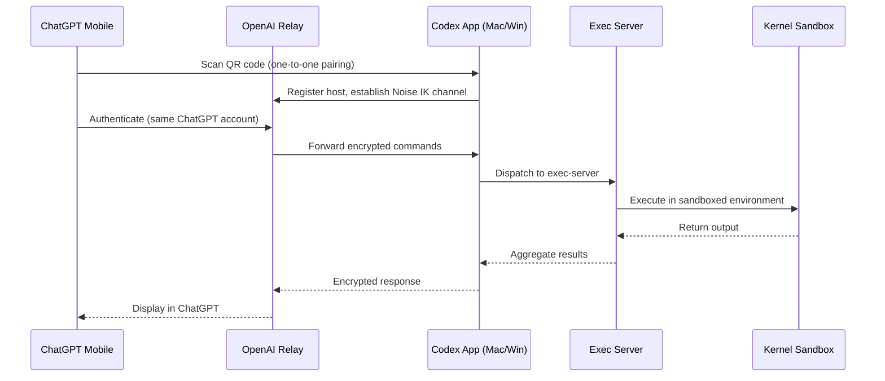
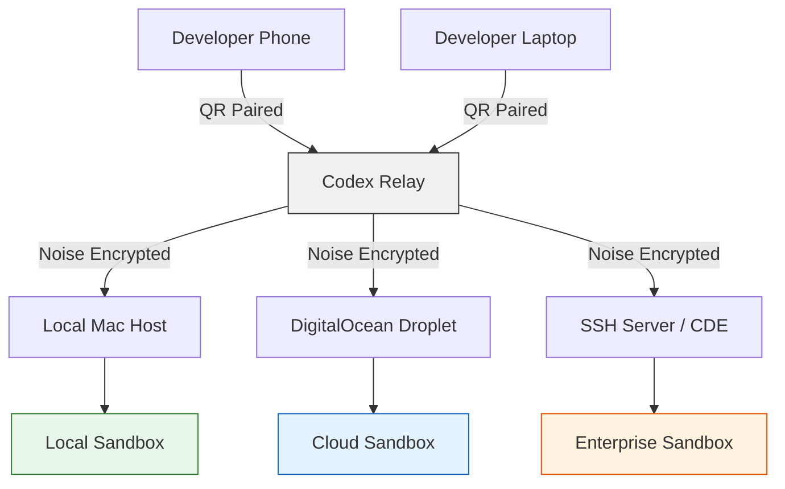

# Codex Remote Reaches GA: QR Pairing, Noise-Encrypted Relay, and the DigitalOcean Plugin That Provisions Your Cloud Workspace in One Command


---

On 25 June 2026, OpenAI announced that Codex Remote had reached general availability [^1]. The feature, which has evolved through several preview iterations since the Codex Mobile launch on 14 May 2026 [^2], now offers authenticated one-to-one QR pairing between iOS or Android devices and Mac or Windows hosts, end-to-end encrypted Noise relay channels, and a growing ecosystem of infrastructure plugins — headlined by a new DigitalOcean plugin that provisions a cloud-hosted development workspace from inside Codex itself [^3].

This article traces the architecture from relay to executor, examines the security model that makes remote agent execution viable for enterprise teams, and walks through the DigitalOcean plugin that turns cloud infrastructure provisioning into a conversation with your coding agent.

## Why Remote Matters for Coding Agents

A coding agent that runs only on the machine in front of you inherits that machine's constraints: it stops when the lid closes, it cannot access a GPU-equipped build server two floors away, and it ties your mobile phone to a "check the logs" role at best. Codex Remote dissolves these boundaries. From ChatGPT on your phone, you start or continue a thread on a connected host, approve shell commands, review outputs, and even hand threads between local and remote machines mid-session [^1].

The GA milestone is significant not because remote access is novel — SSH has existed for decades — but because it wraps authentication, encryption, session continuity, plugin activation, and sandbox enforcement into a single product surface that a developer can set up in under sixty seconds.

## Architecture: Relay, Pairing, and the Security Model



### QR Pairing

The setup flow is deliberately simple: open the Codex App on your Mac or Windows host, navigate to Connections, and scan the displayed QR code from ChatGPT on your phone [^1]. Under the surface, the QR encodes a one-time pairing token that binds the specific mobile device to the specific host. Both endpoints must be signed into the same ChatGPT account and workspace — multi-factor authentication, SSO, and passkeys all apply [^4]. Connections established since 8 June 2026 survive app updates; older inactive connections require re-pairing [^1].

### Noise-Encrypted Relay Channels

Since v0.141.0 (18 June 2026), remote executors communicate over Noise protocol relay channels [^5]. The Noise Protocol Framework, designed by Trevor Perrin, builds security protocols from composable cryptographic primitives — Diffie-Hellman key exchange over Curve25519, AEAD symmetric encryption (typically ChaCha20-Poly1305), and a hash function such as BLAKE2s [^6]. Codex uses the IK handshake pattern, where the initiator (your phone or a second Codex instance) already knows the host's static public key from the pairing step. This yields a 1-RTT handshake with forward secrecy [^6].

Crucially, the relay layer keeps trusted machines reachable across authorised ChatGPT devices without exposing them directly to the public internet [^4]. The OpenAI relay sees only encrypted ciphertext — it cannot inspect commands or outputs. This is a meaningful upgrade from the earlier WebSocket transport, which relied on bearer tokens and required the host to bind to a routable address or sit behind a VPN.

### Cross-Platform Execution

Codex Remote preserves executor-native paths, shells, AGENTS.md discovery, and sandbox behaviour across operating systems [^7]. A thread started on macOS and handed off to a Windows host picks up the Windows project's AGENTS.md, activates its configured hooks, and runs shell commands through the Windows executor's native shell. Selected executor plugins can activate their stdio MCP servers per thread, so a DigitalOcean-provisioned Droplet running Linux gets the same MCP tool surface as a local macOS session [^5].

## The DigitalOcean Plugin: Cloud Workspaces as a Conversation

The most tangible demonstration of where Codex Remote is heading shipped alongside the GA announcement: a first-party DigitalOcean plugin that provisions a Droplet and wires it up as an SSH-connected workspace from within a Codex conversation [^3].

### How It Works

The plugin, open-source at `github.com/digitalocean/CodexPlugin` [^3], contains a `SKILL.md` orchestration file that guides Codex through a five-step provisioning sequence:

1. **Key generation** — `scripts/keygen.py` creates an ed25519 SSH key pair with a unique identifier name
2. **Key registration** — the `key-create` app tool uploads the public key to your DigitalOcean account
3. **Droplet creation** — `droplet-create` provisions from the Codex Universal image (ID `233103029`) with the user's chosen region and size
4. **SSH configuration** — `scripts/configure_ssh.py` renders `ssh_config.tmpl` into `~/.ssh/config`, scans host keys, and probes SSH until cloud-init completes
5. **Handoff** — the user registers the new SSH host in Codex App > Settings > Connections > Add SSH Host

```toml
# Example generated SSH config block
Host codex-droplet-a1b2c3
    HostName 164.90.xxx.xxx
    User root
    IdentityFile ~/.ssh/codex-a1b2c3
    StrictHostKeyChecking accept-new
```

The plugin uses the installed Codex DigitalOcean app for API authentication — no `doctl` binary or raw API tokens required [^3]. The Droplet bills hourly until deleted, and the same plugin surface exposes `droplet-delete` for teardown.

### Why This Matters

Before this plugin, setting up a cloud workspace for Codex Remote required manual Terraform, Pulumi, or console clicks followed by SSH configuration. The DigitalOcean plugin reduces this to a natural-language conversation:

> "Spin up a 4-vCPU Droplet in London for my API migration work."

The agent handles key generation, provisioning, SSH wiring, and cloud-init verification. Combined with Codex Remote GA, you can provision the Droplet, start working on it from your desktop, then continue the same thread from your phone on the train home.

## Remote-First Development: The Emerging Pattern



Codex Remote GA, combined with infrastructure plugins, establishes a pattern where the *execution surface* is decoupled from the *control surface*:

- **Control surfaces** multiply: desktop TUI, VS Code extension, Chrome extension, ChatGPT mobile, a second Codex instance on another machine
- **Execution surfaces** diversify: local sandbox, DigitalOcean Droplet, Coder workspace [^8], enterprise SSH bastion, or any host running the Codex exec-server
- **Threads move freely** between execution surfaces via thread handoff, carrying conversation history and goal state

For enterprise teams, this pattern maps neatly onto existing infrastructure governance. A compliance-sensitive project runs on an internal host behind the corporate VPN; the DigitalOcean Droplet handles the open-source spike; both are controlled from the same ChatGPT mobile app with the same SSO credentials.

## Security Considerations

Remote agent execution introduces attack surface that local-only operation avoids. Codex Remote addresses this through several layers:

| Layer | Mechanism | Notes |
|-------|-----------|-------|
| Transport | Noise IK relay | End-to-end encrypted; relay sees only ciphertext [^5] |
| Authentication | QR one-to-one pairing | Same account + workspace required [^4] |
| Authorisation | Workspace admin controls | Admins can enable/disable remote access per workspace [^4] |
| Execution | Kernel sandbox | Shell commands run sandboxed regardless of control surface [^7] |
| Network | No public exposure | Relay model eliminates need for open ports [^4] |

The documentation explicitly warns against exposing app-server transports directly on shared or public networks; for non-relay access, VPN or mesh networking is recommended [^4].

Two gaps remain worth noting. First, the DigitalOcean plugin provisions Droplets as `root` by default — production deployments should create a non-root user post-provisioning. Second, the Noise relay depends on OpenAI's relay infrastructure for availability; an outage there would prevent new remote connections, though already-established SSH connections would continue independently.

## Practical Setup: From Zero to Remote in Five Minutes

For teams ready to adopt Codex Remote, the minimum path is:

```bash
# 1. Update Codex CLI to v0.142.2+
codex update

# 2. Verify remote readiness
codex doctor

# 3. Install the DigitalOcean plugin (optional, for cloud workspaces)
codex plugin install digitalocean/CodexPlugin

# 4. Open Connections in Codex App, enable Remote Access
# 5. Scan QR code from ChatGPT mobile
# 6. Start a thread from your phone targeting the paired host
```

For the DigitalOcean workflow specifically:

```bash
# In a Codex conversation after plugin installation:
# "Create a Droplet in lon1, s-4vcpu-8gb, for my project"
# Codex handles: key generation → droplet creation → SSH config → readiness probe
# Then: Settings → Connections → Add SSH Host → select the new alias
```

## What Comes Next

The GA announcement positions Codex Remote as more than a convenience feature. With DigitalOcean shipping a provisioning plugin on day one, the template is clear for AWS, GCP, Azure, and CDE providers like Coder and Daytona to offer similar one-command workspace provisioning. The thread handoff primitive means a task can start on a developer's laptop, move to a GPU-equipped cloud instance for a heavy build step, then return to the laptop for review — all within a single conversation thread.

For enterprise teams evaluating Codex at scale, Codex Remote GA removes the last major objection to terminal-native coding agents: the assumption that "terminal" means "local". It does not, and as of 25 June 2026, it has not for a while.

---

## Citations

[^1]: OpenAI, "Codex Changelog — June 25, 2026: Codex Remote has reached general availability," [https://developers.openai.com/codex/changelog](https://developers.openai.com/codex/changelog)

[^2]: TechCrunch, "OpenAI says Codex is coming to your phone," 14 May 2026, [https://techcrunch.com/2026/05/14/openai-says-codex-is-coming-to-your-phone/](https://techcrunch.com/2026/05/14/openai-says-codex-is-coming-to-your-phone/)

[^3]: DigitalOcean, "CodexPlugin — Codex plugin that provisions a DigitalOcean Droplet as a remote SSH workspace," GitHub, [https://github.com/digitalocean/CodexPlugin](https://github.com/digitalocean/CodexPlugin)

[^4]: OpenAI, "Remote connections — Codex," OpenAI Developers, [https://developers.openai.com/codex/remote-connections](https://developers.openai.com/codex/remote-connections)

[^5]: OpenAI, "Codex Changelog — June 18, 2026: Remote executors use authenticated, end-to-end encrypted Noise relay channels," [https://developers.openai.com/codex/changelog](https://developers.openai.com/codex/changelog)

[^6]: Trevor Perrin, "The Noise Protocol Framework," revision 34, [https://noiseprotocol.org/noise.html](https://noiseprotocol.org/noise.html)

[^7]: OpenAI, "Codex Changelog — June 22, 2026: Remote environments preserve executor-native paths, shells, AGENTS.md discovery, and sandbox behavior," [https://developers.openai.com/codex/changelog](https://developers.openai.com/codex/changelog)

[^8]: Coder, "Coder Architecture Documentation," [https://coder.com/docs/admin/infrastructure/architecture](https://coder.com/docs/admin/infrastructure/architecture)
