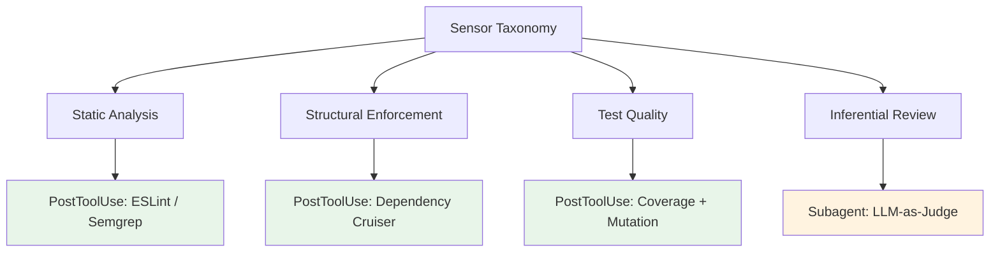
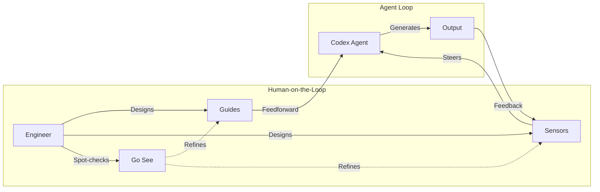

# The Cybernetic Harness: Mapping Böckeler's Guides-and-Sensors Model to Codex CLI's Hook Pipeline and Human-on-the-Loop Governance


---

The coding agent conversation has shifted. Six months ago, teams asked "which agent should we use?" Now the question is "how do we harness it?" Birgitta Böckeler, Distinguished Engineer at Thoughtworks, formalised the answer in her April 2026 article on Martin Fowler's blog: treat the agent as a cybernetic system, regulate it through *guides* (feedforward controls) and *sensors* (feedback controls), and design your codebase for *harnessability* [^1]. Two follow-up Thoughtworks publications extended the model with a sensor taxonomy [^2] and a cybernetic human-on-the-loop framework drawn from Norbert Wiener and Stafford Beer [^3].

This article maps Böckeler's framework to concrete Codex CLI features — hooks, permission profiles, AGENTS.md, Goal Mode, and rollout token budgets — and shows how the cybernetic model translates directly into configuration files and shell scripts.

## The Cybernetic Control Model in Sixty Seconds

Böckeler defines an agent as **Model + Harness**, where the harness is everything except the model weights [^1]. The harness regulates the agent through two control vectors:

| Control Vector | Cybernetic Term | Timing | Purpose |
|---------------|----------------|--------|---------|
| **Guides** | Feedforward | Before generation | Steer the agent toward correct output |
| **Sensors** | Feedback | After generation | Observe output, enable self-correction |

Each vector operates in two execution modes [^1]:

- **Computational** — deterministic, millisecond-fast: linters, type checkers, structural analysis
- **Inferential** — semantic, LLM-based: code review agents, LLM-as-judge evaluation

The framework identifies three regulation dimensions — maintainability, architecture fitness, and behaviour — with maintainability being the most mature and behaviour the least [^1].

## Guides: Feedforward Controls in Codex CLI

Guides prevent bad output before it happens. In Codex CLI, three features serve as feedforward controls.

### AGENTS.md as the Primary Guide

AGENTS.md is the most powerful guide surface. It fires at session start and carries forward throughout the entire run [^4]. A well-structured AGENTS.md encodes coding standards, architectural constraints, test expectations, and naming conventions — all the feed-forward context that Böckeler's model demands.

```toml
# Example: codex.toml pointing to layered AGENTS.md files
[project]
agents_md = ["AGENTS.md", "src/api/AGENTS.md", "src/frontend/AGENTS.md"]
```

Each AGENTS.md layer narrows the agent's action space, matching Ashby's Law of Requisite Variety: the control system must match the complexity of the system it governs [^3].

### Permission Profiles as Constraint Guides

Codex CLI's two-layer security model separates *what the agent can do* (sandbox enforcement) from *when it must ask* (approval policies) [^5]. Named permission profiles make these constraints reusable across projects:

```toml
# ~/.codex/ci-readonly.config.toml
approval_policy = "never"
sandbox_mode = "read-only"
network_access = false
```

```toml
# ~/.codex/dev-interactive.config.toml
approval_policy = "on-request"
sandbox_mode = "workspace-write"
network_access = true
```

In Böckeler's terms, these profiles are *computational guides* — deterministic constraints that bound the agent's action space before any generation occurs.

### PreToolUse Hooks as Gate Guards

Codex CLI's `PreToolUse` hook fires before every tool call, receiving the tool name and full command on stdin [^6]. The hook can approve, deny, or modify the call:

```bash
#!/usr/bin/env bash
# hooks/deny-force-push.sh — Guide: prevent destructive git operations
INPUT=$(cat)
COMMAND=$(echo "$INPUT" | jq -r '.command // empty')

if echo "$COMMAND" | grep -qE 'git\s+(push\s+--force|reset\s+--hard|clean\s+-fd)'; then
  echo '{"action": "deny", "reason": "Destructive git operation blocked by policy"}'
else
  echo '{"action": "approve"}'
fi
```

This is a pure feedforward control — the dangerous command never executes. The hook is computational, deterministic, and sub-millisecond [^6].

## Sensors: Feedback Controls in Codex CLI

Sensors observe what the agent produced and feed corrections back into the loop. Codex CLI implements sensors through `PostToolUse` hooks and external tool integrations.

### PostToolUse Hooks as Output Sensors

`PostToolUse` fires after a tool call completes, receiving the command and its output [^6]. The hook cannot undo execution, but it can replace the tool result with steering feedback:

```bash
#!/usr/bin/env bash
# hooks/lint-sensor.sh — Sensor: run ESLint on modified files
INPUT=$(cat)
COMMAND=$(echo "$INPUT" | jq -r '.command // empty')

# Only fire for file-writing operations
if echo "$COMMAND" | grep -qE '\.(ts|tsx|js|jsx)$'; then
  LINT_OUTPUT=$(npx eslint --format json . 2>/dev/null)
  ERROR_COUNT=$(echo "$LINT_OUTPUT" | jq '[.[].errorCount] | add // 0')

  if [ "$ERROR_COUNT" -gt 0 ]; then
    echo "{\"feedback\": \"ESLint found $ERROR_COUNT errors. Fix them before proceeding.\"}"
  fi
fi
```

This maps directly to Böckeler's *computational sensor* — a deterministic feedback mechanism that steers the agent toward self-correction without human intervention [^2].

### The Sensor Taxonomy Applied

Thoughtworks' sensor taxonomy [^2] classifies sensors by what they observe. Here is how each maps to Codex CLI:



The green nodes are computational sensors — fast, deterministic, run in PostToolUse hooks. The orange node is an inferential sensor — slower, semantic, typically delegated to a Codex subagent with a review-focused AGENTS.md [^7].

## The Three Regulation Dimensions in Practice

Böckeler identifies three dimensions that a harness must regulate [^1]. Each maps to a specific Codex CLI configuration pattern.

### Maintainability Harness

The most mature dimension. Codex CLI teams implement this through:

- **AGENTS.md** encoding naming conventions, import rules, and formatting standards (guide)
- **PostToolUse hooks** running `prettier --check` and `eslint` after every file write (sensor)
- **Rollout token budgets** preventing runaway refactoring by capping token spend per thread [^8]

### Architecture Fitness Harness

Böckeler borrows the *fitness function* concept from evolutionary architecture [^1]. In Codex CLI:

- **AGENTS.md** declaring module boundaries and dependency direction rules (guide)
- **PostToolUse hooks** running architecture enforcement tools like `dependency-cruiser` or custom linters (sensor)
- **Permission profiles** restricting file writes to specific directories per agent role (guide)

```bash
# hooks/arch-fitness.sh — Sensor: enforce layered architecture
INPUT=$(cat)
VIOLATIONS=$(npx depcruise src --output-type err 2>&1)
if [ -n "$VIOLATIONS" ]; then
  echo "{\"feedback\": \"Architecture violation detected: $VIOLATIONS\"}"
fi
```

### Behaviour Harness

The least mature dimension. Functional correctness remains hard to automate. Codex CLI's approach combines:

- **Goal Mode** breaking ambitious objectives into verifiable sub-steps [^9]
- **PostToolUse hooks** running the test suite after implementation changes (sensor)
- **Subagent delegation** spawning a review agent that evaluates whether the implementation matches the requirement (inferential sensor) [^7]

## Human-on-the-Loop: From Review to Steering

The Thoughtworks cybernetics article [^3] reframes the human role using Stafford Beer's Viable System Model. The shift is from *human-in-the-loop* (reviewing every change) to *human-on-the-loop* (designing the harness, intervening by exception).

Codex CLI supports this transition through three mechanisms:



### Attenuation: Filtering Agent Output

Rather than reading every diff, the engineer configures sensors that aggregate quality signals. Codex CLI's `/usage` command now surfaces token consumption and credit state [^8], whilst PostToolUse hooks can emit structured metrics to dashboards. The human only intervenes when thresholds breach.

### Amplification: Extending Human Influence

AGENTS.md files, permission profiles, and hook scripts *amplify* a single engineer's decisions across every agent turn. One well-written architectural constraint in AGENTS.md prevents thousands of violations without further human input [^4].

### Go See: The Gemba Principle

Beer and the Lean tradition both insist on periodic direct observation [^3]. In Codex CLI, this translates to:

- Reviewing a sample of completed threads via `codex history`
- Running `codex doctor` to verify harness health [^10]
- Periodically reading agent output rather than trusting sensor summaries alone

This *double-loop learning* — updating your mental model of how the agent actually behaves versus how you intended it to behave — is what keeps the harness calibrated [^3].

## Harnessability: Why Your Codebase Matters

Böckeler introduces *harnessability* — the degree to which a codebase naturally supports effective harness controls [^1]. Key factors include:

| Factor | High Harnessability | Low Harnessability |
|--------|--------------------|--------------------|
| Type system | Strong static types (TypeScript, Rust, Go) | Dynamic / untyped (vanilla JS, Python without hints) |
| Module boundaries | Enforced via build tool or linter | Implicit, convention-based only |
| Test infrastructure | Fast, deterministic, high coverage | Slow, flaky, low coverage |
| Documentation | Machine-readable (AGENTS.md, OpenAPI specs) | Scattered wikis, tribal knowledge |

For Codex CLI users, the practical implication is clear: *invest in harnessability before investing in prompt engineering*. A well-typed codebase with enforced boundaries and fast tests gives the agent's sensors reliable signals. A poorly-typed codebase with no tests leaves the harness blind.

The OpenAI harness engineering blog post reinforces this finding: swapping the harness changes SWE-bench scores by 22 points, whilst swapping the model changes scores by only 1 point [^11]. The harness is the leverage point, not the model.

## Putting It Together: A Minimal Cybernetic Harness

Here is a minimal but complete harness configuration for a TypeScript project using Codex CLI:

```json
// ~/.codex/hooks.json
{
  "hooks": [
    {
      "event": "PreToolUse",
      "command": "./hooks/deny-destructive-git.sh",
      "timeout_ms": 1000
    },
    {
      "event": "PostToolUse",
      "command": "./hooks/lint-and-test-sensor.sh",
      "timeout_ms": 30000
    }
  ]
}
```

```markdown
<!-- AGENTS.md — Primary Guide -->
## Architecture
- Three-layer architecture: handlers → services → repositories
- No direct imports between handlers and repositories
- All new endpoints require OpenAPI schema updates

## Testing
- Every service function requires unit tests
- Run `npm test` after implementation changes
- Minimum 80% branch coverage on changed files

## Code Style
- British English in comments and user-facing strings
- Strict TypeScript: no `any`, no `as` casts without justification
```

```toml
# ~/.codex/project.config.toml — Permission Profile
approval_policy = "on-request"
sandbox_mode = "workspace-write"
network_access = false
```

This configuration implements five of Böckeler's control mechanisms: three guides (AGENTS.md, permission profile, PreToolUse gate) and two sensors (lint check, test suite), covering the maintainability and architecture fitness dimensions.

## What the Cybernetic Model Reveals

Böckeler's framework provides three insights that Codex CLI users should internalise:

1. **Sensors matter more than guides.** Most teams invest heavily in AGENTS.md (guides) but neglect PostToolUse hooks (sensors). Without feedback, the agent drifts. Invest proportionally in both vectors.

2. **Computational sensors beat inferential sensors.** A linter that catches 100% of violations deterministically is more reliable than an LLM-as-judge that catches 90% non-deterministically. Use inferential sensors only for what computational sensors cannot reach — semantic correctness, design quality, requirement alignment [^2].

3. **The behaviour harness is the frontier.** Maintainability and architecture fitness are well-served by existing tooling. Behavioural correctness — does the code do what the user actually needs? — remains the domain where human judgment is irreplaceable [^1]. Goal Mode's verifiable sub-steps and subagent review are steps toward closing this gap, but the behaviour harness will likely require advances in formal specification and property-based testing before it reaches parity with the other two dimensions.

## Citations

[^1]: Böckeler, B. (2026). *Harness engineering for coding agent users*. martinfowler.com. [https://martinfowler.com/articles/harness-engineering.html](https://martinfowler.com/articles/harness-engineering.html)

[^2]: Thoughtworks (2026). *Harness engineering and agent feedback: Exploring AI coding sensors*. [https://www.thoughtworks.com/insights/blog/generative-ai/harness-engineering-agent-feedback-exploring-ai-coding-sensors](https://www.thoughtworks.com/insights/blog/generative-ai/harness-engineering-agent-feedback-exploring-ai-coding-sensors)

[^3]: Thoughtworks (2026). *Cybernetics and the "human-on-the-loop" in agentic coding*. [https://www.thoughtworks.com/en-us/insights/blog/generative-ai/cybernetics-and-human-on-the-loop-in-agentic-coding](https://www.thoughtworks.com/en-us/insights/blog/generative-ai/cybernetics-and-human-on-the-loop-in-agentic-coding)

[^4]: OpenAI (2026). *Custom instructions with AGENTS.md*. [https://developers.openai.com/codex/guides/agents-md](https://developers.openai.com/codex/guides/agents-md)

[^5]: OpenAI (2026). *Advanced Configuration — Codex CLI*. [https://developers.openai.com/codex/config-advanced](https://developers.openai.com/codex/config-advanced)

[^6]: OpenAI (2026). *Hooks — Codex CLI*. [https://developers.openai.com/codex/hooks](https://developers.openai.com/codex/hooks)

[^7]: OpenAI (2026). *Subagents — Codex*. [https://developers.openai.com/codex/subagents](https://developers.openai.com/codex/subagents)

[^8]: OpenAI (2026). *Codex Changelog — June 22, 2026 (v0.142.0)*. [https://developers.openai.com/codex/changelog](https://developers.openai.com/codex/changelog)

[^9]: OpenAI (2026). *Codex CLI Features*. [https://developers.openai.com/codex/cli/features](https://developers.openai.com/codex/cli/features)

[^10]: OpenAI (2026). *Codex CLI Slash Commands*. [https://developers.openai.com/codex/cli/slash-commands](https://developers.openai.com/codex/cli/slash-commands)

[^11]: OpenAI (2026). *Harness engineering: leveraging Codex in an agent-first world*. [https://openai.com/index/harness-engineering/](https://openai.com/index/harness-engineering/)
