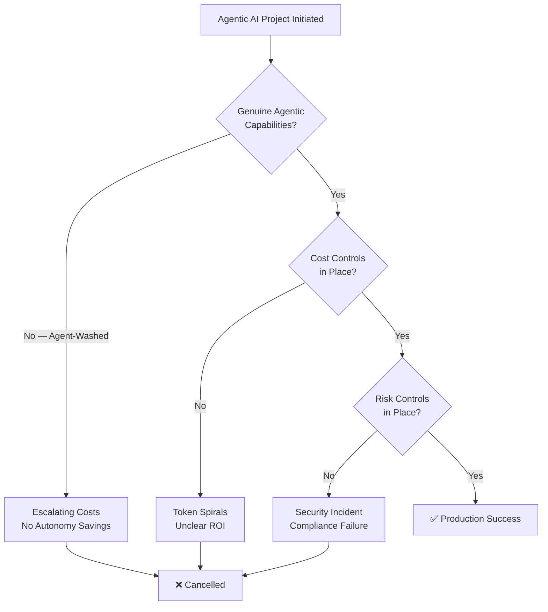
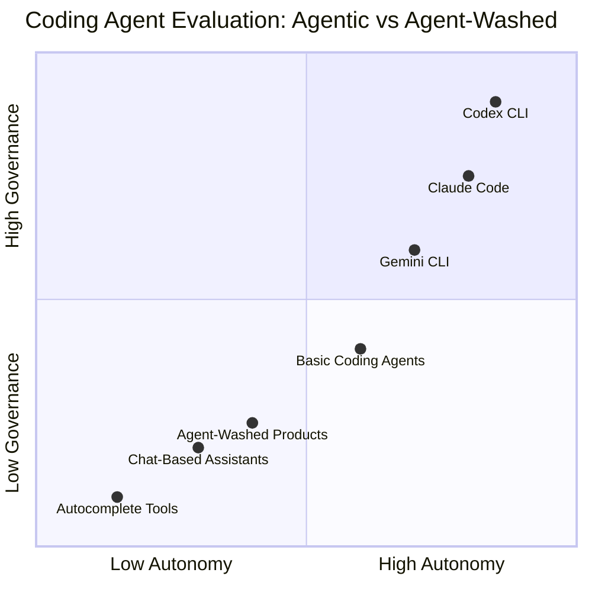

# Gartner's 40% Cancellation Warning and the Agent-Washing Problem: How to Evaluate Whether Your Coding Agent Is Genuinely Agentic


---

Gartner predicts that over 40% of agentic AI projects will be cancelled by the end of 2027, citing three root causes: escalating costs, unclear business value, and inadequate risk controls [^1]. At the same time, Gartner estimates that only around 130 of the thousands of vendors claiming agentic AI capabilities are delivering genuine agentic solutions — the rest are engaged in "agent washing," rebranding chatbots, RPA bots, and AI assistants without substantive autonomy [^1]. For engineering teams evaluating coding agents, these two data points are inseparable: picking an agent-washed tool virtually guarantees you will join the 40%.

This article maps Gartner's three cancellation drivers to the coding agent domain and provides a concrete evaluation framework for distinguishing genuinely agentic coding tools from dressed-up autocomplete.

## The Three Cancellation Drivers, Applied to Coding Agents

Gartner's prediction is not abstract. A January 2025 poll of 3,412 attendees found that 19% of organisations had made significant agentic AI investments, 42% conservative investments, and 31% were still watching [^1]. The cancellation risk sits squarely in that first 61% — teams that have committed budget but may not have committed to the right tool.



### Driver 1: Escalating Costs

Coding agents consume tokens at rates that would have seemed absurd two years ago. A single Codex CLI Goal Mode session resolving a complex feature can consume 200,000+ tokens across multiple turns [^2]. Without budget enforcement, a team of twenty developers running agents concurrently can exhaust a month's API budget in days.

The agent-washing angle compounds this: tools that lack genuine multi-step reasoning force users into repetitive prompting loops, burning tokens without meaningful progress. The cost escalates, but the value does not.

### Driver 2: Unclear Business Value

Business value from a coding agent materialises only when the agent can autonomously navigate a multi-file codebase, run tests, interpret failures, and iterate — without a human re-prompting at every step [^3]. An agent-washed tool that generates single-file suggestions and calls itself "agentic" produces measurable activity (tokens consumed, suggestions generated) but not measurable outcomes (issues resolved, tests passing, PRs merged).

### Driver 3: Inadequate Risk Controls

Agentic coding tools execute shell commands, modify filesystems, and interact with external services. Without sandboxing, approval policies, and audit trails, a single hallucinated `rm -rf` or a prompt injection attack through a malicious dependency README can cause catastrophic damage [^4]. The BeyondTrust Phantom Labs disclosure in March 2026 demonstrated that even OpenAI's own Codex infrastructure was vulnerable to command injection through unsanitised branch names [^5].

## The Agent-Washing Litmus Test for Coding Agents

Gartner's "agent washing" concept needs a coding-specific translation. Below is a five-dimension evaluation framework that separates genuinely agentic coding tools from rebranded autocomplete.

### 1. Autonomous Multi-Step Execution

A genuinely agentic coding tool must be able to receive a high-level objective ("fix the failing CI pipeline") and autonomously decompose it into steps: read the error log, locate the relevant source files, apply a fix, run the test suite, and iterate if tests still fail.

**What to verify:** Does the tool support a goal or objective mode that persists across multiple turns without human re-prompting? Codex CLI's Goal Mode, shipped as GA in March 2026, enables precisely this pattern — the agent drives towards a specific objective for hours or days, with configurable token budgets preventing cost spirals [^6] [^2].

**Agent-washing red flag:** The tool requires you to paste error messages back into it manually between steps.

### 2. Tool Use and Environment Interaction

Genuine agentic capability requires the agent to invoke tools: run shell commands, interact with build systems, call APIs through MCP servers, and inspect runtime output.

**What to verify:** Does the tool expose a documented tool-calling interface? Codex CLI exposes up to 37 tools depending on configuration [^7], integrates with MCP servers for extensible tool access [^8], and supports subagent delegation for concurrent task execution [^9].

**Agent-washing red flag:** The tool generates code suggestions but cannot execute, test, or verify them.

### 3. Sandboxed Execution with Graduated Trust

Any tool that executes code must sandbox that execution. The coding agent must provide configurable permission profiles that control filesystem access, network access, and command execution scope.

**What to verify:** Does the tool offer named permission profiles with filesystem and network policies? Codex CLI provides three built-in profiles (`:read-only`, `:workspace`, `:danger-full-access`) plus custom `[permissions.<name>]` tables with path-level access control [^10]. The kernel-level sandbox (Seatbelt on macOS, Landlock on Linux) enforces these policies at the OS level, not just in application code [^4].

```toml
# Example: custom permission profile for a CI-only agent
[permissions.ci-agent]
  [permissions.ci-agent.filesystem]
    "/workspace" = "write"
    "/tmp" = "write"
    "/" = "read"
  [permissions.ci-agent.network]
    allowed_domains = ["api.github.com", "registry.npmjs.org"]
```

**Agent-washing red flag:** The tool mentions "safety" but provides no configurable sandbox, no filesystem policies, and no network restrictions.

### 4. Hook Pipeline for Governance

Enterprise governance requires interception points: the ability to inspect, modify, or reject agent actions before and after execution. This is what transforms a developer tool into an auditable system.

**What to verify:** Does the tool provide pre- and post-execution hooks with programmatic control? Codex CLI's `PreToolUse` and `PostToolUse` hooks allow external scripts to inspect every command before execution and every output after completion, with exit-code-based flow control (0 = approve, 1 = skip, 2 = reject with error) [^11]. The January 2026 SoK on prompt injection attacks catalogued 42 distinct attack techniques against coding assistants and found that hook-based interception is one of the few defences with measurable effectiveness [^12].

**Agent-washing red flag:** The tool provides no programmatic interception points. You can see what it did, but you cannot prevent what it is about to do.

### 5. Cost Observability and Budget Enforcement

Token spend must be observable, attributable, and enforceable. Without these three properties, the "escalating costs" cancellation driver becomes inevitable.

**What to verify:** Does the tool provide per-session, per-goal, and per-team token tracking with hard budget limits? Codex CLI v0.142.0 introduced configurable rollout token budgets that track usage across agent threads, provide remaining-budget reminders, and abort turns when budgets are exhausted [^13]. The `/usage` command provides real-time visibility into consumption and credit redemption [^13].

**Agent-washing red flag:** The tool shows total spend at the billing-period level but cannot attribute costs to individual tasks, sessions, or developers.

## The Evaluation Matrix

The following matrix summarises the five dimensions. Score each dimension 0 (absent), 1 (partial), or 2 (full). A genuinely agentic coding tool should score 8 or above.



| Dimension | Questions to Ask | Codex CLI v0.142 |
|---|---|---|
| Multi-step autonomy | Goal mode? Multi-turn persistence? | Goal Mode GA, durable threads [^6] |
| Tool use | Shell execution, MCP, subagents? | 37 tools, MCP, 6 concurrent subagents [^7] [^9] |
| Sandboxed execution | Kernel sandbox, permission profiles? | Seatbelt/Landlock, named profiles [^4] [^10] |
| Hook pipeline | PreToolUse/PostToolUse hooks? | Full hook pipeline with exit-code flow [^11] |
| Cost controls | Token budgets, per-session attribution? | Rollout budgets, `/usage`, hard limits [^13] |

## Applying the Framework: A Practical Checklist

Before committing budget to any coding agent deployment, run through these verification steps:

1. **Request a multi-step demo.** Give the agent a failing test suite and ask it to diagnose and fix the issue without human intervention. If it cannot iterate autonomously through at least three tool-call cycles, it is not agentic.

2. **Inspect the sandbox.** Ask for documentation on the execution sandbox. If the answer is "we run code in a container" without configurable filesystem or network policies, the sandbox is not granular enough for enterprise use.

3. **Test the hooks.** Write a `PreToolUse` hook that rejects any command containing `curl` to an unapproved domain. If the tool provides no mechanism to install such a hook, governance will require a separate proxy layer — adding cost and complexity.

4. **Set a token budget.** Configure a hard budget of 50,000 tokens and give the agent a task that would normally consume 200,000. Verify that the agent aborts gracefully rather than silently exceeding the limit.

5. **Check attribution.** After a session, verify that you can attribute token spend to the specific task, developer, and model used. If the billing system only shows aggregate monthly spend, cost management at scale will be impossible.

## The 60% Path

Gartner's prediction is not a death sentence — it is a selection filter. The 60% of projects that survive will be those that chose genuinely agentic tools with built-in cost controls and governance. The 40% that fail will disproportionately be those that fell for agent washing: tools that promised autonomy but delivered expensive prompting loops, tools that claimed safety but provided no sandbox, tools that generated activity metrics but not business outcomes.

For Codex CLI teams, the configuration surface already exists to address all three cancellation drivers. The challenge is not capability — it is discipline: setting token budgets before they are needed, configuring permission profiles before a security incident forces the conversation, and installing governance hooks before the compliance team asks why an agent had unrestricted shell access.

The question is not whether your coding agent project will be in the 40% or the 60%. The question is whether you have configured it to be.

## Citations

[^1]: Gartner, "Gartner Predicts Over 40% of Agentic AI Projects Will Be Canceled by End of 2027," Gartner Newsroom, 25 June 2025. [https://www.gartner.com/en/newsroom/press-releases/2025-06-25-gartner-predicts-over-40-percent-of-agentic-ai-projects-will-be-canceled-by-end-of-2027](https://www.gartner.com/en/newsroom/press-releases/2025-06-25-gartner-predicts-over-40-percent-of-agentic-ai-projects-will-be-canceled-by-end-of-2027)

[^2]: OpenAI, "Features – Codex CLI," OpenAI Developers, 2026. [https://developers.openai.com/codex/cli/features](https://developers.openai.com/codex/cli/features)

[^3]: Artificial Analysis, "AI Coding Agent Benchmarks & Leaderboard," Artificial Analysis, 2026. [https://artificialanalysis.ai/agents/coding-agents](https://artificialanalysis.ai/agents/coding-agents)

[^4]: OpenAI, "Security – Codex," OpenAI Developers, 2026. [https://developers.openai.com/codex/security](https://developers.openai.com/codex/security)

[^5]: BeyondTrust, "Critical Priority 1: Codex GitHub Token Command Injection via Branch Name," BeyondTrust Phantom Labs, disclosed March 2026.

[^6]: OpenAI, "Changelog – Codex," OpenAI Developers, March 2026. [https://developers.openai.com/codex/changelog](https://developers.openai.com/codex/changelog)

[^7]: Zhang et al., "Inside the Scaffold: A Source-Code Taxonomy of Coding Agent Architectures," arXiv:2604.03515, April 2026. [https://arxiv.org/abs/2604.03515](https://arxiv.org/abs/2604.03515)

[^8]: OpenAI, "CLI – Codex," OpenAI Developers, 2026. [https://developers.openai.com/codex/cli](https://developers.openai.com/codex/cli)

[^9]: OpenAI, "Introducing upgrades to Codex," OpenAI Blog, March 2026. [https://openai.com/index/introducing-upgrades-to-codex/](https://openai.com/index/introducing-upgrades-to-codex/)

[^10]: OpenAI, "Permissions – Codex," OpenAI Developers, 2026. [https://developers.openai.com/codex/permissions](https://developers.openai.com/codex/permissions)

[^11]: OpenAI, "Agent approvals & security – Codex," OpenAI Developers, 2026. [https://developers.openai.com/codex/agent-approvals-security](https://developers.openai.com/codex/agent-approvals-security)

[^12]: Maloyan & Namiot, "SoK: Prompt Injection Attacks on Agentic Coding Assistants," arXiv:2601.17548, January 2026. [https://arxiv.org/abs/2601.17548](https://arxiv.org/abs/2601.17548)

[^13]: Releasebot, "Codex Updates by OpenAI — June 2026," Releasebot, June 2026. [https://releasebot.io/updates/openai/codex](https://releasebot.io/updates/openai/codex)
