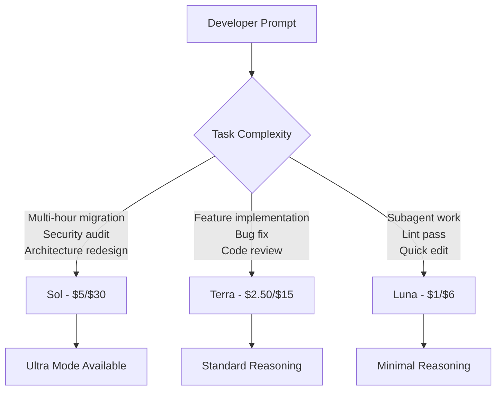

# GPT-5.6 Sol, Terra, and Luna: What the Three-Tier Model Preview Means for Codex CLI Developers


---

On 26 June 2026, OpenAI announced a limited preview of the GPT-5.6 model series — its first release structured as an explicit three-tier family from day one.[^1] Sol is the flagship, Terra the balanced workhorse, and Luna the fast-and-cheap option. The release lands under unusual constraints: the Trump administration's 2 June executive order on frontier AI assessment means initial access is restricted to roughly twenty approved partner organisations, with broader general availability planned "in the coming weeks."[^2]

For Codex CLI users, GPT-5.6 represents the most significant model change since GPT-5.5 arrived on 23 April.[^3] This article covers the confirmed specifications, the pricing economics, the new ultra reasoning mode, cache breakpoint mechanics, and — critically — how to prepare your `config.toml` and AGENTS.md files before the models land in your terminal.

## The Three Tiers Explained

OpenAI has moved from a single model with optional reasoning-effort knobs to a tiered family where each variant occupies a distinct cost-performance envelope.

| Model | Position | Pricing (per 1M tokens) | Target Use Case |
|-------|----------|------------------------|-----------------|
| **Sol** | Flagship | \$5 input / \$30 output | Complex agentic tasks, multi-hour coding, cybersecurity |
| **Terra** | Balanced | \$2.50 input / \$15 output | Everyday development, comparable to GPT-5.5 at 2× lower cost |
| **Luna** | Fast | \$1 input / \$6 output | Subagents, linting, quick edits, high-volume batch work |

Cache writes across all three tiers are billed at 1.25× the uncached input rate, whilst cached reads receive a 90% discount with a guaranteed 30-minute minimum cache lifespan.[^1]

### How This Reshapes Cost-per-Task

Terra at \$2.50/\$15 per million tokens delivers GPT-5.5-class performance at half the price.[^1] For teams already running Codex CLI against GPT-5.5 (\$5/\$30), switching the default model to Terra for routine work halves the token bill without measurable quality loss on standard development tasks.

Luna at \$1/\$6 opens a category that GPT-5.3-Codex-Spark previously occupied alone: cheap, fast inference for subagents, hooks, and high-volume batch operations. At roughly one-fifth of Sol's cost, Luna becomes the natural choice for the six concurrent subagent slots that Codex CLI supports.[^4]



## Sol's Ultra Mode: Sub-Agent Reasoning

GPT-5.6 Sol introduces two new reasoning effort levels beyond the existing `low`, `medium`, and `high` settings: **max** and **ultra**.[^1]

Ultra mode is the headline feature. Rather than simply spending more tokens on chain-of-thought within a single model turn, ultra decomposes complex problems by spawning internal sub-agents — each tackling a distinct aspect of the task before results are synthesised.[^1] This is distinct from Codex CLI's existing subagent system: ultra operates within the model's own reasoning, whilst Codex CLI subagents are separate agent threads managed by the CLI runtime.

The practical implication: a single Codex CLI turn running Sol in ultra mode can internally parallelise reasoning across multiple sub-problems, whilst the CLI's own subagent orchestration handles external tool calls and file operations. The two parallelism layers stack.

### Configuring Reasoning Effort

In `config.toml`, the `model_reasoning_effort` key already accepts string values. When Sol becomes available in the CLI:

```toml
# ~/.codex/config.toml
model = "gpt-5.6-sol"
model_reasoning_effort = "ultra"
```

⚠️ Ultra mode will consume significantly more tokens per turn than standard reasoning. Teams should pair it with rollout token budgets to prevent runaway costs:

```toml
# Cap ultra-mode sessions at 500k tokens
rollout_token_budget = 500000
```

## Context Window and Token Efficiency

Multiple independent reports describe GPT-5.6 Sol's effective context window at approximately 1.5 million tokens — a 43% expansion over GPT-5.5's approximately 1 million token Codex limit.[^5] ⚠️ OpenAI has not published an official context window specification; this figure comes from behavioural observations by early preview partners and should be treated as provisional until confirmed in the model card.

If confirmed, a 1.5M context window pushes the compaction threshold (which fires at `context_window - 13,000` tokens) to roughly 1,487,000 tokens.[^6] For practical purposes, this means:

- Long sessions that previously hit compaction after 30–45 minutes may run 60–90 minutes before needing to compact
- The 50,000-token file re-read budget after compaction becomes proportionally smaller relative to the window
- Teams running extended Goal Mode sessions benefit most from the expanded headroom

Reports also indicate a 10–15% improvement in output-per-input-token efficiency compared to GPT-5.5, attributed to an improved supervised fine-tuning pipeline.[^5]

## Cache Breakpoints: A New Primitive

GPT-5.6 introduces explicit cache breakpoints — a mechanism for developers to signal stable prefixes in their prompts that should be cached and reused across requests.[^1] Unlike the implicit prompt caching in GPT-5.5, breakpoints give programmatic control over what gets cached.

For Codex CLI, this matters in two scenarios:

1. **AGENTS.md and skill instructions**: The system prompt containing your AGENTS.md hierarchy, loaded skills, and MCP tool schemas rarely changes between turns. Cache breakpoints can pin this prefix, reducing input costs on subsequent turns by up to 90%.

2. **Goal Mode continuations**: When a goal persists across multiple turns, the goal context and accumulated progress log form a stable prefix. Caching this prefix means each continuation turn only pays full price for new context.

The 30-minute minimum cache lifespan aligns well with typical Codex CLI session durations. Cache writes at 1.25× input cost are paid once; every subsequent cache hit within the window pays 0.1× — an effective 87.5% savings on repeated context.

## Benchmark Signals

The GPT-5.6 preview system card reveals safety evaluation data but stops short of publishing full capability benchmarks.[^7] What we know:

- **Terminal-Bench 2.0**: One source reports Sol achieving 91.91% in ultra mode and 88.76% in max mode[^8] — up from GPT-5.5's 82.7%[^3]. ⚠️ These figures have not appeared in OpenAI's official publications and should be treated as unconfirmed.
- **SWE-bench Verified**: No official score published. Community estimates place Sol in the 87–89% range.[^5]
- **Safety evaluations**: The system card confirms Sol scores "High" (not Critical) on cybersecurity and biological/chemical capability assessments.[^7]

The system card also notes that "GPT-5.6 Sol more often takes severity level 3 actions" in agentic coding compared to predecessors, though absolute rates remain low.[^7] This suggests Sol is more willing to make consequential changes — a behaviour that reinforces the importance of Codex CLI's sandbox and hook pipeline.

## Preparing Your Codex CLI Configuration

### Step 1: Profile-Based Model Routing

Create named profiles that map to each tier, ready to activate when GPT-5.6 reaches general availability:

```toml
# ~/.codex/sol.config.toml
model = "gpt-5.6-sol"
model_reasoning_effort = "high"
rollout_token_budget = 500000

# ~/.codex/terra.config.toml
model = "gpt-5.6-terra"
model_reasoning_effort = "medium"

# ~/.codex/luna.config.toml
model = "gpt-5.6-luna"
model_reasoning_effort = "low"
```

Switch profiles at launch:

```bash
codex --profile sol "Redesign the authentication module"
codex --profile terra "Fix the failing CI tests"
codex --profile luna "Add JSDoc comments to src/utils/"
```

### Step 2: Subagent Model Assignment

Custom agent definitions in `~/.codex/agents/` can target Luna for cost-efficient parallel work:

```toml
# ~/.codex/agents/lint-agent.toml
[agent]
name = "lint-sweep"
model = "gpt-5.6-luna"
instructions = "Run linters and fix all warnings. Do not change logic."
```

### Step 3: Update AGENTS.md Routing Guidance

Add model routing hints to your project's AGENTS.md so the agent self-selects appropriately:

```markdown
## Model Selection

- Use Sol for architectural decisions, security reviews, and multi-file refactors
- Use Terra for standard feature work, bug fixes, and test writing
- Use Luna for documentation, formatting, and subagent tasks
- Always use `high` or `max` reasoning effort for security-sensitive changes
- Never use `ultra` reasoning effort without a rollout_token_budget cap
```

### Step 4: Hook-Based Cost Guardrails

Add a PostToolUse hook that logs model and token consumption, providing visibility into tier-level spending:

```bash
#!/usr/bin/env bash
# hooks/post-tool-use-cost-log.sh
# Append model + token usage to a session cost log
echo "$(date -u +%FT%TZ) model=$CODEX_MODEL tokens_used=$CODEX_TOKENS_USED" \
  >> "$HOME/.codex/cost-log.txt"
```

## The Government Access Question

The Trump administration's executive order creates an unprecedented situation for a model launch: GPT-5.6 is technically released but practically unavailable to most developers.[^2] OpenAI CEO Sam Altman has stated the company is pushing back on making customer-by-customer government approval "the long-term default," and a broader rollout could come within weeks.[^2]

For Codex CLI teams, this means:

- **Do not change your production model configuration yet.** GPT-5.5 remains the current default and is unaffected.
- **Prepare profiles and AGENTS.md routing now** so you can switch cleanly when access arrives.
- **Monitor the Codex CLI changelog** at the releases page for the stable version that bundles GPT-5.6 model identifiers.[^9]

## Migration Checklist

When GPT-5.6 reaches general availability in Codex CLI:

1. **Test Terra first.** It is the lowest-risk migration — same performance class as GPT-5.5 at half the cost.
2. **Validate compaction behaviour.** If the 1.5M context window is confirmed, your `model_auto_compact_token_limit` may need adjustment.
3. **Audit hook compatibility.** Sol's increased willingness to take "severity level 3 actions" may trigger existing PreToolUse hooks more frequently.
4. **Budget ultra mode carefully.** Pair it with `rollout_token_budget` and reserve it for genuinely complex tasks.
5. **Update model references in CI/CD.** Any `codex exec` pipelines hardcoding `gpt-5.5` should switch to Terra for cost savings or Sol for quality.
6. **Review AGENTS.md model guidance.** Replace any GPT-5.5-specific instructions with tier-aware routing.

## What This Means for the Coding Agent Landscape

GPT-5.6's three-tier structure mirrors Anthropic's recent model stratification (Fable 5 / Opus 4.7 / Haiku 4) and Google's Gemini 3 family.[^10] The industry has converged on tiered model families as the default deployment pattern, and Codex CLI's `config.toml` model routing is well-positioned to exploit this — profiles, subagent model overrides, and AGENTS.md guidance together let teams allocate the right tier to the right task automatically.

The real competitive question is whether Sol's ultra mode — internal sub-agent reasoning — creates a meaningful quality gap on long-horizon agentic coding tasks. If the unconfirmed Terminal-Bench score of 91.91% holds, it would represent a 9-percentage-point jump over GPT-5.5 and establish clear daylight over Claude Fable 5's comparable benchmarks.[^8]

For now, the pragmatic move is preparation, not migration. Ready your profiles, update your AGENTS.md, and wait for the access gates to open.

---

## Citations

[^1]: OpenAI, "Previewing GPT-5.6 Sol: a next-generation model," openai.com, 26 June 2026. [https://openai.com/index/previewing-gpt-5-6-sol/](https://openai.com/index/previewing-gpt-5-6-sol/)

[^2]: Axios, "OpenAI releases powerful new GPT-5.6 model under restrictions," axios.com, 26 June 2026. [https://www.axios.com/2026/06/26/openai-gpt-sol-terra-luna-trump](https://www.axios.com/2026/06/26/openai-gpt-sol-terra-luna-trump)

[^3]: OpenAI, "Introducing GPT-5.5," openai.com, 23 April 2026. [https://openai.com/index/introducing-gpt-5-5/](https://openai.com/index/introducing-gpt-5-5/)

[^4]: OpenAI, "Subagents – Codex," developers.openai.com. [https://developers.openai.com/codex/subagents](https://developers.openai.com/codex/subagents)

[^5]: ChatForest, "GPT-5.6: What Builders Need to Know Before the June 22–28 Launch Window," chatforest.com, June 2026. [https://chatforest.com/builders-log/openai-gpt-5-6-june-2026-pre-release-builder-guide/](https://chatforest.com/builders-log/openai-gpt-5-6-june-2026-pre-release-builder-guide/)

[^6]: Codex Knowledge Base, "Codex CLI Context Compaction Under GPT-5.5," codex.danielvaughan.com, 10 May 2026. [https://codex.danielvaughan.com/2026/05/10/codex-cli-context-compaction-gpt55-failures-resilient-long-sessions/](https://codex.danielvaughan.com/2026/05/10/codex-cli-context-compaction-gpt55-failures-resilient-long-sessions/)

[^7]: OpenAI, "GPT-5.6 Preview System Card," deploymentsafety.openai.com, 26 June 2026. [https://deploymentsafety.openai.com/gpt-5-6-preview](https://deploymentsafety.openai.com/gpt-5-6-preview)

[^8]: AIToolsReview, "GPT-5.6: What's New, Benchmarks & Pricing (June 2026)," aitoolsreview.co.uk, June 2026. [https://aitoolsreview.co.uk/insights/gpt-5-6](https://aitoolsreview.co.uk/insights/gpt-5-6)

[^9]: OpenAI, "Codex CLI Releases," github.com/openai/codex. [https://github.com/openai/codex/releases](https://github.com/openai/codex/releases)

[^10]: 9to5Mac, "OpenAI upgrading ChatGPT and Codex with new GPT-5.6 models in limited release," 9to5mac.com, 26 June 2026. [https://9to5mac.com/2026/06/26/openai-upgrading-chatgpt-and-codex-with-new-gpt-5-6-models-in-limited-release/](https://9to5mac.com/2026/06/26/openai-upgrading-chatgpt-and-codex-with-new-gpt-5-6-models-in-limited-release/)
