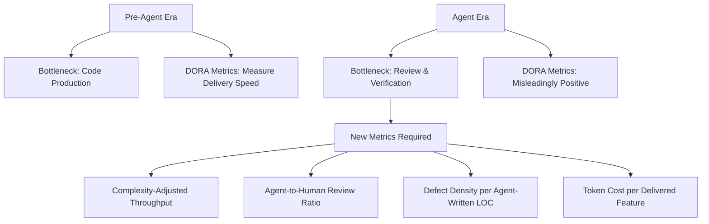
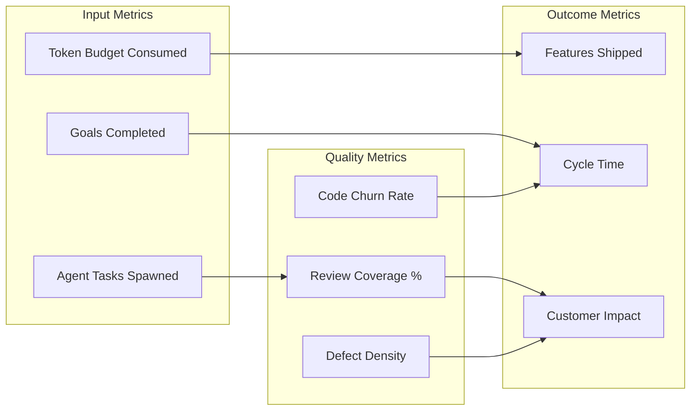

# The Jevons Paradox of AI Coding: Why Codex CLI Creates More Engineering Work, Not Less — and How to Measure What Matters


---

## The Paradox Nobody Expected

In the nineteenth century, William Stanley Jevons observed that James Watt's more efficient steam engine did not reduce coal consumption — it increased it, because cheaper energy made new applications economically viable [^1]. In June 2026, we are watching the same paradox play out in software engineering.

SignalFire's latest State of Talent Report, covered by TechCrunch on 24 June 2026, tracked millions of employees across more than 80 million companies [^2]. The headline finding: while total hiring across the twelve "Tech Majors" (Alphabet, Meta, Apple, Amazon, Microsoft, Netflix, Nvidia, Tesla, Uber, Airbnb, Block, and Stripe) dropped 25% compared to 2019 levels, engineering hiring fell by only 11% [^2]. Engineers now comprise 55% of all new hires at those companies, up from 46% in 2019 [^2]. At early-stage startups, engineer hiring actually rose 7% above 2019 levels [^2].

Jensen Huang put it bluntly: "Now that all engineers at Nvidia use agentic AI, software engineers are busier than ever" [^3]. The efficiency gains from coding agents are not eliminating engineering roles — they are expanding the surface area of what engineering teams attempt.

This article examines the evidence behind the paradox, maps the measurement pitfalls that obscure it, and shows how Codex CLI's feature stack — Goal Mode, AGENTS.md, permission profiles, rollout token budgets, and multi-agent delegation — positions teams to capture the expanded throughput rather than drown in it.

---

## The Evidence: Three Data Points That Define the Paradox

### 1. Hiring Resilience (SignalFire, June 2026)

SignalFire's data is the most comprehensive longitudinal dataset on engineering hiring published this year. The 55% engineering share of new hires is not a statistical artefact — it reflects a structural shift where companies respond to AI-assisted productivity by expanding engineering scope rather than reducing headcount [^2]. Peter McCrory, Anthropic's Chief Economist, noted: "There is no greater material difference in unemployment between workers using Claude for automated tasks — including software engineers — and those less susceptible to AI" [^3].

### 2. The METR Productivity Study — and Its Retraction

METR's randomised controlled trial, published in July 2025, initially found that AI coding tools made experienced open-source developers 19% slower, even though those developers believed they were 20% faster [^4]. The study used 16 developers completing 246 tasks in mature projects where they averaged five years of prior experience [^4].

Seven months later, in February 2026, METR backtracked. Their follow-up revealed critical methodology flaws [^5]:

- **Selection bias**: Developers who benefit most from AI increasingly refused to participate in no-AI control conditions, even at \$50/hour compensation.
- **Task selection bias**: Between 30–50% of surveyed developers avoided submitting tasks they believed AI would significantly accelerate.
- **Concurrent agent interference**: Time tracking became unreliable when developers ran concurrent AI agents whilst working on unrelated tasks.
- **Quality divergence**: Work quality differed between AI-allowed and AI-disallowed conditions, making pure time comparisons misleading.

The revised estimates showed original developers at −18% speedup (confidence interval: −38% to +9%) and newly recruited developers at −4% (confidence interval: −15% to +9%) — neither statistically significant [^5]. METR's honest conclusion was that their experimental design could no longer isolate AI's effect because developers had reorganised their workflows around the tools.

### 3. The Output-Quality Divergence (DORA and Industry Data)

The numbers at the individual level look impressive: AI tools now write approximately 41% of all code, developers report 30–60% time savings on routine tasks, and epics completed per developer are up 66.2% [^6][^7]. But organisational delivery metrics tell a more nuanced story. Code churn is expected to double in 2026, delivery stability decreased 7.2% according to Google's DORA report, and median time in pull request review increased 441% [^6][^7]. Perhaps most concerning, 31% more pull requests are merging with no review at all [^7].

This is the Jevons Paradox in action: more code, more features, more scope — but the governance and quality infrastructure has not scaled to match.

---

## Why Traditional Metrics Break

The standard DORA four keys — deployment frequency, lead time for changes, change failure rate, and time to restore service — were designed for a world where humans wrote code and the bottleneck was development velocity [^8]. In the agent era, the bottleneck shifts to review, verification, and coordination.



The industry average for complexity-adjusted throughput is 8 points per engineer per week for all work, rising to 12 points per week for AI-assisted work [^6]. But measuring points without tracking downstream quality creates a dangerous illusion of productivity.

---

## Configuring Codex CLI for Jevons-Scale Work

If the paradox means more work, not less, the question becomes: how do you configure your coding agent to handle expanded scope without collapsing quality? Codex CLI's recent feature releases directly address this.

### Goal Mode for Expanded Scope

Goal Mode, now on by default since v0.133.0 [^9], is purpose-built for the kinds of work the Jevons Paradox creates — longer-horizon tasks that would not have been attempted without agent assistance. Rather than manually steering each step, you set an objective and let the agent iterate:

```bash
# Set a long-horizon objective
codex /goal "Migrate the payment service from REST to gRPC, keep all existing tests green, add gRPC reflection, and update the OpenAPI spec"

# Use /plan first for complex goals to cut iteration count
codex /plan "Refactor the authentication module to support OIDC"
# Review the plan, then convert to a goal
codex /goal "Execute the OIDC refactoring plan in plan-oidc.md"
```

The `/plan` → `/goal` workflow is particularly effective for Jevons-scale work: the agent designs its approach before executing, reducing mid-loop redesigns by approximately half [^9].

### Permission Profiles for Quality Gates

With more agent-generated code flowing through your pipeline, least-privilege boundaries become essential. Permission profiles in Codex CLI provide composable trust levels [^10]:

```toml
# config.toml — graduated trust for different task types
[profiles.audit]
permissions = ":read-only"

[profiles.implementation]
permissions = ":workspace"

[profiles.dependency-update]
permissions = ":workspace"
network = ["registry.npmjs.org", "pypi.org"]
```

Start in `:read-only` for code review and analysis, move to `:workspace` for implementation, and explicitly scope network access for dependency operations. This directly addresses the DORA finding that 31% more PRs are merging unreviewed — by bounding what the agent can do, you reduce the blast radius of unreviewed changes.

### Rollout Token Budgets for Cost Governance

Codex CLI v0.142.0 introduced configurable rollout token budgets that track usage across agent threads and abort turns when exhausted [^11]. In a Jevons world where teams attempt more work, token spend can spiral without visibility:

```toml
# config.toml — budget controls
[rollout]
token_budget = 500000        # per-thread ceiling
budget_reminder_threshold = 0.8  # warn at 80% consumed
```

This is the engineering equivalent of metering coal consumption — the efficiency gains from AI coding are real, but only if you can observe and govern the resource spend.

### Multi-Agent Delegation for Parallel Scope

The same v0.142.0 release added configurable multi-agent delegation modes [^11]. When Jevons-scale work creates multiple independent streams, delegation lets a primary agent spawn subagents:

```toml
# config.toml — multi-agent configuration
[agents]
max_threads = 6     # concurrent subagent ceiling
max_depth = 1       # prevent recursive fan-out
delegation = "explicit-request-only"  # require explicit delegation
```

⚠️ Setting `max_depth` above 1 can trigger recursive fan-out that multiplies token consumption and latency. Keep it at 1 unless you have specific, tested use cases.

### AGENTS.md for Institutional Knowledge

The expanded scope that Jevons predicts means agents encounter more of your codebase, more of your conventions, and more of your constraints. AGENTS.md codifies this institutional knowledge at three levels [^12]:

```markdown
<!-- ~/.codex/AGENTS.md — global defaults -->
# Global Standards
- British English in all documentation
- Run `make lint` before committing
- Never modify files in vendor/ or generated/

<!-- repo-root/AGENTS.md — project-specific -->
# Payment Service
- All monetary values use decimal.Decimal, never float
- gRPC services must include reflection registration
- Integration tests require `docker compose up -d` first

<!-- repo-root/internal/auth/AGENTS.md — directory-scoped -->
# Auth Module
- OIDC tokens must be validated with RS256, not HS256
- Session store uses Redis, not in-memory maps
```

---

## A Measurement Framework for the Agent Era

DORA metrics remain foundational but insufficient on their own [^8]. Teams navigating the Jevons Paradox need a composite view:

| Metric | What It Measures | Target |
|--------|-----------------|--------|
| **Complexity-adjusted throughput** | Story points per engineer per week (AI-assisted) | ≥12 pts/wk |
| **Agent-to-human review ratio** | % of agent-generated PRs receiving human review | ≥90% |
| **Defect density (agent LOC)** | Bugs per 1,000 lines of agent-written code | ≤ human baseline |
| **Token cost per feature** | Total token spend divided by features shipped | Trending down |
| **Code churn rate** | Lines changed within 14 days of initial commit | ≤ 15% |
| **Time-to-first-review** | Median time from PR open to first human comment | ≤ 4 hours |



The key insight is that the Jevons Paradox makes input metrics (tokens, tasks, goals) look phenomenal. Only by pairing them with quality and outcome metrics can you distinguish genuine productivity from accelerated technical debt.

---

## The Uncomfortable Implication

Dario Amodei warned that "AI could wipe out half of all entry-level white-collar jobs and push unemployment to 10–20% within five years" [^3]. SignalFire's data says the opposite is happening for engineering — for now. The resolution of this tension lies in understanding what Jevons actually predicted: efficiency increases demand for the *resource*, not necessarily for the same *tasks*. The engineers being hired in 2026 are not doing the same work as those hired in 2019. They are orchestrating agents, designing guardrails, specifying goals, and reviewing outputs — work that did not exist at scale three years ago.

Codex CLI's architecture — with its layered permission model, explicit delegation controls, and budget governance — is not just a productivity tool. It is infrastructure for the new shape of engineering work that the Jevons Paradox creates.

---

## Citations

[^1]: W.S. Jevons, *The Coal Question* (1865). Standard economic reference on resource efficiency paradoxes.
[^2]: [TechCrunch — "AI was supposed to kill engineering jobs, but new data suggests they're the most resilient"](https://techcrunch.com/2026/06/24/ai-was-supposed-to-kill-engineering-jobs-but-new-data-suggests-theyre-the-most-resilient/), 24 June 2026. Based on SignalFire State of Talent Report data.
[^3]: [Mezha — "SignalFire finds AI has not reduced engineer hiring despite layoffs"](https://mezha.net/eng/bukvy/e632de65_signalfire_finds_ai/), June 2026. Includes quotes from Jensen Huang, Dario Amodei, and Peter McCrory.
[^4]: [METR — "Measuring the Impact of Early-2025 AI on Experienced Open-Source Developer Productivity"](https://metr.org/blog/2025-07-10-early-2025-ai-experienced-os-dev-study/), July 2025. arXiv:2507.09089.
[^5]: [METR — "We are Changing our Developer Productivity Experiment Design"](https://metr.org/blog/2026-02-24-uplift-update/), February 2026. Experimental design change and updated estimates.
[^6]: [Zylos Research — "Developer Productivity Metrics 2026: From DORA to DevEx and Beyond"](https://zylos.ai/research/2026-02-07-developer-productivity-metrics/), February 2026.
[^7]: [Index.dev — "Top 100 Developer Productivity Statistics with AI Tools 2026"](https://www.index.dev/blog/developer-productivity-statistics-with-ai-tools), 2026.
[^8]: [DORA — Google DevOps Research and Assessment](https://dora.dev/insights/), ongoing. DORA four keys framework and annual reports.
[^9]: [OpenAI — "Using Goals in Codex"](https://developers.openai.com/cookbook/examples/codex/using_goals_in_codex) and [Best Practices](https://developers.openai.com/codex/learn/best-practices), 2026. Goal Mode GA documentation.
[^10]: [OpenAI — "Permissions — Codex CLI"](https://developers.openai.com/codex/permissions), 2026. Permission profiles documentation.
[^11]: [OpenAI — Codex CLI Changelog](https://developers.openai.com/codex/changelog), June 2026. v0.142.0 release notes covering rollout token budgets and multi-agent delegation.
[^12]: [OpenAI — "Custom instructions with AGENTS.md"](https://developers.openai.com/codex/guides/agents-md), 2026. AGENTS.md layering documentation.
