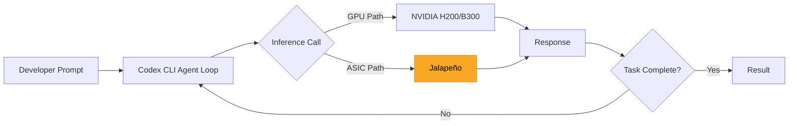
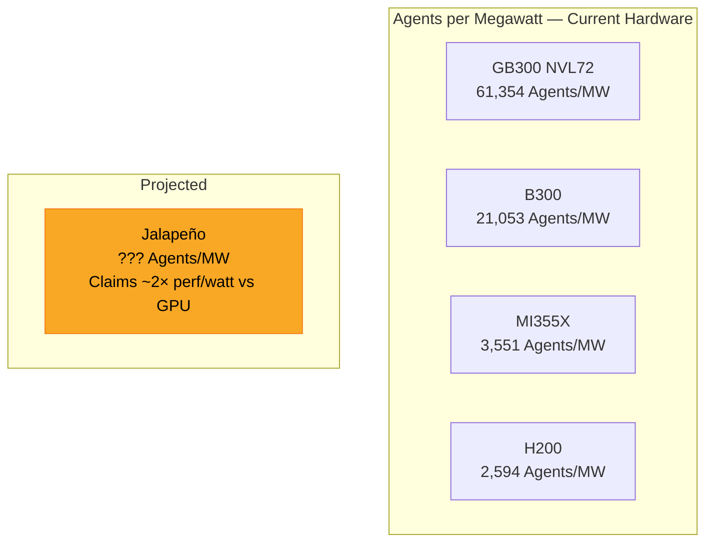

# OpenAI's Jalapeño Inference Chip: What Purpose-Built Silicon Means for Codex CLI Cost, Latency, and the Coding Agent Hardware Stack

---

On 24 June 2026, OpenAI and Broadcom unveiled **Jalapeño** — OpenAI's first custom inference processor and the inaugural entry in a multi-generation compute platform the two companies are building together [^1]. The announcement matters to every developer running Codex CLI, because inference cost and latency are the twin constraints that determine how many agent turns you can afford and how long you wait between them.

This article unpacks Jalapeño's architecture, maps its claimed performance to the specific workload profile of coding agents, and connects it to the AA-AgentPerf benchmark data that already tells us where the hardware bottlenecks sit.

## Why Inference Silicon Matters for Coding Agents

Coding agents are inference-heavy in ways that distinguish them from chatbot or single-shot completion workloads:

- **Long contexts**: a typical Codex CLI session carries 50–130K tokens of project context across tool calls, file reads, and iterative reasoning [^2].
- **Looping execution**: the inspect → patch → test → verify cycle means a single task can trigger dozens of sequential inference calls, each dependent on the last.
- **Compound latency**: a 200ms reduction per turn across a 40-turn task saves eight seconds of wall-clock time — enough to shift the interaction from "waiting for a server" to "working with a tool" [^3].
- **Cost-per-task economics**: developers increasingly budget by task, not by token. A migration that costs £3.20 in inference today would cost £1.60 if the 50% cost reduction claim holds.

## Jalapeño Architecture at a Glance

Jalapeño is a purpose-built inference ASIC — not a repurposed training accelerator [^1]. The key design decisions follow directly from OpenAI's understanding of LLM serving bottlenecks:

| Specification | Detail |
|---|---|
| **Process node** | TSMC 3nm [^4] |
| **Die type** | Reticle-sized ASIC [^4] |
| **Memory** | Eight HBM stacks on-package [^5] |
| **Core architecture** | Systolic array (comparable to Google TPU approach) [^5] |
| **Wafer yield** | ~50–60 ASICs per 300mm wafer [^5] |
| **Design-to-tapeout** | Nine months — believed to be the fastest cycle for a high-performance semiconductor of this class [^4] |
| **Models validated** | Engineering samples running GPT-5.3-Codex-Spark at production target frequency and power [^1] |

Three architecture choices stand out for coding agent workloads:

1. **Memory bandwidth over raw compute.** LLM inference is memory-bound, not compute-bound. Eight HBM stacks address the data movement bottleneck that limits GPU utilisation during autoregressive decoding [^1].

2. **Systolic array design.** Predictable matrix operations — the bread and butter of transformer inference — map efficiently to systolic arrays. Training's exploratory compute patterns do not, which is why Jalapeño is inference-only and OpenAI retains full NVIDIA dependency for training [^5].

3. **Networking-aware layout.** The chip was co-designed with Celestica for board, rack, and networking integration, targeting gigawatt-scale data centres with Microsoft and other partners [^1].

## The 50% Cost Claim: What We Know and What We Don't

Broadcom CEO Hock Tan told Bloomberg that early testing shows Jalapeño delivering approximately **50% lower inference cost per token** than current-generation GPUs [^6]. OpenAI's own public statement is more measured, describing performance per watt as "substantially better than current state-of-the-art" and promising a detailed technical report later in 2026 [^1].

### Caveats for Developers

- **Self-reported benchmarks.** No independent verification exists. The comparison baselines (which GPU? which model? which batch size?) have not been disclosed [^5].
- **Inference only.** Jalapeño handles serving, not training. Variable, exploratory workloads stay on NVIDIA silicon [^5].
- **Cost ≠ price.** A 50% reduction in OpenAI's serving cost does not automatically translate to a 50% reduction in API pricing. The savings might fund higher model quality at the same price, improved rate limits, or margin [^3].
- **Deployment timeline.** Prototype deployments are slated for late 2026, with full production ramp in 2027–2028 [^5]. Developers will not see Jalapeño-served tokens until at least Q4 2026.

⚠️ Until OpenAI publishes the promised technical report with disclosed baselines, the 50% figure should be treated as a directional claim, not a verified benchmark.

## Connecting Jalapeño to the AA-AgentPerf Data

The AA-AgentPerf benchmark, launched by Artificial Analysis in June 2026, provides the first hardware-level performance data specifically for agentic coding workloads [^2]. Its headline metric — **Agents per Megawatt** — measures how many concurrent coding agents a system can sustain within production service-level targets.

Current results for DeepSeek V4 Pro at the 20 tokens/s, 10-second TTFT tier [^7]:

| Hardware | Agents/MW |
|---|---|
| GB300 NVL72 (rack-scale) | 61,354 |
| B300 (single node) | 21,053 |
| AMD MI355X | 3,551 |
| H200 | 2,594 |

Where would Jalapeño land? If the 50% cost-per-token claim maps roughly to a 2× improvement in performance per watt over current GPUs, Jalapeño would need to compete with the B300's 21K Agents/MW at single-node scale. Whether a systolic-array ASIC optimised for OpenAI's specific model architecture can match or exceed Blackwell's Agents/MW on third-party models is an open question — and one that AA-AgentPerf is well positioned to answer once engineering samples become available for independent testing.

## What This Means for Codex CLI Users

### Near Term (Q3–Q4 2026)

Nothing changes immediately. Codex CLI users interact with OpenAI's API endpoints; the underlying silicon is transparent. However, if Jalapeño enters production serving by late 2026, developers might notice:

- **Improved rate limits** as serving capacity increases
- **Lower tail latency** under peak load, making `codex exec` batch jobs more predictable
- **Potential pricing adjustments** on pay-as-you-go tiers, particularly for the Codex-Spark model that is already validated on Jalapeño silicon [^1]

### Medium Term (2027–2028)

The strategic implications are more significant:

- **Self-hosted inference becomes a two-track decision.** Organisations considering self-hosted Codex deployments (via the Agents SDK and MCP server patterns) will need to evaluate NVIDIA Blackwell versus waiting for Jalapeño availability — assuming OpenAI makes the silicon available outside its own data centres.
- **Token budget governance gets cheaper.** Codex CLI's configurable rollout token budgets [^8] become less constraining when each token costs less to serve, potentially enabling longer agent sessions and more ambitious multi-agent delegation.
- **The cost-per-task metric shifts.** If compound inference costs drop materially, workflows that today require `--reasoning-effort low` or Spark-tier models to stay within budget might become viable on full o3/o4-mini reasoning without cost penalty.

### The Broader Silicon Landscape

Jalapeño is not the only custom inference silicon in play. Google has iterated on TPUs for over a decade. Amazon's Trainium and Inferentia chips serve AWS Bedrock. Meta is reportedly developing its own MTIA accelerators. What distinguishes Jalapeño is the **tight vertical integration**: the chip is designed around OpenAI's specific model architectures by the same organisation that builds those models [^1].

For Codex CLI users, this vertical integration could mean that OpenAI's own models (o3, o4-mini, Codex-Spark) run disproportionately well on Jalapeño compared to third-party models, further deepening the lock-in to OpenAI's ecosystem.

## Practical Takeaways

1. **No action required today.** Jalapeño is pre-production silicon. Continue optimising Codex CLI workflows with existing tools: profiles, token budgets, and `--reasoning-effort` tuning.

2. **Watch the technical report.** OpenAI has committed to publishing detailed benchmarks. When that lands, compare against AA-AgentPerf's Agents/MW metric for an apples-to-apples hardware assessment.

3. **Budget for cost reduction, not revolution.** Even if 50% materialises, it arrives incrementally as Jalapeño ramps through OpenAI's data centres. Plan for gradual cost improvements, not a step-function price drop.

4. **Self-hosted teams: defer hardware decisions.** If you are evaluating GB300 or B300 clusters for self-hosted coding agent inference, factor in that OpenAI's ASIC roadmap may change the calculus by mid-2027.

5. **Microsoft's 40% commitment matters.** Microsoft has reportedly committed to purchasing approximately 40% of initial Jalapeño production [^5], which means Azure-hosted Codex workloads may see benefits before direct API users.

## Citations

[^1]: OpenAI, "OpenAI and Broadcom Unveil LLM-Optimized Inference Chip," openai.com, 24 June 2026. [https://openai.com/index/openai-broadcom-jalapeno-inference-chip/](https://openai.com/index/openai-broadcom-jalapeno-inference-chip/)

[^2]: Artificial Analysis, "First Results from AA-AgentPerf: The Hardware Benchmark for the Agent Era," artificialanalysis.ai, June 2026. [https://artificialanalysis.ai/articles/aa-agentperf](https://artificialanalysis.ai/articles/aa-agentperf)

[^3]: NxCode, "OpenAI Jalapeño Chip Guide: What It Means for AI Coding Agents in 2026," nxcode.io, June 2026. [https://www.nxcode.io/resources/news/openai-broadcom-jalapeno-inference-chip-developer-guide-2026](https://www.nxcode.io/resources/news/openai-broadcom-jalapeno-inference-chip-developer-guide-2026)

[^4]: Tom's Hardware, "Broadcom and OpenAI Unveil Custom-Built Jalapeño Inference Processor," tomshardware.com, 24 June 2026. [https://www.tomshardware.com/tech-industry/artificial-intelligence/broadcom-and-openai-unveil-custom-built-jalapeno-inference-processor-openais-first-chip-is-a-massive-reticle-sized-asic-built-in-an-ultra-fast-nine-month-development-cycle](https://www.tomshardware.com/tech-industry/artificial-intelligence/broadcom-and-openai-unveil-custom-built-jalapeno-inference-processor-openais-first-chip-is-a-massive-reticle-sized-asic-built-in-an-ultra-fast-nine-month-development-cycle)

[^5]: Awesome Agents, "OpenAI Ships Jalapeño — Its First Custom AI Chip," awesomeagents.ai, June 2026. [https://awesomeagents.ai/news/openai-jalapeno-chip-broadcom-inference/](https://awesomeagents.ai/news/openai-jalapeno-chip-broadcom-inference/)

[^6]: TechTimes, "OpenAI's First Custom AI Chip Targets 50% Cheaper Inference: Jalapeño Unveiled," techtimes.com, 24 June 2026. [https://www.techtimes.com/articles/319012/20260624/openais-first-custom-ai-chip-targets-50-cheaper-inference-jalapeno-unveiled.htm](https://www.techtimes.com/articles/319012/20260624/openais-first-custom-ai-chip-targets-50-cheaper-inference-jalapeno-unveiled.htm)

[^7]: Artificial Analysis, "AI Hardware Benchmarking & Performance Analysis," artificialanalysis.ai, 2026. [https://artificialanalysis.ai/benchmarks/hardware](https://artificialanalysis.ai/benchmarks/hardware)

[^8]: OpenAI, "Changelog — Codex," developers.openai.com, June 2026. [https://developers.openai.com/codex/changelog](https://developers.openai.com/codex/changelog)
