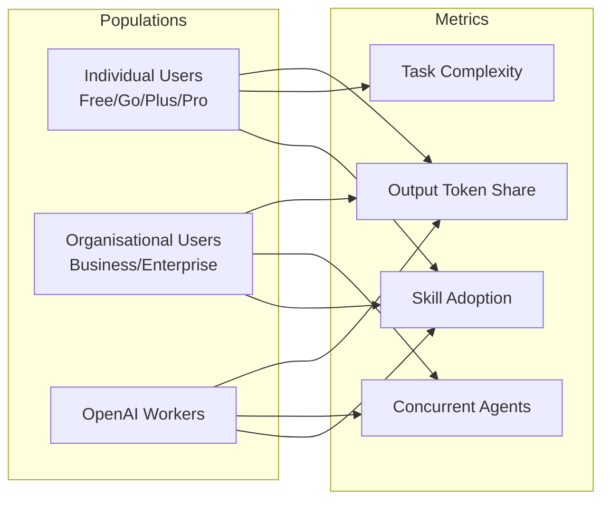
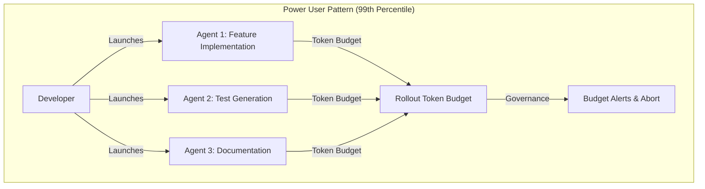

# The Shift to Agentic AI: What OpenAI's Internal Usage Data Reveals About Codex Adoption, Parallel Agent Orchestration, and the Non-Developer Surge


---

On 25 June 2026, OpenAI published both a blog post and a companion research paper — "The Shift to Agentic AI: Evidence from Codex" (arXiv:2606.26959) — presenting the first large-scale quantitative portrait of how agentic AI usage evolves across developer and non-developer populations [^1][^2]. The paper analyses three distinct user segments: individual account holders, organisational (Business and Enterprise) account holders, and OpenAI's own workforce. For Codex CLI practitioners, the data illuminates where the tool is headed, how power users actually operate, and which adoption patterns are likely to arrive in enterprise environments within months.

This article dissects the key findings, connects them to Codex CLI features, and identifies what the data means for teams planning their own agentic workflows.

## Five Headline Numbers

Before diving into methodology, the numbers that matter:

| Metric | Value | Period |
|--------|-------|--------|
| Weekly active user growth | >5× | Jan–Jun 2026 [^1] |
| Individual users submitting 1h+ tasks | 70.2% | May 2026 [^2] |
| Individual users submitting 8h+ tasks | 25.6% | May 2026 [^2] |
| OpenAI 99th-percentile daily agent runtime | 71 hours | Week ending 11 Jun 2026 [^2] |
| Organisational Codex adoption (28-day) | 17.3% | Jun 2026 [^2] |

## Methodology: What the Paper Actually Measures

The research uses an automated, privacy-preserving pipeline that classifies requests without reading underlying messages [^2]. Task complexity is estimated via a model-based classifier applied to a 0.1% sample of individual users. Job titles within organisational accounts are classified by `gpt-5-mini`, and persona classification operates at request level with 3–4% sampling rates [^2].

The authors explicitly acknowledge that OpenAI's internal environment is "unusually favourable" — employees face no quantity restrictions, have high product familiarity, and receive significant internal training [^2]. Internal usage data therefore represents a ceiling, not a benchmark. The external individual and organisational segments provide a more realistic adoption baseline.



## The Output Token Shift: From Chat to Agent

The most striking structural change is where tokens flow. For individual users, Codex generates 16.5% of output tokens — modest but growing [^2]. Organisational users are already at 63.3%, meaning the majority of their AI output comes from agentic tasks rather than conversational chat [^2]. OpenAI workers sit at 99.8% [^2].

This gradient — individual → organisational → internal — maps closely to how Codex CLI adoption typically unfolds in practice. Teams that invest in `AGENTS.md` project configuration, hook pipelines, and skills tend to shift from chat-first to agent-first usage within weeks.

For Codex CLI users, the practical lesson is that the token economics of agentic work differ fundamentally from chat. Rollout token budgets, introduced in v0.142.0, become essential governance tools when Codex accounts for the majority of your AI spend [^3].

## Task Complexity Is Growing Rapidly

The paper's task duration estimates reveal an accelerating shift toward complex, multi-hour delegations:

- **December 2025:** 35.4% of individual users submitted at least one task estimated at 1+ hour of human work [^2]
- **May 2026:** That figure rose to 70.2% [^2]
- **8-hour tasks:** Grew from 2.1% to 25.6% of users in the same period — nearly a tenfold increase [^2]

This maps directly to Codex CLI's evolution. Goal Mode, durable threads, and the codex-maxxing methodology [^4] exist precisely because users are pushing agents into multi-hour territory. The WorldState persistence stack shipped in v0.142.0 addresses the context-loss problems that surface when sessions span hours rather than minutes [^5].

⚠️ The task duration estimates rely on a model-based classifier, not actual human timing comparisons. The paper does not report the classifier's accuracy or calibration, so these percentages should be treated as directional rather than precise.

## Parallel Agent Orchestration: The Power User Pattern

The concurrent agent data reveals a sharp divide between populations:

| Segment | No concurrent agents | 2 concurrent | 5+ concurrent |
|---------|---------------------|--------------|---------------|
| Individual | 63.9% | — | — |
| Organisational | 67.4% | Majority peak | — |
| OpenAI workers | 10.7% single only | — | 28.6% |

Source: Week ending 11 June 2026 [^2]

OpenAI's 99th-percentile workers accumulate 71 hours of daily agent runtime — which, given a 24-hour day, means roughly three agents running continuously in parallel [^2]. This figure increased 88% since 7 April 2026 [^2].

For Codex CLI users, this validates the multi-agent delegation controls introduced in v0.142.0, which allow app-server clients to configure delegation as `disabled`, `explicit-request-only`, or `proactive` at the thread and turn level [^3]. The rollout token budget feature similarly makes sense in this context: when multiple agents run concurrently, budget governance prevents runaway spend.



## The Non-Developer Surge

The paper's most consequential finding for the Codex ecosystem is the non-developer growth rate. Since August 2025, non-developer individual users grew 137×, non-developer organisational users grew 189×, and non-developer OpenAI internal users grew 12× [^2]. Knowledge workers now comprise roughly 20% of Codex's 5 million weekly users, and they are adopting three times faster than developers [^1].

Among organisational users with available job titles, engineers direct 26.8% of output tokens to Codex (quintupled since the start of 2026), whilst data and analytics practitioners account for 15.2% and legal roles 1.9% [^2]. But among users who have adopted Codex, engineers direct 88.3% of their total tokens through it, compared with 17.6% for legal users [^2] — suggesting engineers use it more intensively but non-developers are broadening the user base.

For Codex CLI practitioners, this trend has infrastructure implications. Non-developer colleagues may soon be using the same Codex platform — through the web app rather than the CLI — consuming shared organisational token budgets. Enterprise teams need to plan for this through usage tracking (`/usage`), permission profiles, and potentially separate workspace configurations for developer and knowledge-worker populations.

## Skill Adoption: The Automation Multiplier

Skills — reusable instruction sets for complex workflows — show the clearest correlation with power usage:

- **Individual users:** 25.7% invoked at least one skill (week ending 11 June 2026) [^2]
- **Organisational users:** 30.4% [^2]
- **OpenAI workers:** 96.2% [^2]
- **Growth:** From 5.4% on 1 March to 26.6% on 11 June 2026 [^2]

The fivefold growth in three months suggests skills are the mechanism through which users transition from ad-hoc prompting to repeatable agentic workflows. Codex CLI's skill system — including the plugin marketplace introduced in v0.142.0 with curated, workspace, and shared categories [^3] — is designed for exactly this pattern.

The practical takeaway: teams that invest in building and sharing skills will likely see disproportionate adoption gains. The Record & Replay feature (macOS, shipped 18 June 2026) further lowers the barrier by converting demonstrated workflows into reusable skills [^6].

## What the Critics Rightly Note

The TNW analysis [^7] and broader commentary raise valid concerns:

1. **Self-reported data**: Every statistic comes from OpenAI, which has a direct financial incentive to promote Codex — particularly ahead of a potential Q4 IPO [^7].
2. **No independent verification**: No third party has validated the usage figures [^7].
3. **Institutional pressure**: The paper does not address whether OpenAI incentivises or encourages employees to use Codex, making internal adoption figures potentially inflated [^7].
4. **Input ≠ output**: Token volume is an imperfect proxy for productivity. Faster code generation does not automatically translate into proportional productivity gains when verification, testing, and deployment time may expand [^7].

These caveats do not invalidate the external usage data — individual and organisational adoption trends are harder to manufacture — but they demand that readers treat the internal OpenAI data as an aspirational ceiling rather than a representative benchmark.

## Practical Implications for Codex CLI Teams

The paper's data, read alongside Codex CLI's current feature set, suggests five concrete actions:

### 1. Configure Rollout Token Budgets

With 70% of users now submitting hour-plus tasks, budget governance is no longer optional. Set per-thread and per-session budgets in your `codex.toml`:

```toml
[rollout]
token_budget = 500000
budget_warning_threshold = 0.8
```

### 2. Build Skills Before You Need Them

The 5.4% → 26.6% skill adoption curve shows that skills become standard practice rapidly. Invest in creating project-specific skills now — code review checklists, deployment runbooks, migration patterns — rather than waiting for organic demand.

### 3. Plan for Multi-Agent Concurrency

If 28.6% of OpenAI power users run 5+ concurrent agents, your team will likely reach that pattern within months. Ensure your `AGENTS.md` supports delegation mode configuration and that your hook pipeline can handle concurrent execution.

### 4. Prepare for Non-Developer Codex Users

Knowledge-worker adoption is growing 3× faster than developer adoption. Establish organisational usage policies, workspace-level permission profiles, and token budget allocation before non-developer colleagues start consuming shared capacity.

### 5. Instrument Your Own Usage Data

The paper measures adoption through output token share, task complexity, and concurrent agent count. These same metrics should inform your team's Codex evaluation. Use `/usage` to track token consumption and monitor session duration trends as leading indicators of agentic maturity.

## Conclusion

"The Shift to Agentic AI" is the first rigorous, data-backed study of coding agent adoption at scale. Its findings — the steep task-complexity growth, the parallel agent orchestration pattern, the non-developer surge, and the skill adoption curve — collectively describe a transition from AI-assisted development to AI-delegated development. Codex CLI's recent v0.142.x feature set (token budgets, delegation modes, plugin marketplace, WorldState persistence) maps precisely to the usage patterns the paper documents. The gap between OpenAI's internal ceiling and external organisational adoption is closing rapidly, and the teams that prepare infrastructure, governance, and skills now will be best positioned as that gap narrows.

## Citations

[^1]: OpenAI, "How agents are transforming work," 25 June 2026. [https://openai.com/index/how-agents-are-transforming-work/](https://openai.com/index/how-agents-are-transforming-work/)

[^2]: D. Johnston and D. Holtz, "The Shift to Agentic AI: Evidence from Codex," arXiv:2606.26959, 25 June 2026. [https://arxiv.org/abs/2606.26959](https://arxiv.org/abs/2606.26959)

[^3]: OpenAI, "Codex Changelog — v0.142.0," 25 June 2026. [https://developers.openai.com/codex/changelog](https://developers.openai.com/codex/changelog)

[^4]: OpenAI, "Codex-maxxing for long-running work," 22 June 2026. [https://developers.openai.com/codex/guides/codex-maxxing](https://developers.openai.com/codex/guides/codex-maxxing)

[^5]: OpenAI/Codex, "WorldState Persistence PRs #29833, #29835, #29837," merged 25 June 2026. [https://github.com/openai/codex/pulls](https://github.com/openai/codex/pulls)

[^6]: OpenAI, "Codex Changelog — Codex App 26.616, Record & Replay," 18 June 2026. [https://developers.openai.com/codex/changelog](https://developers.openai.com/codex/changelog)

[^7]: The Next Web, "OpenAI says 98% of its employees now use Codex agents, but all the data is self-reported," 25 June 2026. [https://thenextweb.com/news/openai-codex-agents-shift-employees-non-developers](https://thenextweb.com/news/openai-codex-agents-shift-employees-non-developers)
