# RigorBench and the Process Discipline Gap: What the First Engineering Process Benchmark Reveals About Codex CLI Workflows


---

Every major coding agent benchmark — SWE-bench, Terminal-Bench, ProjDevBench, SlopCodeBench — measures the same thing: **did the agent produce correct output?** None ask a question that matters more in production: **did the agent arrive at that output through sound engineering process?** RigorBench, published on 21 June 2026 by researchers at Georgia Tech (arXiv:2606.22678), is the first benchmark designed to close that gap[^1].

This article examines RigorBench's five-pillar framework, its headline finding that process discipline correlates with outcome quality at r = 0.87, and — most importantly — what it means for how you configure Codex CLI. If you are a senior developer running Codex in production, RigorBench provides the empirical backing to justify the configuration choices you may already be making on instinct.

## Why Outcome-Only Benchmarks Are Insufficient

The authors surveyed twelve major AI coding benchmarks and found that **none evaluate engineering process**[^1]. SWE-bench checks whether a patch resolves a GitHub issue. Terminal-Bench checks whether a terminal session achieves the stated goal. Both treat the agent as a black box.

The problem is obvious to anyone who has reviewed agent-generated pull requests: an agent can brute-force its way to a passing test suite through trial-and-error, leaving behind broken intermediate states, untested edge cases, and commits that make future debugging harder. A correct outcome produced through reckless process is a liability in any codebase that other engineers must maintain.

RigorBench addresses this by analysing **the full execution trajectory** — every plan, edit, test invocation, error recovery attempt, and commit — rather than just the final artefact[^1].

## The Five Pillars of Process Discipline

RigorBench decomposes engineering discipline into five weighted dimensions, aggregated into a composite **RigorScore**:

```mermaid
graph TD
    RS[RigorScore] --> PF["Planning Fidelity<br/>Weight: 0.20"]
    RS --> VC["Verification Coverage<br/>Weight: 0.25"]
    RS --> RE["Recovery Efficiency<br/>Weight: 0.25"]
    RS --> AQ["Abstention Quality<br/>Weight: 0.15"]
    RS --> ATI["Atomic Transition Integrity<br/>Weight: 0.15"]

    PF --> PF1[Plan artifact exists?]
    PF --> PF2[Steps atomic & actionable?]
    PF --> PF3["Plan–execution alignment<br/>(Kendall τ)"]

    VC --> VC1[Test creation rate]
    VC --> VC2[Coverage delta]
    VC --> VC3[Requirements traceability]

    RE --> RE1[Recovery attempt count]
    RE --> RE2[Strategy diversity]
    RE --> RE3[Token waste ratio]

    AQ --> AQ1[Correct impossibility identification]
    AQ --> AQ2[Avoidance of false confidence]

    ATI --> ATI1[Build health between steps]
    ATI --> ATI2[No test regressions]
    ATI --> ATI3[Atomic commit hygiene]
```



### Planning Fidelity (PF) — 20%

Does the agent create an explicit plan before writing code? Are the steps decomposed into atomic, actionable units? Does execution follow the stated plan? RigorBench measures plan–execution alignment using Kendall's τ correlation between planned and actual step order[^1].

### Verification Coverage (VC) — 25%

Does the agent write tests for the features it implements? Does code coverage increase? Can each test be traced back to a requirement in the task specification?[^1]

### Recovery Efficiency (RE) — 25%

When the agent encounters an error, does it recover through diverse strategies rather than repeating the same failed approach? RigorBench penalises **doom loops** — repeated identical recovery attempts that waste tokens without progress[^1].

### Abstention Quality (AQ) — 15%

When a task is genuinely impossible or ambiguous, does the agent say so? Or does it produce plausible-looking but incorrect output with false confidence? This is the epistemic humility pillar[^1].

### Atomic Transition Integrity (ATI) — 15%

Does every intermediate state of the codebase compile and pass existing tests? Are commits logical and atomic? This pillar captures whether the agent maintains build health throughout its work, not just at the end[^1].

## The Headline Results

RigorBench evaluated four harness configurations across 30 curated tasks in isolated Docker containers with a 60-minute timeout and 200K-token budget[^1]:

| Harness | RigorScore | Outcome Score |
|---------|-----------|---------------|
| Agent-Rigor (structured discipline) | **0.61** | **0.83** |
| Agent-Skills | 0.47 | 0.72 |
| Superpowers | 0.48 | 0.70 |
| Baseline ReAct | 0.48 | 0.64 |

Three findings stand out:

1. **Process predicts outcome.** Across 120 executions, the correlation between RigorScore and Outcome Score was r = 0.87 (p < 0.001). The linear relationship: `Outcome = 0.41 + 0.54 × RigorScore`[^1]. This is not a weak association — it is the strongest evidence to date that engineering discipline is a reliable predictor of code quality in agentic systems.

2. **Planning is the biggest gap.** Baseline agents scored 0.25 on Planning Fidelity; structured frameworks achieved 0.83 — a 3.3× improvement. Without explicit scaffolding, agents almost never produce deliberate plans despite having chain-of-thought capabilities[^1].

3. **No baseline agent abstained.** When given impossible tasks, every baseline agent produced plausible-looking but incorrect solutions. Structured frameworks improved correct abstention to 62%[^1].

## Mapping RigorBench to Codex CLI

RigorBench validates the architectural choices that Codex CLI already provides. The question is whether you are using them. Here is a pillar-by-pillar mapping:

### Planning Fidelity → Plan Mode + PLANS.md

Codex CLI's `/plan` command (or `Shift+Tab` toggle) separates planning from execution[^2]. When activated, Codex gathers context, asks clarifying questions, and produces a structured plan before touching code. The `PLANS.md` template extends this to multi-step projects with verification items and completion criteria[^3].

RigorBench's finding that planning fidelity shows the largest improvement under discipline directly supports the practice of starting every non-trivial task in plan mode:

```bash
# Start in plan mode for a complex refactor
codex --plan "Migrate the auth module from session-based to JWT tokens"
```

For longer-horizon work, the ExecPlan pattern documented in OpenAI's cookbook formalises the plan into a persistent document that Codex references throughout execution[^4].

### Verification Coverage → Test-First Workflows + PostToolUse Hooks

RigorBench's Verification Coverage pillar maps directly to Codex CLI's test-driven development workflow. OpenAI's best practices documentation is explicit: "Don't stop at asking Codex to make a change. Ask it to create tests when needed, run the relevant checks, confirm the result, and review the work before you accept it"[^2].

You can enforce verification programmatically with a `PostToolUse` hook that runs the test suite after every code change:

```json
{
  "hooks": [
    {
      "event": "PostToolUse",
      "command": "bash -c 'npm test 2>&1 | tail -20'",
      "timeout_ms": 30000
    }
  ]
}
```

This ensures the agent sees test results after every edit — the feedback loop that RigorBench's Verification Coverage pillar measures[^5].

### Recovery Efficiency → Token Budgets + Model Routing

RigorBench penalises doom loops where agents repeat failed strategies. Codex CLI's **rollout token budgets**, introduced in v0.142.0, provide a mechanical backstop: when the budget is exhausted, the turn aborts with a structured error rather than spiralling into token-wasting recovery loops[^6].

```toml
# config.toml — enforce a token ceiling to prevent doom loops
[budget]
  rollout_token_budget = 500000
```

Combined with model routing — using a cheaper model like `gpt-5.4-mini` for exploratory recovery and reserving `gpt-5.5` for implementation — you can optimise recovery efficiency without manual intervention[^7].

### Abstention Quality → Permission Profiles + Guardian

The abstention gap is perhaps the most concerning finding. When an agent cannot solve a problem, it should say so. Codex CLI's **permission profiles** and **Guardian subagent** provide the governance layer for this[^8].

In `untrusted` approval mode, Codex requires human confirmation before executing commands — creating a natural checkpoint where a developer can evaluate whether the agent is making genuine progress or producing confident nonsense. The Guardian subagent can be configured to route sensitive review requests for additional approval before actions are taken[^8].

For CI/CD contexts using `codex exec`, the `--approval-policy on-failure` flag ensures that failures escalate to human review rather than being silently papered over[^9].

### Atomic Transition Integrity → Hooks + AGENTS.md Build Commands

RigorBench's ATI pillar measures whether intermediate codebase states compile and pass tests. This maps to two Codex CLI features:

1. **AGENTS.md build commands.** When you specify exact build and test commands in `AGENTS.md`, Codex runs them between steps to verify build health[^10]. Research shows that developer-written AGENTS.md files reduce agent-generated bugs by 35–55%[^10].

2. **PreToolUse hooks.** A hook that runs `git diff --stat` before each tool use forces the agent to see uncommitted changes, encouraging atomic commits:

```json
{
  "hooks": [
    {
      "event": "PreToolUse",
      "command": "bash -c 'echo \"Uncommitted changes:\"; git diff --stat'",
      "timeout_ms": 5000
    }
  ]
}
```

## The Token Efficiency Paradox

One counterintuitive RigorBench finding deserves special attention: **disciplined agents used 12% fewer total tokens** than baseline agents despite producing more artefacts (plans, tests, commit messages)[^1]. The explanation is straightforward — tokens recovered from avoided doom loops and failed recovery attempts exceed the overhead of upfront planning.

This has direct cost implications for Codex CLI users. The prevailing assumption that skipping planning saves tokens is empirically wrong. A team running Codex on a rollout token budget will get more work done per token by enabling plan mode than by skipping it.

## A Practical RigorBench-Informed Configuration

Combining the five-pillar mapping into a single Codex CLI setup:

```toml
# ~/.codex/rigorous.config.toml
model = "gpt-5.5"
approval_policy = "on-request"

[budget]
  rollout_token_budget = 1000000

[plugins]
  auto_recommend = true
```

```markdown
<!-- AGENTS.md -->
## Build & Test
- Run `npm run build` after every code change
- Run `npm test` after every implementation step
- Never commit code that fails the test suite

## Planning
- Start complex tasks with /plan
- Decompose into atomic steps before implementation
- If requirements are ambiguous, ask for clarification before proceeding

## Recovery
- If an approach fails twice, try a different strategy
- Do not repeat the same fix more than once
- If a task appears impossible, say so and explain why
```

## Limitations and Open Questions

RigorBench is a first step, not a final answer. The task suite is modest at 30 tasks compared to SWE-bench's 2,294 instances[^1]. The LLM-as-judge scoring achieves κ = 0.74 inter-rater agreement — solid but not definitive[^1]. And the benchmark reflects agent capabilities as of mid-2026; rapid model improvements may shift the baseline.

⚠️ The paper evaluates harness configurations rather than specific commercial products. The results demonstrate that scaffolding (plan enforcement, verification requirements, recovery limits) improves process discipline regardless of the underlying model — but the specific RigorScore numbers should not be directly attributed to any particular product version.

The deeper question RigorBench raises is whether coding agent benchmarks should weight process alongside outcome. Given the r = 0.87 correlation, there is a strong case that they should. For Codex CLI users, the practical implication is clear: the configuration overhead of plan mode, test hooks, token budgets, and explicit AGENTS.md instructions is not ceremony — it is the engineering discipline that makes agent output reliable.

## Citations

[^1]: M. S. P. Madiraju and M. B. Madiraju, "RigorBench: Benchmarking Engineering Process Discipline in Autonomous AI Coding Agents," arXiv:2606.22678, June 2026. [https://arxiv.org/abs/2606.22678](https://arxiv.org/abs/2606.22678)

[^2]: OpenAI, "Best practices — Codex," OpenAI Developers, 2026. [https://developers.openai.com/codex/learn/best-practices](https://developers.openai.com/codex/learn/best-practices)

[^3]: OpenAI, "Workflows — Codex," OpenAI Developers, 2026. [https://developers.openai.com/codex/workflows](https://developers.openai.com/codex/workflows)

[^4]: OpenAI, "Codex-maxxing for long-running work," OpenAI Blog, June 2026. [https://openai.com/index/codex-maxxing-long-running-work/](https://openai.com/index/codex-maxxing-long-running-work/)

[^5]: OpenAI, "Hooks — Codex," OpenAI Developers, 2026. [https://developers.openai.com/codex/hooks](https://developers.openai.com/codex/hooks)

[^6]: OpenAI, "Changelog — Codex," OpenAI Developers, v0.142.0, 22 June 2026. [https://developers.openai.com/codex/changelog](https://developers.openai.com/codex/changelog)

[^7]: OpenAI, "Models — Codex," OpenAI Developers, 2026. [https://developers.openai.com/codex/models](https://developers.openai.com/codex/models)

[^8]: OpenAI, "Agent approvals & security — Codex," OpenAI Developers, 2026. [https://developers.openai.com/codex/agent-approvals-security](https://developers.openai.com/codex/agent-approvals-security)

[^9]: OpenAI, "Command line options — Codex CLI," OpenAI Developers, 2026. [https://developers.openai.com/codex/cli/reference](https://developers.openai.com/codex/cli/reference)

[^10]: OpenAI, "Custom instructions with AGENTS.md — Codex," OpenAI Developers, 2026. [https://developers.openai.com/codex/guides/agents-md](https://developers.openai.com/codex/guides/agents-md)
