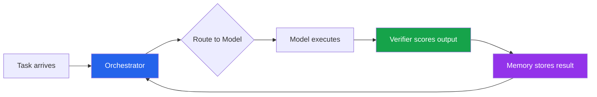
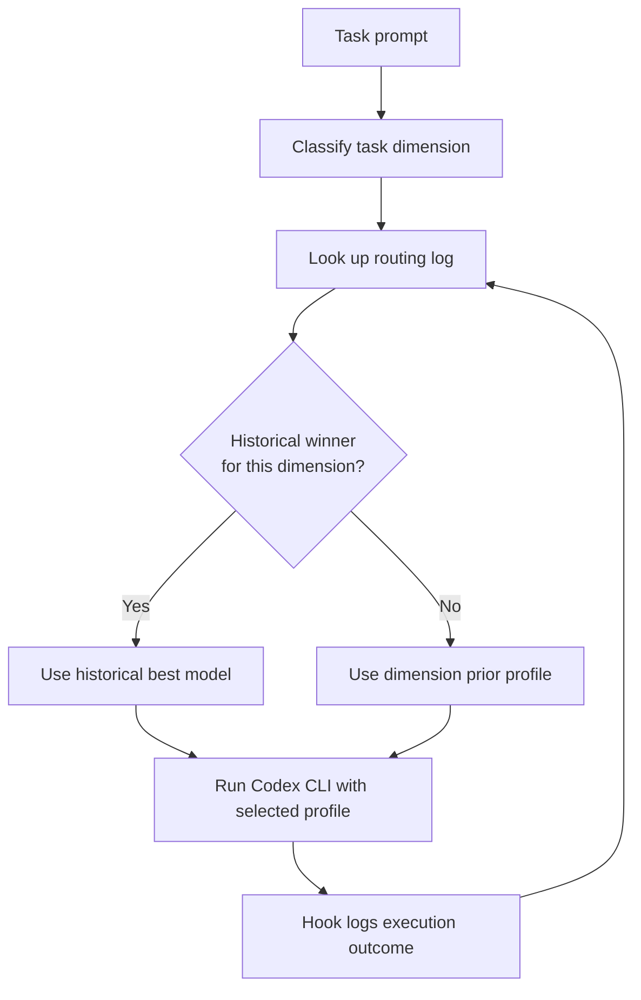

# Agent-as-a-Router: What the First Agentic Model Routing Benchmark Means for Codex CLI Multi-Model Workflows


---

Running Opus 4.6 on every coding task is the most reliable way to incinerate your token budget. Running the cheapest model on everything is the fastest way to ship broken code. The routing problem — which model, for which task, at what cost — has been one of the hardest unsolved questions in agentic coding since multi-model access became the norm in early 2026.

A paper posted to arXiv on 24 June 2026 formalises this problem for the first time with a dedicated benchmark and proposes a system that learns to route during deployment rather than from a frozen training set. "Agent-as-a-Router: Agentic Model Routing for Coding Tasks" by Zhou et al. introduces ACRouter and CodeRouterBench, and the findings have direct implications for anyone configuring Codex CLI profiles and hooks for multi-provider workflows[^1].

## The Information Gap Problem

The paper's central insight is deceptively simple: static routers fail because they lack information about how well each model actually performs on the specific task in front of them.

Zhou et al. measured this directly. A vanilla LLM router (Qwen3.5-0.8B fine-tuned on task embeddings) achieved 41.41% average performance across CodeRouterBench's 10,000 tasks. Adding per-dimension performance statistics from a held-out probing set pushed that to 47.74% — a 15.3% relative gain from nothing more than telling the router which models are good at which task types[^1]. The routing intelligence mattered less than the routing context.

This is the information gap: without execution-grounded feedback on how models actually perform, even sophisticated routers are guessing.

## ACRouter Architecture

ACRouter closes the gap through a three-component system operating in a continuous Context–Action–Feedback loop[^1]:



**Orchestrator.** A fine-tuned Qwen3.5-0.8B model that consumes three information streams: dimension-based priors (which model historically wins each task category), kNN-retrieved neighbours from Memory (the 10 most similar past tasks, retrieved by cosine similarity with a 0.5 threshold), and task metadata (difficulty, programming language, dimension classification). These streams feed a weighted voting mechanism that selects the target model[^1].

**Verifier.** Aggregates signals from AST parsing, sandbox execution, test extraction, and LLM-as-Judge into a unified confidence score between 0 and 1. The weight each verification tool receives varies by task type — test extraction dominates for code generation, AST parsing matters more for refactoring[^1].

**Memory.** An online vector store keyed by task embeddings, logging the chosen model, observed performance, monetary cost, and the Verifier's trace. It maintains a FIFO buffer of 20,000 entries and retrieves the top-10 neighbours for each new routing decision[^1].

The reward function balances performance against cost:

```
r(a) = ε₁·s(a) + ε₂·κ(a)
```

where `ε₁ = 1.0` (performance weight) and `ε₂ = -0.1` (cost penalty)[^1]. This means the router tolerates spending more only when the performance gain is at least 10× the additional cost.

## CodeRouterBench: The First Coding Router Benchmark

Before this paper, there was no benchmark specifically designed to evaluate model routing for coding tasks. CodeRouterBench fills that gap with approximately 10,000 tasks across nine single-turn dimensions and one out-of-distribution agentic programming dimension[^1]:

| Dimension | Task Type |
|---|---|
| Code Generation | Write new code from specification |
| Algorithm Design | Implement algorithmic solutions |
| Bug Fixing | Identify and repair defects |
| Code Completion | Fill in partial implementations |
| Code Refactoring | Restructure without changing behaviour |
| Data Science | Data processing and analysis |
| Multi-Language | Cross-language tasks |
| Code Understanding | Comprehension and explanation |
| Test Generation | Write test suites |
| Agentic Programming (OOD) | Multi-step autonomous tasks |

Eight frontier models were profiled across all dimensions[^1]:

- Claude Opus 4.6 (\$5.00/\$25.00 per 1M input/output tokens)
- Claude Sonnet 4.6 (\$3.00/\$15.00)
- GPT-5.4 (\$2.50/\$15.00)
- Qwen3-Max
- Qwen3.5-Plus (\$0.40/\$1.20)
- GLM-5
- Kimi-K2.5
- MiniMax-M2.7 (\$0.30/\$2.40)

The benchmark splits into a 7,080-task probing set for building priors, a 2,919-task in-distribution test set, and a 176-task out-of-distribution test set for agentic programming scenarios[^1].

## Results That Matter

The headline numbers tell a clear story about the cost–performance frontier[^1]:

### In-Distribution Performance (2,919 tasks)

| Router | AvgPerf% | Cumulative Regret | Perf/$ |
|---|---|---|---|
| Oracle | 57.00 | 0 | 8.20 |
| **ACRouter** | **49.98** | **205.5** | **3.79** |
| DimensionBest | 47.50 | 277.4 | 3.69 |
| LinUCB | 46.84 | 296.9 | 4.38 |
| Always-Opus 4.6 | 43.83 | 387.1 | 1.29 |

### Out-of-Distribution Performance (176 agentic tasks)

| Router | AvgPerf% | Cumulative Regret | Perf/$ |
|---|---|---|---|
| Oracle | 75.89 | 0 | 2.32 |
| **ACRouter** | **62.50** | **17.0** | **1.18** |
| Always-Opus 4.6 | 57.14 | 26.7 | 0.64 |
| RouteLLM-MF | 8.93 | — | — |

Three findings stand out:

**Always-Opus is expensive mediocrity.** On the in-distribution set, always routing to Opus 4.6 cost \$34.02 total for a 43.83% average performance. ACRouter achieved 49.98% — six points higher — for \$13.21. That is 2.9× the cost-efficiency[^1].

**Static classifiers collapse on novel tasks.** RouteLLM-BERT, logistic regression, and fine-tuned classifiers all scored between 47% and 48% on the in-distribution test. On the out-of-distribution agentic programming tasks, lightweight classifiers dropped to 8.93–21.43%, performing worse than random selection at 31.25%[^1]. Any routing strategy that works only on familiar task types is useless for the hardest work.

**Execution feedback is the differentiator.** ACRouter's Memory module — accumulating real execution outcomes and feeding them back into routing decisions — is what prevented collapse on OOD tasks. The C-A-F loop's advantage over static approaches grows precisely when the task distribution shifts[^1].

## Mapping ACRouter's Findings to Codex CLI

Codex CLI does not ship a built-in model router, but its profile and hook infrastructure provides the building blocks to implement the same principles. Here is how ACRouter's three-layer architecture maps to Codex CLI's configuration surfaces.

### Layer 1: Dimension-Based Priors via Named Profiles

ACRouter's dimension-based priors — pre-computed best models per task category — translate directly to Codex CLI named profiles[^2]. Create a profile per task dimension:

```toml
# ~/.codex/refactor.config.toml
model = "gpt-5.4"
model_provider = "openai"
reasoning_effort = "medium"
```

```toml
# ~/.codex/algorithm.config.toml
model = "claude-opus-4-6"
model_provider = "anthropic"
reasoning_effort = "high"
```

```toml
# ~/.codex/bugfix.config.toml
model = "qwen3.5-plus"
model_provider = "openrouter"
reasoning_effort = "low"
```

Invoke with `codex --profile refactor "restructure the auth module"` or `codex --profile algorithm "implement A* pathfinding"`[^2]. This gives you the equivalent of ACRouter's DimensionBest baseline — the simplest routing strategy that still outperforms always-Opus by 3.67 percentage points[^1].

### Layer 2: Execution Feedback via Hooks

ACRouter's Verifier aggregates test results, AST checks, and execution signals. Codex CLI's `PostToolUse` hooks can replicate this[^3]:

```toml
# .codex/config.toml
[hooks.PostToolUse]
command = "python .codex/verify.py"
timeout_ms = 30000
```

A verification script that logs outcomes:

```python
#!/usr/bin/env python3
"""Post-tool verification hook — logs model, task, and outcome."""
import json, os, sys, datetime

result = json.loads(os.environ.get("CODEX_HOOK_CONTEXT", "{}"))
model = os.environ.get("CODEX_MODEL", "unknown")

entry = {
    "timestamp": datetime.datetime.utcnow().isoformat(),
    "model": model,
    "tool": result.get("tool_name", ""),
    "exit_code": result.get("exit_code", -1),
    "task_hint": result.get("task_description", "")[:200],
}

with open(os.path.expanduser("~/.codex/routing_log.jsonl"), "a") as f:
    f.write(json.dumps(entry) + "\n")
```

Over time, this log becomes a local equivalent of ACRouter's Memory module — a record of which models succeeded on which types of tasks within your specific codebase[^3].

### Layer 3: Adaptive Selection via a Wrapper Script

The final layer combines priors and feedback into routing decisions:



```bash
#!/usr/bin/env bash
# route.sh — lightweight task-aware Codex CLI router
TASK="$*"
DIMENSION=$(python3 .codex/classify_dimension.py "$TASK")
BEST_MODEL=$(python3 .codex/lookup_history.py "$DIMENSION")

if [ -n "$BEST_MODEL" ]; then
    codex --profile "$BEST_MODEL" "$TASK"
else
    codex --profile "$DIMENSION" "$TASK"
fi
```

This is not ACRouter's full kNN-over-embeddings retrieval, but it captures the core principle: use execution outcomes to override static priors. The paper's results show that even the simplest feedback-augmented approach (DimensionBest with historical stats) beats sophisticated static classifiers[^1].

## The Self-Hosting Cost Equation

One detail buried in the paper deserves attention: ACRouter's Orchestrator — a fine-tuned Qwen3.5-0.8B — costs \$0.054 per million tokens to run on an H100 GPU[^1]. That is effectively free compared to the models it routes between. The routing overhead is negligible; the routing savings are substantial.

For Codex CLI users, this suggests that investing in a lightweight local classifier (even a simple rule-based system) for task-dimension detection pays for itself almost immediately if you are running more than a few dozen tasks per day across multiple model providers[^2].

## When Static Routing Breaks

The most sobering finding from CodeRouterBench is the OOD collapse. Static trained classifiers — the kind most teams would build first — dropped from ~47% to as low as 8.93% when task types shifted[^1]. In practice, this means:

- A router trained on your current workload will fail when the project enters a new phase
- Bug-fix-heavy sprints will see different optimal routing than feature-development sprints
- Any team rotating between codebases with different technology stacks will hit this wall

ACRouter's solution — continuously updating Memory with execution feedback — is the only approach in the benchmark that maintained reasonable performance across distribution shifts. For Codex CLI users, this means the routing log from Layer 2 is not optional. Without execution feedback, your profiles are just educated guesses that degrade over time.

## Practical Implications

**Start with profiles, not routers.** Named profiles activated by `--profile` flag give you ACRouter's DimensionBest baseline with zero infrastructure. This alone beats always-Opus by 3.7 percentage points and costs 2.6× less[^1][^2].

**Log everything.** The hook-based verification layer is cheap to implement and provides the foundation for any future routing intelligence. Even if you never build an adaptive router, the log tells you which models are costing the most and delivering the least[^3].

**Do not trust frozen classifiers.** If you build or adopt a static model router, plan for drift. CodeRouterBench demonstrates that static approaches collapse precisely when you need routing most — on novel, complex, agentic tasks[^1].

**Budget your routing as Perf/$.** ACRouter's reward function (`r = performance − 0.1 × cost`) provides a clean framework. When evaluating whether to route a task to a more expensive model, ask: will the performance gain exceed 10× the additional cost?[^1]

## Citations

[^1]: Zhou, P., Tang, Z., Ma, Y., Tang, J., Han, Y., Wan, Z., Meng, F., Wang, W., Zhuang, B., Zhao, W. & You, Y. (2026). "Agent-as-a-Router: Agentic Model Routing for Coding Tasks." arXiv:2606.22902. [https://arxiv.org/abs/2606.22902](https://arxiv.org/abs/2606.22902)

[^2]: OpenAI. (2026). "Configuration Reference — Codex CLI." OpenAI Developers. [https://developers.openai.com/codex/config-reference](https://developers.openai.com/codex/config-reference)

[^3]: OpenAI. (2026). "Advanced Configuration — Codex CLI." OpenAI Developers. [https://developers.openai.com/codex/config-advanced](https://developers.openai.com/codex/config-advanced)
