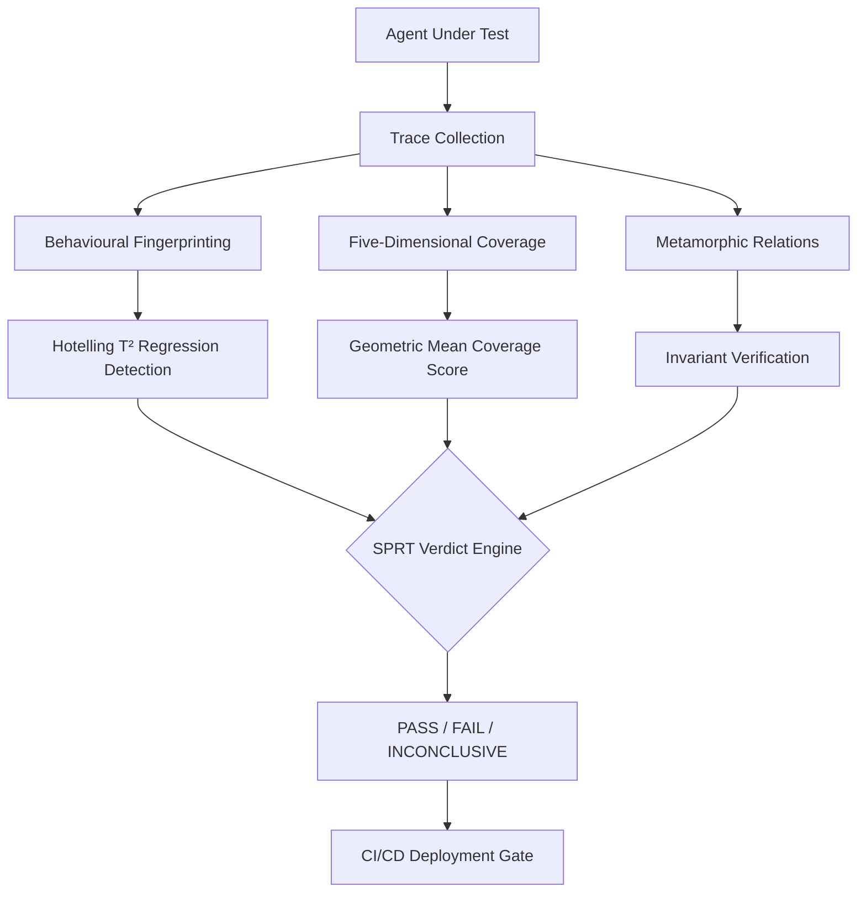
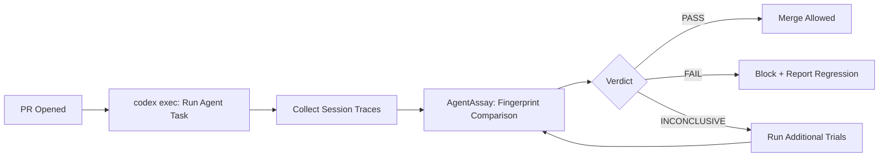

# AgentAssay and the Regression Testing Gap: Statistical Verification for Non-Deterministic Codex CLI Agent Workflows


---

You changed a single line in your AGENTS.md. Your `codex exec` CI pipeline still passes. But your agent now takes 40% more steps, calls tools in the wrong order, and occasionally hallucinates a dependency. Binary pass/fail testing told you nothing was wrong.

This is the regression testing gap for non-deterministic agent workflows — and AgentAssay, a framework backed by peer-reviewed research (arXiv:2603.02601), offers the first principled methodology for closing it [^1]. This article examines how its statistical testing primitives map onto Codex CLI's hook pipeline, `codex exec` automation, and multi-model deployment patterns.

## The Problem: Why Binary Verdicts Fail for Agent Workflows

Traditional software testing relies on determinism: the same input produces the same output. Coding agents violate this assumption fundamentally. The same prompt, tools, and model can produce divergent tool-call sequences, different code outputs, and variable step counts across runs [^2]. A Codex CLI session that calls `grep`, `sed`, then `git commit` on Monday might call `rg`, `awk`, then `git add && git commit` on Tuesday — both correct, both different.

This non-determinism means that:

- **Single-run testing is statistically meaningless.** One passing run proves nothing about the next.
- **Binary verdicts mask behavioural drift.** An agent can "pass" whilst degrading across every other quality dimension.
- **Prompt and config changes propagate unpredictably.** Editing AGENTS.md, switching models, or updating an MCP server can shift agent behaviour in ways that functional tests never surface.

No principled methodology existed for verifying that an agent has not regressed after changes to its prompts, tools, models, or orchestration logic — until AgentAssay introduced stochastic three-valued verdicts and behavioural fingerprinting [^1].

## AgentAssay's Core Architecture

AgentAssay replaces binary pass/fail with a statistical testing pipeline designed for non-deterministic workflows. The framework comprises four layers:



### Three-Valued Verdicts

Rather than forcing a binary decision, AgentAssay uses Wald's Sequential Probability Ratio Test (SPRT) to return one of three verdicts: **PASS**, **FAIL**, or **INCONCLUSIVE** [^1]. The INCONCLUSIVE verdict is critical — it explicitly signals insufficient evidence rather than silently defaulting to pass. In Codex CLI CI pipelines, an INCONCLUSIVE result can trigger additional trial runs or flag the change for human review via a `PostToolUse` hook.

### Behavioural Fingerprinting

The breakthrough contribution is behavioural fingerprinting: converting execution traces into compact vectors capturing tool invocation patterns, decision frequency distributions, output characteristics, and cost metrics [^1]. These vectors are compared via Hotelling's T² test — a multivariate statistical test that detects distributional shifts across multiple dimensions simultaneously.

The paper reports 86% detection power where binary testing achieves 0% [^1]. That figure deserves emphasis: for certain classes of regression (behavioural drift without functional failure), binary testing is literally incapable of detection.

### Five-Dimensional Coverage Metrics

AgentAssay defines coverage across five complementary dimensions [^1]:

| Dimension | What It Measures | Codex CLI Mapping |
|-----------|-----------------|-------------------|
| **Tool Coverage** | Fraction of available tools exercised | Shell, file, search, web tools used |
| **Decision-Path Coverage** | Distinct execution sequences observed | Different code-generation strategies |
| **State-Space Coverage** | Agent states visited (normalised for infinity) | Context window states, compaction points |
| **Boundary Coverage** | Tool parameter extremes tested | Max file sizes, edge-case inputs |
| **Model Coverage** | Cross-model compatibility verified | GPT-5.5 vs GPT-5.3-Codex-Spark |

Overall coverage uses the geometric mean across all five dimensions, which penalises imbalance — a score of 95% tool coverage but 10% boundary coverage produces a low composite, forcing teams to address gaps rather than cherry-pick metrics [^1].

## Mapping AgentAssay to Codex CLI Workflows

### Trace Collection via `codex exec`

Codex CLI's non-interactive mode (`codex exec`) already produces structured JSONL session transcripts stored in `~/.codex/sessions/` [^3]. These transcripts contain every tool call, model response, approval event, and timing metric — precisely the trace data AgentAssay requires.

The `CustomAdapter` pattern bridges the two:

```python
from agentassay.integrations import CustomAdapter
import subprocess
import json

def codex_agent(input_data: dict) -> dict:
    result = subprocess.run(
        ["codex", "exec", "--full-auto", "-q", input_data["prompt"]],
        capture_output=True, text=True,
        cwd=input_data.get("workspace", ".")
    )
    return {
        "output": result.stdout,
        "exit_code": result.returncode,
        "stderr": result.stderr
    }

adapter = CustomAdapter(callable_fn=codex_agent)
trace = adapter.run({"prompt": "Add input validation to api/handlers.go"})
```

For richer trace data, the `MCPToolsAdapter` can intercept MCP tool calls directly when Codex CLI acts as an MCP client [^4].

### Hook-Based Regression Gates

Codex CLI's hook pipeline provides natural integration points for AgentAssay's deployment gates. A `PostSession` hook (triggered after each `codex exec` run in CI) can collect the session transcript, append it to the trial set, and evaluate the statistical verdict:

```bash
#!/usr/bin/env bash
# .codex/hooks/post-session-regression.sh
SESSION_FILE=$(ls -t ~/.codex/sessions/$(date +%Y/%m/%d)/rollout-*.jsonl | head -1)

python3 -c "
from agentassay.efficiency import BehavioralFingerprint
from agentassay.verdicts import VerdictFunction
import json, sys

baseline = BehavioralFingerprint.load('baseline-fingerprint.json')
current_trace = json.load(open('$SESSION_FILE'))
current_fp = BehavioralFingerprint.from_traces([current_trace])

drift = baseline.distance(current_fp)
if drift > 0.15:
    print(f'REGRESSION DETECTED: drift={drift:.3f}', file=sys.stderr)
    sys.exit(1)
"
```

### Multi-Model Regression Detection

Codex CLI v0.142 supports configurable model routing with profiles and per-turn model selection [^5]. When teams switch between GPT-5.5, GPT-5.3-Codex-Spark, and third-party models via provider configuration, AgentAssay's **Model Coverage** dimension ensures that behavioural consistency is verified across all target models:

```python
from agentassay.core.runner import TrialRunner
from agentassay.core.scenario import TestScenario

scenario = TestScenario(
    scenario_id="refactor-handler",
    name="Handler refactoring task",
    input_data={"prompt": "Refactor the error handling in api/handlers.go"},
    expected_properties={
        "max_steps": 15,
        "must_use_tools": ["shell", "file_write"],
        "must_not_use_tools": ["web_search"]
    }
)

# Test across all configured models
for model in ["gpt-5.5", "gpt-5.3-codex-spark", "o4-mini"]:
    runner = TrialRunner(
        agent_fn=lambda inp: codex_agent({**inp, "model": model}),
        config={"model": model}
    )
    results = runner.run_trials(scenario, n=30)
    print(f"{model}: {results.pass_rate:.1%} "
          f"[{results.ci_lower:.1%}, {results.ci_upper:.1%}]")
```

## Mutation Testing for AGENTS.md and Skills

AgentAssay's four mutation operator classes map directly onto Codex CLI's configuration surface [^1]:

| Mutation Class | Codex CLI Target | What It Tests |
|---------------|-----------------|---------------|
| **Prompt Mutations** | AGENTS.md instructions | Robustness to instruction rewording |
| **Tool Mutations** | MCP server availability, tool ordering | Behaviour when tools are unavailable |
| **Model Mutations** | `model` in config.toml | Cross-model consistency |
| **Context Mutations** | Session history, compaction | Behaviour under context pressure |

**Prompt mutations** are particularly valuable for AGENTS.md governance. A team can verify that their coding standards survive synonym substitution, instruction reordering, and noise injection — ensuring the agent follows the *intent* of the instructions rather than depending on specific phrasing:

```bash
agentassay mutate \
  --scenario refactor-scenario.yaml \
  --operators prompt \
  --target-file .codex/AGENTS.md \
  --kill-threshold 0.8
```

A kill rate below the threshold indicates that the test suite fails to detect when AGENTS.md instructions are degraded — a signal that the tests themselves need strengthening.

## Adaptive Budget Optimisation

Running 100 trials per scenario at API rates is expensive. AgentAssay's adaptive budget optimiser calibrates the minimum number of trials needed for a given confidence level based on observed behavioural variance [^1]:

```python
from agentassay.efficiency import AdaptiveBudgetOptimizer

optimizer = AdaptiveBudgetOptimizer(alpha=0.05, beta=0.10)
estimate = optimizer.calibrate(calibration_traces)

print(f"Recommended trials: {estimate.recommended_n}")
print(f"Estimated cost: ${estimate.estimated_cost_usd:.2f}")
```

The paper reports 4–7× trial reduction for stable agents [^1]. For a Codex CLI workflow that consistently produces similar tool-call patterns (low behavioural variance), the optimiser might recommend 8 trials instead of 50 — reducing CI costs from tens of dollars to under a dollar per pipeline run.

Combined with Codex CLI's rollout token budgets (added in v0.142) [^5], teams can set hard cost ceilings on both individual agent runs and the regression testing harness around them.

## CI/CD Integration Pattern

The complete integration chains AgentAssay's statistical gates into a GitHub Actions workflow alongside `codex exec`:




```yaml
# .github/workflows/agent-regression.yml
name: Agent Regression Gate
on: pull_request

jobs:
  regression-test:
    runs-on: ubuntu-latest
    steps:
      - uses: actions/checkout@v4
      - uses: openai/codex-action@v1
        with:
          codex-api-key: ${{ secrets.CODEX_API_KEY }}

      - name: Run agent trials
        run: |
          for i in $(seq 1 $TRIAL_COUNT); do
            codex exec --full-auto -q "$(cat test-prompt.md)" \
              2>/dev/null >> traces.jsonl
          done

      - name: Evaluate regression
        run: |
          agentassay compare \
            --baseline baseline-fingerprint.json \
            --current traces.jsonl \
            --alpha 0.05 --beta 0.10 \
            --format github-actions
```


## Limitations and Open Questions

AgentAssay addresses a genuine gap, but several limitations bear noting:

- **Single-author paper.** The framework has a GitHub repository with 10 adapters [^4], but wider academic validation is still emerging. ⚠️
- **Codex CLI adapter not yet native.** The `CustomAdapter` and `MCPToolsAdapter` work, but a dedicated Codex CLI adapter that natively parses JSONL session transcripts would reduce integration friction.
- **Trace-first analysis assumes trace availability.** Codex CLI stores session transcripts by default, but teams using `history.persistence = false` lose this data.
- **Cost-efficiency claims depend on scenario.** The 78–100% cost reduction figures come from three specific scenarios (e-commerce, customer support, code generation) [^1]; mileage may vary for other workflow types.

## Practical Recommendations

For teams running Codex CLI in production CI pipelines:

1. **Start with behavioural fingerprinting.** Even without the full framework, comparing tool-call distributions across runs catches drift that binary tests miss.
2. **Use three-valued verdicts in deployment gates.** Never default INCONCLUSIVE to PASS — treat it as a signal to gather more evidence.
3. **Mutation-test your AGENTS.md.** If synonym substitution in your instructions changes agent behaviour, your instructions are fragile.
4. **Set adaptive budgets.** Calibrate trial counts to your agent's actual variance rather than picking arbitrary numbers.
5. **Combine with Codex CLI hooks.** Wire AgentAssay into `PostSession` hooks for automated, per-run regression detection.

The regression testing gap for non-deterministic agent workflows is real, measurable, and — with frameworks like AgentAssay — now addressable. The question is no longer whether to test agent behaviour statistically, but how to integrate statistical testing into the development workflow you already have.

## Citations

[^1]: Bhardwaj, V.P. (2026). "AgentAssay: Token-Efficient Regression Testing for Non-Deterministic AI Agent Workflows." arXiv:2603.02601. [https://arxiv.org/abs/2603.02601](https://arxiv.org/abs/2603.02601)

[^2]: SitePoint (2026). "AI Agent Testing Automation: Developer Workflows for 2026." [https://www.sitepoint.com/ai-agent-testing-automation-developer-workflows-for-2026/](https://www.sitepoint.com/ai-agent-testing-automation-developer-workflows-for-2026/)

[^3]: OpenAI (2026). "Non-interactive mode – Codex CLI." OpenAI Developers. [https://developers.openai.com/codex/noninteractive](https://developers.openai.com/codex/noninteractive)

[^4]: Qualixar (2026). "agentassay: Token-efficient stochastic testing for AI agents." GitHub. [https://github.com/qualixar/agentassay](https://github.com/qualixar/agentassay)

[^5]: OpenAI (2026). "Changelog – Codex." OpenAI Developers. [https://developers.openai.com/codex/changelog](https://developers.openai.com/codex/changelog)

[^6]: OpenAI (2026). "Configuration Reference – Codex." OpenAI Developers. [https://developers.openai.com/codex/config-reference](https://developers.openai.com/codex/config-reference)

[^7]: OpenAI (2026). "Agent Skills – Codex." OpenAI Developers. [https://developers.openai.com/codex/skills](https://developers.openai.com/codex/skills)
