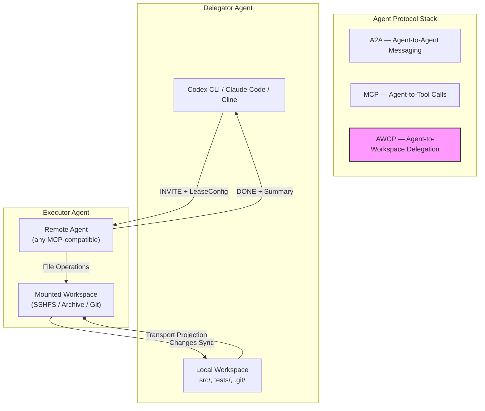
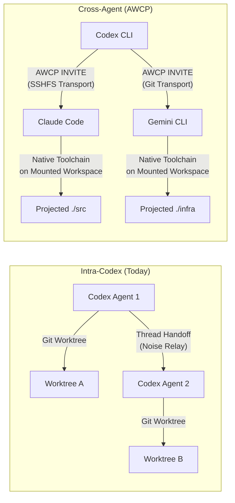
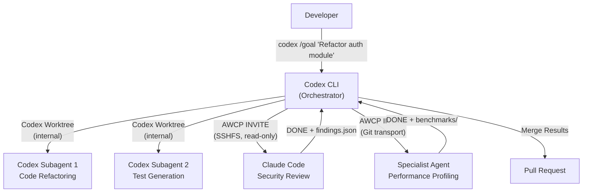

# AWCP and the Missing Workspace Layer: What Filesystem-Level Agent Delegation Means for Codex CLI Multi-Agent Workflows


---

## The Context Gap in Agent Collaboration

The agentic protocol stack has converged on a two-layer model: MCP for tool integration, A2A for agent-to-agent coordination [^1]. Both the Agentic AI Foundation (AAIF) under the Linux Foundation — with 146 member organisations including Anthropic, Google, OpenAI, Microsoft, and AWS — now governs both standards [^2]. MCP has surpassed 97 million downloads [^2]. A2A reached v1.0 in early 2026 with gRPC, signed Agent Cards, and multi-tenancy support [^3].

Yet neither protocol addresses a fundamental problem: when Agent A delegates a coding task to Agent B, Agent B cannot directly touch Agent A's files. It receives serialised payloads — task descriptions, code snippets, diff patches — and must reconstruct enough context to act. This reconstruction is lossy. Build system state, uncommitted changes, symlink structures, `.env` configurations, and git history are all absent from a JSON-RPC message.

Nie et al. formalised this as the **context gap** in their February 2026 paper introducing the Agent Workspace Collaboration Protocol (AWCP) [^4]. Their argument is straightforward: if agents collaborate through filesystems rather than messages, the context gap disappears.

## What AWCP Does

AWCP sits orthogonally to MCP and A2A in the protocol stack. Where MCP defines agent-to-tool boundaries and A2A defines agent-to-agent messaging, AWCP defines the **agent-to-workspace boundary** — enabling one agent (the Delegator) to project its filesystem to a remote agent (the Executor), who then operates on the shared files directly with unmodified local toolchains [^4].

The protocol separates concerns into two planes:

- **Control plane**: HTTP + Server-Sent Events (SSE) for signalling — negotiation, lifecycle management, progress events
- **Transport plane**: Pluggable adapters for actual file movement — SSHFS, ZIP archive, pre-signed storage URLs, or Git branches [^5]



### The Four-Phase Lifecycle

AWCP delegates follow a strict lifecycle managed by dual state machines — a 9-state machine on the Delegator side and a 4-state machine on the Executor side [^5]:

1. **Negotiation** — The Delegator sends an `INVITE` containing a `TaskSpec`, `LeaseConfig` (TTL in seconds), and `EnvironmentDecl`. The Executor responds with `ACCEPT` (possibly with constraints, such as read-only access) or `ERROR`.

2. **Provisioning** — On `START`, the Delegator transmits an `ActiveLease` and `TransportHandle` containing transport-specific credentials (ephemeral SSH keys for SSHFS, pre-signed URLs for storage, branch names for Git).

3. **Execution** — The Executor operates on the projected workspace using its own native toolchains. Progress streams via SSE events. With SSHFS transport, changes are bidirectionally synchronised in real time.

4. **Completion** — Snapshot reconciliation followed by two-phase cleanup: detach the transport, then release the lease.

### Transport Selection

| Transport | Live Sync | Best For |
|-----------|-----------|----------|
| **SSHFS** | Yes (FUSE mount) | Interactive tasks, real-time pair-coding |
| **Archive** | No (ZIP snapshots) | Small workspaces, simple setups |
| **Storage** | No (pre-signed URLs) | Large files, cloud-native deployments |
| **Git** | No (branch commits) | Auditable, versioned collaboration |

## Why This Matters for Codex CLI Developers

Codex CLI already has a sophisticated workspace delegation model. Understanding where AWCP fits — and where it diverges — helps you evaluate whether to adopt it for cross-agent workflows.

### Codex CLI's Existing Workspace Model

Codex CLI's parallel agent execution relies on Git worktrees [^6]. Every subagent gets an independent checkout sharing the same `.git` metadata as the parent repository. Since v0.115.0 (March 2026), spawned subagents reliably inherit sandbox and network rules from the parent session [^7]. Thread handoff between local and remote hosts — shipped in the Codex app 26.616 release on 18 June 2026 — moves Git state and threads between machines via the Noise relay protocol with end-to-end encryption [^8].

This model works well within the Codex ecosystem. But it breaks at the boundary. A Codex CLI agent cannot delegate workspace access to a Claude Code agent, a Cline instance, or a Gemini CLI session. The worktree is Codex-internal; the Noise relay is Codex-internal; the thread format is Codex-internal.

### AWCP Bridges the Cross-Agent Gap

AWCP's MCP integration means any MCP-compatible agent can participate. The reference implementation exposes seven MCP tools via the `@awcp/mcp` package [^5], and configuration is a single JSON block in your MCP client:

```json
{
  "mcpServers": {
    "awcp": {
      "command": "npx",
      "args": ["@awcp/mcp", "--peers", "http://localhost:10200"]
    }
  }
}
```

For Codex CLI, this means adding AWCP as an MCP server in your `config.toml`:

```toml
[mcp-servers.awcp]
command = "npx"
args = ["@awcp/mcp", "--peers", "http://localhost:10200"]
```

With this configured, you can prompt Codex to delegate specific directories to external agents:

> "Delegate ./infrastructure to the Terraform-specialised agent for review."

The Executor agent — whether it is Claude Code, Cline with DeepSeek, or a custom agent — mounts the workspace via SSHFS and operates with its own native toolchains. No serialisation. No context loss. Full access to `terraform.tfstate`, `.terraform.lock.hcl`, and the module dependency tree.

### Practical Mapping: Codex Worktrees vs AWCP Delegations



| Dimension | Codex Worktrees | AWCP Delegation |
|-----------|----------------|-----------------|
| **Scope** | Same Codex ecosystem | Any MCP-compatible agent |
| **Isolation** | Git worktree per agent | Lease-bounded workspace projection |
| **Transport** | Local filesystem / Noise relay | SSHFS, Archive, Storage, Git |
| **Credential lifetime** | Session-scoped | Configurable TTL with automatic expiry |
| **Audit trail** | Codex thread history | Git transport provides commit-level audit |

## Security Considerations

AWCP's security model deserves scrutiny, particularly given the recent history of AGENTS.md injection attacks [^9] and MCP configuration exploits [^10].

**Lease enforcement**: Every delegation has a TTL specified in `LeaseConfig`. When the timer expires, the Delegator fires an `EXPIRE` event and revokes transport credentials. This is a meaningful improvement over open-ended session tokens.

**Credential scoping**: Transport credentials are ephemeral and transport-specific. SSHFS delegations use short-lived SSH certificates. Archive and Storage transports use pre-signed URLs with expiry. The Executor cannot reuse credentials after lease termination [^5].

**Access modes**: Read-only or read-write access is negotiated during the `ACCEPT` phase. For code review delegations, read-only prevents the Executor from introducing malicious changes.

**What is missing**: The paper does not address content-level trust. A projected workspace could contain poisoned AGENTS.md files, malicious build scripts, or prompt injection payloads in code comments. Codex CLI developers should layer AWCP delegations with their existing `deny_read` and `deny_write` filesystem policies, and scope projected directories to the minimum necessary subtree.

## Integration Architecture for Codex CLI Teams

A practical multi-agent architecture combining Codex-native delegation with AWCP for cross-agent collaboration:



The pattern: use Codex-native worktrees for tasks within your primary agent's capability, and AWCP delegations for tasks requiring specialist agents with different model capabilities or toolchains.

## Current Limitations

AWCP is early-stage. The reference implementation is ~9,200 lines of TypeScript with 161 test cases [^5], but several gaps are worth noting:

- **No quantitative benchmarks**: The paper validates via live demonstrations, not reproducible performance measurements. Latency overhead for SSHFS mounts on high-latency connections is uncharacterised.
- **SSHFS dependency**: The highest-fidelity transport (SSHFS) requires FUSE, which is unavailable in many container environments and macOS requires the third-party macFUSE driver [^5].
- **No sandbox integration**: AWCP projects raw filesystems. It does not integrate with Codex CLI's sandbox policies, Docker isolation, or the `deny_read`/`deny_write` mechanisms. ⚠️ This is a significant gap for production use.
- **Discovery**: The protocol assumes pre-configured peer addresses. There is no agent discovery mechanism equivalent to A2A's Agent Cards.

## What to Watch

The agentic protocol stack is consolidating. MCP handles tool access. A2A handles agent messaging. AWCP proposes the third layer: workspace sharing. If the pattern gains adoption — particularly if OpenAI, Anthropic, or Google integrate workspace projection into their agent runtimes — the cross-agent collaboration model shifts from "pass me a diff" to "here's my filesystem, go."

For Codex CLI teams, the immediate action is to experiment with AWCP's MCP integration for read-only review delegations, where the security risk is lowest and the context-gap benefit is highest. Full read-write workspace delegation to external agents should wait for sandbox integration and more rigorous security analysis.

---

## Citations

[^1]: Zylos Research, "Agent Interoperability Protocols 2026: MCP, A2A, ACP and the Path to Convergence," March 2026. [https://zylos.ai/research/2026-03-26-agent-interoperability-protocols-mcp-a2a-acp-convergence/](https://zylos.ai/research/2026-03-26-agent-interoperability-protocols-mcp-a2a-acp-convergence/)

[^2]: Intuz, "MCP vs A2A: AI Agent Protocol Comparison (2026)." [https://www.intuz.com/blog/mcp-vs-a2a](https://www.intuz.com/blog/mcp-vs-a2a)

[^3]: Programming Helper Tech, "Agent to Agent Protocol 2026: Google's A2A Standard Takes Shape as Multi-Agent Systems Emerge." [https://www.programming-helper.com/tech/agent-to-agent-protocol-2026-google-a2a-standard](https://www.programming-helper.com/tech/agent-to-agent-protocol-2026-google-a2a-standard)

[^4]: X. Nie, Z. Guo, Y. Chen, Y. Zhou, and W. Zhang, "AWCP: A Workspace Delegation Protocol for Deep-Engagement Collaboration across Remote Agents," arXiv:2602.20493, February 2026. [https://arxiv.org/abs/2602.20493](https://arxiv.org/abs/2602.20493)

[^5]: AWCP Reference Implementation, GitHub. [https://github.com/SII-Holos/awcp](https://github.com/SII-Holos/awcp)

[^6]: Verdent Guides, "Codex App Worktrees Explained: How Parallel Agents Avoid Git Conflicts." [https://www.verdent.ai/guides/codex-app-worktrees-explained](https://www.verdent.ai/guides/codex-app-worktrees-explained)

[^7]: Firecrawl, "Multi-Agent Orchestration With Codex." [https://www.firecrawl.dev/blog/codex-multi-agent-orchestration](https://www.firecrawl.dev/blog/codex-multi-agent-orchestration)

[^8]: OpenAI, "Codex Changelog — Codex app 26.616, June 18, 2026." [https://developers.openai.com/codex/changelog](https://developers.openai.com/codex/changelog)

[^9]: NVIDIA Technical Blog, "Mitigating Indirect AGENTS.md Injection Attacks in Agentic Environments." [https://developer.nvidia.com/blog/mitigating-indirect-agents-md-injection-attacks-in-agentic-environments/](https://developer.nvidia.com/blog/mitigating-indirect-agents-md-injection-attacks-in-agentic-environments/)

[^10]: Check Point Research, "OpenAI Codex CLI Vulnerability: Command Injection." [https://research.checkpoint.com/2025/openai-codex-cli-command-injection-vulnerability/](https://research.checkpoint.com/2025/openai-codex-cli-command-injection-vulnerability/)
