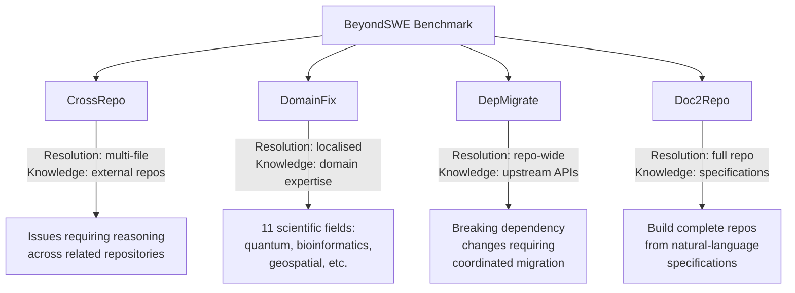
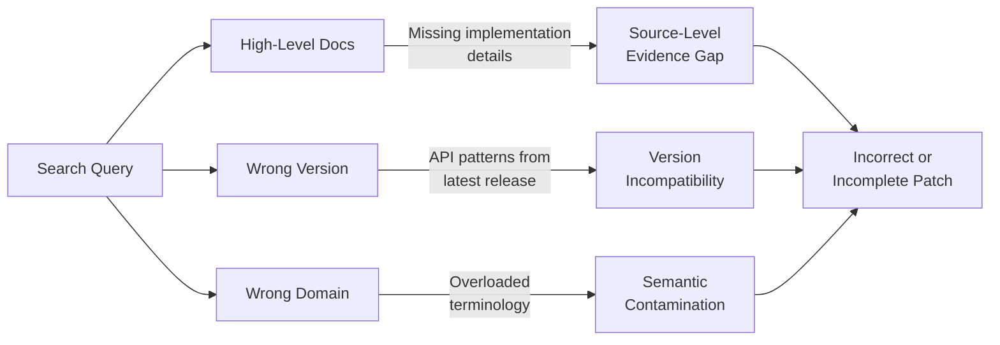

# BeyondSWE: What Happens When Coding Agents Leave the Single-Repo Comfort Zone — and What Codex CLI Developers Should Do About It


---

SWE-bench Verified has served as the industry's yardstick for coding agents since 2024, but its scope is narrow: single-repository bug fixes touching an average of 1.3 files [^1]. Real software engineering demands far more — cross-repository reasoning, domain-specific knowledge, dependency migration, and repository construction from specifications. A new benchmark, **BeyondSWE**, published by Chen et al. in March 2026 and revised in May 2026, asks a pointed question: can today's coding agents survive beyond single-repo bug fixing [^1]?

The short answer is *not yet* — but the failure modes it exposes are directly actionable through Codex CLI configuration. This article unpacks BeyondSWE's four task dimensions, examines why search augmentation doesn't automatically help, and maps the results to practical Codex CLI patterns.

## The Four Dimensions of Real-World Software Engineering

BeyondSWE spans 500 instances drawn from 246 real-world GitHub repositories, organised across two axes: **resolution scope** (how many files the fix touches) and **knowledge scope** (whether the agent needs information beyond the target repository) [^1]. These axes yield four task categories:



### CrossRepo: Reasoning Beyond Repository Boundaries

CrossRepo tasks require agents to resolve GitHub issues where the fix depends on understanding behaviour in related external repositories [^1]. A representative example is `kitware_trame-server_pr8`, where an agent must fix server binding behaviour that breaks downstream PyVista integration — requiring reasoning about how configuration changes propagate across project boundaries [^1].

### DomainFix: Scientific and Specialist Knowledge

DomainFix draws issues from eleven research fields including quantum physics, bioinformatics, and geospatial analysis [^1]. These tasks demand knowledge that goes well beyond general programming competence — the agent needs to understand the domain's conventions, mathematical foundations, and field-specific API idioms.

### DepMigrate: Coordinating Upstream Breaking Changes

DepMigrate tasks present agents with upstream dependency changes that require coordinated, repo-wide modifications [^1]. This mirrors the real-world scenario every senior developer knows: a major library releases a breaking version, and you must update imports, API calls, and configuration files across the entire codebase whilst maintaining compatibility.

### Doc2Repo: Building From Specifications

Doc2Repo asks agents to construct complete repositories from natural-language specifications, touching an average of 26.8 files per task compared to SWE-bench Verified's 1.3 [^1]. This is the closest analogue to Codex CLI's `full-auto` mode on greenfield projects.

## How Agents Actually Perform

The results reveal a significant capability gap. Even frontier models plateau below 45% success on the OpenHands scaffold, and no single model performs consistently across all four task types [^1]:

| Configuration | CrossRepo | DomainFix | DepMigrate | Doc2Repo | Average |
|---|---|---|---|---|---|
| Codex + GPT-5.4 xhigh (SearchSWE) | 55.17% | 61.11% | 48.59% | 61.74% | **56.65%** |
| OpenHands + DeepSeek-V4-Pro Max | — | — | — | — | **46.12%** |
| SWE-bench Verified (baseline context) | ~65% | — | — | — | — |

The Codex harness with GPT-5.4 xhigh and search augmentation achieves the highest average at 56.65%, but that still means nearly half of all tasks fail [^1]. More telling is the drop from SWE-bench Verified's ~65% resolution rates to BeyondSWE's cross-repo and migration tasks — the moment agents leave the single-repository comfort zone, performance degrades substantially.

## Why Search Doesn't Automatically Help

BeyondSWE introduces **SearchSWE**, a framework that augments standard agent workflows with web search and browser tools [^1]. The expectation was straightforward: if agents struggle because they lack external knowledge, give them search access and performance should improve.

Reality is more complicated. Of 32 model-task pairs tested, only 20 improved with search access, whilst 31.2% actually *regressed* [^1]. The paper identifies three recurring failure patterns:

### 1. Source-Level Evidence Retrieval Gap

Search engines return high-level documentation and tutorials when what the agent needs is source-code implementation logic [^1]. An agent trying to understand how a dependency's internal state machine works will find API reference pages, not the actual state transition code it needs to reason about.

### 2. Version Incompatibility

Agents fail to ground external knowledge in local dependency versions [^1]. They retrieve documentation for the latest release and apply newer API patterns to legacy environments — precisely the kind of mistake that compiles cleanly but fails at runtime.

### 3. Semantic Contamination

Keyword-based search pulls in authoritative but unrelated sources when terminology is overloaded across domains [^1]. An agent searching for "binding" in a server context may retrieve UI binding documentation, polluting its context with irrelevant information.



## What This Means for Codex CLI Developers

BeyondSWE's failure modes map directly onto configuration and workflow patterns available in Codex CLI today. Here's how to mitigate each one.

### Mitigating CrossRepo Failures with AGENTS.md Context

When working across related repositories, your `AGENTS.md` should explicitly declare cross-repository dependencies and their relationships:

```markdown
## Cross-Repository Context

This repository (`trame-server`) is consumed by:
- `pyvista` — uses `trame-server` for widget binding
- `trame-vtk` — depends on server lifecycle events

When modifying server binding or lifecycle behaviour, verify changes
against the downstream integration tests in `../pyvista/tests/trame/`.
```

The key insight from BeyondSWE is that agents fail at CrossRepo tasks not because they lack capability, but because they lack *context about the relationship graph* between repositories. Front-loading this into `AGENTS.md` addresses the gap directly [^2].

### Mitigating Version Incompatibility with Pinned Context

For DepMigrate-style tasks, provide version-specific guidance in your `AGENTS.md` or a dedicated skill:

```toml
# codex.toml — pin model and context for migration work
[profile.migrate]
model = "gpt-5.4"
approval_mode = "auto-edit"

[profile.migrate.env]
MIGRATION_FROM = "sqlalchemy==1.4"
MIGRATION_TO = "sqlalchemy==2.0"
```

```markdown
<!-- AGENTS.md migration section -->
## Dependency Migration Rules

- ALWAYS check `requirements.txt` and `pyproject.toml` for pinned versions
  BEFORE applying any API changes from documentation
- NEVER apply patterns from latest documentation without verifying they
  exist in the pinned version
- Run `pip show <package>` to confirm installed version before migration
```

### Mitigating Domain Knowledge Gaps with Skills and MCP

DomainFix failures stem from agents lacking specialist knowledge. Codex CLI's skill system provides a natural solution — package domain expertise as reusable skills [^3]:

```markdown
<!-- ~/.codex/skills/bioinformatics/SKILL.md -->
---
name: bioinformatics
trigger: "bioinformatics OR genomics OR FASTA OR BAM OR VCF"
---

## Domain Conventions

- FASTA files use 0-based half-open coordinates
- BAM files require samtools index after modification
- VCF INFO fields follow key=value;key=value format
- Always validate output against bcftools stats
```

For richer domain context, an MCP server can expose domain-specific documentation and validation tools [^4]:

```json
{
  "mcpServers": {
    "domain-docs": {
      "command": "npx",
      "args": ["@modelcontextprotocol/server-filesystem", "./docs/domain/"]
    }
  }
}
```

### Mitigating Doc2Repo Failures with Structured Prompts

Doc2Repo tasks show that agents struggle to maintain architectural coherence across 26+ files [^1]. For greenfield Codex CLI work, break repository construction into phased goals:

```bash
# Phase 1: scaffold
codex --model gpt-5.4 --approval-mode auto-edit \
  "Create the project structure: directories, pyproject.toml, and __init__.py files. Do NOT implement any logic yet."

# Phase 2: core modules
codex --model gpt-5.4 --approval-mode auto-edit \
  "Implement the core data models in src/models/. Follow the specification in docs/spec.md."

# Phase 3: integration
codex --model gpt-5.4 --approval-mode suggest \
  "Wire the API endpoints to the core models. Run tests after each endpoint."
```

Phased execution with tightening approval modes mirrors how BeyondSWE's best-performing configurations work: constrained scope with verification at each stage.

### PostToolUse Hooks for Version Verification

BeyondSWE's version incompatibility failures can be caught early with a `PostToolUse` hook that validates dependency versions before accepting changes [^5]:

```bash
#!/usr/bin/env bash
# hooks/post-tool-use-version-check.sh
# Verify that modified files don't reference APIs from wrong dependency versions

changed_imports=$(git diff --cached --name-only | xargs grep -l "^import\|^from" 2>/dev/null)
if [ -n "$changed_imports" ]; then
  pip check --quiet 2>&1 | grep -i "incompatible" && {
    echo "ERROR: Dependency version incompatibility detected"
    exit 1
  }
fi
```

## The Benchmark Gap That Matters

BeyondSWE reveals something that SWE-bench Verified's high scores have been quietly obscuring: the gap between single-repo bug fixing and real software engineering is substantial. When the resolution scope expands beyond a handful of files, or the knowledge scope extends beyond the target repository, even frontier models with search access fail roughly half the time [^1].

For Codex CLI developers, the practical takeaway is clear. Don't rely on the agent's general knowledge for cross-repo reasoning, domain expertise, or version-sensitive migration work. Instead, encode that knowledge explicitly — in `AGENTS.md`, in skills, in MCP servers, and in phased workflows that constrain scope at each step.

The agents that perform best on BeyondSWE are the ones given the strongest scaffolding. The same principle applies to your Codex CLI configuration: deeper token budgets don't automatically yield better results without strong scaffolding [^1].

## Citations

[^1]: Chen, G. et al. (2026). "BeyondSWE: Can Current Code Agent Survive Beyond Single-Repo Bug Fixing?" *arXiv:2603.03194*. [https://arxiv.org/abs/2603.03194](https://arxiv.org/abs/2603.03194)

[^2]: OpenAI (2026). "Custom instructions with AGENTS.md — Codex CLI". *OpenAI Developers*. [https://developers.openai.com/codex/guides/agents-md](https://developers.openai.com/codex/guides/agents-md)

[^3]: OpenAI (2026). "Customization — Codex CLI". *OpenAI Developers*. [https://developers.openai.com/codex/concepts/customization](https://developers.openai.com/codex/concepts/customization)

[^4]: OpenAI (2026). "CLI — Codex CLI". *OpenAI Developers*. [https://developers.openai.com/codex/cli](https://developers.openai.com/codex/cli)

[^5]: Vaughan, D. (2026). "The Codex CLI Customisation Stack: How AGENTS.md, Skills, MCP, Subagents, and Plugins Compose Into One System". *Codex Knowledge Base*. [https://codex.danielvaughan.com/2026/04/12/codex-cli-customisation-stack-unified-system/](https://codex.danielvaughan.com/2026/04/12/codex-cli-customisation-stack-unified-system/)
