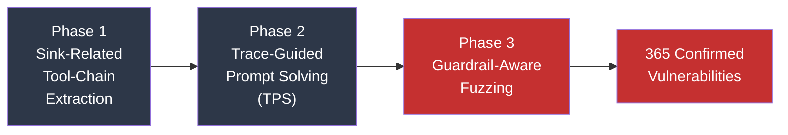
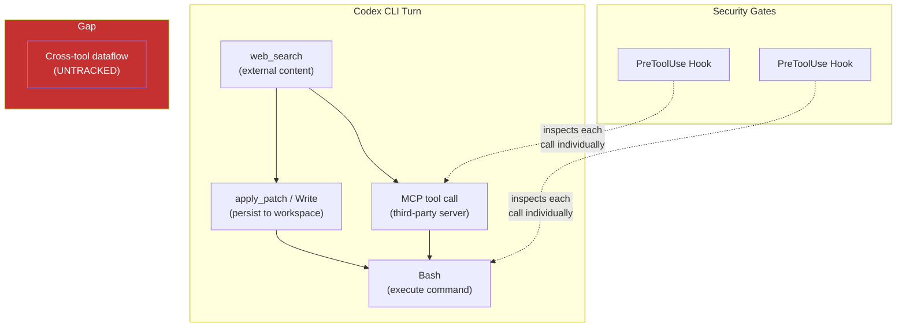
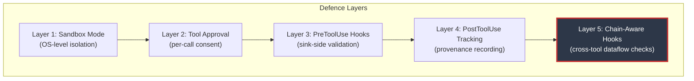

# ChainFuzzer and the Multi-Tool Kill Chain: Why Single-Tool Security Is Not Enough for Codex CLI's MCP Workflows


---

## The Vulnerability You Cannot See by Inspecting One Tool at a Time

Every tool in your Codex CLI plugin stack might pass a security review individually. The web search tool fetches URLs. The file-write tool persists content. The shell tool executes commands. Each operation looks benign in isolation — yet chain them together and you have a textbook remote code execution pipeline: search results containing attacker-controlled payloads are downloaded, written to disc, then executed as code.

This is the core insight behind **ChainFuzzer**, a greybox fuzzing framework published by Wu et al. in March 2026 [^1]. The researchers tested 20 popular open-source LLM agent applications spanning 998 tools and discovered **365 unique, reproducible vulnerabilities** across 19 of the 20 apps. The critical finding: **302 of those vulnerabilities (82.74%) required multi-tool execution** — they were invisible to any testing approach that examines tools one at a time [^1].

For Codex CLI developers building workflows with MCP servers, plugins, and shell tools, this paper is a direct warning. Your `PreToolUse` hook that validates a single Bash command is necessary but insufficient. The attack surface lives in the *composition*.

---

## How ChainFuzzer Works: Three Phases of Discovery

ChainFuzzer introduces a structured three-phase approach to discovering workflow-level vulnerabilities in LLM agent systems [^1].



### Phase 1 — Sink-Related Tool-Chain Extraction

The framework scans tool source code for dangerous API calls — `exec`, `eval`, `urlopen`, `subprocess` — treating these as **sinks**. It then performs backward dataflow analysis to reconstruct the upstream tool chains that feed data into these sinks [^1]. Both direct output-to-input dependencies and indirect dependencies through shared carriers (files, databases, environment variables) are captured.

This phase achieved 96.49% edge precision and 91.50% strict chain precision across the 20 tested applications, extracting 2,388 candidate tool chains [^1].

### Phase 2 — Trace-Guided Prompt Solving (TPS)

Raw tool chains are useless without a way to make the agent actually execute them. TPS synthesises stable prompts through iterative repair: generate a seed prompt, execute the agent under instrumentation, compare the actual execution trace against the target chain, generate semantic constraints explaining divergences, and apply LLM-based solving to revise the prompt [^1].

TPS improved chain reachability from 27.05% to 95.45% and stable prompt rates from 9.50% to 92.50% [^1].

### Phase 3 — Guardrail-Aware Fuzzing

When LLM guardrails block direct malicious payloads, the framework applies mutations — payload fragmentation, encoding transformations, and format perturbation — whilst maintaining the syntax required by each tool. Sink-specific oracles detect successful exploitation [^1].

This phase boosted payload trigger rates from 18.20% to 88.60%, demonstrating that **prompt-level guardrails alone are insufficient** when multi-tool dataflow exists [^1].

---

## The Five Vulnerability Classes

ChainFuzzer categorised the 365 discovered vulnerabilities into five classes [^1]:

| Vulnerability Type | Count | Share |
|---|---|---|
| Command Injection (CMDi) | 121 | 33.15% |
| Server-Side Request Forgery (SSRF) | 97 | 26.57% |
| Code Injection (CODEi) | 79 | 21.26% |
| SQL Injection (SQLi) | 45 | 12.33% |
| Server-Side Template Injection (SSTI) | 23 | 6.30% |

The injection source distribution is particularly relevant for Codex CLI developers: 61.64% of vulnerabilities triggered via user-driven interactions, whilst 38.36% originated from environment-sourced untrusted data — web search results, retrieved artefacts, and downloaded files [^1].

---

## Why This Matters for Codex CLI

Codex CLI's architecture creates exactly the multi-tool composition patterns that ChainFuzzer exploits. A typical Codex CLI session chains:

1. **Web search** → retrieves external content
2. **File operations** → writes retrieved content to the workspace
3. **Shell execution** → runs commands that may reference those files
4. **MCP tool calls** → invoke third-party servers with data from prior steps

Each step is individually gated by Codex's approval and sandbox mechanisms [^2], but the *dataflow between steps* — the source-to-sink chain — is not tracked at the harness level.



### Current Codex CLI Hook Coverage

Codex CLI's hook engine now intercepts Bash commands, `apply_patch` file edits, and MCP tool calls at both `PreToolUse` and `PostToolUse` stages [^3]. Each hook receives standardised JSON on stdin containing session context, tool details, and inputs. Hooks can deny operations by returning `permissionDecision: "deny"` or exit code `2` [^3].

However, hooks evaluate each tool call independently. There is no built-in mechanism to track that the file being executed by Bash was written by a prior `apply_patch` call containing content fetched from an untrusted web search result.

---

## Building a Chain-Aware Defence for Codex CLI

ChainFuzzer's findings suggest three mitigation strategies that map directly to Codex CLI's configuration surface [^1]:

### 1. Sink-Side Input Constraints

Lock down the dangerous endpoints. For Bash tool calls, use `PreToolUse` hooks to enforce allowlisted command templates rather than open-ended shell access.

```json
{
  "hooks": {
    "PreToolUse": [
      {
        "matcher": "^Bash$",
        "type": "command",
        "command": "/usr/local/bin/chain-guard",
        "timeout": 10,
        "statusMessage": "Validating command against allowlist"
      }
    ]
  }
}
```

The `chain-guard` script should reject commands that reference recently-written files from untrusted sources — implementing a basic provenance check at the sink [^3].

### 2. Cross-Tool State Mediation via PostToolUse

Use `PostToolUse` hooks to tag tool outputs with provenance metadata. When a web search or MCP call returns content, record the source in a session-scoped manifest. Subsequent `PreToolUse` hooks on Bash and file-write operations can consult this manifest to detect when untrusted content is flowing towards a sink.

```json
{
  "hooks": {
    "PostToolUse": [
      {
        "matcher": ".*",
        "type": "command",
        "command": "/usr/local/bin/provenance-tracker",
        "timeout": 5,
        "statusMessage": "Recording tool output provenance"
      }
    ],
    "PreToolUse": [
      {
        "matcher": "^Bash$",
        "type": "command",
        "command": "/usr/local/bin/sink-validator",
        "timeout": 10,
        "statusMessage": "Checking provenance before execution"
      }
    ]
  }
}
```

This pattern — a `PostToolUse` tracker paired with a `PreToolUse` validator — approximates ChainFuzzer's source-to-sink analysis at runtime [^1][^3].

### 3. MCP Server Isolation and Tool Approval Modes

Codex CLI supports per-tool approval modes on MCP servers via `config.toml` [^4]. For servers that handle untrusted data, enforce explicit approval:

```toml
[mcp_servers.web-scraper]
enabled_tools = ["fetch_page", "extract_content"]
default_tools_approval_mode = "always-approve"

[mcp_servers.code-runner]
enabled_tools = ["execute"]
default_tools_approval_mode = "always-ask"
```

Tools that advertise destructive annotations already require approval [^4], but the ChainFuzzer research demonstrates that non-destructive tools feeding data to destructive ones are equally dangerous. The defence is to treat the *chain* as destructive, not just the final tool.

### 4. Sandbox Workspace Boundaries

Codex CLI's `workspace-write` sandbox mode restricts file edits to the workspace and limits network access [^2]. This provides a structural barrier against SSRF chains — even if an MCP tool constructs a malicious URL, the sandbox's network restrictions prevent the request from reaching internal services.

Configure writable roots tightly:

```toml
[sandbox]
sandbox_mode = "workspace-write"

[sandbox.workspace_write]
writable_roots = ["./src", "./tests"]
```

By excluding directories like `/tmp` and `./scripts` from writable roots, you prevent the common pattern where downloaded content is written to a temporary location and then executed [^2].

---

## Enterprise Enforcement with requirements.toml

For organisations, `requirements.toml` provides the enforcement layer. Managed hooks can be mandated and user-level hooks blocked entirely [^3][^5]:

```toml
[features]
hooks = true
allow_managed_hooks_only = true

[features.sandbox]
sandbox_mode = "workspace-write"
```

This ensures that chain-aware defence hooks are deployed consistently across all developers, preventing individual opt-outs that would re-open multi-tool attack surfaces [^5].

---

## The Broader Pattern: Composition Is the Attack Surface

ChainFuzzer's 4.79× higher detection rate for multi-tool versus single-tool vulnerabilities [^1] confirms a principle that Codex CLI developers must internalise: **the security boundary is not the tool, it is the workflow**.

This pattern connects to several existing Codex CLI security concerns. The SymJack attack demonstrated that symlink composition across approval boundaries creates exploitation opportunities [^6]. The MCP ambient authority research showed that tool servers inheriting broad permissions create lateral movement paths [^7]. ChainFuzzer extends this logic to arbitrary tool chains — any sequence where untrusted data propagates through benign intermediaries towards a dangerous sink.



Layer 5 — chain-aware hooks — is the gap that ChainFuzzer exposes and that Codex CLI's hook system can fill, provided developers build the provenance-tracking infrastructure to connect `PostToolUse` outputs to `PreToolUse` inputs.

---

## Practical Next Steps

1. **Audit your MCP tool chains.** List every MCP server in your `config.toml` and map which tools produce data consumed by other tools. Any chain terminating in shell execution, code evaluation, or network requests is a candidate for ChainFuzzer-class vulnerabilities.

2. **Implement provenance tracking.** Write a `PostToolUse` hook that logs tool outputs to a session-scoped JSON manifest. Write a `PreToolUse` hook for Bash and MCP sinks that checks whether inputs originate from untrusted sources.

3. **Tighten writable roots.** Remove `/tmp` and scratch directories from `writable_roots`. If your workflow requires temporary files, use a dedicated subdirectory within the workspace and apply `PreToolUse` guards on any execution within that directory.

4. **Enforce approval on chain-terminal tools.** Set `default_tools_approval_mode = "always-ask"` on any MCP server whose tools execute commands, evaluate code, or make network requests — regardless of whether those tools individually appear benign.

5. **Test with composition in mind.** When reviewing hook configurations, test multi-step scenarios: "What happens if a web search returns a malicious payload that gets written to a file and then executed?" Single-tool testing will not catch these chains.

---

## Citations

[^1]: Wu, J., Yao, Z., Nan, Y. & Zheng, Z. (2026). "ChainFuzzer: Greybox Fuzzing for Workflow-Level Multi-Tool Vulnerabilities in LLM Agents." *arXiv:2603.12614*. [https://arxiv.org/abs/2603.12614](https://arxiv.org/abs/2603.12614)

[^2]: OpenAI. (2026). "Sandbox — Codex CLI." *OpenAI Developers*. [https://developers.openai.com/codex/concepts/sandboxing](https://developers.openai.com/codex/concepts/sandboxing)

[^3]: OpenAI. (2026). "Hooks — Codex CLI." *OpenAI Developers*. [https://developers.openai.com/codex/hooks](https://developers.openai.com/codex/hooks)

[^4]: OpenAI. (2026). "Model Context Protocol — Codex CLI." *OpenAI Developers*. [https://developers.openai.com/codex/mcp](https://developers.openai.com/codex/mcp)

[^5]: OpenAI. (2026). "Configuration Reference — Codex CLI." *OpenAI Developers*. [https://developers.openai.com/codex/config-reference](https://developers.openai.com/codex/config-reference)

[^6]: Adversa AI. (2026). "SymJack: Symlink Hijack RCE Attack on Coding Agents." Confirmed against six major coding agents including Codex CLI.

[^7]: OpenAI. (2026). "Agent Approvals & Security — Codex CLI." *OpenAI Developers*. [https://developers.openai.com/codex/agent-approvals-security](https://developers.openai.com/codex/agent-approvals-security)
