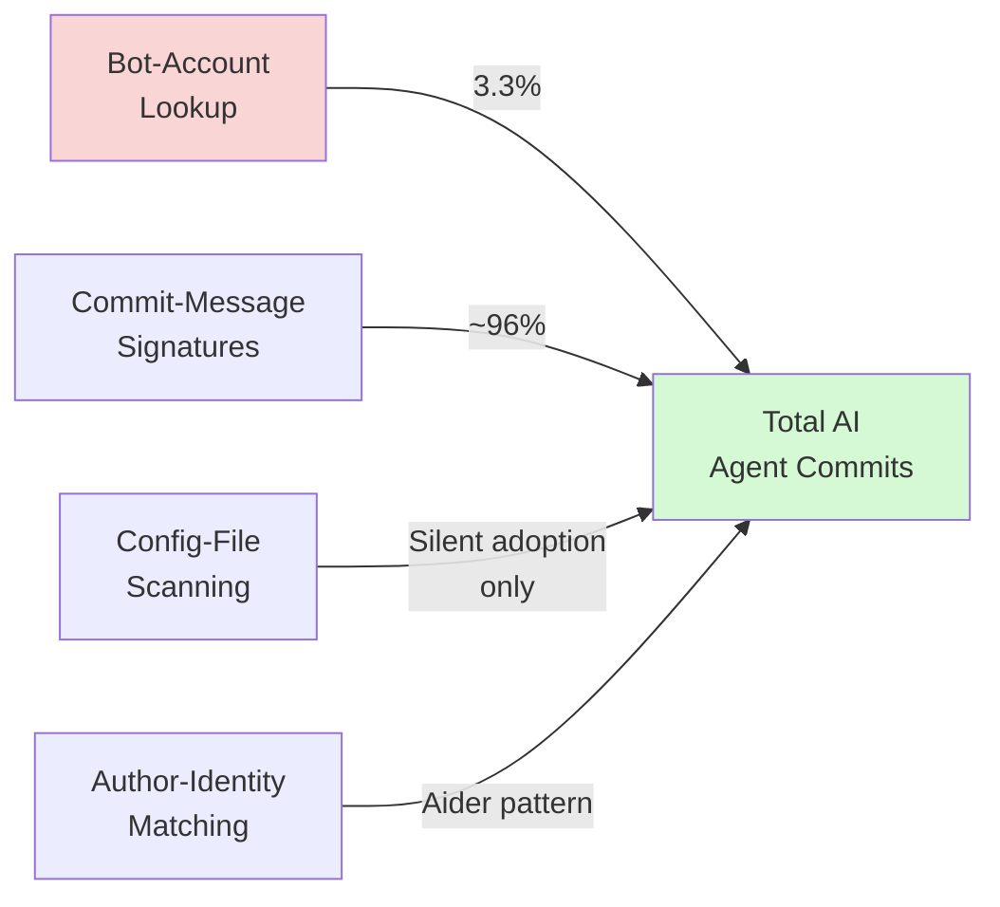
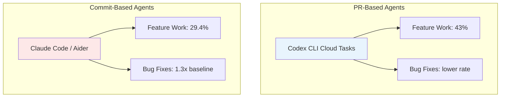

# The Invisible Agent Problem: What a 180-Million-Repository Census Reveals About Codex CLI's Footprint in Open Source


---

On 23 June 2026, researchers Arsham Khosravani and Audris Mockus published the first validated multi-method census of AI coding agent activity across 180 million Git repositories.[^1] The headline finding is stark: traditional bot-detection methods undercount AI agent contributions by a factor of 30. For Codex CLI developers, the implications run deeper than academic interest — they reshape how we think about attribution, supply-chain trust, and the governance AGENTS.md files we ship with every repository.

## The 30x Undercount

The census examined World of Code, a dataset spanning 180 million-plus Git repositories, using a four-layer detection framework:[^1]

1. **Configuration-file scanning** — detecting `.cursorrules`, `CLAUDE.md`, `.claude/`, `AGENTS.md`, `copilot-instructions.md`
2. **Commit-message analysis** — parsing `Co-authored-by:` trailers, `Generated by` headers, tool-specific signatures
3. **Author-identity matching** — identifying bot accounts and agent-specific author patterns
4. **Bot-signature lookup** — matching against known bot-account registries

The critical finding: applying only bot-account lookup — the method most adoption studies rely upon — recovers just 3.3% of Claude Code commits (28,154 of 850,157).[^1] Each detection layer captures a different population. No single method provides adequate coverage.



## Where Codex CLI Sits in the Data

The census reveals a fundamental architectural difference between terminal-native agents. Codex CLI operates primarily through pull requests — the cloud-agent model squash-merges work, which erases individual commit-level attribution. The data makes this strikingly visible:[^1]

| Agent | PR Traces | Commit Traces | Dominant Channel |
|-------|-----------|---------------|------------------|
| Codex | 814,522 | 843 | PR-based |
| Claude Code | 5,137 | 850,157 | Commit-based |
| GitHub Copilot SWE Agent | — | 1,127,201 | Commit-based |
| Devin | — | 215,998 | Commit-based |

Codex CLI generates over 814,000 PR traces but leaves only 843 commit-level traces. A PR-only census misses "essentially all Codex adopters" at the commit level.[^1] Conversely, a commit-only census misses essentially all Codex activity.

This is not a bug — it reflects Codex CLI's architecture. When Codex runs a cloud task, it operates in a sandboxed environment and submits work as a pull request.[^2] The squash-merge workflow that makes PRs clean also strips the commit-level attribution that researchers use to detect agent activity.

### The AGENTS.md Signal

Configuration files tell a different story. Between the October 2025 and April 2026 snapshots, AGENTS.md files went from zero to 134,810 blobs across the World of Code dataset.[^1] This represents entirely new Codex CLI adoption that would be invisible to both commit-message and bot-account detection methods.

For context, Claude Code's configuration footprint (CLAUDE.md plus `.claude/` directories) reached 888,177 blobs in the same period, whilst GitHub Copilot's `copilot-instructions.md` doubled from 92,276 to 211,166.[^1]

AGENTS.md is now found in over 60,000 open-source projects and is read natively by 28-plus tools including Cursor, GitHub Copilot, Windsurf, Amp, Devin, and Aider.[^3]

## Four Behavioural Types of Agent Fingerprints

The census classifies agent traces into four types, each with different implications for Codex CLI developers:[^1]

**Type A — Centralised Bot Account.** The agent commits under a single registered identity. Examples include OpenHands and CodeRabbit. Detection precision: 100%.

**Type B — Commit-Message Signature.** Explicit text embedded in commit messages. Claude Code uses `Co-authored-by: Claude <noreply@anthropic.com>` trailers; Codex uses patterns like `Generated by Codex` or `codex-cli`.[^1] Detection precision: 75–90.5%.

**Type C — Distributed Human Attribution.** Developers append tool-specific suffixes to author names. Aider's `(aider)` pattern captured 25,215 commits across 355 developers.[^1] Detection precision: 78.9–86.8%.

**Type D — Configuration-File Only.** No commit or PR attribution whatsoever — the only signal is the presence of AGENTS.md, CLAUDE.md, `.cursorrules`, or similar files. Detection precision: 92% at file level.[^1]

For Codex CLI, Type D dominance is the norm. Most developers using Codex CLI locally ship an AGENTS.md file but produce no distinguishing commit-message signatures when they manually commit the agent's output.

## The Supply-Chain Trust Question

The census data raises a governance question that senior developers cannot ignore: if AI-generated code enters the supply chain without attribution, how do downstream consumers assess its provenance?

The numbers are material. AI-attributed commits grew from roughly 75,000 per month in December 2024 to over 320,000 per month by mid-2025, and the trajectory has only steepened since.[^1] By March 2026, AI-attributed commits represented 6.7% of non-bot activity, up from 1.6% in December 2025.[^4]

### VS Code's Response

In February 2026, VS Code 1.110 introduced the `git.addAICoAuthor` setting, which automatically appends a `Co-authored-by` trailer when committing code that includes AI-generated contributions.[^4] The setting offers three modes:

- `off` (default) — no attribution
- `chatAndAgent` — trailers added for Copilot Chat and agent-mode contributions
- `all` — trailers added for all AI-generated code, including inline completions

This is the beginning of tooling-level attribution standardisation, but it covers only one editor's ecosystem.

## What This Means for Codex CLI Configuration

The census findings translate into three practical configuration decisions for Codex CLI developers.

### 1. Standardise Attribution in AGENTS.md

Add explicit commit-message conventions to your AGENTS.md file so that agent contributions are attributable:

```toml
# In AGENTS.md — commit attribution section
## Commit Conventions

When committing Codex CLI output, always include:

Co-authored-by: Codex CLI <noreply@openai.com>

This applies to all commits containing agent-generated code,
whether from interactive sessions, Goal Mode, or exec pipelines.
```

This moves Codex CLI output from Type D (invisible) to Type B (commit-message signature), making it discoverable by supply-chain auditing tools.

### 2. Audit Your Own Repository's Agent Footprint

Use Codex CLI itself to scan for undeclared agent traces:

```bash
# Search for agent configuration files
codex exec "Scan this repository for AI agent configuration files \
  (AGENTS.md, CLAUDE.md, .cursorrules, copilot-instructions.md, \
  .windsurfrules, .aider*). Report which agents have been used, \
  whether commit attribution is consistent, and flag any commits \
  lacking Co-authored-by trailers that appear to be agent-generated." \
  --output-format json
```

### 3. Consider the PR-vs-Commit Attribution Gap

If you use Codex CLI's cloud tasks (which produce PRs), your agent activity is visible at the PR level but invisible at commit level after squash-merge. For regulated or audited codebases, consider configuring your merge strategy to preserve attribution:

```bash
# In .github/settings.yml or repository settings
# Use merge commits instead of squash to preserve Co-authored-by trailers
merge_commit_message: PR_BODY
```

Alternatively, add a PostToolUse hook that stamps attribution into the PR body:

```toml
# In config.toml
[[hooks]]
event = "PostToolUse"
tool = "apply_patch"
command = "echo 'AI-assisted change via Codex CLI' >> .codex-attribution.log"
```

## The Work-Profile Divergence

One of the census's subtler findings is that PR-based and commit-based agents produce fundamentally different types of work:[^1]

- **PR-channel agents** (Codex, Cursor) skew towards feature development — 43% of PRs versus the 29.4% human baseline
- **Commit-channel agents** (Claude Code, Aider, OpenHands) surface as maintenance-focused, with bug-fix rates 1.26–1.34x above the human baseline

This is not because the tools have different capabilities. It reflects deployment patterns. Codex CLI's cloud tasks are typically scoped as discrete feature work ("implement this endpoint," "add this test suite"). Interactive CLI sessions that produce direct commits tend towards refactoring, bug fixes, and incremental improvements.



For teams running both Codex CLI and Claude Code — a common multi-agent stack — the census data suggests these tools naturally partition work along the feature/maintenance axis rather than competing on the same task types.

## The Silent Adoption Curve

Perhaps the most striking data point is the growth in configuration-file-only adoption — projects where AGENTS.md or CLAUDE.md exists but no commit or PR traces are detectable. These are projects where developers use coding agents extensively but leave no attribution trail.

Between snapshots, AGENTS.md went from nonexistent to 134,810 instances.[^1] That is 134,810 projects where Codex CLI is shaping code but where, without configuration-file scanning, the agent's involvement would be completely invisible.

The census authors recommend that the industry adopt "standardised AI attribution metadata in Git commits, analogous to Signed-off-by trailers, to enable downstream supply-chain auditing."[^1] For Codex CLI developers, this is not a future concern — it is a present-day governance gap that affects every repository shipping an AGENTS.md file without corresponding commit attribution.

## Practical Takeaways

1. **Single-method detection underestimates AI agent prevalence by 30x.** If your organisation audits for AI-generated code, ensure the audit covers configuration files, commit messages, PR metadata, and author identities — not just bot accounts.

2. **Codex CLI's PR-based architecture makes it invisible to commit-level census methods.** This is architecturally correct but creates a governance gap. Add explicit `Co-authored-by` trailers to close it.

3. **AGENTS.md is now a detection signal, not just a configuration file.** Its presence in a repository indicates Codex CLI (or compatible tool) usage. Treat it as part of your supply-chain disclosure surface.

4. **The feature/maintenance work-profile split between PR and commit agents is real.** Use it to inform your multi-agent strategy rather than fighting it.

5. **Silent adoption is the dominant pattern.** Most AI coding agent usage leaves no commit-level trace. Attribution standards are a team decision, not a tool default.

---

## Citations

[^1]: Khosravani, A. and Mockus, A. (2026). "Detecting AI Coding Agents in Open Source: A Validated Multi-Method Census of 180 Million Repositories." arXiv:2606.24429. [https://arxiv.org/abs/2606.24429](https://arxiv.org/abs/2606.24429)

[^2]: OpenAI (2026). "Codex CLI Documentation." OpenAI Developers. [https://developers.openai.com/codex/cli](https://developers.openai.com/codex/cli)

[^3]: AGENTS.md Project (2026). "A simple, open format for guiding coding agents." Linux Foundation Agentic AI Foundation. [https://agents.md/](https://agents.md/)

[^4]: Penligent AI (2026). "VS Code Copilot Co-Author: When AI Attribution Becomes a Supply Chain Trust Problem." [https://www.penligent.ai/hackinglabs/vs-code-copilot-co-author-when-ai-attribution-becomes-a-supply-chain-trust-problem/](https://www.penligent.ai/hackinglabs/vs-code-copilot-co-author-when-ai-attribution-becomes-a-supply-chain-trust-problem/)
