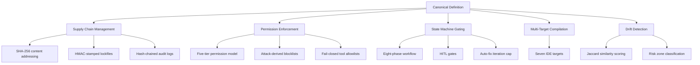
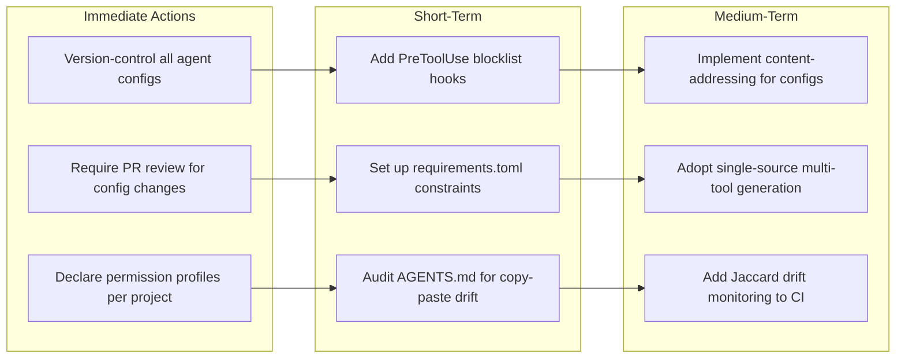

# The Deterministic Control Plane: Why Your Codex CLI Configuration Needs Supply-Chain Governance


---

Your team's `AGENTS.md` was probably copied from another repository. The chances are good that it has never been revised since, declares no permission boundaries, and is effectively identical to hundreds of other files scattered across GitHub. That is the finding of a new 10,008-repository prevalence study published this week by Padmaraj Madatha, which introduces a *deterministic control plane* for LLM coding agent configurations and reveals an uncomfortable truth: the configuration layer that governs what coding agents can do is itself ungoverned [^1].

## The Prevalence Problem: 10,008 Repositories Tell a Story

Madatha's study (arXiv:2606.26924) analysed 6,145 agent configuration files across 10,008 public GitHub repositories [^1]. The findings are stark:

- **10.1%** of tracked configuration paths are SHA-256 exact duplicates across independent repositories (fork-adjusted; 425 content groups) [^1]
- **75.5%** of cloned configuration pairs cross organisational boundaries — teams are copying configs from unrelated organisations without review [^1]
- **58%** of agent configs have exactly one commit and a median revision rate of 0.4 commits per month [^1]
- **Less than 1%** of agent configs declare explicit permission boundaries, compared with 33.39% of GitHub Actions workflows [^1]

The implication is clear: whilst CI/CD pipelines have matured into governed, version-controlled, reviewed artefacts, agent configurations remain write-once-forget-forever files with no integrity verification, no permission declarations, and no drift detection.

## Why This Matters for Codex CLI

Codex CLI's configuration surface spans several files: `config.toml` for global and project settings, `AGENTS.md` for behavioural instructions, permission profiles for sandbox enforcement, hooks for lifecycle gating, and `requirements.toml` for enterprise constraints [^2][^3]. Each of these is a governance boundary — and each is vulnerable to the patterns Madatha identified.

Consider a typical Codex CLI project. The `AGENTS.md` was authored once during initial setup, possibly adapted from a template or copied from a colleague's repository. The `config.toml` declares a permission profile but nobody audits whether it still matches the project's actual security requirements. Hooks exist but were never updated when the team adopted new MCP servers. This is configuration drift, and it is endemic.

The supply-chain risk is not hypothetical. In 2025, Check Point Research disclosed CVE-2025-61260, demonstrating that a malicious `.codex/config.toml` committed to a repository could execute arbitrary commands when a developer ran `codex` [^4]. OpenAI patched the vulnerability within 13 days, but the incident illustrated that agent configs are executable attack surface, not inert documentation.

## Rel(AI)Build: Five Deterministic Mechanisms

Madatha's proposed solution, Rel(AI)Build, implements five mechanisms that treat agent configuration with the same rigour as infrastructure-as-code [^1]:



### 1. Supply-Chain Integrity

Every registry resource is content-addressed via SHA-256. A per-project lockfile records installed resources, targets, and origins, stamped with HMAC-SHA256 over the serialised content. An append-only audit log uses hash-chained mutation history where each entry carries its own SHA-256 hash for tamper-evidence verification [^1].

### 2. Permission Enforcement

A five-tier permission model — `readonly`, `scribe`, `operations`, `specialist`, `orchestrator` — enforces fail-closed tool allowlists at install and transform time [^1]. The `scribe` tier implements traversal defence by normalising paths and explicitly rejecting residual `..` segments. Attack-derived blocklists use regular expressions to block shell commands and write targets tied to documented supply-chain incidents including the Codecov breach (2021) and xz-utils (CVE-2024-3094) [^1].

### 3. Phase-Gated Lifecycle

An eight-phase state machine (Specification → Design → Implementation → Testing → Review → Security → Finalise) enforces mandatory human-in-the-loop gates. Progression is blocked when preceding phases lack end timestamps, required delegations are unrecorded, or post-delegation security scans show violations. Auto-fix iteration count is capped at three per phase entry before escalating to human review [^1].

### 4. Multi-Target Compilation

A single canonical definition compiles to seven IDE targets: Cursor, Claude Code, VS Code/Copilot, Codex, Windsurf, OpenCode, and Kiro [^1]. This eliminates the copy-paste duplication problem — one source of truth generates tool-specific output.

### 5. Drift Detection

Tokenisation-based drift detection uses Jaccard similarity on normalised word tokens, classifying risk as LOW (J ≥ 0.80), MEDIUM (0.60–0.79), or HIGH (J < 0.60) [^1]. Normalisation handles CRLF conversion, trailing whitespace, blank line collapse, and indentation standardisation.

## Mapping Rel(AI)Build to Codex CLI's Configuration Stack

Codex CLI already implements several governance primitives that align with Rel(AI)Build's architecture. The gap is in how teams use them — or rather, how they neglect to.

### Permission Profiles as Tier Enforcement

Codex CLI's named permission profiles map directly to Rel(AI)Build's five-tier model [^2]. A `config.toml` can declare profiles with explicit filesystem and network rules:

```toml
[permissions.security-reviewer]
sandbox_mode = "locked-down"
approval_policy = "on-every-action"

[permissions.security-reviewer.filesystem]
read = ["**/*.md", "**/*.toml", "**/*.yml"]
write = []

[permissions.security-reviewer.network]
allow = []
```

The critical insight from the prevalence study is that fewer than 1% of repositories actually declare these boundaries [^1]. Most teams use `suggest` or `auto-edit` mode without per-project permission profiles, leaving the agent's access surface undefined.

### Hooks as Phase Gates

Codex CLI's hook system supports lifecycle events including `PreToolUse`, `PostToolUse`, `PermissionRequest`, `SessionStart`, and `SubagentStart` [^3]. These map to Rel(AI)Build's phase-gated lifecycle. A `PreToolUse` hook can enforce blocklists:

```bash
#!/bin/bash
# hooks/pre-tool-use.sh — block known supply-chain attack patterns
BLOCKED_PATTERNS=(
  'npx.*--yes'           # auto-confirm payload delivery
  'pip install.*--index-url' # alternate index injection
  'curl.*|.*sh'          # pipe-to-shell
  'nohup.*&'             # detached process spawning
)

COMMAND="$CODEX_TOOL_ARGS"
for pattern in "${BLOCKED_PATTERNS[@]}"; do
  if echo "$COMMAND" | grep -qE "$pattern"; then
    echo "BLOCKED: matches supply-chain attack pattern: $pattern"
    exit 1
  fi
done
```

### Requirements.toml as Enterprise Constraint Layer

For managed deployments, Codex CLI's `requirements.toml` provides organisational constraints that cannot be overridden by individual developers [^5]. This is the closest existing analogue to Rel(AI)Build's deterministic enforcement:

```toml
[constraints]
sandbox_mode = { allowed = ["locked-down", "standard"] }
approval_policy = { disallowed = ["never"] }

[constraints.managed_hooks]
required = true
source = "https://internal.example.com/codex-hooks/"
```

### What Codex CLI Lacks

The paper identifies two governance gaps that Codex CLI does not yet address natively [^1]:

1. **Content-addressed integrity**: there is no built-in mechanism to verify that an `AGENTS.md` or `config.toml` matches a known-good hash. A compromised file is indistinguishable from a legitimate one.
2. **Cross-tool compilation**: teams maintaining both `AGENTS.md` (Codex) and `CLAUDE.md` (Claude Code) or `.cursorrules` (Cursor) have no canonical source that generates all three, leading to the 10.1% duplication rate the study found.

## Practical Governance Checklist

Based on the study's findings, here is what Codex CLI teams should implement today:



**Immediate** — Treat agent configs as code: version-control them, require pull request review for changes, and declare explicit permission profiles in every project's `config.toml`. The study shows 58% of configs are never revised after initial commit [^1] — that alone signals a governance failure.

**Short-term** — Deploy `PreToolUse` hooks with attack-derived blocklists. Configure `requirements.toml` for enterprise-managed constraints. Audit existing `AGENTS.md` files for copy-paste drift using `diff` against known templates.

**Medium-term** — Implement content-addressing (even a simple `sha256sum` check in CI) to detect unauthorised config modifications. Adopt a single-source approach (whether Rel(AI)Build or a simpler template system) that generates tool-specific configs from one canonical definition. Monitor configuration drift with Jaccard similarity scoring in your CI pipeline.

## The Broader Pattern: Configuration as Attack Surface

The Rel(AI)Build paper joins a growing body of work recognising that agent configuration is not documentation — it is executable policy. The Galster et al. study (arXiv:2602.14690) documented eight distinct configuration mechanisms across five coding agents and found that `AGENTS.md` is the dominant mechanism, often the sole one in a repository [^6]. The 180-million-repository census by Khosravani and Mockus (arXiv:2606.24429) found `AGENTS.md` went from zero to 134,810 blobs between snapshots, suggesting rapid adoption without corresponding governance maturation [^7].

The convergence of these findings points to an industry-wide gap: coding agents are being deployed with configuration files that receive less scrutiny than a `Dockerfile`, less integrity verification than a `package-lock.json`, and less permission scoping than a GitHub Actions workflow. Madatha's deterministic control plane offers one path forward — but even without adopting Rel(AI)Build wholesale, the principles of content integrity, explicit permission boundaries, and drift detection are immediately applicable to any Codex CLI deployment.

## Conclusion

The prevalence data is unambiguous: agent configurations are the new ungoverned infrastructure. With 75.5% of duplicated configs crossing organisational boundaries and fewer than 1% declaring permissions, the attack surface is wide and the governance is thin. Codex CLI's existing permission profiles, hooks, and `requirements.toml` provide the primitives — the gap is in treating them with the same discipline we apply to CI/CD pipelines, dependency lockfiles, and infrastructure definitions. The deterministic control plane makes the case that this discipline cannot be optional.

---

## Citations

[^1]: Madatha, P. (2026). "A Deterministic Control Plane for LLM Coding Agents." arXiv:2606.26924. [https://arxiv.org/abs/2606.26924](https://arxiv.org/abs/2606.26924)

[^2]: OpenAI. (2026). "Configuration Reference — Codex CLI." OpenAI Developers. [https://developers.openai.com/codex/config-reference](https://developers.openai.com/codex/config-reference)

[^3]: OpenAI. (2026). "Hooks — Codex CLI." OpenAI Developers. [https://developers.openai.com/codex/hooks](https://developers.openai.com/codex/hooks)

[^4]: Check Point Research. (2025). "OpenAI Codex CLI Vulnerability: Command Injection." CVE-2025-61260. [https://research.checkpoint.com/2025/openai-codex-cli-command-injection-vulnerability/](https://research.checkpoint.com/2025/openai-codex-cli-command-injection-vulnerability/)

[^5]: OpenAI. (2026). "Managed Configuration — Codex CLI." OpenAI Developers. [https://developers.openai.com/codex/enterprise/managed-configuration](https://developers.openai.com/codex/enterprise/managed-configuration)

[^6]: Galster, M. et al. (2026). "Configuring Agentic AI Coding Tools: An Exploratory Study." arXiv:2602.14690. [https://arxiv.org/abs/2602.14690](https://arxiv.org/abs/2602.14690)

[^7]: Khosravani, A. & Mockus, A. (2026). "Detecting AI Coding Agents in Open Source: A 180-Million-Repository Census." arXiv:2606.24429. [https://arxiv.org/abs/2606.24429](https://arxiv.org/abs/2606.24429)
